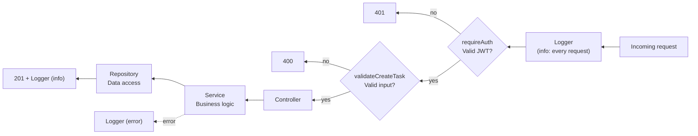

## מה זה?

זהו הפרויקט המסכם של יחידת הוספות — ושל **הקורס כולו**: לוקחים את Task Manager API מהפרויקט המסכם של יחידת Server ומקשיחים אותו לרמת production אמיתית, עם כל חמשת הנושאים ביחידה — Logging מובנה, Validation עם Zod, הגנות OWASP בסיסיות, אימות עם JWT, וארגון מחדש לפי MVC — כדי שהשרת לא רק "יעבוד", אלא יהיה מוכן לעולם האמיתי.

## מילות מפתח שחשוב לזכור

• Logging מובנה — רמות חומרה (info/warn/error), במקום `console.log` אחיד לכל דבר

• Validation עם Zod — סכימה שמאמתת קלט **לפני** שהוא מגיע ללוגיקה העסקית, עם הודעת שגיאה ברורה אם לא תקין

• JWT Middleware — בודק טוקן על כל בקשה לנתיב מוגן, לפני שה-Controller בכלל רץ

• MVC — Controller (HTTP בלבד) → Service (לוגיקה עסקית) → Repository (גישה לנתונים), כל שכבה לא יודעת על מה שמעליה

```javascript
// middleware/validate.js — Zod before the request reaches the Controller
import { z } from "zod";

const createTaskSchema = z.object({
  title: z.string().min(1, "Title is required"),
});

export function validateCreateTask(req, res, next) {
  const result = createTaskSchema.safeParse(req.body);
  if (!result.success) {
    return res.status(400).json({ error: result.error.issues[0].message });
  }
  req.body = result.data;
  next();
}
```

```javascript
// all the layers together in routes/tasks.js
router.post(
  "/",
  requireAuth,              // JWT — must be logged in
  validateCreateTask,       // Zod — valid input
  taskController.create,    // Thin Controller — HTTP only
);
```



## הסבר עיקרי

סדר ה-middleware הוא בדיוק סדר ההגנה — `requireAuth` רץ **לפני** `validateCreateTask`, שרץ **לפני** ה-Controller — כל שכבה "שומרת" על הבאה אחריה: אם אין טוקן תקין, הבקשה נעצרת לפני שהיא בכלל מגיעה לבדיקת ולידציה; אם הקלט לא תקין, היא נעצרת לפני שמגיעה ל-Controller ול-Service. ה-Controller "רואה" רק בקשות שכבר עברו שני שערי הגנה.

Logging מובנה הופך "מה קרה" לניתן-לחיפוש — `console.log` פשוט נותן טקסט חופשי; לוגר מובנה (עם רמות `info`/`warn`/`error`) מאפשר לסנן ("הראה לי רק שגיאות") ולדעת **מיד** אם משהו דורש תשומת לב, במקום לגלול בין אלפי שורות `console.log` זהות.

MVC + כל השאר יחד — הריפקטור ל-MVC (Controller/Service/Repository) לא היה "עוד שכבה" — הוא מה שהופך את כל שאר ההוספות לפשוטות: Middleware אימות/ולידציה מתחברים ב-`routes`, לפני שהם בכלל מגיעים ל-Controller הדק; ה-Service נשאר "נקי" מ-HTTP ומ-JWT לגמרי — קל לבדוק אותו בבידוד (מיחידת Testing), בדיוק כמו שכבר תרגלתם.

## יתרונות

לוגים מובנים הופכים דיבוג production מ"חיפוש מחט בערמת שחת" לתהליך ממוקד; Zod תופס קלט שגוי **לפני** שהוא מזהם את הלוגיקה העסקית; JWT מבטיח שרק משתמשים מחוברים נוגעים בנתונים רגישים; MVC נקי הופך את כל השאר לקל להוסיף בלי לבלגן קוד קיים.

## חסרונות

חמישה נושאים יחד מוסיפים תשתית משמעותית לפני שמגיעים ללוגיקה העסקית עצמה — overhead אמיתי לפרויקט קטן מאוד; יותר שכבות משמעו יותר מקומות אפשריים לטעות בסדר ה-middleware.

## נקודות חשובות

• סדר middleware קובע רמת הגנה: אימות → ולידציה → לוגיקה עסקית, לא הפוך

• Zod תופס קלט שגוי לפני שהוא מגיע ל-Service — שכבת הגנה נפרדת מ-JWT (מי אתה) ולא תחליף לה

• MVC נקי הוא התשתית שהופכת הוספת Middleware (אימות/ולידציה) לפשוטה, בלי לגעת בלוגיקה העסקית

• לוגר מובנה עם רמות חומרה הוא סטנדרט production, לא "נחמד שיהיה"

## טעויות נפוצות

• לשים ולידציה **אחרי** הלוגיקה העסקית במקום לפני — הנזק כבר נעשה עד שהשגיאה מתגלה

• לערבב קוד אימות (JWT) ישירות בתוך Controller/Service, במקום Middleware נפרד וניתן-לשימוש-חוזר

• להמשיך עם `console.log` גם אחרי שיש לוגר מובנה — אי-עקביות שמקשה על חיפוש

• לדלג על MVC "כי זה פרויקט קטן" ואז לגלות שקשה להוסיף אימות/ולידציה נקי לקוד מבולגן

## סיכום

הפרויקט המסכם — והסיכום של הקורס כולו — מקשיח את Task Manager API לרמת production אמיתית: Zod מאמת קלט לפני שהוא מזיק, JWT מגן על נתיבים רגישים, לוגר מובנה הופך דיבוג לניתן-לחיפוש, וארגון MVC נקי הופך את כל זה לפשוט להוסיף בלי לבלגן קוד קיים. זה בדיוק ההבדל בין "שרת שעובד אצלי" לשרת שמוכן להתמודד עם משתמשים אמיתיים.

## דוקומנטציה רשמית

[Zod — Official Docs](https://zod.dev/)

[OWASP — Top 10](https://owasp.org/www-project-top-ten/)

---

## תרגילים

### תרגיל 1 — Zod על endpoint קיים

**המשימה:** הוסיפו סכימת Zod ל-endpoint `POST` קיים, שדוחה בקשה בלי `title`.

**בדיקה:** בקשה בלי `title` מחזירה `400` עם הודעת שגיאה ברורה; בקשה תקינה עוברת כרגיל.

### תרגיל 2 — נתיב מוגן עם JWT

**המשימה:** הוסיפו Middleware `requireAuth` ל-endpoint `DELETE`, ובדקו גישה עם וללא טוקן.

**בדיקה:** בקשה בלי טוקן מחזירה `401`; בקשה עם טוקן תקין עוברת ומבצעת את המחיקה.

---

## פרויקט מסכם

**המשימה:** הקשיחו את Task Manager API המלא (מהפרויקט המסכם של יחידת Server) עם כל חמשת הנושאים ביחידה.

**דרישות:**
1. ארגון מחדש לפי MVC — `controllers/`, `services/`, `repositories/` — אם עדיין לא כך
2. לוגר מובנה שמדפיס `info` על כל בקשה, ו-`error` על כל שגיאה שנתפסת ב-Error-Handling Middleware
3. סכימות Zod על `POST`/`PUT`, שדוחות בקשה עם `title` חסר או ריק
4. `requireAuth` (JWT) על `POST`/`PUT`/`DELETE` — קריאה/`GET` נשארת פתוחה
5. הגנת OWASP בסיסית אחת לפחות (למשל `helmet()`) מותקנת ופעילה על כל האפליקציה

**בדיקה:** `POST /tasks` בלי טוקן מחזיר `401`, עוד לפני שהוולידציה בכלל נבדקת; `POST /tasks` עם טוקן תקין אך בלי `title` מחזיר `400` עם הודעה ברורה; `POST /tasks` תקין ומאומת מצליח ומתועד בלוג עם רמת `info`; שגיאה מכוונת (למשל DB שלא זמין) מתועדת בלוג עם רמת `error`, לא רק מודפסת גולמית.

## מה בפרק הבא

זהו השיעור האחרון בקורס. עברתם מסייה — משתנה בודד ב-JavaScript — ועד אפליקציית Full-Stack שלמה: React מדבר עם Express אמיתי, מגובה מסד נתונים, ארוז ב-Docker, מכוסה בבדיקות אוטומטיות, ומוקשח לרמת production עם אימות, ולידציה ולוגים. כל פרויקט מסכם ביחידה חיבר את מה שנלמד לפרויקט האמיתי מהיחידה שלפניו — זה בדיוק איך שנראית עבודה על מוצר אמיתי. בהצלחה בהמשך הדרך.
