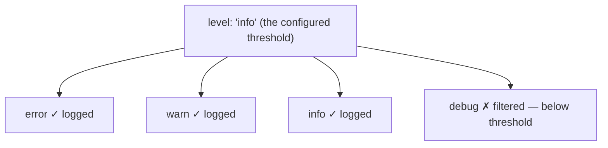

## מה זה?

לאורך כל היחידה השתמשנו ב-`console.log` לדיבוג — וזה בסדר גמור בפיתוח מקומי. אבל בשרת חי (production), `console.log` לא מספיק: הוא לא נשמר לאורך זמן, לכל השורות יש אותה "חשיבות" (אין הבדל בין מידע שגרתי לשגיאה קריטית), ואין timestamp אוטומטי. **Logging** הוא רישום מובנה של אירועים בשרת — עם רמות חומרה, זמן, ויעדי פלט — בעזרת ספרייה ייעודית (כמו Winston) במקום `console.log` פשוט.

## מילות מפתח שחשוב לזכור

• Log Level (רמת רישום) — סיווג חומרה: `error` > `warn` > `info` > `debug` (מהחמור לפחות חמור)

• Transport (יעד פלט) — לאן ה-log נשלח בפועל: קונסול, קובץ, או שירות חיצוני

• Structured Logging — רישום בפורמט JSON (לא טקסט חופשי) — כדי שיהיה אפשר לחפש ולנתח logs מאוחר יותר

• Request Logger — middleware (זוכרים משיעור Middleware?) שרושם כל בקשה נכנסת: method, path, status, משך זמן

• `NODE_ENV` — קובע איזו רמת log פעילה (למשל `debug` בפיתוח, `info` בפרודקשן — פחות "רעש")

```javascript
import winston from "winston";

const logger = winston.createLogger({
  level: process.env.NODE_ENV === "production" ? "info" : "debug",
  transports: [new winston.transports.Console()],
});

logger.info("Server started");
logger.error("Database connection failed", { code: "ECONNREFUSED" });
```



## הסבר עיקרי

רמות חומרה כסינון — בסביבת פיתוח רוצים לראות **הכל**, כולל פרטים קטנים (`debug`). בפרודקשן, רוצים לראות רק מה שבאמת חשוב (`info` ומעלה) — כדי לא "לטבוע" בכמות ה-logs. הגדרת `level` קובעת את הסף: כל log ברמה **נמוכה יותר** מהסף פשוט לא נרשם.

Structured Logging למה זה חשוב — `logger.error("DB failed", { code: "ECONNREFUSED" })` לא רק כותב טקסט — הוא כותב אובייקט מובנה, שאפשר לחפש בו מאוחר יותר ("הראה לי את כל השגיאות עם `code: ECONNREFUSED`") — בניגוד ל-`console.log` שכל מה שהוא נותן הוא טקסט חופשי בלתי-מסודר.

Request Logger כ-middleware מוכר — בדיוק כמו ה-`logger` middleware שכתבנו בשיעור Middleware, אבל עם ספרייה מקצועית: רושם כל בקשה נכנסת עם timestamp, method, path, ו-status code של התגובה — נותן "יומן" מלא של מה קרה בשרת.

## יתרונות

logs נשמרים ונגישים גם אחרי שהשרת ריצה; רמות חומרה מאפשרות לסנן "רעש" בפרודקשן; Structured Logging מאפשר חיפוש וניתוח, לא רק קריאה ידנית.

## חסרונות

עוד ספרייה חיצונית להגדיר ולתחזק; יותר מדי logging (ברמת `debug` בכל מקום) יכול להאט ולבלבל; שכחת להגדיר `level` נכון לפי `NODE_ENV` מחזירה "רעש" מיותר לפרודקשן.

## נקודות חשובות

• Log Levels: `error` (הכי חמור) > `warn` > `info` > `debug` (הכי פחות)

• Transport קובע **לאן** log נשלח; Level קובע **מה** נשלח

• Structured Logging (JSON) מאפשר חיפוש וניתוח, בניגוד לטקסט חופשי

• `NODE_ENV` קובע בדרך כלל את רמת ה-log הפעילה

## טעויות נפוצות

• שימוש ב-`console.log` בפרודקשן במקום ספריית logging מובנית

• רישום כל דבר ברמת `error` בלי הבחנה — מאבדים את המשמעות של "חמור באמת"

• שכחת להתאים `level` ל-`NODE_ENV` — יותר מדי רעש בפרודקשן

## סיכום

Logging מחליף `console.log` ברישום מובנה: רמות חומרה (`error`/`warn`/`info`/`debug`) מסננות מה חשוב, Transports קובעים לאן נשלח, Structured Logging (JSON) מאפשר חיפוש. Request Logger הוא middleware שרושם כל בקשה — יומן מלא של מה קרה בשרת.

## דוקומנטציה רשמית

[Winston — npm](https://www.npmjs.com/package/winston)

---

## תרגילים

### תרגיל 1 — logger בסיסי

**המשימה:** הגדירו Winston logger עם Console transport, והדפיסו הודעה ברמת `info` ואחת ברמת `error`.

**בדיקה:** ה-console מציג שתי שורות שונות, כל אחת מתויגת ברמה שלה (`info`/`error`) — בשונה מ-`console.log` רגיל בלי תיוג.

### תרגיל 2 — Request Logger middleware

**המשימה:** כתבו middleware שמשתמש ב-logger כדי לרשום כל בקשה: method, url, ו-timestamp.

**בדיקה:** `curl http://localhost:3000/` גורם לשורת log חדשה שמכילה `GET`, `/`, וזמן קרוב לזמן הריצה בפועל.

### תרגיל 3 — רמות לפי סביבה

**המשימה:** הגדירו `level` שמשתנה לפי `process.env.NODE_ENV` — `debug` בפיתוח, `info` בפרודקשן. הריצו את השרת בשתי הסביבות עם קריאת `logger.debug(...)` באחד ה-routes.

**בדיקה:** ב-`NODE_ENV=development` הודעת ה-`debug` מופיעה ב-console; ב-`NODE_ENV=production` אותה קריאה בדיוק לא מופיעה כלל.

---

## פרויקט מסכם

**המשימה:** הוסיפו Logging מקצועי לשרת ה-Tasks.

**דרישות:**
1. Winston logger עם level תלוי-`NODE_ENV`
2. Request Logger middleware גלובלי שרושם כל בקשה (method, path, status, משך זמן)
3. ב-Error Middleware (מהשיעור על Express Error Handling) — הוסיפו `logger.error` עם פרטי השגיאה
4. ודאו שהודעות `debug` לא מופיעות כשמדמים `NODE_ENV=production`

**בדיקה:** ב-`NODE_ENV=production`, הפעלת route תקין מציגה שורת `info` עם method+path+status ובלי שום שורת `debug`; גרימת שגיאה מכוונת מייצרת שורת `error` עם פרטי השגיאה.

---

## מה בפרק הבא

בפרק הבא נלמד על **Validation עם Zod** — בשיעורי Express הקודמים כתבנו בדיקות קלט ידניות (`if (!req.body.title) return res.status(400)...`) — עובד, אבל מתנפח מהר עם כל שדה נוסף. **Validation** היא שכבת "שומר שער" שבודקת **כל** קלט שנכנס לשרת
