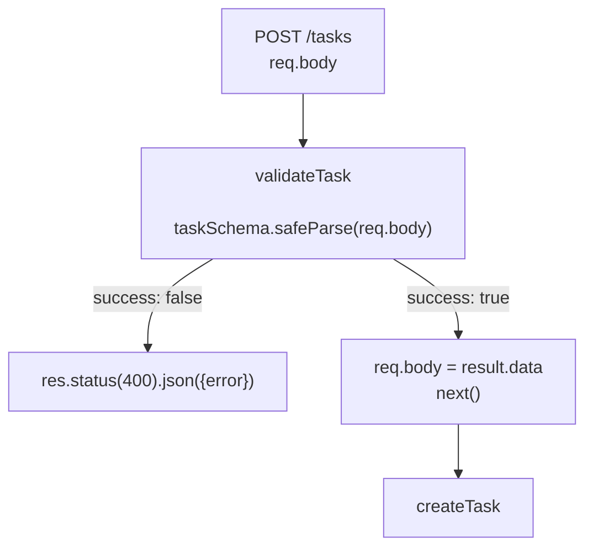

## מה זה?

בשיעורי Express הקודמים כתבנו בדיקות קלט ידניות (`if (!req.body.title) return res.status(400)...`) — עובד, אבל מתנפח מהר עם כל שדה נוסף. **Validation** היא שכבת "שומר שער" שבודקת **כל** קלט שנכנס לשרת מול **Schema** (הגדרה מובנית) מוגדר מראש, לפני שהוא מגיע ללוגיקה העסקית. **Zod** היא ספרייה פופולרית שמאפשרת להגדיר Schema כזה בקלות.

## מילות מפתח שחשוב לזכור

• Schema (סכמה) — הגדרה מובנית של הצורה והחוקים שקלט חייב לעמוד בהם

• `z.object({...})` — מגדיר Schema לאובייקט, עם שדות וטיפוסים

• `.safeParse(data)` — מנסה לאמת נתון מול Schema; מחזיר **אובייקט תוצאה** (`{ success, data }` או `{ success, error }`) — **לא זורק** שגיאה

• Validation Middleware — middleware (מוכר!) שבודק את `req.body` מול Schema **לפני** שההrequest מגיע ל-route handler

```javascript
import { z } from "zod";

const taskSchema = z.object({
  title: z.string().min(1),
  done: z.boolean().optional(),
});

function validateTask(req, res, next) {
  const result = taskSchema.safeParse(req.body);
  if (!result.success) {
    return res.status(400).json({ error: result.error.issues });
  }
  req.body = result.data; // מחליף בגרסה המאומתת והנקייה
  next();
}

router.post("/tasks", validateTask, createTask);
```



## הסבר עיקרי

`safeParse` מול `parse` — `taskSchema.parse(data)` **זורק** שגיאה אם הקלט לא תקין (דורש `try`/`catch`, מוכר מהשיעור על Error Handling). `safeParse` לעומת זאת **תמיד** מחזיר אובייקט תוצאה — בלי `try`/`catch` — נוח יותר בתוך middleware שכבר עובד עם `if`/`return`.

Validation כ-Middleware — בדיוק כמו `express.json()` או `checkApiKey` מהשיעורים הקודמים: `validateTask` רץ **לפני** ה-route handler, ואם הקלט לא תקין — עוצר עם `res.status(400)` ולא קורא `next()` בכלל. אם תקין — מעביר שליטה הלאה.

מונע קריסות "מאוחרות" — בלי validation, `age: "abc"` (מחרוזת במקום מספר) שנשלח מהלקוח עלול לגרום לקריסה **מאוחר יותר**, עמוק בלוגיקה העסקית, במקום שקשה לאבחן. Schema תופס את זה **מיד** בכניסה, עם הודעת שגיאה ברורה ("age must be a number") במקום שגיאה מוזרה מאוחר יותר.

## יתרונות

תופס קלט לא-תקין **מיד**, לפני שהוא "מזהם" את שאר הקוד; Schema אחד מתעד גם את מבנה הנתונים הצפוי — משמש כתיעוד חי; `safeParse` נוח לשילוב עם middleware בלי `try`/`catch`.

## חסרונות

עוד ספרייה ועוד קונספט ללמוד; Schema-ים מורכבים (עם קינון עמוק) יכולים להיות קשים לקריאה; שכחת validation Middleware על route מסוים מבטלת את כל ההגנה שם.

## נקודות חשובות למבחן / ראיון עבודה

• Schema מגדיר את הצורה והחוקים שקלט חייב לעמוד בהם

• `safeParse` מחזיר אובייקט תוצאה (`success`/`error`) ולא זורק שגיאה; `parse` כן זורק

• Validation Middleware בודק קלט **לפני** שהוא מגיע ל-route handler

• Validation תופסת בעיות קלט **מיד**, במקום שיתגלו מאוחר יותר בלוגיקה עסקית

## טעויות נפוצות

• שימוש ב-`parse` (שזורק) בלי `try`/`catch`, וקריסת השרת על קלט לא-תקין

• שכחת לצרף את ה-Validation Middleware ל-route ספציפי

• Schema רופף מדי (למשל בלי `.min(1)` על שדה חובה) שלא באמת תופס את המקרים הבעייתיים

## סיכום

Validation בודקת כל קלט מול Schema לפני שהוא מגיע ללוגיקה העסקית. Zod מגדיר Schema עם `z.object({...})`; `safeParse` מחזיר תוצאה מובנית בלי לזרוק שגיאה — נוח לשילוב כ-middleware. זה תופס קלט פגום **מיד**, במקום שיגרום לבאג מבלבל מאוחר יותר.

## דוקומנטציה רשמית

[Zod — Official Docs](https://zod.dev/)

---

## תרגילים

### תרגיל 1 — Schema ראשון

**המשימה:** הגדירו `z.object` למשתמש עם `name` (string, חובה) ו-`age` (number, מינימום 0). בדקו עם `safeParse` על קלט תקין ולא-תקין (למשל `{ name: "דנה", age: -5 }`).

**בדיקה:** קלט תקין (`{ name: "דנה", age: 25 }`) מחזיר `result.success === true`; קלט עם `age: -5` מחזיר `result.success === false` עם `result.error.issues` שמתאר את הבעיה.

### תרגיל 2 — Validation Middleware

**המשימה:** כתבו middleware שמשתמש ב-Schema שלכם לבדוק `req.body`, ומחזיר `400` עם פירוט השגיאות אם לא תקין.

**בדיקה:** `curl -X POST .../users -H "Content-Type: application/json" -d '{"name":"דנה","age":-5}'` מחזיר status `400` עם מערך שגיאות; אותה בקשה עם `age: 25` עוברת הלאה בהצלחה.

### תרגיל 3 — safeParse מול parse

**המשימה:** נסו את אותו קלט לא-תקין גם עם `.parse()` (עם `try`/`catch`) וגם עם `.safeParse()`.

**בדיקה:** `.parse()` זורק שגיאה שנתפסת רק ב-`catch`; `.safeParse()` על אותו קלט מחזיר `{ success: false, error }` בלי לזרוק דבר — שני הכלים מזהים את אותה בעיה, בדרכים שונות.

---

## פרויקט מסכם

**המשימה:** הוסיפו Validation מלא לשרת ה-Tasks.

**דרישות:**
1. `taskSchema` עם `title` (string, לפחות תו אחד) ו-`done` (boolean, אופציונלי)
2. Validation Middleware על `POST /tasks` וגם על עדכון (`PUT`) אם קיים
3. שגיאות Validation מוחזרות עם `400` ופירוט ברור מה חסר/שגוי
4. ודאו ש-`req.body` המאומת (`result.data`) הוא מה שבאמת נשמר, לא הקלט הגולמי

**בדיקה:** `curl -X POST .../tasks -H "Content-Type: application/json" -d '{}'` מחזיר `400` עם פירוט שדה `title` חסר; `curl -X POST .../tasks -H "Content-Type: application/json" -d '{"title":"קניות"}'` מחזיר `201` עם המשימה שנשמרה.

---

## מה בפרק הבא

בפרק הבא נלמד על **OWASP Basics** — עד כה למדנו לבנות שרתים שעובדים. אבל "עובד" לא אומר "בטוח" — קוד שמקבל קלט ממשתמשים (זוכרים את שיעור ה-Validation?) חשוף להתקפות אם לא בונים אותו בזהירות. **OWASP** (Open Web Application Security Proj
