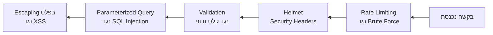

## מה זה?

עד כה למדנו לבנות שרתים שעובדים. אבל "עובד" לא אומר "בטוח" — קוד שמקבל קלט ממשתמשים (זוכרים את שיעור ה-Validation?) חשוף להתקפות אם לא בונים אותו בזהירות. **OWASP** (Open Web Application Security Project) הוא ארגון שמפרסם את **OWASP Top 10** — רשימת עשר הפגיעויות הנפוצות ביותר באפליקציות web. הבעיה שנפתרת: קוד יכול "לעבוד" מבחינה פונקציונלית, אבל בלי מודעות לדפוסי תקיפה נפוצים, הוא חושף את המשתמשים ואת השרת לפריצה.

## מילות מפתח שחשוב לזכור

• SQL Injection — הזרקת קוד SQL זדוני דרך קלט משתמש כדי לשנות את כוונת שאילתת DB (נעמיק בקורס ה-SQL בהמשך)

• Parameterized Query — שאילתה שמפרידה מבנה SQL מנתונים — מונעת SQL Injection מהיסוד

• XSS (Cross-Site Scripting) — השתלת JavaScript זדוני שרץ בדפדפן של **משתמש אחר**, למשל דרך תגובה שלא עברה sanitization

• CSRF (Cross-Site Request Forgery) — גרימת דפדפן משתמש לשלוח בקשה מוסמכת לאתר אחר בלי ידיעתו

• Helmet — ספרייה שמוסיפה אוסף security headers לשרת Express, בשורה אחת של קוד

• Rate Limiting — הגבלת מספר בקשות מ-client בחלון זמן נתון — הגנה מפני Brute Force (ניחוש סיסמה חוזר ונשנה)

```javascript
import helmet from "helmet";
import rateLimit from "express-rate-limit";

app.use(helmet()); // מוסיף security headers אוטומטית

const limiter = rateLimit({ windowMs: 15 * 60 * 1000, max: 100 }); // 100 בקשות ל-15 דקות
app.use("/api/", limiter);
```



## הסבר עיקרי

Injection כעיקרון כללי — כל פעם שקלט משתמש "מתערבב" בתוך פקודה (SQL, HTML, פקודת מערכת) בלי הפרדה ברורה, יש סיכון ל-Injection. Parameterized Query פותרת את זה ל-SQL ספציפית: הנתונים תמיד מטופלים כ**נתונים**, לא כחלק מהפקודה עצמה — גם אם המשתמש כתב `'; DROP TABLE users; --`.

XSS — למה Validation לבד לא מספיקה — גם קלט "תקין" מבחינת Schema (מחרוזת רגילה) יכול להכיל `<script>שלח קוקיז לתוקף</script>`. אם התוכן הזה מוצג למשתמש אחר בלי "ניקוי" (sanitization/escaping), הסקריפט **ירוץ** בדפדפן שלו. ההגנה: תמיד "לברוח" (escape) מתוכן שמגיע ממשתמשים לפני הצגתו.

Helmet כ"רשת ביטחון" בסיסית — הגדרת headers כמו `X-Content-Type-Options` ו-`Strict-Transport-Security` ידנית היא עבודה משעממת וקל לשכוח אותה; `app.use(helmet())` מוסיפה אוסף שלם של הגנות בסיסיות מוכרות, בשורה אחת.

Rate Limiting נגד ניחוש חוזר — בלי הגבלה, תוקף יכול לנסות אלפי סיסמאות לשנייה על `POST /login`. `express-rate-limit` חוסם client אחרי מספר מסוים של ניסיונות בחלון זמן.

## יתרונות

מודעות בסיסית מונעת חלק גדול מהפגיעויות הנפוצות ביותר בפועל; Helmet ו-Rate Limiting נותנים הגנת בסיס כמעט "בחינם"; Parameterized Queries מונעות את אחת הפגיעויות הקטלניות ביותר, כמעט לחלוטין.

## חסרונות

אבטחה היא תחום עמוק — הכרת Top 10 היא התחלה, לא כיסוי מלא; Rate Limiting אגרסיבי מדי עלול לחסום משתמשים לגיטימיים בטעות.

## נקודות חשובות למבחן / ראיון עבודה

• SQL Injection נמנעת ע"י Parameterized Queries — לעולם לא לשרשר קלט ישירות לתוך שאילתת SQL

• XSS = קוד זדוני שרץ אצל משתמש אחר; ההגנה היא escaping/sanitization של תוכן ממשתמשים

• CSRF מנצל דפדפן של משתמש מחובר לשלוח בקשה בלי ידיעתו

• Helmet מוסיף security headers; Rate Limiting מגביל בקשות נגד Brute Force

## טעויות נפוצות

• שרשור קלט משתמש ישירות לתוך שאילתת SQL (`"SELECT * FROM users WHERE id=" + userId`) במקום Parameterized Query

• הצגת תוכן ממשתמשים בלי escaping — פתח ל-XSS

• פרסום API בפרודקשן בלי `helmet()` ובלי Rate Limiting על endpoints רגישים כמו login

## סיכום

OWASP Top 10 מרכז את הפגיעויות הנפוצות ביותר: SQL Injection (נמנע ע"י Parameterized Queries), XSS (נמנע ע"י escaping), CSRF, ועוד. Helmet מוסיף security headers בסיסיים בשורה אחת; Rate Limiting מגן מפני ניסיונות חוזרים אגרסיביים. מודעות בסיסית לאלה חוסכת הרבה נזק אפשרי.

## דוקומנטציה רשמית

[OWASP Top 10](https://owasp.org/www-project-top-ten/)

---

## תרגילים

### תרגיל 1 — זיהוי Injection

**המשימה:** בהינתן שאילתה `"SELECT * FROM users WHERE name='" + userInput + "'"`, כתבו קלט זדוני שהיה "שובר" אותה, והסבירו למה Parameterized Query מונעת זאת.

**בדיקה:** קלט כמו `' OR '1'='1` הופך את השאילתה ל-`WHERE name='' OR '1'='1'` שמתאימה לכל שורה; ההסבר מזכיר שב-Parameterized Query הקלט מטופל תמיד כנתון, לא כחלק מהפקודה.

### תרגיל 2 — helmet ו-rate limit

**המשימה:** התקינו `helmet` ו-`express-rate-limit`, והוסיפו את שניהם לשרת קיים.

**בדיקה:** `curl -i http://localhost:3000/` מציג header כמו `X-Content-Type-Options`; שליחת מעל 100 בקשות לאותו endpoint בתוך 15 דקות מחזירה status `429` על הבקשות העודפות.

### תרגיל 3 — זיהוי XSS

**המשימה:** תארו (בכתיבה) תרחיש שבו הצגת תגובת משתמש בלי escaping מובילה ל-XSS, ואיך למנוע זאת.

**בדיקה:** התיאור כולל: משתמש שולח `<script>...</script>` כתוכן; אם הוא מוצג בלי escaping למשתמש אחר, הסקריפט רץ בדפדפן שלו; המניעה היא escaping/sanitization של תוכן ממשתמשים לפני הצגה.

---

## פרויקט מסכם

**המשימה:** הקשיחו (harden) את שרת ה-Tasks עם הגנות בסיסיות.

**דרישות:**
1. `helmet()` מותקן ורשום גלובלית
2. `express-rate-limit` על כל ה-`/api/` routes (למשל 100 בקשות ל-15 דקות)
3. ודאו ש-Validation (מהשיעור הקודם) עדיין פעילה — היא חלק מההגנה גם כן
4. תעדו (בהערה) איזו פגיעות OWASP כל שכבת הגנה חוסמת

**בדיקה:** `curl -i http://localhost:3000/api/tasks` מציג security headers של helmet; שליחת בקשות מעבר למכסה ל-`/api/` מחזירה `429`; `POST /api/tasks` עם body לא תקין עדיין מחזיר `400` (Validation פעילה).

---

## מה בפרק הבא

בפרק הבא נלמד על **Auth & JWT** — בשיעור HTTP Basics למדנו שHTTP הוא **Stateless** — השרת לא זוכר בקשות קודמות. אבל אחרי שמשתמש מתחבר (login), השרת חייב "לזכור" מי הוא בכל בקשה עתידית — איך? **JWT** (JSON Web Token) הוא תקן פתוח לטוקן
