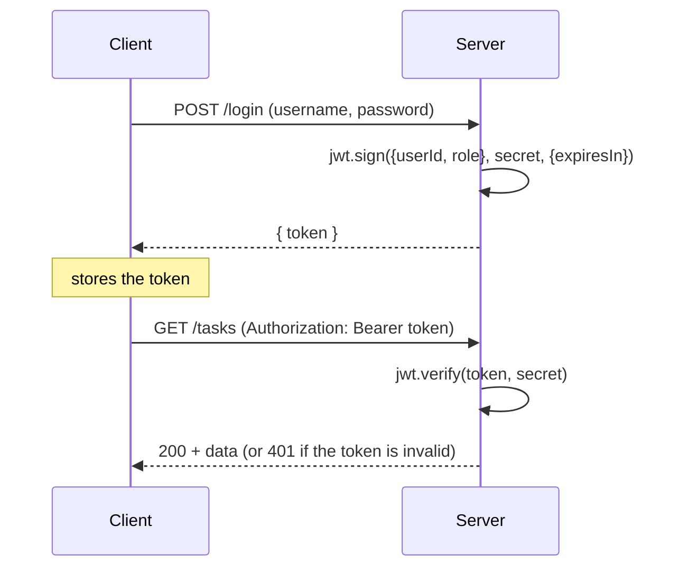

## מה זה?

בשיעור HTTP Basics למדנו שHTTP הוא **Stateless** — השרת לא זוכר בקשות קודמות. אבל אחרי שמשתמש מתחבר (login), השרת חייב "לזכור" מי הוא בכל בקשה עתידית — איך? **JWT** (JSON Web Token) הוא תקן פתוח לטוקן **חתום** שהלקוח שולח עם כל בקשה, כדי שהשרת ידע מי שולח אותה — בלי לשמור session בזיכרון השרת.

## מילות מפתח שחשוב לזכור

• Authentication (אימות) — **מי אתה**: וידוא זהות המשתמש (login עם סיסמה, לדוגמה)

• Authorization (הרשאה) — **מה מותר לך**: מה המשתמש המזוהה רשאי לעשות

• Payload (מטען) — החלק ב-JWT עם הנתונים (`userId`, `role`); **גלוי לכולם**, לא מוצפן, רק חתום

• Signature (חתימה) — האימות הקריפטוגרפי שמוודא שהטוקן לא שונה, ושנוצר עם ה-secret הנכון של השרת

• Access Token — טוקן קצר-מועד (דקות) לאימות בקשות שוטפות

• `jwt.sign(payload, secret, options)` — יוצר טוקן חדש עם תוקף (`expiresIn`)

• `jwt.verify(token, secret)` — מאמת טוקן; זורק שגיאה אם פג תוקף או שהחתימה לא תואמת

```javascript
import jwt from "jsonwebtoken";

// On successful login:
const token = jwt.sign({ userId: user.id, role: user.role }, process.env.JWT_SECRET, { expiresIn: "1h" });
res.json({ token });

// Middleware to authenticate future requests:
function requireAuth(req, res, next) {
  const token = req.headers.authorization?.split(" ")[1]; // "Bearer <token>"
  try {
    req.user = jwt.verify(token, process.env.JWT_SECRET); // adds req.user
    next();
  } catch {
    res.status(401).json({ error: "Invalid or expired token" });
  }
}
```



## הסבר עיקרי

Payload גלוי, אבל לא ניתן לשינוי — ה-Payload של JWT הוא רק **Base64**, לא הצפנה — כל אחד שרואה את הטוקן יכול "לקרוא" אותו. אבל ה-Signature מוודאת ש**אף אחד לא יכול לשנות** את הפרטים בלי לדעת את ה-`secret` הסודי של השרת — אם ה-Payload השתנה, האימות (`jwt.verify`) נכשל.

איך זה פותר את בעיית ה-Stateless — במקום שהשרת "יזכור" מי מחובר (session בזיכרון), הוא פשוט **מאמת מחדש** את הטוקן בכל בקשה — כל המידע (מי המשתמש, מה התפקיד שלו) כבר נמצא בתוך הטוקן עצמו, חתום ומאומת. זה בדיוק תואם ל-Stateless — כל בקשה עצמאית, אבל "מביאה איתה" את זהות השולח.

Authentication מול Authorization — `requireAuth` (למעלה) עונה על "מי אתה?" (Authentication) — אם הטוקן תקין, `req.user` מוגדר. שאלה נפרדת: "האם המשתמש הזה, שכבר מזוהה, **מורשה** לבצע את הפעולה?" (Authorization) — למשל, `if (req.user.role !== "admin") return res.status(403)...` — זה middleware נפרד, שרץ **אחרי** `requireAuth`.

Access Token מול Refresh Token — Access Token קצר-מועד (למשל שעה) מגביל נזק אם הוא נגנב. Refresh Token ארוך-מועד (ימים) מאפשר "לחדש" Access Token בלי לבקש מהמשתמש להתחבר שוב כל שעה — שילוב שנותן גם אבטחה וגם נוחות.

## יתרונות

מתאים בול ל-Stateless HTTP — לא צריך לשמור session בזיכרון השרת; ה-Signature מונעת זיוף טוקנים בלי ה-secret; Access+Refresh Tokens מאזנים בין אבטחה לנוחות משתמש.

## חסרונות

ה-Payload גלוי לכולם — **אסור** לשים בו סיסמאות או מידע רגיש; טוקן שנגנב תקף עד שפג תוקפו (או שיש מנגנון ביטול נפרד); דורש ניהול זהיר של ה-`secret` (ב-`.env`, זוכרים?).

## נקודות חשובות

• JWT = Header.Payload.Signature; Payload גלוי (Base64), לא מוצפן

• Signature מוודאת שהטוקן לא שונה, לא "מסתירה" את התוכן

• Authentication = מי אתה; Authorization = מה מותר לך — שני שלבים נפרדים

• Access Token קצר-מועד; Refresh Token ארוך-מועד לחידוש בלי login חוזר

## טעויות נפוצות

• שמירת מידע רגיש (סיסמה!) בתוך ה-Payload — הוא גלוי לכל מי שיש לו את הטוקן

• בלבול בין Authentication ("מי אתה") ל-Authorization ("מה מותר לך") — שני middlewares שונים

• שמירת ה-`JWT_SECRET` בקוד במקום ב-`.env` (זוכרים למה זה מסוכן?)

## סיכום

JWT הוא טוקן חתום שפותר את בעיית ה-Stateless: השרת לא זוכר session, אלא מאמת מחדש כל בקשה מול הטוקן שהלקוח שולח. `jwt.sign` יוצר, `jwt.verify` מאמת. Authentication ("מי אתה") ו-Authorization ("מה מותר לך") הם שני שלבים נפרדים. Payload גלוי — אסור לשים בו סודות.

## דוקומנטציה רשמית

[jsonwebtoken — npm](https://www.npmjs.com/package/jsonwebtoken)

---

## תרגילים

### תרגיל 1 — יצירת טוקן

**המשימה:** צרו JWT עם `jwt.sign({ userId: 1 }, secret, { expiresIn: "1h" })`, והדפיסו אותו.

**בדיקה:** המחרוזת המודפסת מורכבת משלושה חלקים מופרדים בנקודה (`xxx.yyy.zzz`) ונראית כטקסט מקודד בלתי-קריא — לא `{userId: 1}` רגיל.

### תרגיל 2 — אימות טוקן

**המשימה:** אמתו את הטוקן עם `jwt.verify`, והדפיסו את ה-Payload שחזר. אחר כך שנו תו אחד בטוקן ידנית ונסו לאמת שוב.

**בדיקה:** אימות הטוקן המקורי מחזיר אובייקט עם `userId: 1`; אימות הטוקן המשונה זורק שגיאה (חתימה לא תואמת) במקום להחזיר Payload.

### תרגיל 3 — Authentication מול Authorization

**המשימה:** כתבו `requireAuth` (מאמת טוקן) ו-`requireAdmin` (בודק `req.user.role === "admin"`) כשני middlewares נפרדים ברצף על אותו route.

**בדיקה:** בקשה בלי טוקן מקבלת `401` מ-`requireAuth` (לא מגיעה בכלל ל-`requireAdmin`); בקשה עם טוקן תקין אך `role` שאינו `"admin"` מקבלת `403`; בקשה עם טוקן תקין ו-`role: "admin"` מקבלת `200`.

---

## פרויקט מסכם

**המשימה:** הוסיפו login מלא ו-route מוגן לשרת ה-Tasks.

**דרישות:**
1. `POST /login` שמדמה בדיקת משתמש/סיסמה (בלי DB אמיתי) ומחזיר JWT בהצלחה
2. `requireAuth` middleware שמאמת טוקן מ-`Authorization` header
3. `GET /tasks` דורש טוקן תקין (מוגן ע"י `requireAuth`)
4. בקשה בלי טוקן, או עם טוקן שגוי, מקבלת `401`

**בדיקה:** `curl -X POST .../login -H "Content-Type: application/json" -d '{"username":"dana","password":"1234"}'` מחזיר `200` עם `token`; `curl .../tasks` (בלי header) מחזיר `401`; `curl -H "Authorization: Bearer <token>" .../tasks` עם הטוקן שהתקבל מחזיר `200` עם רשימת המשימות.

---

## מה בפרק הבא

בפרק הבא נלמד על **MVC & DDD** — לאורך היחידה כתבנו הכל בתוך route handlers — קבלת בקשה, לוגיקה עסקית, "גישה לנתונים" (בזיכרון, לעת עתה) — הכל באותה פונקציה. זה עבד לדוגמאות קטנות, אבל בפרויקט אמיתי, "Controller ספגטי" שמכיל שאילתת D
