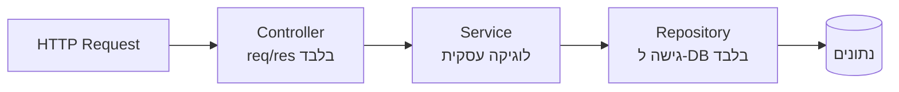

## מה זה?

לאורך היחידה כתבנו הכל בתוך route handlers — קבלת בקשה, לוגיקה עסקית, "גישה לנתונים" (בזיכרון, לעת עתה) — הכל באותה פונקציה. זה עבד לדוגמאות קטנות, אבל בפרויקט אמיתי, "Controller ספגטי" שמכיל שאילתת DB, כללי עסק, ותגובת HTTP — הכל יחד — הוא בלתי-ניתן-לבדיקה בבידוד וקשה מאוד לשנות. **MVC/DDD** מציעים הפרדה לשלוש שכבות ברורות: **Controller** (HTTP בלבד), **Service** (לוגיקה עסקית), ו-**Repository** (גישה ל-DB בלבד) — כל שכבה יודעת כמה שפחות על השכבות האחרות.

## מילות מפתח שחשוב לזכור

• Controller — שכבת ה-HTTP **בלבד**: מקבל `req`, קורא ל-Service, מחזיר `res`; **לא** מכיר DB בכלל

• Service — שכבת הלוגיקה העסקית: כללי עסק, חישובים; **לא** מכיר `req`/`res`

• Repository — שכבת ה-DB **בלבד**: `find`/`save`/`update`/`delete`; **לא** מכילה לוגיקה עסקית

• Separation of Concerns (הפרדת אחריות) — העיקרון הכללי: כל יחידת קוד אחראית על **תחום אחד** בלבד — זוכרים את זה משיעור Clean Code?

• Domain Function — פונקציה טהורה עם כלל עסקי, ללא תלות ב-DB או HTTP; ניתנת לבדיקה בבידוד מוחלט

```javascript
// repository/taskRepository.js — DB בלבד
export const taskRepository = {
  findAll: () => tasksInMemory,
  create: (task) => { tasksInMemory.push(task); return task; },
};

// services/taskService.js — לוגיקה עסקית בלבד
export function createTask(title) {
  if (!title || title.length < 1) throw new ValidationError("Title required");
  const task = { id: Date.now(), title, done: false };
  return taskRepository.create(task);
}

// controllers/taskController.js — HTTP בלבד
export function createTaskHandler(req, res) {
  const task = createTask(req.body.title); // לא יודע כלום על איך זה נשמר
  res.status(201).json(task);
}
```



## הסבר עיקרי

למה ההפרדה הזו עוזרת — `createTask` (Service) לא יודעת אם היא נקראת מ-HTTP, מ-CLI, או מבדיקה אוטומטית (test) — היא רק מקבלת `title` ומחזירה תוצאה. זה הופך אותה לניתנת-לבדיקה **בבידוד גמור**, בלי צורך "להעמיד פנים" שיש בקשת HTTP אמיתית.

Controller "טיפש" בכוונה — ה-Controller לא מכיל שום כלל עסקי (למשל, בדיקת אורך `title`) — הוא רק "מתרגם" בין עולם ה-HTTP (`req`/`res`) לעולם הלוגיקה העסקית (קריאה ל-Service רגילה). כל השינוי בכללים עסקיים קורה ב-Service בלבד, בלי לגעת ב-Controller.

Repository כ"שכבת בידוד" מה-DB — אם מחר עוברים מ"מערך בזיכרון" ל-MongoDB אמיתי (נלמד בהמשך הקורס), רק `taskRepository` צריך להשתנות — `taskService` ו-`taskController` נשארים **בדיוק** אותו דבר, כי הם לא יודעים (ולא צריכים לדעת) איך הנתונים בפועל נשמרים.

## יתרונות

כל שכבה נבדקת (testing) בבידוד; שינוי ב-DB (Repository) לא משפיע על לוגיקה עסקית (Service); Controller קצר וברור — קל להבין מה כל route בדיוק עושה.

## חסרונות

עוד קבצים ועוד שכבות הפשטה לפרויקטים קטנים — יכול להרגיש "מוגזם" למשימה פשוטה; דורש משמעת לשמור על ההפרדה לאורך זמן, במיוחד תחת לחץ זמנים.

## נקודות חשובות למבחן / ראיון עבודה

• Controller = HTTP בלבד; Service = לוגיקה עסקית; Repository = DB בלבד

• Service לא מכיר `req`/`res`; Controller לא מכיר DB ישירות

• Separation of Concerns מאפשרת לבדוק כל שכבה בנפרד, ולשנות אחת בלי לגעת באחרות

• Domain Function היא פונקציה טהורה, ניתנת לבדיקה בלי תלות ב-HTTP או DB

## טעויות נפוצות

• כתיבת שאילתת DB ישירות בתוך Controller — מערבב שכבות ומקשה על בדיקות

• הכנסת לוגיקה עסקית (חישובים, כללים) לתוך Repository — היא אמורה להיות "טיפשה", רק גישה לנתונים

• Service שמקבל `req`/`res` ישירות במקום פרמטרים פשוטים — יוצר תלות מיותרת ב-HTTP

## סיכום

MVC/DDD מפרידים קוד שרת לשלוש שכבות: Controller (HTTP בלבד), Service (לוגיקה עסקית, ללא תלות ב-HTTP/DB), ו-Repository (DB בלבד). כל שכבה "יודעת" כמה שפחות על האחרות — מה שהופך כל אחת לניתנת-לבדיקה בבידוד ולשינוי בלי להשפיע על השאר.

## דוקומנטציה רשמית

[Martin Fowler — Separation of Concerns](https://martinfowler.com/bliki/PresentationDomainDataLayering.html)

---

## תרגילים

### תרגיל 1 — זיהוי שכבות

**המשימה:** קחו route handler שכתבתם בשיעורים קודמים (עם כל הלוגיקה מעורבבת בפונקציה אחת), וסמנו בהערות אילו שורות שייכות ל-Controller, אילו ל-Service, ואילו ל-Repository.

**בדיקה:** כל שורה מסומנת לשכבה אחת בלבד: שורות עם `req`/`res` הן Controller, שורות עם כללי עסק (בדיקות, חישובים) הן Service, שורות שנוגעות ישירות במערך/ה-DB הן Repository.

### תרגיל 2 — הפרדה בסיסית

**המשימה:** קחו route handler אחד מפרויקט קודם שלכם ופצלו אותו ל-3 קבצים: controller, service, repository.

**בדיקה:** ה-route עצמו ממשיך להחזיר בדיוק את אותה תגובה כמו לפני הפיצול (בדקו עם `curl`); `taskController.js` לא מכיל אף גישה ישירה למערך הנתונים.

### תרגיל 3 — בדיקת Service בבידוד

**המשימה:** כתבו סקריפט קטן שקורא ישירות לפונקציית ה-Service (בלי `app`, בלי `req`/`res`, בלי `fetch`), ומדפיס את התוצאה.

**בדיקה:** הרצת הסקריפט (`node test-service.js`) מדפיסה תוצאה תקינה בלי להפעיל שרת HTTP כלל — הוכחה שה-Service לא תלוי ב-HTTP.

---

## פרויקט מסכם

**המשימה:** ארגנו מחדש את שרת ה-Tasks המלא לפי MVC.

**דרישות:**
1. `repositories/taskRepository.js` — כל הגישה למערך המשימות בזיכרון
2. `services/taskService.js` — כללי עסק (למשל: אין ליצור משימה בלי `title`), קורא ל-Repository
3. `controllers/taskController.js` — routes בלבד, קורא ל-Service, מחזיר `res`
4. ודאו שכל ה-endpoints הקיימים (`GET`/`POST`/`PUT`/`DELETE`) עדיין עובדים בדיוק כמו קודם

**בדיקה:** `curl http://localhost:3000/tasks`, `curl -X POST http://localhost:3000/tasks -H "Content-Type: application/json" -d '{"title":"קניות"}'` וכו' מחזירים בדיוק את אותן תגובות כמו לפני הריפקטור; `taskController.js` לא מכיל אף התייחסות ישירה למערך המשימות.

---

## מה בפרק הבא

בפרק הבא — **הפרויקט המסכם האחרון בקורס**: מקשיחים את Task Manager API לרמת production אמיתית עם כל חמשת הנושאים ביחידה יחד — Logging, Validation, OWASP, JWT, ו-MVC.
