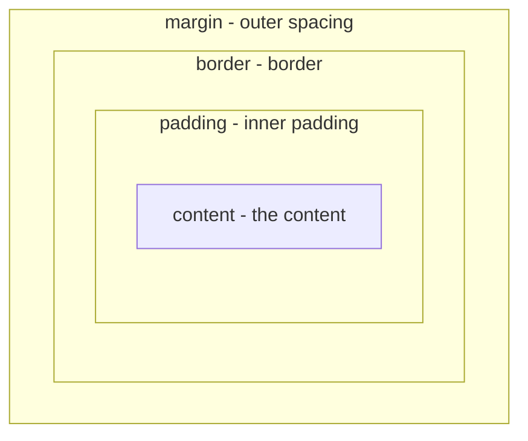

## מה זה?

בשיעור הקודם למדנו **מה** לעצב (Selectors). עכשיו: איך CSS בכלל **מודד** גודל ומרווח? כל אלמנט ב-CSS, בלי יוצא מן הכלל, נחשב **קופסה מלבנית** — גם אם זה טקסט, תמונה, או כפתור. ה-**Box Model** מתאר את השכבות של הקופסה הזו: התוכן עצמו, מרווח פנימי סביבו, גבול, ומרווח חיצוני שמפריד מקופסאות אחרות.

## מילות מפתח שחשוב לזכור

• Content (תוכן) — התוכן עצמו של האלמנט (טקסט, תמונה)

• Padding (ריפוד) — מרווח **פנימי**, בין התוכן לגבול הקופסה — "מרפד" את התוכן מבפנים

• Border (גבול) — קו שמקיף את ה-padding+content

• Margin (שוליים) — מרווח **חיצוני**, מחוץ לגבול — המרחק מקופסאות אחרות

• `box-sizing: border-box` — קובע איך מחשבים `width`/`height`: כולל padding+border בתוכם (לא מוסיף אותם מעליהם) — כמעט תמיד עדיף

• Units (יחידות) — `px` (פיקסלים, קבוע), `%` (יחסי להורה), `em`/`rem` (יחסי לגודל פונט — `rem` יחסי לפונט הבסיס של כל הדף, `em` יחסי לפונט של האלמנט עצמו)

```css
.card {
  width: 300px;
  padding: 16px;
  border: 1px solid #ccc;
  margin: 8px;
  box-sizing: border-box;
}
```



## הדגמה חיה

<div class="demo-live" style="direction:rtl;border:1px solid #d1d5db;border-radius:10px;padding:1.25rem;margin:1.25rem 0;background:#fafafa;color:#111827;">
<p style="font-weight:600;margin:0 0 0.9rem;color:#6b7280;font-size:0.85rem;">🔴 הדגמה חיה — שכבות ה-Box Model בצבעים אמיתיים (בדיוק כמו ב-DevTools)</p>
<div style="background:#f9cc9d;padding:18px;display:inline-block;border-radius:4px;">
<div style="background:#fdd;padding:16px;border:4px solid #cc8;border-radius:4px;">
<div style="background:#bfdadc;padding:14px;border-radius:4px;">
<div style="background:#9fc6cf;padding:10px 16px;border-radius:2px;color:#0b3d42;font-weight:600;">content</div>
</div>
</div>
</div>
<p style="margin:0.9rem 0 0;font-size:0.85rem;color:#6b7280;">מבחוץ פנימה: <span style="color:#b8860b;">margin (כתום)</span> ← <span style="color:#a08000;">border (זהב)</span> ← <span style="color:#2c7a7b;">padding (תכלת)</span> ← content (כחול כהה)</p>
</div>

## הסבר עיקרי

box-sizing כבחירה קריטית — בברירת המחדל (`content-box`), `width: 300px` קובע רק את **התוכן** — padding ו-border **מתווספים** מעליו, כך שהרוחב הכולל בפועל גדול מ-300px! `box-sizing: border-box` משנה את זה: `width: 300px` הופך ל**רוחב הכולל** (כולל padding+border) — הרבה יותר אינטואיטיבי, ולכן כמעט כל פרויקט מודרני מגדיר אותו כברירת מחדל גלובלית.

px מול % מול rem — `px` הוא ערך קבוע, לא מגיב לשום דבר. `%` יחסי **להורה** — `width: 50%` פירושו "חצי מרוחב האלמנט המכיל". `rem` יחסי לגודל הפונט הבסיסי של **כל הדף** (בד"כ 16px) — `font-size: 1.5rem` תמיד = 24px, לא משנה איפה באלמנט זה מוגדר; זה הופך אותו לצפוי ועקבי, ולכן מומלץ ל-font sizing על פני `px` קבוע.

margin collapse — תופעה ייחודית: כששני אלמנטים אנכיים סמוכים יש להם margin (למשל, אחד עם `margin-bottom: 20px` והשני עם `margin-top: 10px`), המרווח **ביניהם בפועל** הוא לא הסכום (30px) — הוא ה-margin **הגדול מביניהם** (20px)! זו טעות נפוצה שמבלבלת מפתחים שמצפים לחיבור.

## יתרונות

Box Model נותן מודל עקבי וחזוי לכל אלמנט, בלי יוצא מן הכלל; `border-box` הופך חישובי רוחב לאינטואיטיביים; `rem` נותן עקביות בגדלי טקסט בכל הדף.

## חסרונות

margin collapse הוא התנהגות לא-אינטואיטיבית שמפתיעה מפתחים חדשים; ברירת המחדל (`content-box`) מבלבלת אם לא מגדירים `border-box` במפורש; ריבוי יחידות (px/%/em/rem) דורש הבנה מתי כל אחת מתאימה.

## נקודות חשובות

• סדר השכבות (מבפנים החוצה): content → padding → border → margin

• `box-sizing: border-box` כולל padding+border בתוך ה-`width`/`height` המוגדר

• `rem` יחסי לפונט הבסיס של כל הדף; `em` יחסי לפונט של האלמנט עצמו; `%` יחסי להורה

• Margin collapse: מרווחים אנכיים סמוכים "מתמזגים" לגדול מביניהם, לא מסתכמים

## טעויות נפוצות

• לא להגדיר `box-sizing: border-box` — `width` בפועל גדול ממה שציפיתם, בגלל padding/border שמתווספים

• להשתמש רק ב-`px` לכל דבר, גם לגדלי טקסט — פחות גמיש לנגישות (משתמש שמגדיל טקסט בדפדפן)

• להתבלבל מ-margin collapse ולחשוב שיש באג כשהמרווח לא "מסתכם" כצפוי

## סיכום

כל אלמנט ב-CSS הוא קופסה עם ארבע שכבות: content → padding → border → margin. `box-sizing: border-box` הופך חישובי רוחב לאינטואיטיביים, וכמעט תמיד רצוי. `px` הוא קבוע, `%` יחסי להורה, `rem` יחסי לפונט הבסיס — כל אחד מתאים להקשר שונה. Margin collapse ממזג מרווחים אנכיים סמוכים לגדול מביניהם.

## דוקומנטציה רשמית

[MDN — The Box Model](https://developer.mozilla.org/en-US/docs/Learn/CSS/Building_blocks/The_box_model)

---

## תרגילים

### תרגיל 1 — box-sizing בפעולה

**המשימה:** צרו קופסה עם `width: 200px`, `padding: 20px`, `border: 5px solid`. מדדו את הרוחב בפועל ב-DevTools פעם עם `box-sizing: content-box` ופעם עם `border-box`.

**בדיקה:** עם `content-box`, הרוחב בפועל הוא 250px (200+20+20+5+5); עם `border-box`, הרוחב בפועל הוא בדיוק 200px.

### תרגיל 2 — rem מול px

**המשימה:** קבעו `font-size` על `<h1>` אחד ב-`px` ועל `<h1>` אחר ב-`rem`. שנו את גודל הפונט הבסיסי של הדף (`html { font-size: ... }`) והשוו איך כל אחד מגיב.

**בדיקה:** ה-`<h1>` עם `rem` משתנה בגודל יחסית לשינוי; ה-`<h1>` עם `px` נשאר קבוע.

### תרגיל 3 — margin collapse

**המשימה:** צרו שני אלמנטי `<div>` סמוכים (אחד אחרי השני), הראשון עם `margin-bottom: 30px`, השני עם `margin-top: 15px`. מדדו ב-DevTools את המרווח בפועל ביניהם.

**בדיקה:** המרווח בפועל הוא 30px (הגדול מבין השניים), לא 45px (הסכום).

---

## פרויקט מסכם

**המשימה:** עצבו את כרטיסי ה-"כישורים"/"תחביבים" בעמוד האודות (מיחידת HTML) כקופסאות עם Box Model עקבי.

**דרישות:**
1. `box-sizing: border-box` מוגדר גלובלית (על `*` או `html`)
2. כל כרטיס עם `padding`, `border`, ו-`margin` עקביים
3. גדלי טקסט ב-`rem`, לא `px`
4. רוחב הכרטיסים ב-`%` יחסי לאזור המכיל

**בדיקה:** כל הכרטיסים נראים אחידים בגודל ומרווח; שינוי גודל הפונט הבסיסי של הדף משנה את גדלי הטקסט בכרטיסים יחסית.

---

## מה בפרק הבא

בפרק הבא נלמד על **CSS Specificity** — בשיעור על Selectors כתבנו כמה סלקטורים לאותו עמוד. אבל מה קורה אם **שני** חוקי CSS שונים קובעים ערך **שונה** לאותה תכונה על אותו אלמנט — למשל `p { color: blue; }` ו-`.highlight { color: red; }`, ואלמנ
