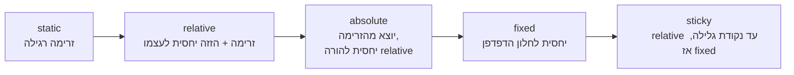

## מה זה?

עד עכשיו, כל האלמנטים שלנו זרמו זה אחרי זה, מלמעלה למטה, בסדר שהם מופיעים ב-HTML ("Normal Flow"). אבל מה אם רוצים כפתור "X" שצף **בפינה** של כרטיס, בלי קשר לזרימה הרגילה? או תפריט עליון שנשאר **דבוק** למעלה גם כשגוללים למטה? **CSS Position** קובע איך אלמנט בודד ממוקם — האם הוא משתתף בזרימה הרגילה, או "יוצא" ממנה למיקום מדויק.

## מילות מפתח שחשוב לזכור

• `position: static` — ברירת המחדל: האלמנט בזרימה הרגילה, `top`/`left` וכו' לא משפיעים עליו כלל

• `position: relative` — נשאר בזרימה הרגילה, אבל אפשר "להזיז" אותו **יחסית למקום המקורי שלו** עם `top`/`left`

• `position: absolute` — **יוצא** מהזרימה הרגילה לגמרי, וממוקם יחסית להורה **הכי קרוב** שיש לו `position` שאינו `static`

• `position: fixed` — יוצא מהזרימה, וממוקם יחסית ל**חלון הדפדפן** — נשאר במקום גם כשגוללים

• `position: sticky` — היברידי: מתנהג כ-`relative` עד שמגיעים לנקודה מסוימת בגלילה, ואז "נדבק" כמו `fixed`

• `z-index` — קובע איזה אלמנט "מעל" איזה, כשכמה אלמנטים ממוקמים חופפים

```css
.card { position: relative; }
.card .badge {
  position: absolute;
  top: 8px;
  right: 8px;
}
.navbar { position: sticky; top: 0; }
```



## הדגמה חיה

<div class="demo-live" style="direction:rtl;border:1px solid #d1d5db;border-radius:10px;padding:1.25rem;margin:1.25rem 0;background:#fafafa;color:#111827;">
<p style="font-weight:600;margin:0 0 0.9rem;color:#6b7280;font-size:0.85rem;">🔴 הדגמה חיה — badge ממוקם ביחס לכרטיס, וכותרת sticky שגוללים תחתיה</p>
<div style="position:relative;background:#e5e7eb;border-radius:8px;padding:1.5rem;width:220px;">
<span style="position:absolute;top:8px;left:8px;background:#dc2626;color:#fff;border-radius:999px;padding:0.15rem 0.55rem;font-size:0.75rem;font-weight:700;">badge</span>
<p style="margin:0;font-size:0.85rem;">כרטיס עם <code style="direction:ltr;display:inline-block;">position:relative</code> — ה-badge ממוקם <code style="direction:ltr;display:inline-block;">absolute</code> ביחסו, לא ביחס לכל העמוד</p>
</div>
<div style="margin-top:1rem;height:110px;overflow-y:auto;border:1px solid #d1d5db;border-radius:8px;">
<div style="position:sticky;top:0;background:#2563eb;color:#fff;padding:0.4rem 0.75rem;font-weight:700;font-size:0.85rem;">כותרת sticky — גללו למטה</div>
<p style="padding:0.5rem 0.75rem;margin:0;font-size:0.85rem;">שורת תוכן 1</p>
<p style="padding:0.5rem 0.75rem;margin:0;font-size:0.85rem;">שורת תוכן 2</p>
<p style="padding:0.5rem 0.75rem;margin:0;font-size:0.85rem;">שורת תוכן 3</p>
<p style="padding:0.5rem 0.75rem;margin:0;font-size:0.85rem;">שורת תוכן 4</p>
<p style="padding:0.5rem 0.75rem;margin:0;font-size:0.85rem;">שורת תוכן 5 — הכותרת נשארה דבוקה למעלה</p>
</div>
</div>

## הסבר עיקרי

absolute תמיד צריך "עוגן" relative — זו הנקודה הכי מבלבלת למתחילים: `position: absolute` בלי הורה עם `position: relative` (או `absolute`/`fixed`) ממוקם יחסית **לכל העמוד** (`<html>`), לא למקום שציפיתם! בדוגמה למעלה, `.card { position: relative; }` הוא בדיוק ה"עוגן" — הוא **לא** משנה שום דבר ויזואלית בעצמו, אבל הופך את עצמו ל"נקודת ייחוס" עבור `.badge` שבתוכו.

fixed מול sticky — `fixed` תמיד "צף" במקום קבוע ביחס לחלון, לא משנה כמה גוללים. `sticky` "מתחיל" בזרימה הרגילה (כמו `relative`), ורק **כשמגיעים** לנקודת הגלילה שהגדרתם (`top: 0`), הוא "נדבק" למקום — שימושי לתפריטי ניווט שרוצים שיישארו נגישים, אבל רק אחרי שגוללים מעבר לתוכן שמעליהם.

z-index כשיש חפיפה — כשכמה אלמנטים ממוקמים (לא `static`) חופפים חזותית, מי מוצג "מעל" מי? `z-index` (מספר) קובע את זה — גבוה יותר = מעל. `z-index` **עובד רק** על אלמנטים עם `position` שאינו `static` — הגדרתו על אלמנט `static` פשוט לא עושה כלום.

## יתרונות

`relative`+`absolute` נותנים שליטה מדויקת על מיקום יחסי (badge בפינת כרטיס, tooltip); `sticky` נותן חוויית משתמש טובה לתפריטים בלי JavaScript; `fixed` שימושי לאלמנטים שצריכים להישאר נגישים תמיד (כפתור "חזרה למעלה").

## חסרונות

`absolute` בלי "עוגן" `relative` נכון מוביל למיקום לא-צפוי לגמרי; שכבות `z-index` רבות ולא-מתועדות הופכות קשות לניהול; `fixed`/`sticky` יכולים "לכסות" תוכן על מסכים קטנים אם לא מטפלים בזהירות.

## נקודות חשובות למבחן / ראיון עבודה

• `static` = ברירת מחדל, בזרימה; `relative` = בזרימה + הזזה עצמית; `absolute`/`fixed` = יוצאים מהזרימה

• `absolute` ממוקם יחסית להורה הכי קרוב עם `position` שאינו `static` — אם אין כזה, יחסית לכל העמוד

• `sticky` = `relative` עד נקודת גלילה מסוימת, ואז `fixed`

• `z-index` קובע סדר שכבות, ועובד רק על אלמנטים לא-`static`

## טעויות נפוצות

• שימוש ב-`absolute` בלי הורה `relative` — האלמנט "קופץ" למקום לא-צפוי (יחסית לכל הדף)

• הנחה ש-`z-index` יעבוד על אלמנט `static` — צריך קודם `position` שאינו `static`

• שימוש-יתר ב-`fixed` שמכסה תוכן חשוב במסכים קטנים

## סיכום

`position` קובע איך אלמנט ממוקם: `static` (ברירת מחדל, בזרימה), `relative` (בזרימה + הזזה עצמית), `absolute` (יוצא מהזרימה, יחסית להורה `relative`), `fixed` (יחסית לחלון), `sticky` (היברידי). `z-index` קובע סדר שכבות בין אלמנטים חופפים, ועובד רק על אלמנטים לא-`static`.

## דוקומנטציה רשמית

[MDN — Positioning](https://developer.mozilla.org/en-US/docs/Learn/CSS/CSS_layout/Positioning)

---

## תרגילים

### תרגיל 1 — relative + absolute

**המשימה:** צרו כרטיס (`<div>`) עם `position: relative`, ובתוכו "badge" קטן עם `position: absolute; top: 8px; right: 8px;`.

**בדיקה:** ה-badge ממוקם בדיוק בפינה הימנית-עליונה של הכרטיס — לא של כל העמוד.

### תרגיל 2 — absolute בלי עוגן

**המשימה:** הסירו זמנית את `position: relative` מהכרטיס, והשאירו את ה-badge עם `position: absolute`. בדקו מה קורה.

**בדיקה:** ה-badge "קופץ" למיקום אחר לגמרי — יחסית לכל העמוד, לא לכרטיס — עדות לחשיבות ה"עוגן".

### תרגיל 3 — sticky navbar

**המשימה:** בנו תפריט עליון עם `position: sticky; top: 0;`, מעל עמוד עם הרבה תוכן שאפשר לגלול בו.

**בדיקה:** התפריט נשאר דבוק לראש המסך כשגוללים למטה, אחרי שעברתם את התוכן שמעליו.

---

## פרויקט מסכם

**המשימה:** הוסיפו לעמוד האודות תפריט sticky וכרטיסי מידע עם badges ממוקמים.

**דרישות:**
1. תפריט ניווט עליון עם `position: sticky; top: 0;`
2. לפחות כרטיס אחד עם `position: relative` שמכיל badge/תווית עם `position: absolute`
3. `z-index` מוגדר במפורש אם יש חפיפה בין אלמנטים

**בדיקה:** גלילה בעמוד משאירה את התפריט דבוק למעלה; ה-badge תמיד ממוקם נכון ביחס לכרטיס שלו, גם אם משנים את תוכן הכרטיס.

---

## מה בפרק הבא

בפרק הבא נלמד על **Flexbox** — עד עכשיו מיקום אלמנטים היה ידני יחסית — `position`, מרווחים ידניים. אבל איך מסדרים למשל 3 כרטיסים **בשורה אחת, מרווחים שווה ביניהם**, שמתאימים את עצמם אוטומטית לרוחב המסך? לעשות את זה עם `position` בל
