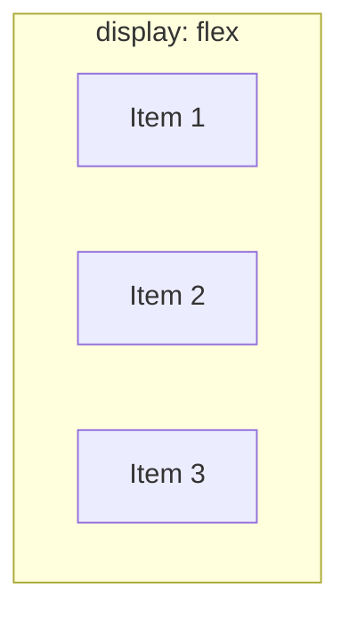

## מה זה?

עד עכשיו מיקום אלמנטים היה ידני יחסית — `position`, מרווחים ידניים. אבל איך מסדרים למשל 3 כרטיסים **בשורה אחת, מרווחים שווה ביניהם**, שמתאימים את עצמם אוטומטית לרוחב המסך? לעשות את זה עם `position` בלבד יהיה מסובך ושביר. **Flexbox** הוא מערכת פריסה (Layout System) שנועדה בדיוק לזה: מסדרת קבוצת אלמנטים **בציר אחד** (שורה או עמודה), עם כלים מובנים לחלוקת מקום, יישור, ומרווח.

## מילות מפתח שחשוב לזכור

• `display: flex` — הופך אלמנט ל-Flex Container; **הילדים הישירים שלו** הופכים ל-Flex Items

• Main Axis (ציר ראשי) — הכיוון שבו הפריטים מסודרים; `flex-direction: row` (אופקי, ברירת מחדל) או `column` (אנכי)

• `justify-content` — מיישר פריטים לאורך ה-**ציר הראשי** (למשל `space-between` — מרווח שווה ביניהם)

• `align-items` — מיישר פריטים לאורך ה-**ציר הצולב** (הניצב לראשי)

• `gap` — מרווח קבוע בין פריטים, בלי צורך ב-`margin` ידני על כל אחד

• `flex-wrap` — קובע אם פריטים "עוברים שורה" כשאין מספיק מקום (`wrap`) או נדחסים (`nowrap`, ברירת מחדל)

```css
.container {
  display: flex;
  justify-content: space-between;
  align-items: center;
  gap: 16px;
}
```



## הדגמה חיה

<div class="demo-live" style="direction:rtl;border:1px solid #d1d5db;border-radius:10px;padding:1.25rem;margin:1.25rem 0;background:#fafafa;color:#111827;">
<p style="font-weight:600;margin:0 0 0.9rem;color:#6b7280;font-size:0.85rem;">🔴 הדגמה חיה — Flex Container אמיתי, עם justify-content:space-between ו-align-items:center</p>
<div style="display:flex;justify-content:space-between;align-items:center;gap:12px;background:#e5e7eb;border-radius:8px;padding:1rem;height:90px;">
<div style="background:#2563eb;color:#fff;border-radius:6px;padding:0.5rem 1rem;font-weight:700;">Item 1</div>
<div style="background:#059669;color:#fff;border-radius:6px;padding:1.1rem 1rem;font-weight:700;">Item 2</div>
<div style="background:#d97706;color:#fff;border-radius:6px;padding:0.5rem 1rem;font-weight:700;">Item 3</div>
</div>
<p style="margin:0.75rem 0 0;font-size:0.85rem;color:#6b7280;">שימו לב: המרווח שווה בין הפריטים (space-between), וכולם ממורכזים אנכית (align-items:center) למרות שה-Item 2 גבוה יותר.</p>
</div>

## הסבר עיקרי

Container מול Items — ההבחנה הזו קריטית: `display: flex` על אלמנט הופך **אותו** ל-Container, אבל התכונות המעניינות (`justify-content`, `align-items`, `gap`) מוגדרות **גם כן על ה-Container**, ומשפיעות על איך ה**ילדים** שלו מסודרים. תכונות אחרות (כמו `flex-grow`) מוגדרות **על הילדים עצמם**, לשליטה פרטנית.

justify-content מול align-items — שני צירים שונים לגמרי: אם `flex-direction: row` (ברירת מחדל), `justify-content` שולט על היישור **האופקי** (לאורך השורה), ו-`align-items` שולט על היישור **האנכי** (בתוך גובה השורה). אם הופכים ל-`flex-direction: column`, שני הצירים **מתחלפים** — `justify-content` הופך לאנכי, `align-items` לאופקי.

gap פותר בעיה ישנה — לפני `gap`, כדי לתת מרווח בין פריטי flex, היו צריכים `margin` על **כל פריט**, עם טיפול מיוחד לפריט הראשון/אחרון (שלא צריך margin בקצה). `gap` נותן מרווח **רק בין** הפריטים, אוטומטית, בלי כל ההתעסקות הזו.

## יתרונות

פותר בקלות יישור, חלוקת מקום, ומרווח — משימות שהיו מסובכות עם `position`/`float` בעבר; `flex-wrap` נותן רספונסיביות בסיסית (פריטים "עוברים שורה") בלי media queries; נתמך היטב בכל דפדפן מודרני.

## חסרונות

חד-ממדי בלבד (שורה **או** עמודה, לא שתיהן יחד לבקרה מלאה — לכך יש Grid, בשיעור הבא); הרבה תכונות (justify-content, align-items, align-content, flex-grow...) דורשות זמן להפנים.

## נקודות חשובות למבחן / ראיון עבודה

• `display: flex` הופך אלמנט ל-Container; ילדיו הישירים הופכים ל-Items אוטומטית

• `justify-content` = ציר ראשי; `align-items` = ציר צולב — מתחלפים בין `row` ל-`column`

• `gap` נותן מרווח בין פריטים בלי margin ידני

• `flex-wrap: wrap` מאפשר לפריטים "לעבור שורה" כשאין מקום

## טעויות נפוצות

• להגדיר `justify-content`/`align-items` על ה-**Item** במקום ה-**Container** — לא עושה כלום

• לבלבל בין ציר ראשי לצולב אחרי החלפת `flex-direction` — התכונות "מתחלפות" תפקיד

• לשכוח `flex-wrap: wrap` ולתהות למה פריטים "נדחסים" קטנים מדי במקום לעבור שורה

## סיכום

Flexbox מסדר אלמנטים בציר אחד (שורה או עמודה): `display: flex` על ההורה הופך ילדים ל-Items. `justify-content` שולט על הציר הראשי, `align-items` על הצולב — הם מתחלפים כש-`flex-direction` משתנה. `gap` נותן מרווח נקי בין פריטים, `flex-wrap` מאפשר מעבר שורה כשאין מקום.

## דוקומנטציה רשמית

[MDN — Basic Concepts of Flexbox](https://developer.mozilla.org/en-US/docs/Learn/CSS/CSS_layout/Flexbox)

---

## תרגילים

### תרגיל 1 — שורת כרטיסים

**המשימה:** סדרו 3 כרטיסים בשורה אחת עם `display: flex` ו-`justify-content: space-between`.

**בדיקה:** הכרטיסים מסודרים אופקית, עם מרווח שווה ביניהם, הראשון בקצה אחד והאחרון בקצה השני.

### תרגיל 2 — align-items ליישור אנכי

**המשימה:** על אותה שורת flex, שנו את גובה ה-Container והשתמשו ב-`align-items: center` ליישר את הכרטיסים אנכית באמצע.

**בדיקה:** הכרטיסים ממורכזים אנכית בתוך ה-Container, לא רק צמודים לחלק העליון.

### תרגיל 3 — flex-wrap לרספונסיביות בסיסית

**המשימה:** הוסיפו עוד כרטיסים (עד שאין להם מספיק מקום בשורה אחת) עם `flex-wrap: wrap`.

**בדיקה:** כשאין מספיק רוחב, הכרטיסים העודפים "עוברים" לשורה חדשה, במקום להידחס או לגלוש.

---

## פרויקט מסכם

**המשימה:** בנו תפריט ניווט עם Flexbox, וגלריית כרטיסים עם Flexbox.

**דרישות:**
1. תפריט (`<nav>`) עם קישורים מסודרים בשורה, `justify-content: space-between` בין הלוגו לקישורים
2. גלריית כרטיסים (לפחות 4) עם `display: flex; flex-wrap: wrap; gap: 16px;`
3. כל כרטיס מיושר אנכית עם `align-items: center` בתוך ה-Container שלו (אם רלוונטי)

**בדיקה:** התפריט נראה מסודר בכל רוחב מסך; הכרטיסים "עוברים שורה" כשמצמצמים את חלון הדפדפן, בלי לגלוש הצידה.

---

## מה בפרק הבא

בפרק הבא נלמד על **CSS Grid** — Flexbox (שיעור קודם) מסדר אלמנטים **בציר אחד** — שורה או עמודה. אבל מה אם רוצים פריסה אמיתית של עמוד: כותרת למעלה על פני כל הרוחב, תפריט צד, תוכן ראשי, footer למטה — **גם שורות וגם עמודות יחד**, עם של
