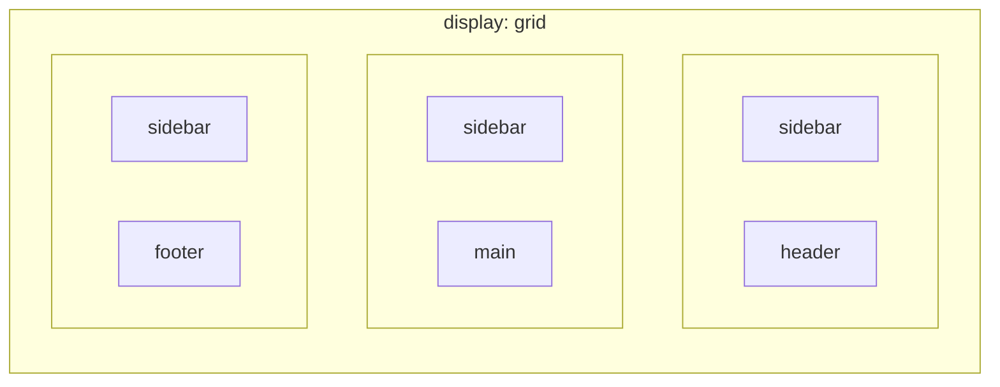

## מה זה?

Flexbox (שיעור קודם) מסדר אלמנטים **בציר אחד** — שורה או עמודה. אבל מה אם רוצים פריסה אמיתית של עמוד: כותרת למעלה על פני כל הרוחב, תפריט צד, תוכן ראשי, footer למטה — **גם שורות וגם עמודות יחד**, עם שליטה מדויקת על שניהם בו-זמנית? **CSS Grid** הוא בדיוק זה: מערכת פריסה **דו-ממדית** ששולטת בשורות ובעמודות בבת אחת.

## מילות מפתח שחשוב לזכור

• `display: grid` — הופך אלמנט ל-Grid Container

• `grid-template-columns` — מגדיר כמה עמודות יש, ומה הרוחב של כל אחת

• `fr` (fraction unit) — יחידה ייחודית ל-Grid: "חלק יחסי" מהמקום הפנוי (`1fr 2fr` = עמודה שנייה כפולה מהראשונה)

• `grid-template-areas` — נותן **שמות** לאזורים בפריסה, ומאפשר "לצייר" את המבנה בטקסט קריא

• `grid-column` / `grid-row` — קובעים על אלמנט ספציפי כמה עמודות/שורות הוא "תופס" (span)

```css
.layout {
  display: grid;
  grid-template-columns: 200px 1fr;
  grid-template-areas:
    "sidebar header"
    "sidebar main"
    "sidebar footer";
  gap: 16px;
}
.sidebar { grid-area: sidebar; }
.header  { grid-area: header; }
.main    { grid-area: main; }
.footer  { grid-area: footer; }
```



## הדגמה חיה

<div class="demo-live" style="direction:rtl;border:1px solid #d1d5db;border-radius:10px;padding:1.25rem;margin:1.25rem 0;background:#fafafa;color:#111827;">
<p style="font-weight:600;margin:0 0 0.9rem;color:#6b7280;font-size:0.85rem;">🔴 הדגמה חיה — grid-template-areas אמיתי, בדיוק כמו בקוד</p>
<style>
.demo-grid-layout{display:grid;grid-template-columns:90px 1fr;grid-template-areas:"sidebar header" "sidebar main" "sidebar footer";gap:8px;height:220px;}
.demo-grid-sidebar{grid-area:sidebar;background:#7c3aed;color:#fff;border-radius:6px;display:flex;align-items:center;justify-content:center;font-weight:700;font-size:0.85rem;}
.demo-grid-header{grid-area:header;background:#2563eb;color:#fff;border-radius:6px;display:flex;align-items:center;justify-content:center;font-weight:700;font-size:0.85rem;}
.demo-grid-main{grid-area:main;background:#059669;color:#fff;border-radius:6px;display:flex;align-items:center;justify-content:center;font-weight:700;font-size:0.85rem;}
.demo-grid-footer{grid-area:footer;background:#d97706;color:#fff;border-radius:6px;display:flex;align-items:center;justify-content:center;font-weight:700;font-size:0.85rem;}
</style>
<div class="demo-grid-layout">
<div class="demo-grid-sidebar">sidebar</div>
<div class="demo-grid-header">header</div>
<div class="demo-grid-main">main</div>
<div class="demo-grid-footer">footer</div>
</div>
</div>

## הסבר עיקרי

fr כיחידה ייחודית ל-Grid — `grid-template-columns: 200px 1fr` אומר: "עמודה ראשונה קבועה ב-200px, עמודה שנייה תופסת **את כל השאר**" (`1fr` = כל המקום הפנוי הנותר). `1fr 2fr` היה נותן לעמודה השנייה **כפול** מהראשונה מהמקום הפנוי. זו יחידה גמישה שאין ל-Flexbox או ל-`%` רגיל.

grid-template-areas כ"ציור" הפריסה בטקסט — זו אחת התכונות הכי קריאות ב-CSS: הדוגמה למעלה **ממש נראית** כמו הפריסה בפועל — `sidebar` תופס את כל העמודה (3 שורות), `header`/`main`/`footer` מסודרים בעמודה השנייה. כל אלמנט מקבל `grid-area: name` שמתאים לשם שהגדרתם — קל להבין מסתכלים על הקוד מה קורה, לעומת חישובי `grid-column`/`grid-row` ידניים.

Grid מול Flexbox — מתי מה — Flexbox מצוין לפריסה **חד-ממדית**: תפריט, שורת כפתורים, רשימת כרטיסים שזורמת. Grid מצוין לפריסה **דו-ממדית**: מבנה עמוד שלם (header/sidebar/main/footer), גלריית תמונות עם שורות ועמודות מדויקות. בפרויקטים אמיתיים, כמעט תמיד משתמשים ב**שניהם יחד** — Grid לפריסה הכללית, Flexbox בתוך כל אזור.

## יתרונות

שליטה דו-ממדית אמיתית — שורות ועמודות יחד, לא רק ציר אחד; `grid-template-areas` נותן קריאות גבוהה במיוחד לפריסות מורכבות; `fr` נותן חלוקת מקום גמישה שקשה להשיג אחרת.

## חסרונות

עקומת למידה תלולה יותר מ-Flexbox — יותר תכונות ומושגים חדשים; פחות מתאים לרכיבים קטנים/פשוטים שזורמים בציר אחד (שם Flexbox פשוט יותר).

## נקודות חשובות

• Grid הוא דו-ממדי (שורות+עמודות); Flexbox הוא חד-ממדי (שורה **או** עמודה)

• `fr` הוא "חלק יחסי" מהמקום הפנוי — ייחודי ל-Grid

• `grid-template-areas` נותן שמות לאזורים, וכל אלמנט מקבל `grid-area` תואם

• בפרויקטים אמיתיים, Grid ו-Flexbox משתלבים יחד — Grid לפריסה הכללית, Flexbox בתוך אזורים

## טעויות נפוצות

• לנסות לבנות פריסת עמוד שלמה עם Flexbox בלבד, כש-Grid היה פשוט ומתאים יותר (דו-ממדי)

• שכחת `grid-area` תואם על אלמנט, למרות שהוגדר ב-`grid-template-areas` — שם לא-תואם פשוט לא עובד

• בלבול בין `fr` ל-`%`: `fr` מתחלק **מהמקום הפנוי בלבד**, אחרי הפחתת עמודות קבועות (כמו `200px`)

## סיכום

CSS Grid הוא מערכת פריסה דו-ממדית ששולטת בשורות ובעמודות יחד. `grid-template-columns` מגדיר רוחב עמודות (עם `fr` לחלוקה גמישה); `grid-template-areas` "מצייר" את הפריסה בטקסט קריא, עם `grid-area` על כל אלמנט. Grid ו-Flexbox משתלבים יחד בפרויקטים אמיתיים — Grid לשלד הכללי, Flexbox בתוך כל אזור.

## דוקומנטציה רשמית

[MDN — CSS Grid Layout](https://developer.mozilla.org/en-US/docs/Learn/CSS/CSS_layout/Grids)

---

## תרגילים

### תרגיל 1 — Grid בסיסי עם fr

**המשימה:** צרו Grid עם 3 עמודות (`1fr 1fr 1fr`) ו-2 שורות, עם 6 פריטים (`<div>`) בתוכו.

**בדיקה:** שלושת הפריטים בכל שורה מוצגים ברוחב שווה בדיוק, לא משנה תוכן.

### תרגיל 2 — עמודה קבועה + גמישה

**המשימה:** שנו את הגדרת העמודות ל-`200px 1fr 1fr` — עמודה ראשונה קבועה, שתי הנותרות גמישות.

**בדיקה:** העמודה הראשונה נשארת תמיד ב-200px גם כשמשנים את רוחב החלון; שתי האחרות מתכווצות/מתרחבות יחד יחסית.

### תרגיל 3 — grid-template-areas

**המשימה:** בנו פריסת עמוד עם `header`/`sidebar`/`main`/`footer` בעזרת `grid-template-areas`.

**בדיקה:** שינוי סדר השמות במחרוזת ה-`grid-template-areas` (למשל הזזת `sidebar` לצד השני) משנה את הפריסה בפועל, בלי לגעת בשום CSS אחר.

---

## פרויקט מסכם

**המשימה:** בנו את פריסת העמוד השלמה (header/sidebar/main/footer) לעמוד האודות, עם CSS Grid.

**דרישות:**
1. `display: grid` על ה-`<body>` (או container ראשי) עם `grid-template-areas`
2. `header` על פני כל הרוחב למעלה, `footer` על פני כל הרוחב למטה
3. `sidebar` (תפריט/קישורים) בצד אחד, `main` (תוכן) בצד השני
4. בתוך `main`, השתמשו ב-Flexbox (משיעור קודם) לסדר כרטיסי תוכן

**בדיקה:** הפריסה נראית כמו "שלד עמוד" אמיתי; שינוי גודל `sidebar` (רוחב העמודה) בקובץ ה-Grid בלבד, בלי לגעת ב-HTML, משנה את הפריסה כצפוי.

---

## מה בפרק הבא

בפרק הבא נלמד על **Responsive Design** — עד עכשיו בנינו פריסות עם Flexbox ו-Grid, אבל בהנחה סמויה של מסך "רגיל". מה קורה כשאותו עמוד נפתח בטלפון נייד ברוחב 375px? sidebar שהיה 200px עלול לתפוס כמעט את כל המסך! **Responsive Design** הוא הגישה
