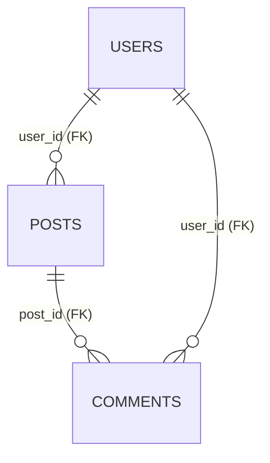
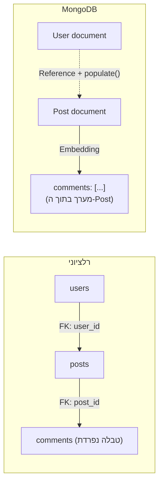

## מה זה?

זהו הפרויקט המסכם של יחידת בסיסי הנתונים: לא טכנולוגיה חדשה, אלא **אותו תחום נתונים בדיוק** — פלטפורמת בלוג קטנה עם משתמשים, פוסטים ותגובות — מעוצב **פעמיים**: פעם כסכימה רלציונית ב-SQL (עם Foreign Keys ו-JOIN), ופעם כמסמכי MongoDB עם Mongoose. המטרה: להרגיש בעצמכם את ההבדל בין השתיים, לא רק לקרוא עליו.

## מילות מפתח שחשוב לזכור

• Foreign Key — עמודה בטבלה אחת ש"מצביעה" על שורה בטבלה אחרת (`posts.user_id` → `users.id`)

• JOIN — שאילתה שמחברת שורות משתי טבלאות (או יותר) לפי Foreign Key, בשאילתה אחת

• Embedding מול Referencing (MongoDB) — לשמור נתונים קשורים **בתוך** אותו document, או **בנפרד** עם הפניה (כמו FK ב-SQL)

• Schema (Mongoose) — הגדרת המבנה הצפוי של document — שדות, טיפוסים, חובה/לא-חובה — גם ש-MongoDB עצמו "לא אוכף" schema באופן טבעי

```sql
-- גרסה רלציונית: שתי טבלאות + JOIN
CREATE TABLE users (id SERIAL PRIMARY KEY, name TEXT NOT NULL);
CREATE TABLE posts (
  id SERIAL PRIMARY KEY,
  title TEXT NOT NULL,
  user_id INTEGER REFERENCES users(id)
);

SELECT posts.title, users.name
FROM posts
JOIN users ON posts.user_id = users.id;
```

```javascript
// גרסה MongoDB + Mongoose: posts כ-documents נפרדים, עם reference למשתמש
const postSchema = new mongoose.Schema({
  title: { type: String, required: true },
  author: { type: mongoose.Schema.Types.ObjectId, ref: "User" },
});

const posts = await Post.find().populate("author"); // "JOIN" של Mongoose
```





## הסבר עיקרי

אותה בעיה, שתי גישות שונות — ב-SQL, `posts.user_id` **חייב** להצביע על שורה קיימת ב-`users` (Foreign Key אוכף את זה ברמת מסד הנתונים עצמו) — ו-`JOIN` הוא הדרך היחידה לקבל "פוסט + שם הכותב" בשאילתה אחת. ב-MongoDB, `Post` יכול להחזיק `author` כ-Reference (דומה ל-FK, עם `populate()` שמדמה JOIN) — או, לחלופין, **להטמיע** את פרטי הכותב ישירות בתוך ה-document של הפוסט (Embedding), אם רוב הקריאות ממילא צריכות את שניהם ביחד.

מתי Embedding הגיוני — אם "תגובה" תמיד מוצגת **רק** יחד עם הפוסט שלה, ולעולם לא לבד, יש היגיון להטמיע את מערך התגובות **בתוך** ה-document של הפוסט עצמו — קריאה אחת מביאה הכל, בלי `populate`/JOIN נוסף. המחיר: אם רוצים "כל התגובות של משתמש X" בלי קשר לפוסט, זה הופך למסובך יותר.

מתי Referencing הגיוני — אם "משתמש" נגיש בפני עצמו (דף פרופיל, רשימת כל המשתמשים) ולא רק דרך הפוסטים שלו, Referencing (כמו ב-SQL) הגיוני יותר — כל משתמש הוא document עצמאי, ופוסטים רק "מצביעים" עליו.

## יתרונות

תרגול אותו תחום בשתי גישות מבהיר **בפועל**, לא רק בתיאוריה, מתי FK+JOIN עדיפים (יחסים מובנים, אכיפת תקינות) ומתי Embedding עדיף (קריאה מהירה של נתונים שתמיד "הולכים ביחד"); Mongoose Schema נותן חלק מהביטחון של SQL (טיפוסים, שדות חובה) גם ב-MongoDB הגמיש.

## חסרונות

עיצוב אותו דבר פעמיים לוקח יותר זמן מבחירה ישירה בטכנולוגיה אחת; קל "לבלבל" בין העקרונות של שתי הגישות אם לא מתרגלים כל אחת בנפרד קודם.

## נקודות חשובות למבחן / ראיון עבודה

• Foreign Key + JOIN הם הדרך הרלציונית לחבר טבלאות; Reference + `populate()` הם המקבילה ב-Mongoose

• Embedding שם נתונים קשורים **בתוך** אותו document; Referencing שומר אותם נפרדים עם הפניה

• הבחירה בין Embedding ל-Referencing תלויה בדפוס הקריאה (query pattern), לא רק במבנה הנתונים

• Mongoose Schema מוסיף מבנה/טיפוסים מעל MongoDB הגמיש-מטבעו, לא דורש את זה שום דבר ברמת המסד עצמו

## טעויות נפוצות

• Embedding של נתונים שגדלים בלי גבול (למשל: כל התגובות אי-פעם) בתוך document אחד — MongoDB documents מוגבלים בגודל

• לשכוח `populate()` ב-Mongoose ואז לתהות למה `author` מציג רק ID גולמי במקום אובייקט מלא

• לעצב סכימה רלציונית בלי Foreign Keys בכלל — מאבדים את האכיפה האוטומטית של קשרים תקינים

• לבחור MongoDB "כי זה מודרני יותר" בלי לשקול אם הנתונים באמת קשריים-מטבעם (ואז SQL עם JOIN מתאים יותר)

## סיכום

הפרויקט המסכם בונה את אותה פלטפורמת בלוג פעמיים: פעם רלציונית עם Foreign Keys ו-JOIN שאוכפים קשרים תקינים ברמת המסד, ופעם עם MongoDB ו-Mongoose, ששוקלים בכל document האם להטמיע (Embedding) או להפנות (Referencing) לפי איך הנתונים באמת נקראים. אין תשובה "נכונה" אחת — יש התאמה לתרחיש, וזה בדיוק מה שהפרויקט הזה נועד להבהיר.

## דוקומנטציה רשמית

[PostgreSQL — Joins](https://www.postgresql.org/docs/current/tutorial-join.html)

[Mongoose — Populate](https://mongoosejs.com/docs/populate.html)

---

## תרגילים

### תרגיל 1 — JOIN בסיסי

**המשימה:** צרו שתי טבלאות (`authors`, `books`) עם Foreign Key, הכניסו כמה שורות, וכתבו שאילתת `JOIN` שמציגה כותרת ספר + שם הסופר יחד.

**בדיקה:** תוצאת השאילתה מציגה שורה אחת לכל ספר, עם שם הסופר הנכון לצדו — לא ID גולמי.

### תרגיל 2 — Embedding מול Referencing

**המשימה:** עצבו document MongoDB ל"מתכון בישול עם רשימת מרכיבים" — פעם עם המרכיבים מוטמעים (מערך בתוך אותו document), פעם כ-collection נפרד עם reference.

**בדיקה:** תארו (בכתיבה) באיזה תרחיש שימוש כל גרסה עדיפה — למשל, אם מרכיב מסוים (כמו "קמח") משותף להרבה מתכונים ורוצים למצוא את כל המתכונים שמכילים אותו.

---

## פרויקט מסכם

**המשימה:** תכננו ומימשו פלטפורמת בלוג קטנה (משתמשים + פוסטים + תגובות) בשתי גישות — רלציונית ו-MongoDB.

**דרישות — גרסה רלציונית:**
1. טבלאות `users`, `posts`, `comments`, עם Foreign Keys נכונים (`posts.user_id`, `comments.post_id`, `comments.user_id`)
2. שאילתת `JOIN` שמחזירה כל פוסט עם שם הכותב שלו
3. שאילתת `JOIN` נוספת (עם שתי טבלאות נוספות) שמחזירה כל תגובה עם שם הפוסט ושם כותב התגובה

**דרישות — גרסה MongoDB + Mongoose:**
1. `User` Schema ו-`Post` Schema, כאשר `Post` מחזיק `author` כ-Reference ל-`User`
2. תגובות **מוטמעות** כמערך בתוך `Post` (לא collection נפרד) — נמקו למה זו בחירה סבירה כאן
3. שאילתה עם `.populate("author")` שמחזירה פוסט מלא עם פרטי הכותב, לא רק ID

**בדיקה:** בגרסה הרלציונית, שתי שאילתות ה-JOIN מחזירות שמות אמיתיים (לא IDs) לצד הנתונים הרלוונטיים; בגרסה של MongoDB, `Post.find().populate("author")` מחזיר אובייקט `author` מלא (`name`/`email`), והתגובות מופיעות כמערך מוטמע בתוך אותו document בלי query נוסף.

## מה בפרק הבא

בפרק הבא נתחיל יחידה חדשה — **Testing**. עד עכשיו בדקנו שהקוד עובד ידנית — הרצת השרת, שליחת בקשה, בדיקה חזותית שהתוצאה נכונה. ביחידת Testing נלמד לכתוב קוד ש**בודק את עצמו אוטומטית**, כדי לתפוס באגים לפני שהם מגיעים למשתמש.
