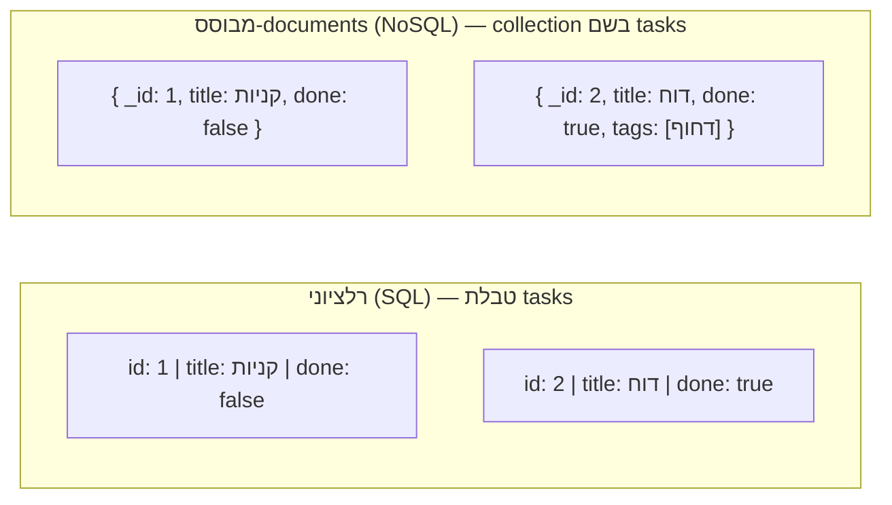

## מה זה?

לאורך כל יחידת השרתים, "מסד הנתונים" שלנו היה בעצם מערך רגיל בזיכרון (`let tasks = []`) — נוח לתרגול, אבל בעייתי מיסודו: **בכל הפעלה מחדש של השרת, כל הנתונים נעלמים**. אתר אמיתי חייב לאחסן נתונים **לצמיתות** (persistent storage) — במקום שנשאר קיים גם אחרי שהשרת נכבה. זה תפקידו של **מסד נתונים** (Database). אבל יש שתי גישות שונות-מהיסוד לארגן את הנתונים בתוכו: **רלציוני** (SQL) — טבלאות קשיחות עם עמודות קבועות וקשרים מפורשים ביניהן; ו-**NoSQL מבוסס-documents** (כמו MongoDB) — "מסמכים" גמישים, כל אחד יכול להיראות מעט אחרת. שתי הגישות פותרות את אותה בעיה (אחסון לצמיתות), בדרכים שונות מאוד.

## מילות מפתח שחשוב לזכור

• Database (מסד נתונים) — אחסון נתונים לצמיתות; שורד הפעלה-מחדש של השרת, בניגוד למערך בזיכרון

• Relational Database / SQL — מארגן נתונים בטבלאות עם עמודות קבועות; קשרים בין טבלאות מוגדרים במפורש

• Table / Row / Column — טבלה (אוסף רשומות מאותו סוג) מורכבת משורות (רשומה בודדת) ועמודות (שדה קבוע לכל השורות)

• Document Database / NoSQL — מארגן נתונים כ-documents דמויי-JSON בתוך Collections; כל document יכול להיות שונה במבנה שלו

• Schema — ה"תבנית" שמגדירה אילו שדות מותרים; ב-SQL נאכפת בקשיחות ע"י ה-DB עצמו, ב-NoSQL היא גמישה בברירת מחדל

• ACID — קבוצת ערבויות (Atomicity, Consistency, Isolation, Durability) שרוב מסדי הנתונים הרלציוניים מספקים באופן מובנה

## הסבר עיקרי

מבנה קשיח מול גמיש — בדיאגרמה למעלה, שתי המשימות בטבלת SQL **חייבות** להיות באותו מבנה בדיוק (אותן עמודות לכולן, גם אם חלק ריקות). ב-NoSQL, ל-document השני יש שדה `tags` שלא קיים בראשון בכלל — ואין בכך שום בעיה, כי אין Schema קשיח שאוכף אחידות.

קשרים בין ישויות — נניח שרוצים לקשר כל משימה למשתמש שיצר אותה. ב-SQL, זה קשר מפורש: טבלת `tasks` מחזיקה עמודת `user_id` שמצביעה לשורה בטבלת `users` (Foreign Key) — ה-DB עצמו דואג שהערך תמיד יצביע למשתמש קיים. ב-NoSQL, אין אכיפה כזו מובנית: אפשר "להטמיע" (embed) את פרטי המשתמש בתוך המשימה עצמה, או "לשמור הפניה" (reference) ל-`_id` שלו — הבחירה והאכיפה באחריות הקוד שלכם.

מתי איזו גישה — נתונים מאוד קשורים זה לזה עם הרבה שאילתות "תן לי X עם כל ה-Y שלו" (למשל: הזמנות, פריטים בהזמנה, לקוחות) נהנים מהמבנה הקשיח והקשרים המאומתים של SQL. נתונים שהמבנה שלהם משתנה הרבה, או שלא צריך "לחתוך" אותם לפי יחסים מורכבים (למשל: תוכן מאמרים עם שדות משתנים לפי סוג), מתאימים יותר ל-NoSQL הגמיש.

## יתרונות

SQL: ACID מלא (עסקאות בטוחות), קשרים מאומתים ע"י ה-DB עצמו (אי אפשר "לשבור" קשר בטעות), Schema קשיח תופס טעויות מבנה מוקדם. NoSQL: גמישות מלאה במבנה, קל להוסיף שדות חדשים בלי migration, טבעי לעבוד עם JSON כשקוד ה-JavaScript כבר "חושב" באובייקטים.

## חסרונות

SQL: שינוי מבנה טבלה קיימת (migration) יכול להיות מסובך ומסוכן על נתונים קיימים; דורש תכנון Schema מראש. NoSQL: בלי Schema קשיח, קל בטעות ליצור documents לא-עקביים; אין אכיפת קשרים מובנית — קל "לשבור" reference בלי לשים לב.

## נקודות חשובות למבחן / ראיון עבודה

• SQL = טבלאות + עמודות קבועות + קשרים מפורשים (Foreign Keys); NoSQL = documents גמישים + Collections

• ACID הוא קבוצת ערבויות שרוב מסדי הנתונים הרלציוניים מספקים באופן מובנה

• אין תשובה "נכונה" אחת — הבחירה תלויה במבנה הנתונים ובדפוסי השאילתות

• MongoDB היא דוגמת NoSQL מבוסס-documents; PostgreSQL/MySQL הן דוגמאות SQL רלציוניות

## טעויות נפוצות

• לחשוב ש-NoSQL "פשוט יותר" תמיד — היעדר Schema קשיח מעביר את האחריות לעקביות אל הקוד שלכם, לא מבטל אותה

• להשתמש ב-SQL כשהנתונים משתנים הרבה במבנה, ולהיאבק עם migrations תכופות שלא לצורך

• להשתמש ב-NoSQL לנתונים מאוד-קשורים (כמו הזמנות/לקוחות/מוצרים) בלי לתכנן איך לשמור על עקביות בין הקשרים

## סיכום

מסד נתונים מאחסן מידע לצמיתות, בניגוד למערך בזיכרון שנעלם בהפעלה מחדש. SQL מארגן נתונים בטבלאות קשיחות עם קשרים מפורשים ומאומתים; NoSQL (כמו MongoDB) מארגן אותם כ-documents גמישים ב-Collections. הבחירה תלויה במבנה הנתונים ובאיך שואלים אותם — נלמד את שתי הגישות לעומק ביחידה הזו, החל מ-SQL.

## דוקומנטציה רשמית

[MongoDB — SQL vs NoSQL](https://www.mongodb.com/resources/basics/databases/nosql-explained/nosql-vs-sql)

---

## תרגילים

### תרגיל 1 — זיהוי מבנה מתאים

**המשימה:** לכל תרחיש קבעו אם SQL או NoSQL מתאימים יותר, ונמקו במשפט אחד: (א) מערכת ניהול הזמנות עם לקוחות, מוצרים והזמנות המקושרים זה לזה; (ב) קטלוג מאמרי בלוג שבו לכל סוג מאמר שדות שונים לגמרי.

**בדיקה:** תשובה סבירה: (א) SQL — קשרים ברורים בין ישויות שדורשים אכיפה; (ב) NoSQL — מבנה משתנה בין תתי-סוגים.

### תרגיל 2 — טבלה מול document

**המשימה:** קחו את "משימות" (Tasks) מיחידת השרתים (`title`, `done`) והוסיפו שדה חדש שרק לחלק מהמשימות יש (למשל `dueDate`). שרטטו (בטקסט חופשי) איך זה נראה כשורה בטבלת SQL, ואיך זה נראה כ-document ב-NoSQL.

**בדיקה:** בגרסת ה-SQL שלכם כל השורות כוללות עמודת `dueDate` (גם אם ריקה/NULL עבור חלקן); בגרסת ה-NoSQL רק המשימות הרלוונטיות כוללות את השדה בכלל.

---

## פרויקט מסכם

**המשימה:** תכננו (בכתיבה, לא קוד) איך הייתם מאחסנים את "מערכת המשימות" (Tasks) שבניתם ביחידת השרתים בשתי הגישות.

**דרישות:**
1. גרסת SQL: רשמו את שמות הטבלאות והעמודות (כולל טיפוסים) הדרושות, כולל כל Foreign Key
2. גרסת NoSQL: רשמו דוגמת document אחד או שניים בפורמט JSON
3. ציינו איזו גישה הייתם בוחרים בפועל לפרויקט הזה, ולמה

**בדיקה:** יש לכם שני תיאורים מלאים (SQL ו-NoSQL) לאותה מערכת, וסעיף החלטה עם נימוק ברור.

---

## מה בפרק הבא

בפרק הבא נלמד על **SQL Basics** — בשיעור הקודם ראינו שמסד רלציוני מארגן נתונים בטבלאות. אבל איך בפועל "מדברים" עם הטבלאות האלה — שולפים מהן נתונים, מוסיפים שורה חדשה, משנים ערך קיים? **SQL** (Structured Query Language) היא השפה התקנית
