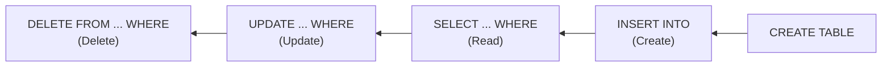

## מה זה?

בשיעור הקודם ראינו שמסד רלציוני מארגן נתונים בטבלאות. אבל איך בפועל "מדברים" עם הטבלאות האלה — שולפים מהן נתונים, מוסיפים שורה חדשה, משנים ערך קיים? **SQL** (Structured Query Language) היא השפה התקנית לכך — כמעט כל מסד רלציוני (PostgreSQL, MySQL, SQLite ואחרים) מבין אותה, עם הבדלים קטנים. ארבע הפעולות הבסיסיות ביותר נקראות **CRUD**: Create (יצירה), Read (קריאה), Update (עדכון), Delete (מחיקה) — לכל אחת פקודת SQL משלה.

## איך מריצים את זה בפועל?

השיעור הזה מלמד את שפת SQL עצמה — עדיין בלי DB מחובר בפועל (זה מגיע בשיעור **Supabase** בהמשך). כדי לתרגל את הפקודות כבר עכשיו, יש שתי דרכים פשוטות, בלי להתקין כלום:

• **Sandbox אונליין** — הדרך הכי מהירה לניסוי בלי שום התקנה: [DB Fiddle](https://www.db-fiddle.com/) (בחרו PostgreSQL) נותן עורך SQL בדפדפן שמריץ מיד

• **פסודוקוד תקני** — התחביר בשיעור זהה כמעט תמיד (`CREATE TABLE`/`SELECT`/`INSERT`/`UPDATE`/`DELETE`), כך שאפשר גם רק לקרוא ולהבין בלי להריץ, ולחזור אליו אחרי שיעור ה-Supabase עם DB אמיתי מחובר

• **מי שכבר מתקין PostgreSQL מקומי** (למשל דרך Docker, או התקנה ישירה) — ה-CLI `psql` מריץ את אותן פקודות בדיוק (`psql -U postgres -d mydb`, ואז מדביקים כל פקודה); זו גם בדיוק הדרך שבה `pgAdmin`/`DBeaver` (כלים גרפיים) עובדים מאחורי הקלעים

## מילות מפתח שחשוב לזכור

• `SELECT` — שולף שורות מטבלה (Read)

• `INSERT INTO` — מוסיף שורה חדשה (Create)

• `UPDATE` — משנה ערכים בשורות קיימות (Update)

• `DELETE FROM` — מוחק שורות (Delete)

• `WHERE` — מסנן אילו שורות מושפעות מהפעולה (SELECT/UPDATE/DELETE) — בלעדיו הפעולה חלה על **כל** השורות בטבלה

• Primary Key — עמודה (לרוב `id`) שמזהה שורה באופן ייחודי; אין שתי שורות עם אותו Primary Key

```sql
CREATE TABLE tasks (
  id SERIAL PRIMARY KEY,
  title TEXT NOT NULL,
  done BOOLEAN DEFAULT false
);

INSERT INTO tasks (title) VALUES ('Groceries');
SELECT * FROM tasks WHERE done = false;
UPDATE tasks SET done = true WHERE id = 1;
DELETE FROM tasks WHERE id = 2;
```



## הסבר עיקרי

CREATE TABLE כהגדרת המבנה — לפני שיש בכלל שורות, צריך להגדיר את מבנה הטבלה: אילו עמודות יש, מה הטיפוס של כל אחת (`TEXT`, `BOOLEAN`, `INTEGER`...), והאם יש ברירות מחדל (`DEFAULT false`) או אילוצים (`NOT NULL` — אסור שהעמודה תהיה ריקה). זה בדיוק ה-Schema הקשיח שדיברנו עליו בשיעור הקודם.

WHERE כ"מסנן חובה כמעט תמיד" — `UPDATE tasks SET done = true` בלי `WHERE` היה מעדכן **את כל** השורות בטבלה, לא רק אחת! זו אחת הטעויות המסוכנות ביותר ב-SQL — במיוחד עם `DELETE`, ששוכח `WHERE` מוחק את כל הנתונים בטבלה בבת אחת, בלי דרך חזרה.

Primary Key כזיהוי חד-משמעי — `id SERIAL PRIMARY KEY` אומר: העמודה `id` מקבלת מספר עולה אוטומטית (1, 2, 3...) לכל שורה חדשה, וה-DB עצמו מוודא שאין כפילות. זה בדיוק כמו ה-`_id` שראינו ב-MongoDB בשיעור הקודם — דרך מובטחת להצביע על שורה ספציפית אחת.

## יתרונות

תחביר תקני שכמעט כל מסד רלציוני מבין; `WHERE` נותן שליטה מדויקת על אילו שורות מושפעות; Primary Key מבטיח זיהוי חד-משמעי של כל שורה אוטומטית.

## חסרונות

שכחת `WHERE` ב-`UPDATE`/`DELETE` היא טעות הרסנית ובלתי-הפיכה שקלה לעשות בטעות; שינוי מבנה טבלה קיימת (`ALTER TABLE`) על נתונים רבים יכול לקחת זמן ולהיות מסוכן.

## נקודות חשובות

• CRUD = Create (`INSERT`), Read (`SELECT`), Update (`UPDATE`), Delete (`DELETE`)

• `WHERE` בלי תנאי = הפעולה חלה על כל השורות בטבלה — סכנה אמיתית ב-`UPDATE`/`DELETE`

• Primary Key מבטיח זיהוי ייחודי לכל שורה; `SERIAL` (Postgres) מייצר אותו אוטומטית

• `NOT NULL` ו-`DEFAULT` הם אילוצים שנקבעים ב-`CREATE TABLE`

## טעויות נפוצות

• הרצת `UPDATE`/`DELETE` בלי `WHERE` — משפיע על כל הטבלה בטעות

• בלבול בין `=` (השוואה) ל-`==` (לא קיים ב-SQL, טעות תחבירית שמגיעה מהרגל מ-JavaScript)

• שכחת `;` בסוף פקודה בכלים שדורשים אותה במפורש

## סיכום

SQL הוא שפת השאילתות התקנית למסדים רלציוניים: `SELECT`/`INSERT`/`UPDATE`/`DELETE` הן ארבע פעולות ה-CRUD הבסיסיות. `WHERE` קובע אילו שורות מושפעות — קריטי לזכור אותו ב-`UPDATE`/`DELETE`. `CREATE TABLE` מגדיר את ה-Schema הקשיח מראש, כולל Primary Key שמזהה כל שורה באופן ייחודי.

## דוקומנטציה רשמית

[PostgreSQL — Official Docs](https://www.postgresql.org/docs/current/tutorial-sql.html)

---

## תרגילים

### תרגיל 1 — CREATE TABLE

**המשימה:** כתבו `CREATE TABLE` לטבלת `tasks` עם `id` (Primary Key), `title` (טקסט, חובה), ו-`done` (בוליאני, ברירת מחדל `false`).

**בדיקה:** הפקודה יוצרת את הטבלה בלי שגיאה; שאילתת `SELECT * FROM tasks` (על טבלה ריקה) מחזירה 0 שורות בלי שגיאה.

### תרגיל 2 — CRUD מלא

**המשימה:** כתבו רצף פקודות: הוסיפו 3 משימות עם `INSERT`, שלפו את אלה שעדיין לא בוצעו (`done = false`) עם `SELECT`+`WHERE`, סמנו אחת כבוצעה עם `UPDATE`+`WHERE`, ומחקו אחת עם `DELETE`+`WHERE`.

**בדיקה:** אחרי הרצף, `SELECT * FROM tasks` מחזיר 2 שורות (לא 3 — אחת נמחקה), ואחת מהן עם `done = true`.

### תרגיל 3 — הסכנה של WHERE חסר

**המשימה:** על טבלת בדיקה (לא נתונים אמיתיים!) הריצו `UPDATE tasks SET done = true` בלי `WHERE`, והשוו לתוצאה של אותה פקודה עם `WHERE id = 1`.

**בדיקה:** הגרסה בלי `WHERE` משנה את **כל** השורות ל-`done = true`; הגרסה עם `WHERE id = 1` משנה רק שורה אחת.

---

## פרויקט מסכם

**המשימה:** בנו את סכימת ה-SQL המלאה למערכת "משימות" (Tasks) כולל שדות נוספים.

**דרישות:**
1. `CREATE TABLE tasks` עם `id`, `title` (חובה), `done` (ברירת מחדל `false`), ו-`created_at` (חותמת זמן, ברירת מחדל השעה הנוכחית)
2. רצף `INSERT` שמוסיף לפחות 4 משימות שונות
3. שאילתת `SELECT` שמחזירה רק משימות שלא בוצעו, ממוינות לפי `created_at`
4. פקודת `UPDATE` שמסמנת משימה ספציפית (לפי `id`) כבוצעה

**בדיקה:** כל הפקודות רצות בלי שגיאת syntax; השאילתה הממוינת מחזירה רק משימות עם `done = false`, בסדר כרונולוגי.

---

## מה בפרק הבא

בפרק הבא נלמד על **SQL Joins** — בשיעור הקודם כל השאילתות שלנו פעלו על טבלה אחת בלבד. אבל נתונים אמיתיים לרוב מפוזרים בין כמה טבלאות קשורות — למשל, טבלת `users` וטבלת `tasks` שבה לכל משימה יש `user_id` שמצביע על היוצר שלה. איך שולפים
