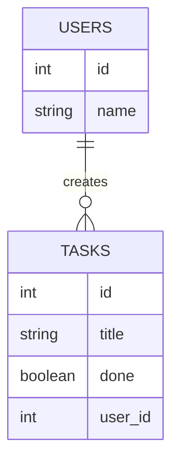

## מה זה?

בשיעור הקודם כל השאילתות שלנו פעלו על טבלה אחת בלבד. אבל נתונים אמיתיים לרוב מפוזרים בין כמה טבלאות קשורות — למשל, טבלת `users` וטבלת `tasks` שבה לכל משימה יש `user_id` שמצביע על היוצר שלה. איך שולפים "את כל המשימות **יחד עם** שם היוצר שלהן" בשאילתה אחת, בלי לשלוף כל טבלה בנפרד ולחבר בקוד? זו בדיוק הבעיה ש-**JOIN** פותר — מחבר שורות משתי טבלאות (או יותר) לפי עמודה משותפת, בתוך ה-DB עצמו.

## מילות מפתח שחשוב לזכור

• Foreign Key — עמודה בטבלה אחת שמצביעה על Primary Key בטבלה אחרת (למשל `tasks.user_id` מצביע על `users.id`)

• `JOIN` (או `INNER JOIN`) — מחבר שורות משתי טבלאות לפי תנאי שוויון; מחזיר רק שורות שיש להן התאמה בשתי הטבלאות

• `LEFT JOIN` — כמו `JOIN`, אך מחזיר **גם** שורות מהטבלה השמאלית שאין להן התאמה בטבלה הימנית (עם `NULL` בעמודות החסרות)

• `ON` — מגדיר את תנאי החיבור בין הטבלאות (לרוב `table1.id = table2.foreign_id`)

• 1:N (אחד-לרבים) — קשר נפוץ: משתמש אחד יכול להיות מקושר להרבה משימות, כל משימה שייכת למשתמש אחד בלבד

```sql
SELECT tasks.title, users.name
FROM tasks
JOIN users ON tasks.user_id = users.id
WHERE tasks.done = false;
```



## הסבר עיקרי

JOIN כ"חיבור לפי מפתח" — `JOIN users ON tasks.user_id = users.id` אומר: "לכל שורה בטבלת `tasks`, מצא את השורה בטבלת `users` שה-`id` שלה שווה ל-`user_id` של המשימה, וחבר אותן לשורה אחת משותפת". זה קורה בתוך ה-DB, יעיל בהרבה משליפת שתי הטבלאות בנפרד וחיבור ידני ב-JavaScript.

JOIN רגיל מול LEFT JOIN — `JOIN` רגיל (הנקרא גם `INNER JOIN`) מחזיר **רק** משימות שיש להן `user_id` שמצביע על משתמש שקיים בפועל — משימה עם `user_id` שגוי (או `NULL`) פשוט "נעלמת" מהתוצאה. `LEFT JOIN` שומר על **כל** השורות מהטבלה השמאלית (`tasks`) גם אם אין התאמה — במקום שם המשתמש יופיע `NULL`. הבחירה תלויה בשאלה: האם משימות ללא משתמש תקין רלוונטיות לתוצאה או לא.

Foreign Key כאכיפת עקביות — בשיעור "רלציוני מול NoSQL" ראינו ש-SQL אוכף קשרים באופן מובנה. `FOREIGN KEY` על `tasks.user_id` שמצביע ל-`users.id` אומר ל-DB: "אל תאפשר לשמור משימה עם `user_id` שלא קיים בטבלת המשתמשים" — מונע נתונים "יתומים" (משימה שמצביעה על משתמש שלא קיים) מלכתחילה. הדיאגרמה למעלה (`erDiagram`) מתארת בדיוק את זה: הסימון `||--o{` אומר "משתמש אחד (`||`) יכול להיות מקושר לאפס-או-יותר (`o{`) משימות" — קשר 1:N.

## יתרונות

JOIN מבצע את החיבור ביעילות בתוך ה-DB, בלי לשלוף נתונים מיותרים ולחבר בקוד; Foreign Keys מונעים נתונים "יתומים" אוטומטית; אפשר לחבר יותר משתי טבלאות בשאילתה אחת.

## חסרונות

JOINs על טבלאות גדולות עלולים להיות איטיים בלי אינדקסים מתאימים; שאילתות עם הרבה JOINs נהיות קשות לקריאה; בחירה שגויה בין `JOIN` ל-`LEFT JOIN` יכולה "לאבד" שורות שקיוויתם לראות בתוצאה.

## נקודות חשובות

• `JOIN` (INNER) מחזיר רק שורות עם התאמה בשתי הטבלאות; `LEFT JOIN` שומר את כל השורות מהטבלה השמאלית גם בלי התאמה

• Foreign Key = עמודה שמצביעה על Primary Key בטבלה אחרת, ונאכפת ע"י ה-DB

• `ON` מגדיר את תנאי ההתאמה בין הטבלאות — בד"כ שוויון Foreign Key ל-Primary Key

• 1:N הוא קשר נפוץ: "צד אחד" (משתמש) מול "הרבה" (המשימות שלו)

## טעויות נפוצות

• שימוש ב-`JOIN` רגיל כשרוצים גם שורות ללא התאמה — "מאבדים" נתונים בטעות בלי הודעת שגיאה

• שכחת `ON` (או תנאי שגוי בו) — יוצר "Cartesian Product": כל שורה בטבלה א' מחוברת לכל שורה בטבלה ב', תוצאה ענקית ושגויה

• הגדרת `user_id` בלי `FOREIGN KEY` — לא נאכף שום דבר, אפשר לשמור בטעות `user_id` שלא קיים

## סיכום

JOIN מחבר שורות משתי טבלאות קשורות (לפי Foreign Key) לשאילתה אחת. `JOIN` רגיל מחזיר רק שורות עם התאמה בשתי הטבלאות; `LEFT JOIN` שומר על כל שורות הטבלה השמאלית גם בלעדיה. Foreign Keys נאכפים ע"י ה-DB עצמו, ומונעים נתונים "יתומים" מראש.

## דוקומנטציה רשמית

[PostgreSQL — Joins](https://www.postgresql.org/docs/current/tutorial-join.html)

---

## תרגילים

### תרגיל 1 — JOIN בסיסי

**המשימה:** על טבלאות `tasks` (עם `user_id`) ו-`users`, כתבו שאילתת `JOIN` שמחזירה את כותרת כל משימה יחד עם שם המשתמש שיצר אותה.

**בדיקה:** כל שורה בתוצאה מכילה גם `title` וגם `name` — לא רק אחד מהם; מספר השורות שווה למספר המשימות שיש להן `user_id` תקין.

### תרגיל 2 — JOIN מול LEFT JOIN

**המשימה:** הוסיפו משימה עם `user_id` שלא קיים בטבלת המשתמשים. הריצו עליה גם `JOIN` רגיל וגם `LEFT JOIN`, והשוו תוצאות.

**בדיקה:** ה-`JOIN` הרגיל לא כולל את המשימה הזו בתוצאה בכלל; ה-`LEFT JOIN` כן כולל אותה, עם `NULL` בעמודת שם המשתמש.

### תרגיל 3 — ספירה עם JOIN

**המשימה:** כתבו שאילתה שמחזירה, לכל משתמש, כמה משימות לא-גמורות יש לו (`JOIN` + `WHERE done = false` + `GROUP BY` + `COUNT`).

**בדיקה:** התוצאה מציגה שורה אחת לכל משתמש עם מספר המשימות הלא-גמורות שלו.

---

## פרויקט מסכם

**המשימה:** הרחיבו את סכימת ה-Tasks משיעור SQL Basics עם טבלת משתמשים וקשר ביניהן.

**דרישות:**
1. `CREATE TABLE users` עם `id`, `name` (חובה)
2. הוסיפו עמודת `user_id` לטבלת `tasks` כ-`FOREIGN KEY` שמצביעה על `users.id`
3. הכניסו 2-3 משתמשים ומספר משימות המקושרות אליהם
4. שאילתת `JOIN` שמציגה את כל המשימות הלא-גמורות יחד עם שם היוצר שלהן

**בדיקה:** ניסיון להכניס משימה עם `user_id` שלא קיים נכשל עם שגיאת Foreign Key; שאילתת ה-JOIN הסופית מחזירה רק משימות לא-גמורות, כל אחת עם שם משתמש תקין.

---

## מה בפרק הבא

בפרק הבא נלמד על **עיצוב מסדי נתונים (DB Design)** — בשני השיעורים הקודמים בנינו טבלת `tasks` וטבלת `users` וקישרנו ביניהן עם Foreign Key. אבל איך יודעים מראש איך "לפרק" נתונים לטבלאות נכונות? למה לא, למשל, לשמור את שם המשתמש כטור טקסט בתוך טבלת `tasks`
