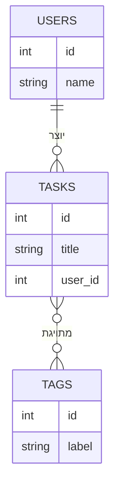

## מה זה?

בשני השיעורים הקודמים בנינו טבלת `tasks` וטבלת `users` וקישרנו ביניהן עם Foreign Key. אבל איך יודעים מראש איך "לפרק" נתונים לטבלאות נכונות? למה לא, למשל, לשמור את שם המשתמש כטור טקסט בתוך טבלת `tasks` עצמה, בלי טבלת `users` נפרדת בכלל? עיצוב מסדי נתונים (DB Design) הוא התהליך של תכנון מבנה הטבלאות **לפני** שכותבים קוד — כדי למנוע כפילויות נתונים ואי-עקביות שקשה לתקן מאוחר יותר.

## מילות מפתח שחשוב לזכור

• Normalization (נירמול) — תהליך פירוק נתונים לטבלאות נפרדות כדי למנוע כפילות מיותרת

• Data Duplication (כפילות נתונים) — כשאותו מידע (למשל שם משתמש) מופיע בהרבה שורות/טבלאות — אם הוא משתנה, צריך לעדכן בהרבה מקומות

• 1:1, 1:N, N:N — שלושת סוגי היחסים האפשריים בין שתי ישויות: אחד-לאחד, אחד-לרבים, רבים-לרבים

• Junction Table (טבלת קישור) — טבלה נוספת שמייצגת קשר N:N בין שתי טבלאות (למשל: תגיות למשימות)

• ERD (Entity-Relationship Diagram) — דיאגרמה חזותית שממחישה את הטבלאות והקשרים ביניהן, לפני שכותבים `CREATE TABLE` בכלל

## הסבר עיקרי

למה לא לשים הכל בטבלה אחת — דמיינו טבלת `tasks` יחידה עם עמודת `user_name` (טקסט) במקום `user_id` וטבלת `users` נפרדת. אם למשתמש "דנה" יש 20 משימות, השם "דנה" חוזר 20 פעמים. אם דנה מחליטה לשנות שם, צריך לעדכן את כל 20 השורות — ואם שוכחים שורה אחת, נוצרת אי-עקביות (חלק מהמשימות מראות שם ישן). Foreign Key לטבלת `users` נפרדת פותר את זה: השם נשמר **פעם אחת בלבד**, וכל משימה רק "מצביעה" אליו.

1:1, 1:N, N:N — הקשר בין משתמש למשימות שלו הוא 1:N (משתמש אחד, הרבה משימות, כל משימה שייכת למשתמש אחד). אבל הקשר בין משימות לתגיות (tags) הוא **N:N**: למשימה אחת יכולות להיות כמה תגיות ("דחוף", "עבודה"), ולתגית אחת ("דחוף") יכולות להיות שייכות הרבה משימות. קשר N:N לא ניתן לייצוג ישיר עם Foreign Key בודד — צריך **טבלת קישור** (Junction Table): טבלה שלישית (למשל `task_tags`) עם שתי עמודות Foreign Key, אחת לכל צד.

ERD לפני קוד — הדיאגרמה למעלה היא בדיוק מה שמתכננים **לפני** `CREATE TABLE` — מציגה אילו ישויות (טבלאות) יש, ואילו קשרים ביניהן, כדי לתפוס בעיות תכנון מוקדם (למשל: "רגע, שכחתי שלמשימה יכולות להיות כמה תגיות!") לפני שכותבים אפילו שורת SQL אחת.

## יתרונות

נירמול נכון מונע כפילות נתונים ואי-עקביות; ERD תופס בעיות תכנון לפני כתיבת קוד, לא אחרי; קשרי N:N דרך Junction Table נשארים גמישים וניתנים להרחבה.

## חסרונות

נירמול-יתר (יותר מדי טבלאות קטנות) הופך שאילתות פשוטות לדרוש הרבה JOINs; לפעמים "כפילות מכוונת" (denormalization) משתלמת לביצועים במחיר עקביות; תכנון גרוע מההתחלה קשה מאוד לתקן אחרי שיש הרבה נתונים אמיתיים בטבלאות.

## נקודות חשובות למבחן / ראיון עבודה

• Normalization מפרק נתונים לטבלאות נפרדות כדי למנוע כפילות

• 1:N נפתר עם Foreign Key בטבלת ה"רבים"; N:N דורש Junction Table נפרדת

• ERD מתכנן מבנה טבלאות וקשרים לפני כתיבת SQL

• כפילות נתונים יוצרת סיכון לאי-עקביות כשמעדכנים רק חלק מהעותקים

## טעויות נפוצות

• לנסות לייצג קשר N:N עם Foreign Key יחיד — פיזית בלתי אפשרי (עמודה אחת יכולה להצביע רק על ערך אחד)

• שכפול נתונים (כמו שם משתמש) בהרבה שורות במקום Foreign Key לטבלה נפרדת

• לדלג על תכנון ERD ולהתחיל לכתוב `CREATE TABLE` ישירות — מגלים בעיות מבנה רק אחרי שיש נתונים אמיתיים

## סיכום

עיצוב מסד נתונים (DB Design) מתכנן את מבנה הטבלאות והקשרים ביניהן **לפני** כתיבת קוד. נירמול מפרק נתונים לטבלאות נפרדות כדי למנוע כפילות; קשרי 1:N נפתרים עם Foreign Key, קשרי N:N דורשים Junction Table. ERD הוא הכלי החזותי לתכנן את כל זה מראש.

## דוקומנטציה רשמית

[PostgreSQL Tutorial — Database Design](https://www.postgresqltutorial.com/postgresql-tutorial/postgresql-database-design/)

---

## תרגילים

### תרגיל 1 — זיהוי סוג קשר

**המשימה:** קבעו את סוג הקשר (1:1, 1:N, או N:N) עבור: (א) משתמש ותעודת הזהות שלו; (ב) לקוח והזמנות שלו; (ג) סטודנטים וקורסים שהם רשומים אליהם.

**בדיקה:** תשובות: (א) 1:1, (ב) 1:N, (ג) N:N.

### תרגיל 2 — תכנון Junction Table

**המשימה:** תכננו (בכתיבה) את מבנה טבלת הקישור `task_tags` שמייצגת את הקשר N:N בין `tasks` ל-`tags`. רשמו את שמות העמודות שלה.

**בדיקה:** הטבלה שתכננתם כוללת לפחות שתי עמודות Foreign Key: אחת שמצביעה על `tasks.id`, אחת שמצביעה על `tags.id`.

### תרגיל 3 — ציור ERD

**המשימה:** שרטטו (בטקסט חופשי, אפשר גם בתחביר mermaid `erDiagram`) ERD למערכת "ספרייה": ספרים, קוראים, השאלות — קורא אחד יכול להשאיל כמה ספרים, ספר יכול היה להיות מושאל (בעבר) לכמה קוראים שונים.

**בדיקה:** ה-ERD כולל 3 ישויות וקשר N:N בין קוראים לספרים, המיוצג דרך ישות "השאלות" כ-Junction Table.

---

## פרויקט מסכם

**המשימה:** תכננו ERD מלא למערכת "משימות עם תגיות", והמירו אותו ל-SQL בפועל.

**דרישות:**
1. ERD (דיאגרמה או תיאור כתוב) עם 3 ישויות: users, tasks, tags — כולל קשרי 1:N ו-N:N
2. `CREATE TABLE` לכל אחת מהטבלאות, כולל טבלת הקישור `task_tags`
3. הכניסו נתוני דוגמה: משתמש אחד, 2-3 משימות, 2-3 תגיות, וכמה שיוכים בטבלת הקישור
4. שאילתת `JOIN` (בין 3 טבלאות) שמחזירה משימה יחד עם כל התגיות שלה

**בדיקה:** השאילתה הסופית מחזירה שורה לכל צירוף משימה-תגית; משימה עם 2 תגיות מופיעה פעמיים (פעם לכל תגית).

---

## מה בפרק הבא

בפרק הבא נלמד על **Supabase** — עד עכשיו תרגלנו SQL בלי לציין איפה בדיוק ה-DB "רץ" בפועל. כדי להשתמש בו מקוד אמיתי (בשיעור הבא), צריך מסד PostgreSQL **אמיתי, מאוחסן איפשהו, ונגיש דרך רשת** — לא רק תרגול על הנייר. התקנת PostgreSQL מק
