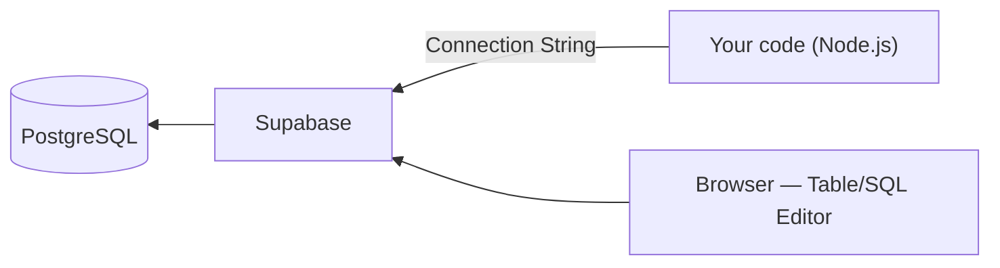

## מה זה?

עד עכשיו תרגלנו SQL בלי לציין איפה בדיוק ה-DB "רץ" בפועל. כדי להשתמש בו מקוד אמיתי (בשיעור הבא), צריך מסד PostgreSQL **אמיתי, מאוחסן איפשהו, ונגיש דרך רשת** — לא רק תרגול על הנייר. התקנת PostgreSQL מקומית אפשרית, אבל דורשת הגדרה מסובכת (התקנה, ניהול משתמשים, הרשאות, גיבויים). **Supabase** הוא שירות ענן (cloud) שנותן מסד PostgreSQL מלא, מוכן לשימוש תוך דקות — בלי להתקין שום דבר על המחשב שלכם.

## מילות מפתח שחשוב לזכור

• Cloud Database (מסד ענן) — מסד נתונים שרץ על שרתים מרוחקים (לא על המחשב שלכם), נגיש דרך רשת

• Project (פרויקט) — יחידת העבודה ב-Supabase; לכל פרויקט יש מסד PostgreSQL נפרד משלו

• Connection String — כתובת (URL) שמכילה את כל הפרטים הדרושים כדי להתחבר למסד: host, port, שם משתמש, סיסמה, שם ה-DB

• Table Editor — ממשק חזותי (בדפדפן) לצפייה ועריכה של טבלאות ב-Supabase, בלי לכתוב SQL בכלל

• SQL Editor — ממשק בדפדפן להרצת פקודות SQL ישירות על המסד, מבלי להתקין כלי חיצוני

## הסבר עיקרי

מה Supabase בעצם עושה — Supabase מריצה ומנהלת שרת PostgreSQL בשבילכם (על תשתית ענן), ונותנת לכם Connection String להתחברות אליו מכל מקום — כולל מהקוד שלכם (השיעור הבא) וגם מכלים חזותיים. אין צורך להתקין PostgreSQL, לנהל גיבויים, או לדאוג לזמינות השרת — Supabase עושה את זה.

Connection String כ"כתובת + מפתח" — כשיוצרים פרויקט חדש ב-Supabase, מקבלים מחרוזת שמכילה host, שם משתמש, סיסמה ושם ה-DB — זו בדיוק אותה מחרוזת שהשיעור הבא (SQL from Node) ישתמש בה כדי להתחבר מהקוד. **חשוב**: הסיסמה נמצאת בתוך המחרוזת הזו — לעולם לא מעלים אותה ל-Git (זוכרים `.gitignore` ו-`.env`?).

Table Editor ו-SQL Editor — שני כלים משלימים בממשק הדפדפן של Supabase: Table Editor מאפשר לצפות/לערוך נתונים כמו בגיליון אלקטרוני, בלי לכתוב שורת SQL; SQL Editor מאפשר להריץ בדיוק את פקודות ה-`CREATE TABLE`/`SELECT`/`INSERT` ששיעורי SQL Basics ו-SQL Joins לימדו, ישירות מהדפדפן — כדי לבדוק שהן עובדות לפני שמשלבים אותן בקוד.

## יתרונות

מסד PostgreSQL אמיתי מוכן תוך דקות, בלי התקנה מקומית; ממשק חזותי (Table Editor) לצפייה מהירה בנתונים בלי SQL; שכבה חינמית (free tier) מספיקה לגמרי לפרויקטי לימוד.

## חסרונות

תלות ברשת אינטרנט — בלי חיבור, אין גישה למסד; שכבה חינמית עם מגבלות (אחסון, השהיית פרויקט לא-פעיל); Connection String מכיל סיסמה — דורש זהירות שלא לחשוף אותו בטעות.

## נקודות חשובות

• Supabase הוא שירות ענן ל-PostgreSQL — לא מנוע DB חדש, אלא PostgreSQL אמיתי מאוחסן ומנוהל

• Connection String מכיל את כל פרטי ההתחברות למסד, כולל סיסמה — לעולם לא נכנס ל-Git

• Table Editor = ממשק חזותי בלי SQL; SQL Editor = הרצת SQL ישירות בדפדפן

• כל פרויקט Supabase מקבל מסד PostgreSQL נפרד משלו

## טעויות נפוצות

• העלאת Connection String (עם הסיסמה) ל-Git בטעות — חשיפת גישה מלאה למסד לכל מי שרואה את הריפו

• בלבול בין Table Editor (עריכה חזותית) ל-SQL Editor (כתיבת SQL) — טעות בבחירת הכלי המתאים למשימה

• הנחה ששכבת החינמית זמינה תמיד בלי הגבלות — פרויקטים לא-פעילים עלולים "להשהות" את עצמם

## סיכום

Supabase נותן מסד PostgreSQL אמיתי, מאוחסן בענן, מוכן לשימוש בלי התקנה מקומית. Table Editor נותן ממשק חזותי לעריכת נתונים; SQL Editor מריץ SQL ישירות בדפדפן. Connection String הוא המפתח להתחברות מקוד — ובגלל שהוא מכיל סיסמה, לעולם לא נכנס ל-Git. בשיעור הבא נשתמש בו כדי להתחבר מ-Node.js.

## דוקומנטציה רשמית

[Supabase — Official Docs](https://supabase.com/docs)

---

## תרגילים

### תרגיל 1 — יצירת פרויקט

**המשימה:** צרו חשבון ופרויקט חדש ב-Supabase, וקבלו את ה-Connection String שלו מהגדרות הפרויקט.

**בדיקה:** יש לכם מחרוזת שמתחילה ב-`postgresql://` עם host, שם משתמש וסיסמה — לא ריקה ולא placeholder.

### תרגיל 2 — SQL Editor

**המשימה:** ב-SQL Editor של הפרויקט, הריצו את פקודת ה-`CREATE TABLE tasks` משיעור SQL Basics, ואז `INSERT` שתי שורות.

**בדיקה:** לאחר ההרצה, ה-Table Editor מציג את טבלת `tasks` עם שתי השורות שהוספתם.

### תרגיל 3 — עריכה חזותית

**המשימה:** ב-Table Editor, ערכו ידנית (בלי SQL) את הערך של עמודת `done` באחת השורות.

**בדיקה:** הרצת `SELECT * FROM tasks` ב-SQL Editor מציגה את הערך המעודכן — עדות לכך ששני הכלים עובדים על אותו מסד.

---

## פרויקט מסכם

**המשימה:** הקימו מסד Supabase מלא למערכת המשימות (Tasks) שתכננתם בשיעורי SQL הקודמים.

**דרישות:**
1. פרויקט Supabase חדש
2. הרצת סכימת ה-`CREATE TABLE` המלאה (users + tasks, עם Foreign Key) דרך SQL Editor
3. הכנסת נתוני דוגמה (לפחות 2 משתמשים, 4 משימות)
4. שמירת ה-Connection String במקום בטוח (לא ב-Git) — לשימוש בשיעור הבא

**בדיקה:** Table Editor מציג את שתי הטבלאות עם הנתונים; שאילתת JOIN ב-SQL Editor (כמו בשיעור SQL Joins) מחזירה תוצאות תקינות.

---

## מה בפרק הבא

בפרק הבא נלמד על **SQL מ-Node.js** — עד עכשיו הרצנו SQL ישירות ב-SQL Editor של Supabase. אבל שרת Express אמיתי (כמו זה שבנינו ביחידת השרתים) צריך לשלוח שאילתות **מתוך הקוד עצמו** — כשמגיעה בקשת `POST /tasks`, השרת צריך להריץ `INSERT INTO
