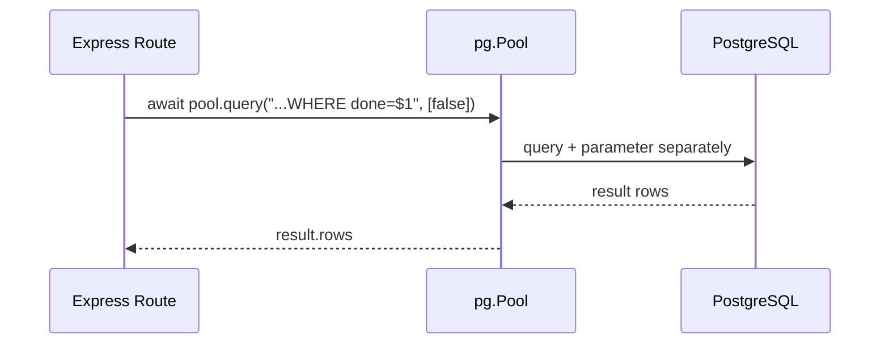

## מה זה?

עד עכשיו הרצנו SQL ישירות ב-SQL Editor של Supabase. אבל שרת Express אמיתי (כמו זה שבנינו ביחידת השרתים) צריך לשלוח שאילתות **מתוך הקוד עצמו** — כשמגיעה בקשת `POST /tasks`, השרת צריך להריץ `INSERT INTO tasks...` ולהחזיר תוצאה, בלי שאדם מריץ SQL ידנית. חבילת `pg` (node-postgres) היא ה-Driver הרשמי שמאפשר לקוד Node.js להתחבר למסד PostgreSQL (כמו זה שהקמתם ב-Supabase) ולשלוח שאילתות — כל שאילתה מוחזרת כ-Promise, בדיוק כמו `fetch`.

## מילות מפתח שחשוב לזכור

• Driver — ספרייה שמתרגמת בין שפת התכנות (JavaScript) לפרוטוקול התקשורת של ה-DB; `pg` הוא ה-Driver הרשמי ל-PostgreSQL ב-Node.js

• `Pool` — אובייקט שמנהל כמה חיבורים למסד בו-זמנית, וממחזר אותם בין שאילתות שונות — יעיל יותר מפתיחת חיבור חדש לכל שאילתה

• `pool.query(sql, params)` — שולח שאילתת SQL ומחזיר Promise עם התוצאה

• Parameterized Query (שאילתה עם פרמטרים) — שאילתה שבה ערכים מועברים כפרמטרים נפרדים (`$1`, `$2`...) במקום "להדביק" אותם ישירות למחרוזת ה-SQL

• SQL Injection — פרצת אבטחה שבה קלט משתמש זדוני "משנה" את השאילתה עצמה; Parameterized Queries מונעות אותה לגמרי

```javascript
import pg from "pg";
const pool = new pg.Pool({ connectionString: process.env.DATABASE_URL });

async function getOpenTasks() {
  const result = await pool.query("SELECT * FROM tasks WHERE done = $1", [false]);
  return result.rows;
}
```



## הסבר עיקרי

Pool במקום חיבור בודד — פתיחת חיבור חדש למסד בכל בקשה איטית ומבזבזת משאבים. `Pool` פותח כמה חיבורים מראש ו"משאיל" אחד מהם לכל `pool.query()`, ומחזיר אותו לשימוש הבא כשהשאילתה מסתיימת.

`pool.query` מחזיר Promise — זה בדיוק אותו דפוס שכבר מכירים מ-`fetch`: `await pool.query(...)` "ממתין" לתשובה מה-DB בלי לחסום את שאר השרת, ו-`result.rows` מכיל מערך של כל השורות שהשאילתה החזירה — בדיוק כמו `await response.json()`.

Parameterized Queries נגד SQL Injection — למה לא להדביק קלט משתמש ישירות לתוך מחרוזת ה-SQL (טמפלייט ליטרל)? כי אם הקלט הוא בפועל טקסט שנועד "לשבור" את השאילתה, היא עלולה לבצע פקודה **נוספת** שהמשתמש הזדוני "הזריק" — זו התקפת **SQL Injection**, אחת מפרצות האבטחה החמורות ביותר בהיסטוריית האינטרנט. `pool.query("... WHERE title = $1", [userInput])` פותר את זה לגמרי: `$1` הוא placeholder, וה-Driver עצמו דואג לשלוח את הערך **בנפרד** מהשאילתה — לעולם לא כטקסט שמתמזג לתוכה.

## יתרונות

`pool.query` משתלב טבעי עם `async`/`await` שכבר מוכר; Parameterized Queries מונעות SQL Injection לגמרי בלי מאמץ נוסף; `Pool` מנהל חיבורים ביעילות אוטומטית.

## חסרונות

כתיבת SQL גולמי בתוך מחרוזות JavaScript חסרת auto-complete/type-checking (בניגוד ל-ORM); שגיאות syntax ב-SQL מתגלות רק בזמן ריצה, לא מראש; ניהול חיבורי `Pool` דורש תשומת לב (למשל, לסגור אותו בסיום התוכנית).

## נקודות חשובות

• `pg` הוא ה-Driver הרשמי ל-PostgreSQL ב-Node.js; `Pool` מנהל חיבורים מרובים ביעילות

• `pool.query()` מחזיר Promise, בדיוק כמו `fetch` — עובד עם `async`/`await`

• Parameterized Queries (`$1`, `$2`...) מונעות SQL Injection — **לעולם** לא מדביקים קלט משתמש ישירות למחרוזת SQL

• `result.rows` מכיל את מערך השורות שהשאילתה החזירה

## טעויות נפוצות

• הדבקת קלט משתמש ישירות לתוך מחרוזת SQL — פותח פרצת SQL Injection חמורה

• פתיחת חיבור DB חדש לכל שאילתה במקום שימוש חוזר ב-`Pool` — מבזבז משאבים ומאט את השרת

• שכחת `await` על `pool.query()` וניסיון להשתמש בתוצאה כאילו היא כבר הגיעה

## סיכום

`pg` (node-postgres) מחבר קוד Node.js למסד PostgreSQL אמיתי (כמו זה שהקמתם ב-Supabase). `Pool` מנהל חיבורים ביעילות; `pool.query()` מחזיר Promise, בדיוק כמו `fetch`. Parameterized Queries (`$1`, `$2`) הן הדרך היחידה הבטוחה להעביר קלט משתמש לשאילתה — מונעות SQL Injection לגמרי.

## דוקומנטציה רשמית

[node-postgres — Official Docs](https://node-postgres.com/)

---

## תרגילים

### תרגיל 1 — חיבור ראשון

**המשימה:** התקינו `pg`, צרו `Pool` עם ה-`DATABASE_URL` מ-Supabase (דרך `.env`, כמו בשיעור dotenv), והריצו שאילתה שמחזירה את הזמן הנוכחי של השרת (`SELECT NOW()`).

**בדיקה:** הרצת הסקריפט מדפיסה תאריך/שעה תקינים — לא שגיאת חיבור.

### תרגיל 2 — שליפה עם await

**המשימה:** כתבו פונקציית `async` `getAllTasks()` שמריצה `SELECT * FROM tasks` ומחזירה `result.rows`.

**בדיקה:** קריאה ל-`await getAllTasks()` מחזירה מערך עם אותו מספר משימות שיש בטבלה ב-Supabase.

### תרגיל 3 — Parameterized Query

**המשימה:** כתבו פונקציה `getTasksByStatus(done)` שמריצה `SELECT * FROM tasks WHERE done = $1` עם `[done]` כפרמטר.

**בדיקה:** `getTasksByStatus(true)` מחזיר רק משימות עם `done = true`; `getTasksByStatus(false)` מחזיר רק את השאר — בלי לכתוב שתי שאילתות נפרדות בקוד.

---

## פרויקט מסכם

**המשימה:** חברו את שרת ה-Tasks (Express) שבניתם ביחידת השרתים ל-DB האמיתי ב-Supabase, במקום מערך בזיכרון.

**דרישות:**
1. `Pool` מחובר ל-`DATABASE_URL` דרך `.env`
2. `GET /tasks` מריץ `SELECT * FROM tasks` ומחזיר את `result.rows` כ-JSON
3. `POST /tasks` מריץ `INSERT INTO tasks (title) VALUES ($1) RETURNING *` עם קלט המשתמש כפרמטר (לא הדבקה למחרוזת!)
4. `PUT /tasks/:id` מריץ `UPDATE tasks SET done = $1 WHERE id = $2` עם `id` כפרמטר

**בדיקה:** הפעלה מחדש של השרת לא מאבדת נתונים (בניגוד למערך בזיכרון!) — `curl` ל-`GET /tasks` אחרי restart עדיין מציג את אותן משימות; ניסיון `POST` עם כותרת שמכילה גרש בודד לא שובר את השאילתה (הוכחה ש-Parameterized Query עובד).

---

## מה בפרק הבא

בפרק הבא נלמד על **MongoDB Basics** — בשיעור "רלציוני מול NoSQL" ראינו את הרעיון: NoSQL מאחסן documents גמישים ב-collections, בלי Schema קשיח. **MongoDB** היא מסד ה-NoSQL הפופולרי ביותר מהסוג הזה. בדיוק כמו ש-SQL היא השפה שדרכה מדברים עם 
