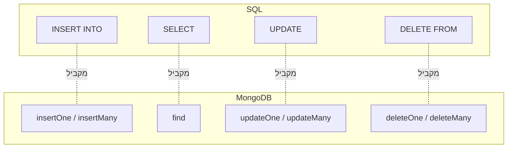

## מה זה?

בשיעור "רלציוני מול NoSQL" ראינו את הרעיון: NoSQL מאחסן documents גמישים ב-collections, בלי Schema קשיח. **MongoDB** היא מסד ה-NoSQL הפופולרי ביותר מהסוג הזה. בדיוק כמו ש-SQL היא השפה שדרכה מדברים עם מסד רלציוני, ל-MongoDB יש דרך משלה (querying עם אובייקטי JavaScript, לא שפה נפרדת) לבצע CRUD: Create, Read, Update, Delete — על documents בתוך collections.

## מילות מפתח שחשוב לזכור

• Document — רשומה בודדת ב-MongoDB, בפורמט דמוי-JSON (בפועל BSON — גרסה בינארית של JSON)

• Collection — קבוצת documents, מקבילה ל"טבלה" ב-SQL — אך בלי Schema קשיח שאוכף מבנה אחיד

• `_id` — שדה ייחודי שכל document מקבל אוטומטית עם יצירתו (ObjectId), מקביל ל-Primary Key ב-SQL

• `db.collection.insertOne(doc)` — מוסיף document בודד ל-collection

• `db.collection.find(filter)` — שולף documents שמתאימים ל-filter; בלי filter, מחזיר את כולם

• `db.collection.updateOne(filter, update)` — מעדכן את ה-document הראשון שמתאים ל-filter

• `db.collection.deleteOne(filter)` — מוחק את ה-document הראשון שמתאים ל-filter

## הסבר עיקרי

Document בלי Schema קשיח — בניגוד לטבלת `tasks` ב-SQL, ששורה בה **חייבת** להתאים בדיוק למבנה שהוגדר ב-`CREATE TABLE`, document ב-MongoDB יכול להכיל כל שדה שרוצים, בלי הכרזה מראש. `db.tasks.insertOne({ title: "קניות", done: false })` פשוט יוצר document — אין "טבלה" שצריך להגדיר קודם.

find עם filter כמקביל ל-WHERE — `db.tasks.find({ done: false })` מקביל בדיוק ל-`SELECT * FROM tasks WHERE done = false` בשיעור SQL Basics: אובייקט ה-filter מתאר איזה documents לשלוף, בדיוק כמו ש-`WHERE` מתאר אילו שורות. `find()` בלי ארגומנטים (כמו `SELECT *` בלי `WHERE`) מחזיר את כל ה-documents ב-collection.

updateOne/deleteOne ודרישת filter — בדיוק כמו ש-`UPDATE`/`DELETE` ב-SQL בלי `WHERE` מסוכנים כי הם משפיעים על כל השורות, `updateOne`/`deleteOne` דורשים filter כדי לדעת **על איזה** document לפעול — אבל שימו לב לשם: `updateOne` משפיע על ה-document ה**ראשון** שמתאים, גם אם כמה מתאימים; `updateMany`/`deleteMany` (השם המפורש) משפיעים על כולם.

## יתרונות

אין צורך להגדיר Schema מראש לפני שמכניסים נתונים; ה-API עובד ישירות עם אובייקטי JavaScript, בלי שפה נפרדת (כמו SQL); documents יכולים לכלול מבנים מקוננים (אובייקטים בתוך אובייקטים) בטבעיות.

## חסרונות

בלי Schema, קל בטעות ליצור documents לא-עקביים (חלק עם שדה מסוים, חלק בלי); `updateOne`/`deleteOne` בלי לשים לב לשם עלולים "לפספס" documents שרציתם לעדכן; שאילתות מורכבות (כמו JOIN ב-SQL) פחות טבעיות (נלמד ב-Mongoose איך מתמודדים עם קשרים).

## נקודות חשובות למבחן / ראיון עבודה

• Document = רשומה יחידה (דמוי-JSON); Collection = קבוצת documents, מקבילה לטבלה

• `_id` הוא השדה הייחודי האוטומטי, מקביל ל-Primary Key

• `find(filter)` מקביל ל-`SELECT ... WHERE`; בלי filter מחזיר הכל

• `updateOne`/`deleteOne` פועלים רק על ה-document הראשון שמתאים; `updateMany`/`deleteMany` על כולם

## טעויות נפוצות

• להשתמש ב-`updateOne` כשהכוונה הייתה לעדכן כמה documents — רק הראשון מתעדכן, השאר נשארים ללא שינוי בלי שגיאה

• לשכוח ש-MongoDB לא אוכפת מבנה — הנחה ש"כל ה-documents נראים אותו דבר" בלי לוודא זאת בקוד

• לבלבל בין `find()` (מחזיר את כולם, Cursor) ל-`findOne()` (מחזיר document יחיד או `null`)

## סיכום

MongoDB מאחסן documents דמויי-JSON בתוך collections, בלי Schema קשיח. `insertOne`/`find`/`updateOne`/`deleteOne` הן פעולות ה-CRUD המקבילות ל-`INSERT`/`SELECT`/`UPDATE`/`DELETE` ב-SQL — עם ה-filter תופס את מקום `WHERE`. `_id` מקביל ל-Primary Key. בשיעור הבא נעמיק באופרטורים לסינון מתקדם יותר.

## דוקומנטציה רשמית

[MongoDB — CRUD Operations](https://www.mongodb.com/docs/manual/crud/)

---

## תרגילים

### תרגיל 1 — insertOne ו-find

**המשימה:** הוסיפו 3 documents ל-collection בשם `tasks` (עם `title` ו-`done`), ואז שלפו את כולם עם `find()`.

**בדיקה:** התוצאה כוללת 3 documents, כל אחד עם `_id` שהוקצה אוטומטית.

### תרגיל 2 — find עם filter

**המשימה:** שלפו רק את המשימות שעדיין לא בוצעו (`done: false`).

**בדיקה:** התוצאה כוללת רק documents עם `done: false` — לא את כל ה-3.

### תרגיל 3 — updateOne ו-deleteOne

**המשימה:** סמנו משימה אחת כבוצעה עם `updateOne`, ואז מחקו document אחר עם `deleteOne`.

**בדיקה:** `find()` אחרי שתי הפעולות מחזיר 2 documents (לא 3), ואחד מהם עם `done: true`.

---

## פרויקט מסכם

**המשימה:** בנו collection "tasks" מלא ב-MongoDB (מקומי או Atlas) עם כל פעולות ה-CRUD.

**דרישות:**
1. הוסיפו לפחות 4 documents שונים (עם `title`, `done`, ואופציונלית שדה נוסף שלא לכולם יש)
2. שאילתת `find` שמחזירה רק משימות לא-גמורות
3. `updateOne` שמסמן משימה ספציפית (לפי `_id`) כבוצעה
4. `deleteOne` שמוחק משימה ספציפית

**בדיקה:** לפני/אחרי כל פעולה, `find()` מציג את מספר ה-documents הנכון והשדות המעודכנים; document עם השדה הנוסף עדיין מכיל אותו, documents אחרים לא נפגעים ממנו.

---

## מה בפרק הבא

בפרק הבא נלמד על **MongoDB Operators** — בשיעור הקודם ה-filter שלנו היה תמיד שוויון מדויק: `{ done: false }` מוצא documents שבהם `done` **שווה בדיוק** ל-`false`. אבל מה אם רוצים "משימות עם עדיפות גבוהה", או "משימות עם עדיפות גבוהה **או** דחו
