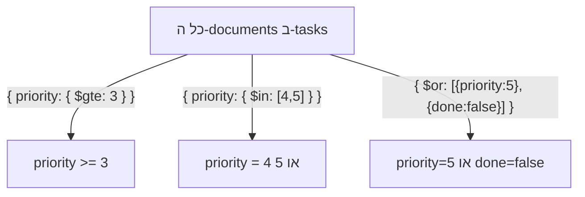

## מה זה?

בשיעור הקודם ה-filter שלנו היה תמיד שוויון מדויק: `{ done: false }` מוצא documents שבהם `done` **שווה בדיוק** ל-`false`. אבל מה אם רוצים "משימות עם עדיפות גבוהה", או "משימות עם עדיפות גבוהה **או** דחופה"? שוויון מדויק לא מספיק. **Query Operators** — מילות מפתח מיוחדות שמתחילות ב-`$` — מאפשרים תנאי סינון עשירים בהרבה בתוך אובייקט ה-filter.

## מילות מפתח שחשוב לזכור

• `$gt` / `$gte` — "גדול מ-" / "גדול-או-שווה ל-" (greater than / greater than or equal)

• `$lt` / `$lte` — "קטן מ-" / "קטן-או-שווה ל-" (less than / less than or equal)

• `$in` — הערך נמצא **באחת** מתוך רשימת אפשרויות

• `$and` / `$or` — משלב כמה תנאים: כולם צריכים להתקיים (`$and`) או שלפחות אחד (`$or`)

• `$ne` — "שונה מ-" (not equal)

```javascript
// משימות עם עדיפות 3 ומעלה
db.tasks.find({ priority: { $gte: 3 } });

// משימות בעדיפות גבוהה או דחופה
db.tasks.find({ priority: { $in: [4, 5] } });
```



## הסבר עיקרי

אופרטור בתוך ערך השדה — שימו לב למבנה: `{ priority: { $gte: 3 } }` — במקום לכתוב `priority: 3` (שוויון מדויק), כותבים אובייקט **בתוך** ערך השדה, עם מפתח שמתחיל ב-`$`. זה אומר ל-MongoDB "אל תבדוק שוויון — הפעל את האופרטור הזה על הערך".

שילוב תנאים על שדות שונים — כשה-filter כולל כמה שדות באותו אובייקט (למשל `{ priority: { $gte: 3 }, done: false }`), MongoDB דורשת שגם וגם יתקיימו — זה **$and** מרומז (implicit). אם רוצים "או" מפורש (למשל: "עדיפות גבוהה **או** לא-בוצע"), צריך את האופרטור `$or` במפורש, עם מערך של תנאים.

`$in` כקיצור ל-"או" על אותו שדה — `{ priority: { $in: [4, 5] } }` הוא קיצור נוח ל-`{ $or: [{ priority: 4 }, { priority: 5 }] }` — כשבודקים אם שדה אחד שווה לאחד מכמה ערכים אפשריים, `$in` קריא יותר מ-`$or` מפורש.

## יתרונות

Query Operators מאפשרים תנאי סינון עשירים בלי לכתוב שפה נפרדת (כמו SQL); `$in` נותן קיצור קריא לבדיקת "אחד מתוך רשימה"; שילוב אופרטורים מאפשר שאילתות מדויקות בדיוק כמו `WHERE` מורכב ב-SQL.

## חסרונות

תחביר האופרטורים (`$gte`, `$in` וכו') דורש שינון בנפרד מ-SQL, למרות שהרעיון דומה; filter מקונן עמוק (הרבה `$and`/`$or` משולבים) יכול להיות קשה לקריאה.

## נקודות חשובות למבחן / ראיון עבודה

• אופרטורים מתחילים תמיד ב-`$` ונכתבים כאובייקט בתוך ערך השדה, לא כערך ישיר

• תנאים מרובים באותו אובייקט filter הם `$and` מרומז; `$or`/`$and` מפורשים דורשים מערך

• `$in` הוא הדרך הקריאה לבדוק "שווה לאחד מתוך רשימה"

• `$gt`/`$gte`/`$lt`/`$lte` מקבילים בדיוק ל-`>`/`>=`/`<`/`<=` ב-SQL

## טעויות נפוצות

• לכתוב `{ priority: [4, 5] }` (בלי `$in`) בציפייה שזה יבדוק "אחד מתוך" — זו לא התחביר הנכון, וזה יחפש שוויון מדויק למערך שלם

• לשכוח את ה-`$` בתחילת שם האופרטור — MongoDB תפרש אותו כשם שדה רגיל, לא כאופרטור

• לבלבל בין `$and` מרומז (כמה שדות באותו אובייקט) לצורך ב-`$or` מפורש כשבאמת רוצים "או"

## סיכום

Query Operators (`$gt`, `$lt`, `$in`, `$and`, `$or` ועוד) מאפשרים תנאי סינון עשירים ב-MongoDB, מעבר לשוויון מדויק — מקבילים לתנאי `WHERE` מורכבים ב-SQL. הם נכתבים כאובייקט עם מפתח `$` בתוך ערך השדה. `$in` הוא קיצור נוח ל-"אחד מתוך רשימה".

## דוקומנטציה רשמית

[MongoDB — Query Operators](https://www.mongodb.com/docs/manual/reference/operator/query/)

---

## תרגילים

### תרגיל 1 — טווח מספרים

**המשימה:** שלפו את כל המשימות עם עדיפות (`priority`) 3 ומעלה, בעזרת `$gte`.

**בדיקה:** כל document בתוצאה מכיל `priority` שהוא 3 או יותר — אף אחד מתחת ל-3.

### תרגיל 2 — $in

**המשימה:** שלפו משימות שהעדיפות שלהן היא 1 **או** 5 (בלי לכתוב `$or` מפורש — השתמשו ב-`$in`).

**בדיקה:** התוצאה כוללת רק documents עם `priority` בדיוק 1 או 5 — לא ערכים אחרים.

### תרגיל 3 — שילוב $or

**המשימה:** שלפו משימות שהן **או** דחופות (`priority: 5`) **או** לא-בוצעו (`done: false`) — השתמשו ב-`$or` עם שני תנאים.

**בדיקה:** כל document בתוצאה מקיים לפחות אחד משני התנאים; documents שלא עומדים באף אחד מהם לא מופיעים.

---

## פרויקט מסכם

**המשימה:** הרחיבו את collection ה-"tasks" עם שדה `priority` (מספר 1-5), והוסיפו שאילתות סינון מתקדמות.

**דרישות:**
1. עדכנו את כל ה-documents הקיימים כך שיכללו `priority`
2. שאילתה שמחזירה משימות בעדיפות גבוהה (4 ומעלה) שעדיין לא בוצעו
3. שאילתה שמחזירה משימות בעדיפות 1, 2 או 3 בעזרת `$in`
4. שאילתה אחת שמשלבת `$or`: עדיפות גבוהה **או** לא-בוצעו

**בדיקה:** כל אחת מ-4 השאילתות מחזירה רק documents שבאמת עומדים בתנאי שלה — בדקו ידנית לפחות דוגמה אחת מכל שאילתה מול הנתונים.

---

## מה בפרק הבא

בפרק הבא נלמד על **MongoDB Atlas** — בדיוק כמו ש-Supabase נתן לנו PostgreSQL אמיתי בענן בלי התקנה מקומית, **MongoDB Atlas** הוא השירות הרשמי המקביל בצד ה-MongoDB: cluster מאוחסן ומנוהל בענן, מוכן לחיבור תוך דקות. עד עכשיו תרגלנו CRUD ואו
