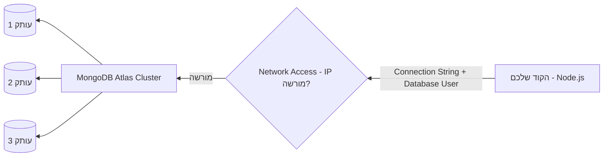

## מה זה?

בדיוק כמו ש-Supabase נתן לנו PostgreSQL אמיתי בענן בלי התקנה מקומית, **MongoDB Atlas** הוא השירות הרשמי המקביל בצד ה-MongoDB: cluster מאוחסן ומנוהל בענן, מוכן לחיבור תוך דקות. עד עכשיו תרגלנו CRUD ואופרטורים על MongoDB "באופן מופשט" — Atlas הוא איפה שבפועל מריצים את כל זה על נתונים אמיתיים, נגישים מכל מקום.

## מילות מפתח שחשוב לזכור

• Cluster — קבוצת שרתים שמריצה את מסד ה-MongoDB שלכם בענן (המקביל ל"פרויקט" ב-Supabase)

• Connection String — כתובת התחברות ל-Cluster, כולל שם משתמש, סיסמה וכתובת השרתים — בדיוק כמו ב-Supabase

• Network Access (IP Whitelist) — רשימת כתובות IP שמורשות להתחבר ל-Cluster; בברירת מחדל, שום דבר לא מורשה

• Database User — משתמש עם שם וסיסמה, נפרד מהחשבון שלכם ב-Atlas, ששרת ה-Node.js ישתמש בו כדי להתחבר

• Replica Set — כמה עותקים מסונכרנים של אותם הנתונים, לזמינות גבוהה — אם שרת אחד נופל, אחר ממשיך לשרת בקשות

## הסבר עיקרי

שני שכבות אבטחה נפרדות — כדי להתחבר ל-Atlas בהצלחה, צריך **שתי** אישורים נפרדים: (1) Database User עם שם משתמש וסיסמה תקינים בתוך ה-Connection String, וגם (2) כתובת ה-IP שממנה מתחברים חייבת להיות ברשימת ה-Network Access המורשית. שכחת אחד משני התנאים — אפילו עם Connection String נכון לגמרי — גורמת לחיבור להיכשל.

Cluster כתשתית, לא מסד בודד — Cluster יכול להכיל כמה מסדי נתונים (databases) שונים, כל אחד עם collections משלו — בדיוק כמו שפרויקט Supabase יכול להכיל כמה טבלאות. ה-Connection String מצביע על ה-Cluster; בקוד בוחרים איזה database בתוכו לעבוד מולו.

Replica Set לזמינות גבוהה — הדיאגרמה למעלה מראה שה-Cluster בפועל מריץ כמה עותקים מסונכרנים ("עותק 1", "עותק 2", "עותק 3") של אותם הנתונים. אם שרת אחד נופל (תקלת חומרה, עדכון וכו'), אחד השאר ממשיך לענות לבקשות בלי הפסקת שירות — משהו שקשה מאוד להשיג לבד עם מסד מותקן-מקומית.

## יתרונות

Cluster מוכן תוך דקות, בלי להתקין ולנהל שרת MongoDB בעצמכם; Replica Set נותן זמינות גבוהה אוטומטית; שכבת חינמית (free tier) מספיקה לחלוטין לפרויקטי לימוד.

## חסרונות

הגדרת Network Access לא-נכונה (או שכוחה) היא מקור נפוץ לתקלות חיבור מבלבלות; תלות ברשת אינטרנט; שכבה חינמית עם מגבלות משאבים.

## נקודות חשובות למבחן / ראיון עבודה

• Atlas הוא שירות הענן הרשמי ל-MongoDB, מקביל ל-Supabase בצד ה-SQL

• חיבור מוצלח דורש גם Database User תקין וגם כתובת IP מאושרת ב-Network Access

• Cluster יכול להכיל כמה databases, כל אחד עם collections משלו

• Replica Set = כמה עותקים מסונכרנים של הנתונים, לזמינות גבוהה

## טעויות נפוצות

• שכחת להוסיף את כתובת ה-IP הנוכחית ל-Network Access — חיבור נכשל למרות Connection String נכון

• שימוש בסיסמת Database User עם תווים מיוחדים בלי URL-encoding בתוך ה-Connection String — גורם לשגיאת פענוח

• בלבול בין הסיסמה של החשבון האישי ב-Atlas לסיסמת ה-Database User — אלה שני דברים נפרדים לגמרי

## סיכום

MongoDB Atlas נותן Cluster מאוחסן ומנוהל בענן, מקביל ל-Supabase בצד ה-SQL. חיבור מוצלח דורש Database User תקין **וגם** אישור ב-Network Access. Replica Set שומר על זמינות גבוהה אוטומטית. בשיעורים הבאים (Compass, Mongoose) נתחבר ל-Cluster הזה בפועל.

## דוקומנטציה רשמית

[MongoDB Atlas — Official Docs](https://www.mongodb.com/docs/atlas/getting-started/)

---

## תרגילים

### תרגיל 1 — יצירת Cluster

**המשימה:** צרו חשבון MongoDB Atlas ו-Cluster חינמי חדש.

**בדיקה:** ה-Cluster מופיע בדשבורד עם סטטוס "פעיל" (לא "בהקמה").

### תרגיל 2 — Database User ו-Network Access

**המשימה:** צרו Database User עם שם וסיסמה, והוסיפו את כתובת ה-IP הנוכחית שלכם ל-Network Access.

**בדיקה:** שני הפריטים מופיעים ברשימות המתאימות בדשבורד — המשתמש תחת Database Access, ה-IP תחת Network Access.

### תרגיל 3 — קבלת Connection String

**המשימה:** קבלו את ה-Connection String של ה-Cluster, והחליפו בו את ה-placeholder של הסיסמה בסיסמה האמיתית של ה-Database User שיצרתם.

**בדיקה:** יש לכם מחרוזת `mongodb+srv://...` מלאה, בלי placeholder כמו `<password>` שנשאר לא-מוחלף.

---

## פרויקט מסכם

**המשימה:** הקימו Cluster מלא ב-Atlas, והעבירו אליו את נתוני "המשימות" ששלחתם קודם ל-MongoDB מקומי (בשיעורי MongoDB Basics/Operators).

**דרישות:**
1. Cluster חדש, Database User, ו-Network Access מוגדרים נכון
2. חיבור מוצלח (בעזרת `mongosh` או Compass — השיעור הבא) עם ה-Connection String
3. יצירת database בשם `course` וcollection בשם `tasks` בתוכו
4. הכנסת לפחות 4 documents עם `title`, `done`, ו-`priority`

**בדיקה:** שאילתת `find()` על ה-Cluster (לא מקומי!) מחזירה את כל ה-documents שהכנסתם — הוכחה שהחיבור לענן עובד בפועל.

---

## מה בפרק הבא

בפרק הבא נלמד על **MongoDB Compass** — עד עכשיו כל שאילתת MongoDB נכתבה כקוד (JavaScript/Shell). לפעמים רוצים פשוט **לראות** מה יש ב-collection, לבדוק אם document התעדכן כמו שציפינו, או לתקן ערך אחד ידנית — בלי לכתוב שאילתה בשביל זה. **Mon
