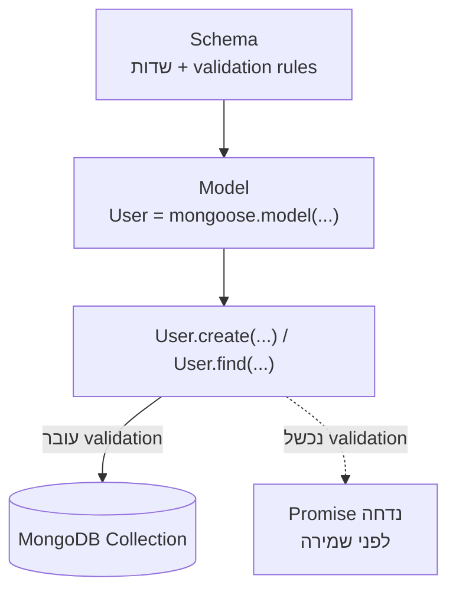

## מה זה?

Mongoose הוא ODM (Object Document Mapper) ל-MongoDB ב-Node.js — הוא עוטף את ה-Native Driver ומוסיף שכבת Schema, Validation, ו-API נוח שמחזיר Promises. הבעיה שנפתרת: Native Driver לבדו לא אוכף מבנה או תקינות על Documents — חובה חסר, שדה עם ערך שגוי, או טעות בשם שדה בקריאה ל-DB יכולים להיכנס בלי בדיקה, ולהתגלות רק כשמשהו כבר נשבר.

## מילות מפתח שחשוב לזכור

• Schema — הגדרת מבנה ה-document: שדות, טיפוסים, validation rules

• Model — מחלקה שמייצגת Collection שמאפשרת CRUD (`User.find()`, `User.create()`)

• `required` / `min` / `max` — validation rules ב-Schema; Mongoose זורק שגיאה לפני שמירה אם לא עומדים בהם

• `async`/`await` — כל פעולת Mongoose (`find`, `create`, `save`) מחזירה Promise

• `_id` — מזהה ייחודי שכל document מקבל אוטומטית ב-MongoDB

```javascript
const userSchema = new mongoose.Schema({
  name: { type: String, required: true },
  age: { type: Number, min: 0 },
});
const User = mongoose.model("User", userSchema);

const user = await User.create({ name: "Dana", age: 28 });
```



## הסבר עיקרי

Schema כחוזה — לפני Mongoose, אין שום דבר שמכריח document ב-MongoDB להיראות בצורה עקבית; כל document יכול להיות שונה. Schema מגדיר "איך document מסוג User אמור להיראות" — שדות, טיפוסים, ואילו שדות חובה — וזה נאכף אוטומטית לפני כל שמירה.

Model כגשר ל-Collection — `mongoose.model("User", userSchema)` יוצר Model שמייצג Collection שלמה. דרכו מתבצעות כל הפעולות: `User.find()` (שליפה), `User.create()` (יצירה), `User.findByIdAndUpdate()` (עדכון) — כולן מחזירות Promise, בדיוק כמו `fetch` שנלמד ב-JavaScript.

Validation לפני שמירה, לא אחרי — אם `required: true` ולא סופק ערך, `User.create()` דוחה את ה-Promise עם שגיאת Validation **לפני** שה-document בכלל נשמר ל-DB. זה מונע כניסת נתונים פגומים מלכתחילה, במקום לגלות אותם מאוחר יותר.

async/await עם Mongoose — כל קריאה ל-Mongoose (כמו `fetch`) היא async ומחזירה Promise. הדפוס הסטנדרטי הוא `async`/`await` בתוך `try`/`catch`, כדי לתפוס גם שגיאות validation וגם שגיאות חיבור ל-DB באותו מקום.

## יתרונות

Schema אוכף מבנה ותקינות באופן אוטומטי לפני כל שמירה; API מבוסס Promise משתלב טבעי עם `async`/`await`; שגיאות validation מתגלות מיד, לא מאוחר יותר בקוד שמניח שהנתונים תקינים.

## חסרונות

שכבת Mongoose מוסיפה overhead קל לעומת Native Driver ישיר; Schema לא-גמיש מדי עלול להכביד כשצריך מבנה נתונים דינמי לגמרי; טעויות בהגדרת Schema (למשל טיפוס שגוי) מתגלות רק כשמנסים לשמור נתון שלא תואם.

## נקודות חשובות למבחן / ראיון עבודה

• Schema מגדיר מבנה ו-validation; Model הוא הממשק לביצוע פעולות על Collection

• כל פעולת Mongoose מחזירה Promise — נדרש `await` או `.then()`

• `required: true` גורם ל-`create`/`save` להידחות אם השדה חסר

• `_id` מתווסף אוטומטית ע"י MongoDB לכל document חדש

## טעויות נפוצות

• שכחת `await` על קריאת Mongoose וניסיון להשתמש בתוצאה כאילו היא ערך רגיל, לא Promise

• יצירת document בלי לתפוס שגיאת validation אפשרית ב-`try`/`catch`

• הגדרת שדה חובה (`required`) אחרי שכבר יש documents קיימים בלי אותו שדה — יוצר חוסר עקביות

## סיכום

Mongoose עוטף את MongoDB Native Driver בשכבת Schema (מבנה + validation) ו-Model (ממשק ל-Collection). כל פעולה מחזירה Promise, כך שהיא משתלבת טבעי עם `async`/`await`. Validation נאכפת לפני שמירה — נתונים פגומים לא נכנסים ל-DB מלכתחילה.

## דוקומנטציה רשמית

[Mongoose — Official Docs](https://mongoosejs.com/docs/guide.html)

---

## תרגילים

### תרגיל 1 — Schema ראשון

**המשימה:** הגדירו `productSchema` עם `name` (String, חובה) ו-`price` (Number, מינימום 0). צרו `Model` בשם `Product`.

**בדיקה:** יצירת מוצר עם `name` ו-`price` תקינים (למשל `Product.create({ name: "עט", price: 5 })`) מצליחה ומחזירה document עם `_id` שהוקצה אוטומטית.

### תרגיל 2 — יצירה עם await

**המשימה:** כתבו פונקציית `async` שיוצרת מוצר חדש עם `Product.create()` ומדפיסה את ה-`_id` שלו.

**בדיקה:** ה-console מדפיס מחרוזת `_id` באורך 24 תווים הקסדצימליים (פורמט ObjectId של MongoDB), לא `undefined`.

### תרגיל 3 — Validation

**המשימה:** נסו ליצור מוצר בלי `name` (השדה החובה). תפסו את שגיאת ה-Validation עם `try`/`catch` והדפיסו הודעה ברורה.

**בדיקה:** ה-console מדפיס הודעת שגיאה שמזכירה את השדה `name`, בלי שהתוכנית קורסת עם `Uncaught Exception`.

---

## פרויקט מסכם

**המשימה:** בנו מודל `User` בסיסי עם Mongoose לרישום משתמשים.

**דרישות:**
1. Schema עם `name` (חובה), `email` (חובה), `age` (מינימום 0)
2. פונקציית `async` `registerUser(data)` שיוצרת משתמש עם `try`/`catch`
3. אם ה-validation נכשל — מחזירה הודעת שגיאה ברורה, לא קריסה
4. פונקציה נוספת `findUserByEmail(email)` שמשתמשת ב-`User.findOne()`

**בדיקה:** `registerUser({ name: "דנה", email: "dana@test.com", age: 25 })` מחזירה משתמש עם `_id`; `registerUser({ email: "x@test.com" })` (בלי `name`) מחזירה הודעת שגיאה ברורה במקום לזרוק חריגה לא-מטופלת; `findUserByEmail("dana@test.com")` אחרי הרישום הראשון מחזירה את אותו document (לא `null`).
