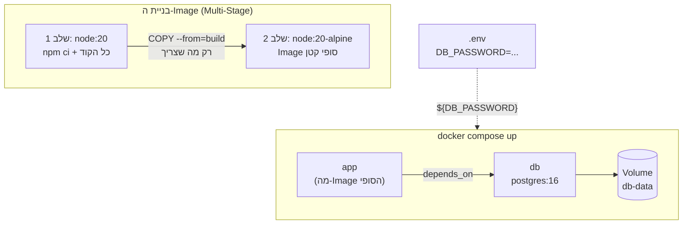

## מה זה?

זהו הפרויקט המסכם של יחידת Docker: לוקחים את הידע מכל שלושת השיעורים — Dockerfile (בניית Image), Docker Compose (הרצת כמה קונטיינרים יחד) — ומוסיפים שלב אחד קדימה: **Dockerfile רב-שלבי (Multi-Stage)** לImage קטן ונקי יותר, ו**קובץ `.env`** שמעביר קונפיגורציה ל-Compose בלי לכתוב אף ערך קשיח.

## מילות מפתח שחשוב לזכור

• Multi-Stage Build — Dockerfile עם כמה בלוקי `FROM`; שלב אחד מתקין ובונה, ושלב סופי **קטן** מעתיק ממנו רק מה שבאמת צריך בזמן ריצה

• `.dockerignore` — כמו `.gitignore`, אבל קובע מה **לא** נכנס להקשר הבנייה (`node_modules`, `.env`, `.git`) — Image קטן יותר, ובלי דליפת סודות

• `.env` + `docker-compose.yml` — Compose קורא אוטומטית קובץ `.env` באותה תיקייה, ומזריק את הערכים דרך `${VAR}` בתוך ה-YAML

```dockerfile
# שלב 1: בנייה — יש כאן כל כלי הפיתוח, אבל הImage הזה נזרק בסוף
FROM node:20 AS build
WORKDIR /app
COPY package*.json ./
RUN npm ci
COPY . .

# שלב 2: ריצה — Image סופי קטן, בלי כלי בנייה מיותרים
FROM node:20-alpine
WORKDIR /app
COPY --from=build /app .
CMD ["node", "server.js"]
```

```yaml
# docker-compose.yml — קורא ערכים מ-.env אוטומטית
services:
  app:
    build: .
    environment:
      - DB_HOST=db
      - DB_PASSWORD=${DB_PASSWORD}   # מגיע מקובץ .env
    depends_on:
      - db
  db:
    image: postgres:16
    environment:
      - POSTGRES_PASSWORD=${DB_PASSWORD}
    volumes:
      - db-data:/var/lib/postgresql/data

volumes:
  db-data:
```



## הסבר עיקרי

Multi-Stage חוסך משקל בלי לוותר על שום דבר — שלב הבנייה (`build`) מתקין את **כל** התלויות (כולל כלי פיתוח כבדים), אבל שלב הריצה מעתיק ממנו רק את הקבצים המוגמרים (`COPY --from=build`). ה-Image הסופי לא מכיל את כלי הבנייה בכלל — קטן יותר, ומשטח-התקפה קטן יותר (פחות תוכנה מותקנת = פחות פגיעויות אפשריות).

`.env` עובד עם Compose בלי קוד נוסף — Docker Compose **קורא אוטומטית** קובץ בשם `.env` באותה תיקייה כמו `docker-compose.yml`, ומחליף כל `${DB_PASSWORD}` בתוך ה-YAML בערך המתאים. זו בדיוק אותה עקרון dotenv מיחידת Server — קונפיגורציה נפרדת מקוד — רק שכאן זה קורה ברמת ה-orchestration, לפני שהקונטיינרים בכלל עולים.

`.dockerignore` מונע שתי בעיות בבת אחת — בלי אותו, `docker build` שולח את **כל** תיקיית הפרויקט (כולל `node_modules` ענק ו-`.env` עם סודות) להקשר הבנייה — גם אם ה-Dockerfile לא באמת צריך אותם. `.dockerignore` חוסם את זה: בנייה מהירה יותר, ובלי סיכון שסוד מ-`.env` "יידלף" בטעות לתוך שכבה של ה-Image.

## יתרונות

Multi-Stage נותן Image קטן ומאובטח יותר בלי לשנות שום קוד אפליקציה; `.env` + Compose מפרידים סודות/קונפיגורציה מה-YAML עצמו, כך שאפשר לשתף `docker-compose.yml` (ב-Git) בלי לחשוף סיסמאות; `.dockerignore` מייעל את הבנייה ומונע דליפת קבצים רגישים.

## חסרונות

Dockerfile רב-שלבי מורכב יותר לקריאה מ-Dockerfile פשוט בשלב אחד; קובץ `.env` חייב להישאר **מחוץ** ל-Git (ב-`.gitignore`) — אם מישהו מוסיף אותו בטעות, הסודות נחשפים בהיסטוריה.

## נקודות חשובות למבחן / ראיון עבודה

• Multi-Stage Build משתמש בכמה `FROM` בקובץ אחד; `COPY --from=<stage>` מעתיק רק מה שצריך לשלב הסופי

• Compose קורא `.env` **אוטומטית** מאותה תיקייה — אין צורך בדגל מיוחד

• `.dockerignore` חוסם קבצים מהקשר הבנייה, במקביל ל-`.gitignore` לגבי Git

• קובץ `.env` צריך להיות ב-`.gitignore` תמיד — לעולם לא מחובר לריפו

## טעויות נפוצות

• לשכוח `.dockerignore` ואז לתהות למה בניית ה-Image לוקחת דקות ארוכות (שולח `node_modules` שלם בכל פעם)

• לכתוב סיסמה ישירות ב-`docker-compose.yml` במקום ב-`${VAR}` שמגיע מ-`.env`

• לשכוח `COPY --from=build` בשלב האחרון, ואז לגלות שה-Image הסופי לא מכיל את הקוד בכלל

• להוסיף `.env` בטעות ל-Git (בלי `.gitignore` מתאים) — חשיפת סודות בהיסטוריה, גם אם מוחקים את הקובץ אחר-כך

## סיכום

הפרויקט המסכם בונה Dockerfile רב-שלבי ל-Image קטן ונקי, מריץ אותו יחד עם מסד נתונים דרך `docker compose`, ומעביר את כל הקונפיגורציה (סיסמאות, כתובות) דרך קובץ `.env` שנקרא אוטומטית — בלי אף ערך קשיח בקוד או ב-YAML. זו בדיוק ההגדרה של "מוכן ל-production" בעולם ה-containers.

## דוקומנטציה רשמית

[Docker Docs — Multi-stage builds](https://docs.docker.com/build/building/multi-stage/)

[Docker Compose — Environment variables](https://docs.docker.com/compose/how-tos/environment-variables/)

---

## תרגילים

### תרגיל 1 — הפיכת Dockerfile לרב-שלבי

**המשימה:** קחו Dockerfile בשלב אחד (מהשיעור הקודם) והפכו אותו לרב-שלבי — שלב `build` ושלב ריצה נפרד.

**בדיקה:** `docker images` מראה שגודל ה-Image החדש קטן משמעותית מהגרסה בשלב-אחד.

### תרגיל 2 — קונפיגורציה דרך `.env`

**המשימה:** צרו קובץ `.env` עם `APP_PORT=4000`, והשתמשו בו ב-`docker-compose.yml` דרך `${APP_PORT}` בהגדרת `ports`.

**בדיקה:** שינוי הערך ב-`.env` ל-`5000` והרצת `docker compose up` מחדש משנה בפועל על איזה פורט האפליקציה נגישה — בלי לגעת ב-YAML.

---

## פרויקט מסכם

**המשימה:** בנו סביבת `docker compose` מלאה, עם Dockerfile רב-שלבי וקונפיגורציה דרך `.env` בלבד.

**דרישות:**
1. Dockerfile רב-שלבי לשרת ה-Node שלכם — שלב בנייה + שלב ריצה קטן (`node:20-alpine`)
2. `.dockerignore` שחוסם `node_modules`, `.env`, ו-`.git`
3. `docker-compose.yml` עם Service `app` (מה-Dockerfile) ו-Service `db` (`postgres:16` או `mongo:7`), עם `depends_on` ו-`volumes` לשמירת נתונים
4. כל סיסמה/פורט/כתובת מגיעים מקובץ `.env` דרך `${VAR}` — אף ערך קשיח ב-`docker-compose.yml`
5. `.env` מופיע ב-`.gitignore`

**בדיקה:** `docker compose up --build` מריץ את שני השירותים בהצלחה, והאפליקציה מגיבה ב-`curl` על הפורט שמוגדר ב-`.env`; `docker images` מראה שה-Image של ה-`app` קטן משמעותית ממה שהיה בגרסה בשלב-אחד; שינוי סיסמה ב-`.env` ו-`docker compose up` מחדש מעדכן את שני השירותים בלי לגעת ב-YAML בכלל.

## מה בפרק הבא

בפרק הבא נתחיל יחידה חדשה — **Testing**. עד עכשיו בדקנו שהקוד עובד ידנית — הרצת השרת, שליחת בקשה, בדיקה חזותית שהתוצאה נכונה. ביחידת Testing נלמד לכתוב קוד ש**בודק את עצמו אוטומטית**, כדי לתפוס באגים לפני שהם מגיעים למשתמש.
