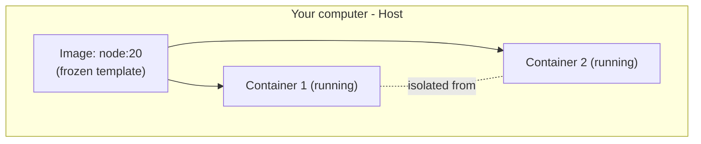

## מה זה?

לאורך כל הקורס, כדי להריץ את הפרויקטים שלכם צריך שילוב מדויק של: גרסת Node.js נכונה, כל התלויות מ-`package.json` מותקנות, ואולי גם מסד נתונים רץ ברקע (Supabase/MongoDB). על **המחשב שלכם** זה עובד. אבל כשמעלים את הקוד לשרת אחר (או שחבר מנסה להריץ אותו), לפעמים "זה לא עובד" — גרסת Node שונה, ספרייה חסרה, הבדל במערכת ההפעלה. **Docker** פותר את זה: אורז את האפליקציה **יחד עם כל מה שהיא צריכה כדי לרוץ** (Runtime, תלויות, קונפיגורציה) ל"קונטיינר" (Container) — יחידה אחת שרצה **אותו הדבר בדיוק** בכל מקום.

## מילות מפתח שחשוב לזכור

• Image (תמונה) — "תבנית" קפואה שמכילה את כל מה שצריך כדי להריץ את האפליקציה: קוד, Runtime (כמו Node.js), תלויות

• Container (קונטיינר) — מופע **רץ** של Image — כמו שאובייקט הוא מופע של Class; אפשר להריץ כמה קונטיינרים מאותו Image

• Docker Hub — "חנות" ציבורית של Images מוכנים (כמו `node`, `postgres`, `mongo`) שאפשר להוריד ולהשתמש בהם ישירות

• `docker run` — מריץ קונטיינר חדש מ-Image

• `docker ps` — מציג את כל הקונטיינרים שרצים כרגע

• Isolation (בידוד) — כל קונטיינר רץ בסביבה משלו, מבודד מהמחשב המארח ומקונטיינרים אחרים

## הסבר עיקרי

Image כתבנית, Container כמופע — בדיוק כמו ש-`class` הוא תבנית ו-`new` יוצר ממנה מופע (זוכרים Factory Functions?), Image הוא תבנית קפואה, ו-`docker run` יוצר ממנה קונטיינר **רץ**. אפשר להריץ כמה קונטיינרים מאותו Image בו-זמנית, כל אחד מבודד מהשני.

Docker Hub כ"npm ל-Images" — בדיוק כמו ש-`npm install express` מוריד ספרייה מוכנה מ-npm, `docker run node:20` מוריד Image מוכן ("node", גרסה 20) מ-Docker Hub ומריץ אותו — לא צריך להתקין Node.js על המחשב שלכם בכלל כדי להריץ קוד Node בתוך קונטיינר.

Isolation פותר את "אצלי זה עובד" — קונטיינר לא "רואה" את שאר המחשב שלכם (קבצים, תוכנות מותקנות) — יש לו רק את מה שה-Image הגדיר. זה אומר שאם הקונטיינר רץ אצלכם, הוא ירוץ **בדיוק אותו דבר** על כל מחשב אחר שיש עליו Docker — לא משנה איזו מערכת הפעלה, אילו גרסאות מותקנות שם.

## יתרונות

פותר לגמרי את בעיית "אצלי זה עובד" — סביבת הרצה זהה בכל מקום; Docker Hub נותן גישה מיידית ל-Images מוכנים (Node, Postgres, MongoDB) בלי התקנה ידנית; קל להריץ ולהרוס קונטיינרים בלי "ללכלך" את המחשב עצמו.

## חסרונות

עקומת למידה בתחילת הדרך (מושגים חדשים: Image, Container, Volume...); Images יכולים לתפוס הרבה מקום בדיסק; overhead קל בביצועים לעומת הרצה ישירה על המחשב (בדרך כלל זניח).

## נקודות חשובות

• Image = תבנית קפואה; Container = מופע רץ של Image

• אפשר להריץ כמה Containers מאותו Image בו-זמנית, מבודדים זה מזה

• Docker Hub הוא המאגר הציבורי של Images מוכנים

• Docker פותר את בעיית "אצלי זה עובד" ע"י אריזת כל הסביבה יחד עם הקוד

## טעויות נפוצות

• בלבול בין Image (התבנית) ל-Container (המופע הרץ) — הם לא אותו דבר

• לחשוב שקונטיינר "רואה" את כל המחשב המארח — בברירת מחדל הוא מבודד לגמרי

• לשכוח ש-`docker run` בלי דגלים נכונים לא בהכרח חושף פורטים או משתף קבצים

## סיכום

Docker אורז אפליקציה יחד עם כל מה שהיא צריכה (Runtime, תלויות) ל-Image — תבנית קפואה. `docker run` יוצר ממנה Container — מופע רץ ומבודד. Docker Hub נותן גישה מיידית ל-Images מוכנים. זה פותר את בעיית "אצלי זה עובד" ע"י הבטחת סביבת הרצה זהה בכל מקום.

## דוקומנטציה רשמית

[Docker — Get Started](https://docs.docker.com/get-started/)

---

## תרגילים

### תרגיל 1 — הרצת קונטיינר ראשון

**המשימה:** הריצו `docker run hello-world`.

**בדיקה:** מופיעה הודעה שמתחילה ב-"Hello from Docker!" — עדות שה-Image הורד והקונטיינר רץ בהצלחה.

### תרגיל 2 — קונטיינר Node אינטראקטיבי

**המשימה:** הריצו קונטיינר Node.js אינטראקטיבי (`docker run -it node:20`) והריצו בתוכו `console.log(1+1)` ב-REPL שנפתח.

**בדיקה:** הפלט מציג `2` — הוכחה שה-Node.js רץ **בתוך** הקונטיינר, לא על המחשב שלכם ישירות.

### תרגיל 3 — docker ps

**המשימה:** בזמן שקונטיינר עדיין רץ בטרמינל אחד, פתחו טרמינל נוסף והריצו `docker ps`.

**בדיקה:** הפלט מציג שורה עם ה-Container ID, שם ה-Image ששימש אותו, וזמן ההרצה.

---

## פרויקט מסכם

**המשימה:** הריצו קונטיינר PostgreSQL מקומי (בלי Supabase), והתחברו אליו.

**דרישות:**
1. `docker run` עם Image של `postgres` (כולל הגדרת סיסמה דרך משתנה סביבה `-e POSTGRES_PASSWORD=...`)
2. חשיפת הפורט המתאים (`-p 5432:5432`) כדי לגשת מהמחשב שלכם
3. אימות שהקונטיינר רץ עם `docker ps`
4. חיבור למסד (בעזרת `psql` או כלי GUI) והרצת שאילתה פשוטה

**בדיקה:** `docker ps` מציג את הקונטיינר כ"רץ" (Up); שאילתה פשוטה על המסד מחזירה תוצאה — הוכחה שהמסד בתוך הקונטיינר נגיש מבחוץ.

---

## מה בפרק הבא

בפרק הבא נלמד על **Dockerfile** — בשיעור הקודם השתמשנו ב-Images **מוכנים** מ-Docker Hub (`node`, `postgres`). אבל איך אורזים את **האפליקציה שלכם עצמה** ל-Image? צריך "מתכון" שאומר בדיוק: איזה Image בסיסי להתחיל ממנו, אילו קבצים להעתיק
