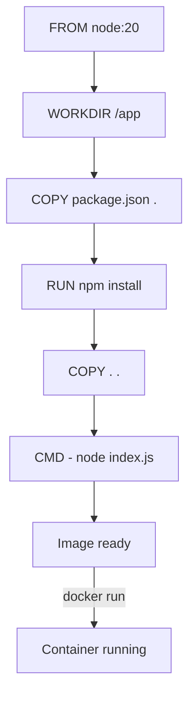

## מה זה?

בשיעור הקודם השתמשנו ב-Images **מוכנים** מ-Docker Hub (`node`, `postgres`). אבל איך אורזים את **האפליקציה שלכם עצמה** ל-Image? צריך "מתכון" שאומר בדיוק: איזה Image בסיסי להתחיל ממנו, אילו קבצים להעתיק פנימה, אילו תלויות להתקין, ואיך להריץ את האפליקציה. **Dockerfile** הוא בדיוק זה — קובץ טקסט עם רשימת הוראות, ש-`docker build` הופך ל-Image מוכן.

## מילות מפתח שחשוב לזכור

• `FROM` — קובע את ה-Image הבסיסי שממנו מתחילים (למשל `FROM node:20`)

• `WORKDIR` — קובע את תיקיית העבודה בתוך הקונטיינר לכל הפקודות הבאות

• `COPY` — מעתיק קבצים מהמחשב שלכם (מחוץ לקונטיינר) לתוך ה-Image

• `RUN` — מריץ פקודה **בזמן בניית ה-Image** (למשל `npm install`) — התוצאה נשמרת בתוך ה-Image עצמו

• `CMD` — הפקודה שתרוץ כש**קונטיינר** נוצר מה-Image (בניגוד ל-`RUN`, שרץ רק פעם אחת בזמן ה-build)

• Layer (שכבה) — כל הוראה ב-Dockerfile יוצרת שכבה נפרדת ב-Image; Docker שומר במטמון (cache) שכבות שלא השתנו, ומזרז builds חוזרים

```dockerfile
FROM node:20
WORKDIR /app
COPY package.json .
RUN npm install
COPY . .
CMD ["node", "index.js"]
```



## הסבר עיקרי

סדר ההוראות קובע יעילות, לא רק תוצאה — שימו לב שבדוגמה, `COPY package.json .` ו-`RUN npm install` מגיעים **לפני** `COPY . .` (שמעתיק את כל שאר הקוד). זה לא מקרי: Docker שומר כל שורה כ-Layer נפרד במטמון. אם רק הקוד שלכם משתנה (לא `package.json`), ה-build הבא ידלג על `npm install` (Layer לא השתנה) ויתחיל ישר מ-`COPY . .` — חוסך זמן build משמעותי. אם היינו מעתיקים הכל ביחד בהתחלה, כל שינוי קטן בקוד היה "שובר" את המטמון ומכריח התקנה מחדש של כל התלויות.

RUN מול CMD — ההבדל הקריטי: `RUN` מתבצע **פעם אחת**, בזמן בניית ה-Image (`docker build`) — התוצאה (למשל `node_modules` שהותקן) נשמרת בתוך ה-Image לתמיד. `CMD` לעומת זאת מוגדר ב-Image אבל **מתבצע** רק כש-`docker run` יוצר קונטיינר ממנו — וזה קורה בכל פעם מחדש שמריצים קונטיינר חדש.

WORKDIR כתיקיית בית — `WORKDIR /app` אומר "מעכשיו, כל `COPY`/`RUN` הבאים פועלים מתוך `/app` בתוך הקונטיינר" — בדיוק כמו `cd /app`, אבל בצורה שנשמרת גם עבור הקונטיינר הרץ בפועל.

## יתרונות

Dockerfile הוא תיעוד חי ומדויק של איך בדיוק לבנות את סביבת ההרצה — לא צריך "README עם הוראות התקנה" נפרד; Layer caching מזרז builds חוזרים משמעותית; אותו Dockerfile בונה Image זהה על כל מחשב.

## חסרונות

סדר הוראות לא-אופטימלי הורס את יתרון ה-caching; Dockerfile "עבה מדי" (הרבה תלויות מיותרות) מייצר Image גדול שאיטי להעביר; שכחת `.dockerignore` (מקביל ל-`.gitignore`) עלולה להעתיק `node_modules` מקומי בטעות לתוך ה-Image.

## נקודות חשובות

• `FROM` קובע Image בסיס; `COPY` מעתיק קבצים; `RUN` מריץ פקודה בזמן build; `CMD` מריץ פקודה בזמן run של הקונטיינר

• כל הוראה ב-Dockerfile היא Layer נפרד, עם caching — סדר ההוראות משפיע על מהירות build חוזר

• `docker build` הופך Dockerfile ל-Image; `docker run` יוצר קונטיינר מה-Image

• מומלץ להעתיק `package.json` ולהריץ `npm install` **לפני** העתקת שאר הקוד, כדי לנצל caching

## טעויות נפוצות

• להעתיק את כל הקוד (`COPY . .`) לפני `npm install` — כל שינוי קוד קטן שובר את המטמון ומכריח התקנה מחדש של תלויות

• בלבול בין `RUN` (זמן build) ל-`CMD` (זמן run) — שימוש שגוי גורם לפקודה לא לרוץ בזמן הנכון

• שכחת `.dockerignore` — מעתיקים `node_modules`/`.git` מקומיים בטעות ל-Image, מנפחים אותו

## סיכום

Dockerfile הוא רשימת הוראות שממנה `docker build` בונה Image מותאם-אישית: `FROM` קובע בסיס, `COPY`/`RUN` מכינים את הסביבה (בזמן build), `CMD` קובע מה ירוץ כשיוצרים קונטיינר. סדר ההוראות משפיע ישירות על מהירות builds חוזרים, בזכות Layer caching.

## דוקומנטציה רשמית

[Docker — Dockerfile Reference](https://docs.docker.com/reference/dockerfile/)

---

## תרגילים

### תרגיל 1 — Dockerfile ראשון

**המשימה:** כתבו Dockerfile לאפליקציית Node.js פשוטה: `FROM node:20`, `WORKDIR /app`, `COPY . .`, `CMD ["node", "index.js"]`.

**בדיקה:** `docker build -t my-app .` מסתיים בלי שגיאה ומייצר Image בשם `my-app` (בדקו עם `docker images`).

### תרגיל 2 — בנייה והרצה

**המשימה:** הריצו קונטיינר מה-Image שבניתם (`docker run my-app`).

**בדיקה:** הפלט של האפליקציה (למשל `console.log` מ-`index.js`) מופיע בטרמינל.

### תרגיל 3 — ניצול Layer Caching

**המשימה:** שנו את ה-Dockerfile כך ש-`COPY package.json .` ו-`RUN npm install` יבואו **לפני** `COPY . .`. בנו פעם ראשונה, שנו רק קובץ קוד (לא `package.json`), ובנו שוב.

**בדיקה:** ה-build השני מדפיס `CACHED` (או דומה) לצד שורת ה-`RUN npm install` — הוכחה שהמטמון נוצל ולא הותקנו התלויות מחדש.

---

## פרויקט מסכם

**המשימה:** כתבו Dockerfile מלא לשרת ה-Express (Tasks) שבניתם ביחידת השרתים, ובנו ממנו Image.

**דרישות:**
1. `FROM node:20`, `WORKDIR /app`
2. `COPY package.json .` ו-`RUN npm install` **לפני** העתקת שאר הקוד (לניצול caching)
3. `COPY . .`
4. `CMD` שמריץ את השרת

**בדיקה:** `docker build -t tasks-server .` מצליח; `docker run -p 3000:3000 tasks-server` מריץ את השרת; `curl http://localhost:3000/tasks` (מהמחשב שלכם, לא מתוך הקונטיינר) מחזיר תשובה תקינה — הוכחה שהפורט נחשף נכון.

---

## מה בפרק הבא

בפרק הבא נלמד על **Docker Compose** — אפליקציה אמיתית כמעט אף פעם לא רצה לבד — צריך גם את השרת (מה-Dockerfile בשיעור הקודם) **וגם** מסד נתונים (כמו PostgreSQL, בקונטיינר נפרד משיעור Docker Basics). להריץ כל אחד בנפרד עם `docker run` ולזכו
