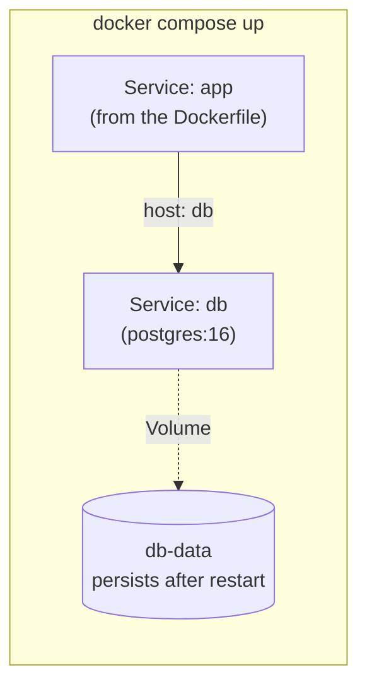

## מה זה?

אפליקציה אמיתית כמעט אף פעם לא רצה לבד — צריך גם את השרת (מה-Dockerfile בשיעור הקודם) **וגם** מסד נתונים (כמו PostgreSQL, בקונטיינר נפרד משיעור Docker Basics). להריץ כל אחד בנפרד עם `docker run` ולזכור לחבר ביניהם ידנית (רשת, פורטים, סדר הפעלה) מסורבל ומועד לטעויות. **Docker Compose** פותר את זה: קובץ תצורה יחיד (`docker-compose.yml`) שמתאר את **כל** הקונטיינרים שהאפליקציה צריכה יחד, ומפעיל את כולם בפקודה אחת.

## מילות מפתח שחשוב לזכור

• `docker-compose.yml` — קובץ YAML שמתאר את כל ה-Services (קונטיינרים) שהאפליקציה צריכה

• Service — הגדרת קונטיינר בודד בתוך `docker-compose.yml` (למשל `app`, `db`)

• `docker compose up` — מריץ את **כל** ה-Services המוגדרים בקובץ, יחד, בפקודה אחת

• Network — Docker Compose יוצר רשת פנימית משותפת אוטומטית; Services יכולים "לדבר" ביניהם לפי שם ה-Service (לא IP)

• Volume — אחסון שנשאר קיים גם אחרי שקונטיינר נעצר/נמחק — קריטי למסד נתונים, שאסור לו לאבד נתונים בכל restart

```yaml
services:
  app:
    build: .
    ports:
      - "3000:3000"
    depends_on:
      - db
  db:
    image: postgres:16
    environment:
      POSTGRES_PASSWORD: secret
    volumes:
      - db-data:/var/lib/postgresql/data

volumes:
  db-data:
```



## הסבר עיקרי

Service מדבר עם Service לפי שם — בשיעור SQL from Node, ה-`DATABASE_URL` הצביע על `localhost` או Supabase. בתוך Docker Compose, ה-`app` Service **לא** מתחבר ל-`localhost` כדי להגיע ל-DB — הוא מתחבר לכתובת `db` (בדיוק שם ה-Service שהגדרתם!) — Docker Compose יוצר רשת פנימית ופותר את השם הזה אוטומטית לכתובת הקונטיינר הנכונה. זה בדיוק כמו ששרת DNS מתרגם שם דומיין לכתובת IP.

depends_on קובע סדר הפעלה — `app` תלוי ב-`db` (`depends_on: - db`) אומר ל-Compose "תפעיל קודם את ה-DB, ורק אז את האפליקציה" — חשוב כי אין טעם להפעיל שרת שמנסה להתחבר למסד שעדיין לא רץ.

Volume פותר את בעיית הנתונים הנעלמים — קונטיינר, כברירת מחדל, "שוכח" הכל כשהוא נעצר או נמחק — בדיוק כמו המערך בזיכרון בתחילת יחידת השרתים! `volumes: - db-data:/var/lib/postgresql/data` אומר ל-Docker "שמור את תיקיית הנתונים של Postgres במקום שנשאר קיים גם אחרי שהקונטיינר נעצר" — בדיוק הבעיה שיחידת ה-DB כולה פתרה, עכשיו בהקשר של קונטיינרים.

## יתרונות

פקודה אחת (`docker compose up`) מפעילה את כל הסביבה, כולל DB; רשת פנימית אוטומטית — Services מוצאים זה את זה לפי שם, בלי הגדרת IP ידנית; `depends_on` מבטיח סדר הפעלה נכון; Volumes שומרים נתוני DB גם אחרי restart.

## חסרונות

`depends_on` מבטיח **סדר הפעלה**, אבל לא בהכרח ש-DB **מוכן לקבל חיבורים** (יכול לקחת עוד כמה שניות) — לפעמים צריך לוגיקת retry באפליקציה; קובץ `docker-compose.yml` מורכב יכול להיות קשה לתחזק בפרויקטים גדולים.

## נקודות חשובות

• `docker-compose.yml` מגדיר כמה Services יחד; `docker compose up` מפעיל את כולם בפקודה אחת

• Services מדברים ביניהם לפי **שם ה-Service**, לא `localhost` ולא IP קבוע

• Volume שומר נתונים גם אחרי שקונטיינר נעצר/נמחק — קריטי למסדי נתונים

• `depends_on` קובע סדר הפעלה בין Services

## טעויות נפוצות

• להשתמש ב-`localhost` מתוך קוד ה-`app` Service כדי להתחבר ל-DB — צריך את שם ה-Service (`db`), לא `localhost`

• לשכוח `volumes` על ה-DB Service — כל `docker compose down` מוחק את כל הנתונים

• להניח ש-`depends_on` מבטיח שה-DB **מוכן לחיבורים**, לא רק **שהתחיל לעלות** — עלול לגרום לכישלון חיבור ראשוני

## סיכום

Docker Compose מתאר בקובץ YAML אחד את כל ה-Services (קונטיינרים) שהאפליקציה צריכה — למשל `app` ו-`db` — ומפעיל את כולם יחד עם `docker compose up`. Services מדברים ביניהם לפי שם, לא IP; `depends_on` קובע סדר הפעלה; Volumes שומרים נתוני DB גם אחרי שקונטיינר נעצר. זה סוגר את המעגל של כל היחידה: מ-Image בודד (Docker Basics) ל-Dockerfile מותאם-אישית ועד סביבת ריצה שלמה ומתואמת.

## דוקומנטציה רשמית

[Docker — Compose Overview](https://docs.docker.com/compose/)

---

## תרגילים

### תרגיל 1 — docker-compose.yml בסיסי

**המשימה:** כתבו `docker-compose.yml` עם Service יחיד בשם `db` (Image: `postgres:16`, עם `POSTGRES_PASSWORD`).

**בדיקה:** `docker compose up` מפעיל את הקונטיינר בלי שגיאה; `docker compose ps` מציג אותו כ"רץ".

### תרגיל 2 — הוספת Volume

**המשימה:** הוסיפו `volumes` ל-Service `db` כדי לשמור את הנתונים. הכניסו נתון, הריצו `docker compose down` ואז `docker compose up` שוב.

**בדיקה:** הנתון שהכנסתם עדיין קיים אחרי ה-restart — לא נעלם.

### תרגיל 3 — שני Services מחוברים

**המשימה:** הוסיפו Service שני בשם `app` (`build: .` מה-Dockerfile שכתבתם בשיעור הקודם) עם `depends_on: - db`. גרמו לקוד ה-app להתחבר ל-DB דרך הכתובת `db` (לא `localhost`).

**בדיקה:** `docker compose up` מפעיל את שני ה-Services; לוגים של ה-`app` מראים חיבור מוצלח ל-DB, בלי שגיאת "connection refused".

---

## פרויקט מסכם

**המשימה:** איחדו את שרת ה-Tasks (Dockerfile משיעור קודם) ומסד PostgreSQL לכדי סביבת `docker compose` שלמה אחת.

**דרישות:**
1. `docker-compose.yml` עם Service `app` (מה-Dockerfile שלכם) ו-Service `db` (`postgres:16`)
2. `depends_on` כך שה-DB עולה לפני האפליקציה
3. `volumes` על ה-`db` כדי לשמור נתונים
4. קוד ה-`app` מתחבר ל-DB לפי שם ה-Service (`db`), לא `localhost`

**בדיקה:** `docker compose up` מפעיל את שני הקונטיינרים בפקודה אחת; `curl http://localhost:3000/tasks` מחזיר תשובה תקינה מהשרת שרץ בתוך Docker, מגובה DB שגם הוא רץ בתוך Docker; `docker compose down` ואז `docker compose up` שוב עדיין מציג את אותם נתונים (הודות ל-Volume).

---

## מה בפרק הבא

בפרק הבא — **פרויקט מסכם ליחידת Docker**: Dockerfile רב-שלבי ל-Image קטן יותר, מורץ יחד עם מסד נתונים דרך Compose, עם כל הקונפיגורציה מגיעה מקובץ `.env` בלבד.
