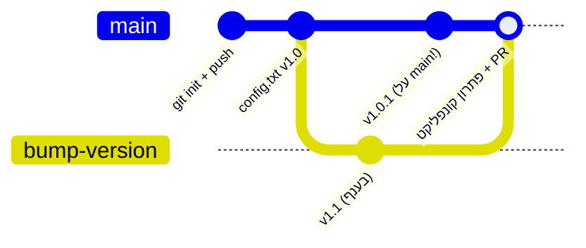

## מה זה?

זהו הפרויקט המסכם של יחידת Git: לא פקודה חדשה, אלא **זרימת עבודה מלאה** שמחברת את כל מה שנלמד — repository מקומי (Basics), remote ב-GitHub עם Pull Request (GitHub), וענף נפרד עם מיזוג שכולל קונפליקט אמיתי (Branches & Merge) — בדיוק כמו שעובדים על פרויקט אמיתי בעבודה, מההתחלה ועד הסוף.

## מילות מפתח שחשוב לזכור

• Repository מקומי → Remote → GitHub — סדר הפעולות: `git init` מקומי, `git remote add`/`git push` כדי לחבר ולשלוח ל-GitHub

• Feature Branch Workflow — כל שינוי משמעותי קורה על ענף נפרד, לא ישירות על `main`

• Pull Request (PR) — בקשה ב-GitHub למזג ענף לתוך `main`, עם אפשרות לסקירת קוד לפני המיזוג בפועל

• Merge Conflict — כששני מקורות (כאן: `main` וענף) שינו את אותן שורות; נפתר ידנית לפני שממשיכים

```bash
# הסדר המלא, בקצרה
git init                                  # 1. repository מקומי
git remote add origin <github-url>        # 2. חיבור ל-GitHub
git push -u origin main                   # 3. שליחה ראשונה
git switch -c feature-x                   # 4. ענף לשינוי חדש
# ... commits על הענף ...
git push -u origin feature-x              # 5. שליחת הענף ל-GitHub
# 6. פתיחת Pull Request באתר GitHub
# 7. מיזוג (עם פתרון קונפליקט אם צריך)
```



## הסבר עיקרי

מקומי קודם, מרוחק אחר-כך — כל repository מתחיל מקומי (`git init`, מיחידת Basics) — ה-commits הראשונים קיימים רק על המחשב שלכם. `git remote add origin <url>` מחבר אותו לרפוזיטורי ריק ב-GitHub, ו-`git push` שולח את ההיסטוריה לשם בפעם הראשונה. מהרגע הזה, אותו repository "חי" בשני מקומות: מקומית ובענן.

Pull Request הוא שכבה **מעל** merge, לא תחליף לו — אפשר למזג ענף ישירות מקומית (`git merge`, מיחידת Branches & Merge) בלי GitHub בכלל. Pull Request נותן משהו נוסף: שלב סקירה (Code Review) לפני שהמיזוג קורה בפועל — שימושי במיוחד כשעובדים בצוות, אבל אפשר וכדאי להתרגל אליו גם לבד.

קונפליקט לא משנה אם הוא קרה מקומית או דרך GitHub — העיקרון זהה: כששני מקורות שינו את אותן שורות, מישהו (אתם) צריך להחליט ידנית מה נכון. בין אם זה קרה ב-`git merge` מקומי ובין אם GitHub מודיע "This branch has conflicts" בממשק ה-PR — הפתרון זהה: לפתוח את הקובץ, לבחור/לשלב, ולסיים עם commit.

## יתרונות

זרימת עבודה מלאה (מקומי → remote → branch → PR → merge) היא בדיוק איך שעובדים בצוותי פיתוח אמיתיים; תרגול קונפליקט בסביבה מבוקרת בונה ביטחון לפני שהוא קורה "באמת" בעבודה; היסטוריה מלאה ב-GitHub נותנת גיבוי אמיתי, לא רק מקומי.

## חסרונות

זרימת עבודה מלאה עם GitHub דורשת יותר שלבים מ-commit מקומי בודד — לא תמיד נחוץ לפרויקט אישי קטן; קונפליקטים מורכבים (כמה קבצים, שינויים גדולים) יכולים לקחת זמן לפתור נכון גם עם ניסיון.

## נקודות חשובות למבחן / ראיון עבודה

• הסדר הנכון: repository מקומי → `git remote add` → `git push` → GitHub

• Pull Request מוסיף שלב סקירה מעל `git merge` הרגיל — לא מנגנון שונה במהותו

• קונפליקט נפתר באותו אופן בין אם קרה מקומית או דרך ממשק GitHub

• Feature Branch Workflow — `main` תמיד יציב; כל שינוי קורה על ענף נפרד עד שהוא מוכן ונסקר

## טעויות נפוצות

• לבצע `git push` ישירות מ-`main` בלי ענף נפרד ובלי PR, גם בפרויקט צוותי

• לשכוח `-u` בפעם הראשונה (`git push -u origin <branch>`) — הפקודות הבאות לא "זוכרות" לאן לדחוף

• לפאניקה כש-GitHub מציג "This branch has conflicts with the base branch" — זה בדיוק אותו קונפליקט שכבר תרגלתם מקומית, רק בממשק אחר

• למחוק ענף מקומי לפני שהוא באמת מוזג (מקומית או דרך PN שאושר)

## סיכום

הפרויקט המסכם מדגים את מלוא מחזור החיים של שינוי בקוד: repository מקומי עם `git init`, חיבור ל-GitHub עם `remote`/`push`, עבודה על ענף נפרד כדי לא לסכן את `main`, ופתרון קונפליקט אמיתי — בין אם מקומית עם `git merge` ובין אם דרך Pull Request ב-GitHub. זו בדיוק זרימת העבודה שתשתמשו בה בכל פרויקט אמיתי מכאן והלאה בקורס.

## דוקומנטציה רשמית

[GitHub Docs — About Pull Requests](https://docs.github.com/en/pull-requests/collaborating-with-pull-requests/proposing-changes-to-your-work-with-pull-requests/about-pull-requests)

---

## תרגילים

### תרגיל 1 — חיבור repository מקומי ל-GitHub

**המטרה:** לתרגל את המעבר ממקומי למרוחק, בלי ענפים בינתיים.

**שלבים:**

1. צרו repository ריק חדש באתר GitHub (בלי README).
2. מקומית, בתיקייה חדשה:
   ```bash
   git init
   echo "# My Project" > README.md
   git add README.md
   git commit -m "Initial commit"
   ```
3. חברו ושלחו:
   ```bash
   git remote add origin <ה-URL שקיבלתם מ-GitHub>
   git push -u origin main
   ```

**בדיקה שהצלחתם:** רענון עמוד ה-repository ב-GitHub מציג את `README.md` שיצרתם, עם אותה הודעת commit שכתבתם מקומית.

### תרגיל 2 — ענף, שינוי, ו-Pull Request

**המטרה:** לתרגל את המסלול המלא מענף ועד PR מאושר.

**שלבים:**

1. צרו ענף חדש ועברו אליו:
   ```bash
   git switch -c add-info
   ```
2. הוסיפו שורה ל-`README.md`, ובצעו commit:
   ```bash
   git add README.md
   git commit -m "Add project info"
   ```
3. שלחו את הענף ל-GitHub:
   ```bash
   git push -u origin add-info
   ```
4. באתר GitHub, פתחו Pull Request מהענף `add-info` אל `main`, ולחצו "Merge".

**בדיקה שהצלחתם:** אחרי המיזוג ב-GitHub, הריצו מקומית `git switch main && git pull` — השורה שהוספתם מופיעה עכשיו גם ב-`main` המקומי שלכם.

---

## פרויקט מסכם

**המשימה:** דמו זרימת עבודה מלאה — מ-repository מקומי, דרך GitHub, ענף עם קונפליקט, ועד מיזוג סופי.

**שלבים:**

1. צרו repository חדש ב-GitHub, ושכפלו אותו מקומית (`git clone <url>`), או השתמשו ב-repository קיים מהתרגילים למעלה.
2. ב-`main`, ודאו שיש קובץ `config.txt` עם שורה אחת: `version=1.0`. אם אין, צרו ובצעו commit ושלחו ל-GitHub.
3. צרו ענף חדש ושנו את השורה ל-`version=1.1`, בצעו commit ושלחו את הענף:
   ```bash
   git switch -c bump-version
   # ערכו את config.txt כך שהשורה תהיה version=1.1
   git add config.txt
   git commit -m "Bump version to 1.1"
   git push -u origin bump-version
   ```
4. **בלי למזג עדיין** — חזרו ל-`main` ושנו את **אותה שורה בדיוק** לערך אחר, ובצעו commit ושלחו ישירות:
   ```bash
   git switch main
   # ערכו את config.txt כך שהשורה תהיה version=1.0.1
   git add config.txt
   git commit -m "Patch version to 1.0.1"
   git push
   ```
5. פתחו Pull Request מ-`bump-version` אל `main` באתר GitHub. GitHub יודיע על קונפליקט.
6. פתרו את הקונפליקט — או דרך "Resolve conflicts" בממשק GitHub, או מקומית:
   ```bash
   git switch main
   git merge bump-version
   # פתחו את config.txt, בחרו/שלבו את הערך הנכון, מחקו סימוני <<<< ==== >>>>
   git add config.txt
   git commit -m "Resolve version conflict"
   git push
   ```
7. מחקו את הענף שכבר מוזג:
   ```bash
   git branch -d bump-version
   git push origin --delete bump-version
   ```

**בדיקה שהצלחתם:** `config.txt` ב-`main` (גם מקומית וגם ב-GitHub) מכיל ערך יחיד וסופי, בלי סימוני קונפליקט; `git log --oneline` מראה את כל ה-commits כולל commit פתרון הקונפליקט; הענף `bump-version` כבר לא קיים לא מקומית ולא ב-GitHub.

## מה בפרק הבא

בפרק הבא נתחיל יחידה חדשה — **Server**. עד עכשיו כתבנו קוד JavaScript שרץ רק בדפדפן או ישירות דרך `node`. ביחידת Server נלמד להריץ JavaScript **כשרת** אמיתי — תוכנית שמאזינה לבקשות רשת ועונה עליהן, הבסיס לכל API ואפליקציית web אמיתית.
