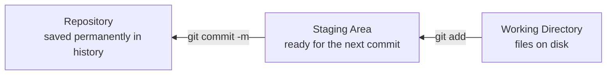

## מה זה?

Git הוא מערכת ניהול גרסאות (Version Control) ששומרת היסטוריה מלאה של כל שינוי בקוד — מי שינה, מה שונה, ומתי. הבעיה שנפתרת: בלי Git, גיבוי קוד נראה כמו `script_v1.js`, `script_v2_final.js`, `script_v2_final_REAL.js` — בלגן שלא מאפשר לדעת מה בדיוק השתנה בין גרסה לגרסה, ואין דרך בטוחה לחזור אחורה בלי לאבד עבודה.

## מילות מפתח שחשוב לזכור

• Repository (repo) — תיקיית פרויקט שעוקבת אחריה Git; מזוהה ע"י תיקיית `.git/` נסתרת

• Working Directory — הקבצים כפי שהם עכשיו על הדיסק, לפני שתיעדת אותם

• Staging Area — "אזור המתנה" לקבצים שסימנת (`git add`) לפני commit

• Commit — תמונת מצב (snapshot) קבועה של הפרויקט, עם הודעה שמסבירה מה השתנה ולמה

• `git status` — מציג אילו קבצים שונו ובאיזה שלב הם (Working / Staging)

• `git log` — היסטוריית ה-commits, מהחדש לישן

```bash
git init                    # creates a new repository in the folder
git add index.js            # adds a file to the Staging Area
git commit -m "first commit"
git log --oneline           # shows a condensed history
```



## הסבר עיקרי

שלושה שלבים, לא אחד — כל שינוי עובר דרך שלושה מצבים ברצף: Working Directory (ערכת בטיוטה) → Staging Area (`git add`, "מה ייכנס ל-commit הבא") → Repository (`git commit`, "נשמר לצמיתות בהיסטוריה"). ההפרדה בין Staging ל-Commit מאפשרת לבחור בדיוק אילו שינויים נכנסים יחד, גם אם שינית כמה קבצים במקביל.

למה commit קטן ותכוף עדיף — commit שמתעד שינוי אחד ברור ("הוספת תיקוף למייל") קל להבין, לבדוק ולבטל בנפרד. commit ענק שמערבב חמישה שינויים לא קשורים הופך את ההיסטוריה לבלתי שימושית — קשה לדעת מה בדיוק גרם לבאג שהתגלה מאוחר יותר.

הודעת commit כתיעוד — `git commit -m "..."` היא לא פורמליות — היא ההסבר שהצוות (וגם אתה, בעוד חצי שנה) יקרא כדי להבין למה שונה קוד. "fix bug" לא אומר כלום; "fix: validation email allowed empty string" כן.

## יתרונות

היסטוריה מלאה ובטוחה של כל שינוי — אפשר לחזור לכל נקודה בזמן; שיתוף פעולה בין כמה מפתחים על אותו קוד בלי לדרוס אחד את השני; תיעוד אוטומטי (מי שינה מה, מתי, ולמה) שלא תלוי בזיכרון של אף אחד.

## חסרונות

עקומת למידה בהתחלה — המושגים (Working/Staging/Repository) לא אינטואיטיביים מיד; שכחת `git add` לקובץ חדש לפני commit היא טעות שכיחה בהתחלה; פקודות שגויות (כמו reset לא זהיר) יכולות לאבד עבודה שלא נשמרה ב-commit.

## נקודות חשובות

• שלושה שלבים: Working Directory → Staging Area (`git add`) → Repository (`git commit`)

• `git status` מראה מה שונה ובאיזה שלב; `git log` מראה היסטוריית commits

• commit הוא תמונת מצב קבועה עם הודעה — לא ניתן לשנות בשקט אחרי ששותף

• תיקיית `.git/` היא ה-repository עצמו; מחיקתה מוחקת את כל ההיסטוריה

## טעויות נפוצות

• שכחת `git add` לקובץ חדש — הוא לא נכנס ל-commit גם אם שינית אותו

• הודעות commit עמומות ("update", "fix") שלא מסבירות כלום בעוד חודש

• commit אחד ענק שמערבב כמה שינויים לא קשורים — קשה לבטל חלק בלבד

• בלבול בין Working Directory (מה על הדיסק) ל-Staging Area (מה ייכנס ל-commit הבא)

## סיכום

Git שומר היסטוריה מלאה של פרויקט דרך שלושה שלבים: Working Directory, Staging Area, ו-Repository. `git add` מסמן קבצים ל-commit הבא; `git commit -m` שומר תמונת מצב קבועה עם הודעה. commits קטנים וממוקדים עם הודעות ברורות הופכים היסטוריה לכלי שימושי, לא רק לגיבוי.

## דוקומנטציה רשמית

[Git — Getting Started](https://git-scm.com/book/en/v2/Getting-Started-Git-Basics)

---

## תרגילים

### תרגיל 1 — Repo ראשון, שלב אחר שלב

**המטרה:** להרגיש בעצמכם את מחזור החיים הבסיסי: Working Directory → Staging → Commit.

**שלבים:**

1. פתחו טרמינל וצרו תיקייה חדשה:
   ```bash
   mkdir my-first-repo
   ```
2. היכנסו לתוכה:
   ```bash
   cd my-first-repo
   ```
3. הפכו אותה ל-Git repository:
   ```bash
   git init
   ```
4. צרו בתוכה קובץ בשם `hello.js` (בעורך הקוד שלכם) עם שורה אחת בפנים:
   ```javascript
   console.log("Hello Git");
   ```
5. בדקו מה Git "רואה" כרגע:
   ```bash
   git status
   ```
   אתם אמורים לראות את `hello.js` תחת "Untracked files" — Git מזהה שיש קובץ חדש, אבל עדיין לא עוקב אחריו.
6. הוסיפו את הקובץ ל-Staging Area:
   ```bash
   git add hello.js
   ```
7. הריצו `git status` שוב — עכשיו `hello.js` אמור להופיע תחת "Changes to be committed".
8. בצעו את ה-commit הראשון שלכם:
   ```bash
   git commit -m "Initial commit: add hello.js"
   ```

**בדיקה שהצלחתם:** הריצו `git log --oneline` — אמורה להופיע **שורה אחת** עם ה-commit שיצרתם.

### תרגיל 2 — commit שני, שלב אחר שלב

**המטרה:** לתרגל את אותו מחזור פעם נוספת, ולראות היסטוריה עם יותר מ-commit אחד.

**שלבים:**

1. פתחו את `hello.js` והוסיפו שורה נוספת בסופו:
   ```javascript
   console.log("Second line");
   ```
2. שמרו את הקובץ, ואז בדקו מה השתנה:
   ```bash
   git status
   ```
   הפעם `hello.js` אמור להופיע תחת "Changes not staged for commit" — כי הוא **כבר** נעקב (מה-commit הקודם), רק שהשתנה.
3. הוסיפו את השינוי ל-Staging:
   ```bash
   git add hello.js
   ```
4. בצעו commit שני, עם הודעה שמתארת בדיוק מה השתנה:
   ```bash
   git commit -m "Add second console.log line"
   ```

**בדיקה שהצלחתם:** הריצו `git log --oneline` — אמורות להופיע **שתי** שורות, אחת לכל commit.

### תרגיל 3 — status ו-diff, שלב אחר שלב

**המטרה:** להבין את ההבדל בין "מה שונה" (`status`) ל"איך בדיוק זה שונה" (`diff`).

**שלבים:**

1. שנו שורה קיימת ב-`hello.js` (למשל, שנו את הטקסט בתוך ה-`console.log` הראשון) — **בלי** לבצע commit.
2. הריצו:
   ```bash
   git status
   ```
   שימו לב: הוא אומר לכם **איזה קובץ** השתנה, אבל לא **מה בדיוק** השתנה בתוכו.
3. עכשיו הריצו:
   ```bash
   git diff
   ```
   הפעם אתם אמורים לראות את השורה הישנה (מסומנת ב-`-`) והשורה החדשה (מסומנת ב-`+`) — ההבדל המדויק.

**בדיקה שהצלחתם:** אתם יכולים להסביר במילים שלכם למה `status` ו-`diff` נותנים שתי רמות מידע שונות.

---

## פרויקט מסכם

**המשימה:** תעדו פרויקט mini קטן (2-3 קבצי JS) מההתחלה עם היסטוריית Git נקייה — שלב אחר שלב.

**שלבים:**

1. צרו תיקייה חדשה והפכו אותה ל-repository:
   ```bash
   mkdir mini-project
   cd mini-project
   git init
   ```
2. צרו קובץ `math.js` עם פונקציה בסיסית אחת (למשל `add(a, b)`). בצעו את ה-commit הראשון:
   ```bash
   git add math.js
   git commit -m "Add math.js with add() function"
   ```
3. הוסיפו לאותו קובץ פונקציה שנייה (למשל `subtract(a, b)`). בצעו commit שני, **נפרד** מהראשון:
   ```bash
   git add math.js
   git commit -m "Add subtract() function to math.js"
   ```
4. צרו קובץ חדש `main.js` שמייבא ומשתמש בפונקציות מ-`math.js`. בצעו commit שלישי:
   ```bash
   git add main.js
   git commit -m "Add main.js that uses math functions"
   ```
5. תקנו טעות קטנה כלשהי (למשל שם משתנה) באחד הקבצים. בצעו commit רביעי, שמתאר את התיקון:
   ```bash
   git add .
   git commit -m "Fix variable naming in main.js"
   ```

**בדיקה שהצלחתם:** הריצו `git log --oneline` — אמורות להופיע **4 שורות נפרדות**, כל אחת עם הודעה שמסבירה בבירור מה השתנה באותו commit ספציפי (לא "update" או "fix" סתמי).

---

## מה בפרק הבא

בפרק הבא נלמד על **GitHub** — בשיעור הקודם למדנו ש-Git שומר היסטוריית שינויים מלאה — אבל שימו לב: כל ה-`.git/` הזה נמצא **רק** על המחשב שלכם. אם המחשב נשבר או נגנב, כל ההיסטוריה נעלמת יחד איתו. וגם: אם רוצים לעבוד על אותו קוד עם ע
