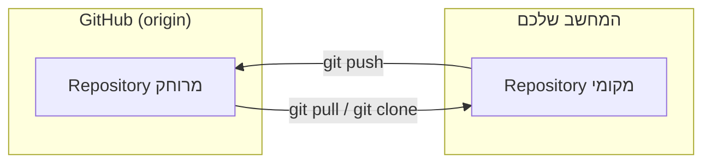

## מה זה?

בשיעור הקודם למדנו ש-Git שומר היסטוריית שינויים מלאה — אבל שימו לב: כל ה-`.git/` הזה נמצא **רק** על המחשב שלכם. אם המחשב נשבר או נגנב, כל ההיסטוריה נעלמת יחד איתו. וגם: אם רוצים לעבוד על אותו קוד עם עוד מפתחים, איך בדיוק שולחים להם את ה-Repository שלכם? GitHub הוא אתר (ושירות) שפותר את שתי הבעיות האלה: הוא מארח עותק של ה-Repository שלכם ב"ענן" (בשרתים שלו) — עותק שאפשר לגבות אליו, לשתף, ולעבוד עליו מכמה מחשבים.

## מילות מפתח שחשוב לזכור

• Remote (Repository מרוחק) — עותק של ה-Repository שיושב במקום אחר, לרוב על שרת של GitHub

• `origin` — השם שגיט נותן **כברירת מחדל** ל-Remote הראשי שאיתו עובדים

• `git clone <url>` — מוריד עותק מלא של Repository מ-GitHub למחשב שלכם, כולל כל ההיסטוריה

• `git push` — שולח commits שביצעתם **מקומית** אל ה-Remote (GitHub)

• `git pull` — מביא שינויים חדשים **מה-Remote** (GitHub) למחשב שלכם

• README.md — קובץ טקסט מיוחד שמוצג אוטומטית בעמוד הראשי של Repository ב-GitHub, בדרך כלל מסביר מה הפרויקט עושה

• `.gitignore` — קובץ שרושמים בו אילו קבצים/תיקיות Git **צריך להתעלם מהם** ולא לעקוב אחריהם (למשל, קבצי סיסמאות)

```bash
git clone https://github.com/example/my-project.git   # מוריד את כל הפרויקט מ-GitHub
git push origin main    # שולח את ה-commits שלי ל-GitHub
git pull origin main    # מביא שינויים חדשים שאחרים שלחו ל-GitHub
```



## הסבר עיקרי

מקומי (Local) מול מרוחק (Remote) — עד עכשיו כל מה שעשינו קרה על ה-Repository **המקומי** (על המחשב שלכם בלבד). GitHub הוא Remote — עותק **נוסף** של אותו Repository, שיושב על שרת. `git push` ו-`git pull` הם הדרך "לסנכרן" בין השניים: push שולח את השינויים שלכם החוצה, pull מביא שינויים של אחרים פנימה.

מאיפה מגיע השם `origin`? — כשעושים `git clone`, Git קורא אוטומטית ל-Remote שממנו הורדתם `origin` — זה סתם שם נוח (אפשר לשנות, אבל כמעט תמיד משאירים כך). זו הסיבה שרואים `git push origin main` כל כך הרבה — "שלח ל-Remote בשם origin, לענף (branch) בשם main".

README כברוכים-הבאים — כשמישהו נכנס לעמוד ה-Repository שלכם ב-GitHub, קובץ `README.md` מוצג אוטומטית מתחת לרשימת הקבצים — זה כרטיס הביקור של הפרויקט: מה הוא עושה, איך מתקינים אותו, איך מריצים אותו.

.gitignore למה שלא צריך לעקוב — לא כל קובץ בתיקיית הפרויקט שייך ב-Git: תיקיית `node_modules` (ספריות מותקנות, אפשר לשחזר בקלות), קבצי `.env` (סיסמאות/מפתחות סודיים — **אסור** שיעלו ל-GitHub הפומבי!), וקבצי מערכת של המחשב. `.gitignore` הוא רשימה של תבניות קבצים ש-Git "מדלג" עליהן לגמרי — לא Working Directory, לא Staging, לא Commit.

## יתרונות

גיבוי אמיתי — גם אם המחשב נהרס, הקוד וההיסטוריה שלמים ב-GitHub; שיתוף פעולה עם מפתחים אחרים בלי לשלוח קבצים ידנית; תיק עבודות (portfolio) ציבורי שמעסיקים בודקים.

## חסרונות

שכחת `.gitignore` יכולה לגרום להעלאת סיסמאות/מפתחות בטעות לפומבי; `git push`/`git pull` דורשים חיבור אינטרנט; עבודה עם כמה מפתחים על אותם קבצים דורשת תיאום (נלמד בשיעור הבא — Branches).

## נקודות חשובות למבחן / ראיון עבודה

• `git clone` מוריד Repository שלם מ-GitHub, כולל היסטוריה

• `origin` הוא השם שניתן אוטומטית ל-Remote הראשי לאחר `clone`

• `push` שולח שינויים מקומיים החוצה; `pull` מביא שינויים מרוחקים פנימה

• `.gitignore` מונע מ-Git לעקוב אחרי קבצים מסוימים — קריטי לסודות ולקבצים גדולים

## טעויות נפוצות

• העלאת קובץ `.env` עם סיסמאות ל-GitHub כי שכחו להוסיף אותו ל-`.gitignore`

• ניסיון ל-`push` בלי `pull` קודם, וקבלת שגיאת "עדכונים נדחו" כי ה-Remote כבר השתנה

• בלבול בין Repository מקומי (על המחשב) ל-Remote (על GitHub) — הם לא תמיד מסונכרנים אוטומטית

## סיכום

GitHub מארח עותק Remote של ה-Repository שלכם בענן — לגיבוי ולשיתוף פעולה. `git clone` מוריד עותק מלא; `git push`/`git pull` מסנכרנים בין המקומי למרוחק. README.md מציג תיאור לפרויקט; `.gitignore` מונע מקבצים רגישים או מיותרים להיכנס למעקב.

## דוקומנטציה רשמית

[GitHub Docs — Getting started](https://docs.github.com/en/get-started)

---

## תרגילים

### תרגיל 1 — יצירת Repository ב-GitHub, שלב אחר שלב

**המטרה:** להבין את הקשר בין Repository ב-GitHub (Remote) לעותק על המחשב שלכם (Local).

**שלבים:**

1. היכנסו ל-github.com והתחברו לחשבון שלכם.
2. לחצו על "New repository" (או "+", ואז "New repository").
3. תנו לו שם, למשל `my-github-practice`, וסמנו "Add a README file".
4. לחצו "Create repository" — עכשיו יש לכם Repository ב-GitHub, אבל **עדיין אין** אותו על המחשב.
5. בעמוד ה-Repository, לחצו על הכפתור הירוק "Code" והעתיקו את הכתובת (URL) שמופיעה.
6. בטרמינל, במיקום שבו תרצו את הפרויקט, הריצו (הדביקו את ה-URL שהעתקתם):
   ```bash
   git clone https://github.com/YOUR-USERNAME/my-github-practice.git
   ```
7. היכנסו לתיקייה שנוצרה:
   ```bash
   cd my-github-practice
   ```

**בדיקה שהצלחתם:** הריצו `ls` (או `dir` ב-Windows) — אתם אמורים לראות את קובץ ה-`README.md` שכבר קיים, כי הוא הגיע מ-GitHub דרך ה-`clone`.

### תרגיל 2 — push ראשון, שלב אחר שלב

**המטרה:** לראות שינוי "נוסע" מהמחשב שלכם בחזרה ל-GitHub.

**שלבים:**

1. בתוך אותה תיקייה (`my-github-practice`), צרו קובץ חדש בשם `notes.txt` עם משפט כלשהו בפנים.
2. הוסיפו אותו ל-Staging ובצעו commit:
   ```bash
   git add notes.txt
   git commit -m "Add notes.txt"
   ```
3. שלחו את ה-commit ל-GitHub:
   ```bash
   git push origin main
   ```
4. חזרו לעמוד ה-Repository שלכם ב-GitHub בדפדפן, ורעננו את הדף.

**בדיקה שהצלחתם:** קובץ `notes.txt` אמור להופיע ברשימת הקבצים ב-GitHub — הוכחה שה-`push` באמת שלח את השינוי.

### תרגיל 3 — .gitignore, שלב אחר שלב

**המטרה:** לוודא שקבצים מסוימים לעולם לא נכנסים למעקב של Git.

**שלבים:**

1. באותה תיקייה, צרו קובץ בשם `.gitignore` (כן, עם נקודה בהתחלה, בלי שם לפני).
2. פתחו אותו והוסיפו שתי שורות:
   ```
   *.log
   node_modules
   ```
3. עכשיו צרו קובץ בדיקה בשם `debug.log` עם תוכן כלשהו.
4. הריצו:
   ```bash
   git status
   ```

**בדיקה שהצלחתם:** `debug.log` **לא** אמור להופיע ב-`git status` בכלל — `.gitignore` מסתיר אותו מ-Git לגמרי, כאילו הוא לא קיים.

---

## פרויקט מסכם

**המשימה:** העלו פרויקט קיים ל-GitHub עם תיעוד נקי — שלב אחר שלב.

**שלבים:**

1. בטרמינל, בתוך תיקיית פרויקט קיימת (או צרו חדשה עם `mkdir`/`cd`), הריצו `git init` אם עוד לא עשיתם.
2. צרו קובץ `.gitignore` עם השורות:
   ```
   node_modules
   .env
   ```
3. צרו (או עדכנו) `README.md` עם כותרת ותיאור קצר של הפרויקט:
   ```markdown
   # שם הפרויקט

   תיאור קצר של מה שהפרויקט עושה.
   ```
4. בצעו commit ראשון עם שני הקבצים האלה:
   ```bash
   git add .gitignore README.md
   git commit -m "Add README and .gitignore"
   ```
5. היכנסו ל-github.com, צרו Repository חדש **בלי** README (כי כבר יש לכם אחד מקומית) — השאירו את "Add a README file" **לא** מסומן.
6. העתיקו את הפקודות שמופיעות בעמוד תחת "…or push an existing repository from the command line" והריצו אותן בטרמינל — הן ייראו בערך כך:
   ```bash
   git remote add origin https://github.com/YOUR-USERNAME/YOUR-REPO.git
   git branch -M main
   git push -u origin main
   ```
7. עשו שינוי קטן נוסף (למשל, הוסיפו שורה ל-README), ובצעו commit ו-push שני:
   ```bash
   git add README.md
   git commit -m "Update README with more details"
   git push
   ```

**בדיקה שהצלחתם:** רעננו את עמוד ה-Repository ב-GitHub — אמורים לראות את `README.md`, את `.gitignore`, ולפחות **2 commits** בהיסטוריה (לחצו על "commits" בעמוד כדי לוודא).

---

## מה בפרק הבא

בפרק הבא נלמד על **Branches & Merge** — עד עכשיו, כל ה-commits שלנו נכנסו לאותו "קו זמן" יחיד. אבל תארו לעצמכם צוות של 3 מפתחים שכולם עובדים ישירות על אותו קו זמן בו-זמנית: קוד חצי-גמור ושבור של אחד היה מופיע מיד אצל כולם. **Branch (ענף)** 
