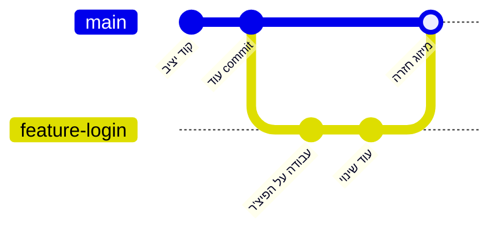

## מה זה?

עד עכשיו, כל ה-commits שלנו נכנסו לאותו "קו זמן" יחיד. אבל תארו לעצמכם צוות של 3 מפתחים שכולם עובדים ישירות על אותו קו זמן בו-זמנית: קוד חצי-גמור ושבור של אחד היה מופיע מיד אצל כולם. **Branch (ענף)** הוא הפתרון: קו-פיתוח **עצמאי ונפרד**, שמאפשר לעבוד על שינוי (למשל, פיצ'ר חדש) בלי לגעת בקוד היציב, עד שהעבודה מוכנה — ואז **ממזגים (Merge)** אותה בחזרה.

## מילות מפתח שחשוב לזכור

• Branch (ענף) — קו-פיתוח עצמאי; commits שנעשים עליו לא משפיעים על ענפים אחרים עד שממזגים

• `main` (או `master`) — שם הענף הראשי, ה"ברירת מחדל", שאמור להכיל תמיד קוד יציב

• `git branch <name>` — יוצר ענף חדש (בלי לעבור אליו)

• `git switch <name>` (או `git checkout <name>`) — עובר לענף אחר

• `git merge <name>` — ממזג את השינויים מהענף הנתון לתוך הענף שאתם נמצאים עליו כרגע

• Merge Conflict (התנגשות מיזוג) — כששני ענפים שינו את **אותן שורות בדיוק**, ו-Git לא יכול להחליט איזה שינוי "נכון" — נדרשת התערבות ידנית

```bash
git branch feature-login      # יוצר ענף חדש בשם feature-login
git switch feature-login      # עובר לענף החדש
# ... כותבים קוד, מבצעים commits, כרגיל ...
git switch main               # חוזרים ל-main
git merge feature-login       # ממזגים את השינויים מ-feature-login לתוך main
```



## הסבר עיקרי

למה זה בטוח לעבוד על ענף — כל commit שמבצעים על `feature-login` **קיים רק שם** — `main` לא רואה אותו בכלל, עד שמבצעים `merge` במפורש. זה נותן חופש לנסות, לטעות, ולתקן, בלי סיכון לקוד היציב שכולם תלויים בו.

מה קורה בפועל ב-merge — כשעומדים על `main` ומריצים `git merge feature-login`, Git לוקח את כל ה-commits שנוספו על `feature-login` (מאז שהוא "התפצל" מ-`main`) ומוסיף אותם ל-`main`. אם שני הענפים לא נגעו באותן שורות קוד, המיזוג קורה אוטומטית וללא בעיות.

Merge Conflict כשיש התנגשות אמיתית — אם שני הענפים שינו **אותה שורה בדיוק** בצורה שונה, Git לא יכול לנחש איזו גרסה נכונה — הוא עוצר את המיזוג ומסמן את הקובץ עם שני הגרסאות זו לצד זו. התפקיד שלכם: לפתוח את הקובץ, לבחור (או לשלב) ידנית מה נכון, ואז לבצע commit שמסיים את המיזוג.

מחיקת ענף אחרי מיזוג — אחרי ש-`feature-login` מוזג בהצלחה ל-`main`, אין יותר צורך בו — נהוג למחוק אותו (`git branch -d feature-login`) כדי לשמור על רשימת ענפים נקייה.

## יתרונות

מאפשר לכמה אנשים לעבוד במקביל בלי להתנגש; `main` נשאר יציב תמיד, גם כשעובדים על שינויים גדולים; קל "לזרוק" ענף שלם אם רעיון לא הצליח, בלי להשפיע על שאר הפרויקט.

## חסרונות

Merge Conflicts יכולים להיות מבלבלים ומלחיצים למתחילים; ענפים ישנים ולא-ממוזגים שנשארים לאורך זמן קשה לעקוב אחריהם; שכחה לעבור לענף הנכון (`git switch`) לפני commit גורמת ל-commit "במקום הלא נכון".

## נקודות חשובות למבחן / ראיון עבודה

• Branch הוא קו-פיתוח עצמאי; commits עליו לא משפיעים על ענפים אחרים עד merge

• `main`/`master` הוא הענף שאמור להכיל תמיד קוד יציב

• Merge Conflict קורה כששני ענפים שינו את אותן שורות בדיוק — דורש פתרון ידני

• `git switch` (או `git checkout`) עובר בין ענפים; `git branch` יוצר ענף חדש בלי לעבור אליו

## טעויות נפוצות

• ביצוע commits ישירות על `main` במקום ליצור ענף נפרד לפיצ'ר חדש

• שכחה על איזה ענף נמצאים כרגע (`git status` תמיד מראה את זה בשורה הראשונה)

• פאניקה כש-Merge Conflict מופיע — זה חלק נורמלי מהעבודה, לא שגיאה קטלנית

• מחיקת ענף **לפני** שהוא מוזג בהצלחה, ואיבוד העבודה שעליו

## סיכום

Branch הוא קו-פיתוח עצמאי שמאפשר לעבוד על שינוי בלי לסכן את `main` היציב. `git branch`/`git switch` יוצרים ועוברים בין ענפים; `git merge` משלב שינויים בחזרה. Merge Conflict קורה כששני ענפים שינו אותן שורות, ודורש בחירה ידנית — חלק רגיל מעבודת צוות, לא תקלה.

## דוקומנטציה רשמית

[Git — Branches in a Nutshell](https://git-scm.com/book/en/v2/Git-Branching-Branches-in-a-Nutshell)

---

## תרגילים

### תרגיל 1 — ענף ראשון, שלב אחר שלב

**המטרה:** להוכיח לעצמכם שעבודה על ענף באמת "לא נראית" ב-`main` עד שממזגים.

**שלבים:**

1. בתוך repository קיים עם לפחות commit אחד, צרו ענף חדש:
   ```bash
   git branch feature-test
   ```
2. עברו אליו:
   ```bash
   git switch feature-test
   ```
3. צרו קובץ חדש בשם `feature.txt` עם תוכן כלשהו.
4. הוסיפו ובצעו commit:
   ```bash
   git add feature.txt
   git commit -m "Add feature.txt on feature-test branch"
   ```
5. עברו חזרה ל-`main`:
   ```bash
   git switch main
   ```
6. הריצו `ls` (או `dir`).

**בדיקה שהצלחתם:** `feature.txt` **לא** אמור להופיע ב-`main` בכלל — ה-commit קיים רק על `feature-test`.

### תרגיל 2 — merge בלי קונפליקט, שלב אחר שלב

**המטרה:** לראות איך שינוי "עובר" מהענף בחזרה ל-`main`.

**שלבים:**

1. ודאו שאתם על `main`:
   ```bash
   git status
   ```
   (השורה הראשונה אמורה לומר "On branch main")
2. מזגו את `feature-test` פנימה:
   ```bash
   git merge feature-test
   ```
3. הריצו `ls` שוב.

**בדיקה שהצלחתם:** הפעם `feature.txt` **כן** מופיע — המיזוג הביא את השינוי מהענף אל `main`.

### תרגיל 3 — יצירה והבנה של Merge Conflict, שלב אחר שלב

**המטרה:** לחוות קונפליקט אמיתי בסביבה בטוחה, ולראות שהוא לא מפחיד כשמבינים מה קורה.

**שלבים:**

1. ודאו שאתם על `main` עם קובץ `shared.txt` שמכיל שורה אחת: `"original line"`. אם אין לכם כזה, צרו אותו ובצעו commit קודם.
2. צרו וצאו לענף ראשון:
   ```bash
   git switch -c branch-a
   ```
3. שנו את השורה ב-`shared.txt` ל-`"changed by A"`, ובצעו commit:
   ```bash
   git add shared.txt
   git commit -m "Change line from branch-a"
   ```
4. חזרו ל-`main`, וצרו ענף שני **מ-main** (לא מ-branch-a!):
   ```bash
   git switch main
   git switch -c branch-b
   ```
5. שנו את **אותה שורה בדיוק** ב-`shared.txt`, הפעם ל-`"changed by B"`, ובצעו commit:
   ```bash
   git add shared.txt
   git commit -m "Change line from branch-b"
   ```
6. חזרו ל-`main` ומזגו את הענף הראשון — זה אמור לעבוד חלק:
   ```bash
   git switch main
   git merge branch-a
   ```
7. עכשיו נסו למזג גם את השני:
   ```bash
   git merge branch-b
   ```

**מה אמור לקרות:** Git יעצור ויודיע על CONFLICT. פתחו את `shared.txt` — תראו שני בלוקים מסומנים עם `<<<<<<<`, `=======`, ו-`>>>>>>>`. בחרו איזו גרסה נכונה (או שלבו את שתיהן), מחקו את סימוני ה-`<<<`/`===`/`>>>`, ואז:
```bash
git add shared.txt
git commit -m "Resolve merge conflict in shared.txt"
```

**בדיקה שהצלחתם:** `git log --oneline` מראה commit שמסיים את המיזוג, ו-`shared.txt` מכיל את הגרסה הסופית שבחרתם — בלי סימוני קונפליקט שנשארו בטעות.

---

## פרויקט מסכם

**המשימה:** דמו זרימת עבודה מלאה של פיצ'ר עם ענף נפרד — שלב אחר שלב.

**שלבים:**

1. ב-repository קיים (או חדש עם `git init`), צרו `app.js` עם שורה בסיסית אחת, ובצעו commit ראשוני:
   ```bash
   git add app.js
   git commit -m "Initial commit: basic app.js"
   ```
2. צרו ועברו לענף פיצ'ר:
   ```bash
   git switch -c feature-greeting
   ```
3. הוסיפו ל-`app.js` פונקציה חדשה, למשל `function greet(name) { return "Hi " + name; }`. בצעו commit ראשון על הענף:
   ```bash
   git add app.js
   git commit -m "Add greet() function"
   ```
4. שפרו את הפונקציה (למשל, הוסיפו ברירת מחדל לפרמטר). בצעו commit **שני**, נפרד, על אותו ענף:
   ```bash
   git add app.js
   git commit -m "Add default parameter to greet()"
   ```
5. חזרו ל-`main` ומזגו את הענף:
   ```bash
   git switch main
   git merge feature-greeting
   ```
6. ודאו שהמיזוג הצליח (`app.js` על `main` מכיל עכשיו את `greet`), ואז מחקו את הענף שכבר לא נחוץ:
   ```bash
   git branch -d feature-greeting
   ```

**בדיקה שהצלחתם:** `git log --oneline` על `main` מראה את כל ה-commits (כולל השניים מהענף), ו-`git branch` (בלי `-d`) כבר לא מציג את `feature-greeting` ברשימה — הוא נמחק אחרי שנוצל בהצלחה.

---

## מה בפרק הבא

בפרק הבא — **פרויקט מסכם ליחידת Git**: זרימת עבודה מלאה מ-repository מקומי, דרך GitHub, ענף עם קונפליקט אמיתי, ועד Pull Request ומיזוג סופי.
