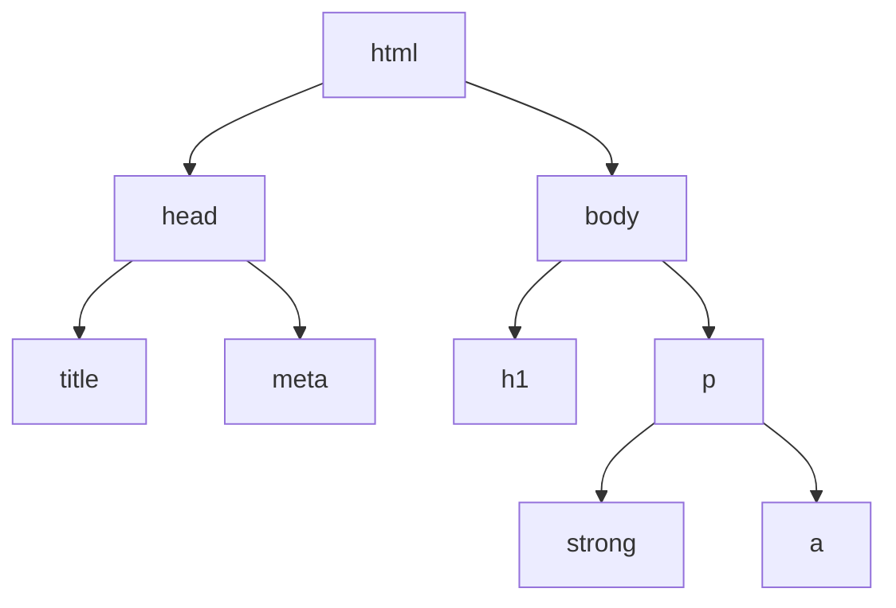

## מה זה?

עד עכשיו כל הקורס עסק ב"מאחורי הקלעים" — לוגיקה, שרתים, מסדי נתונים. אבל מה בעצם **רואה** משתמש כשהוא פותח דף אינטרנט בדפדפן? **HTML** (HyperText Markup Language) היא שפת התיוג שבונה את השלד של כל עמוד: כותרות, פסקאות, קישורים, תמונות — כל אלמנט חזותי שאתם רואים באתר מתחיל כתגית HTML. זו לא שפת תכנות (אין בה לוגיקה, תנאים, לולאות) — היא שפת **מבנה**: מתארת מה יש בעמוד ומה תפקיד כל חלק בו.

## מילות מפתח שחשוב לזכור

• Element (אלמנט) — יחידת בנייה בסיסית ב-HTML: תג פתיחה, תוכן, ותג סגירה (למשל `<p>טקסט</p>`)

• Tag (תגית) — הסימון עצמו, כמו `<p>` (פתיחה) ו-`</p>` (סגירה)

• Attribute (תכונה) — מידע נוסף על אלמנט, בתוך תג הפתיחה (למשל `<a href="...">`)

• Nesting (קינון) — אלמנטים יכולים להכיל אלמנטים אחרים בתוכם, ויוצרים היררכיה (עץ)

• DOM (Document Object Model) — הייצוג הפנימי שהדפדפן בונה מה-HTML, כעץ של אובייקטים — זה מה ש-JavaScript "מדבר" איתו כדי לשנות עמוד (נלמד בהמשך)

```html
<!DOCTYPE html>
<html lang="he" dir="rtl">
  <head>
    <meta charset="UTF-8" />
    <title>My Page</title>
  </head>
  <body>
    <h1>Welcome</h1>
    <p>This is a <strong>paragraph</strong> with a link <a href="https://example.com">here</a>.</p>
  </body>
</html>
```



## הסבר עיקרי

מבנה בסיסי של כל מסמך — `<!DOCTYPE html>` אומר לדפדפן "זה מסמך HTML5 מודרני". `<html>` הוא השורש שמכיל הכל; `<head>` מכיל מטא-מידע **על** העמוד (כותרת, קידוד תווים) שלא מוצג ישירות למשתמש; `<body>` מכיל את כל מה שבאמת **רואים** בעמוד.

Nesting יוצר עץ, לא רשימה שטוחה — הדיאגרמה למעלה מראה את זה במפורש: `<p>` מכיל בתוכו `<strong>` ו-`<a>` — אלמנטים "בתוך" אלמנטים אחרים. ה-DOM (שנראה בפירוט כשנגיע ל-JavaScript DOM) הוא בדיוק העץ הזה — כל תג הופך ל"צומת" (node) בעץ, עם הורים וילדים.

Attribute כמידע נוסף על התג — `href="https://example.com"` בתוך `<a>` הוא Attribute: הוא לא חלק מהתוכן המוצג (המילה "לכאן"), אלא מידע **נוסף** על התג — לאן הקישור מוביל. תגים שונים תומכים ב-Attributes שונים (`` צריך `src`, `<a>` צריך `href`).

## יתרונות

תחביר פשוט וקריא — כל תג מתאר בבירור את תפקידו; נתמך אוניברסלית בכל דפדפן; משמש כבסיס שכל טכנולוגיית frontend אחרת (CSS, JavaScript, React) בונה עליו.

## חסרונות

HTML לבדו לא מטפל בעיצוב חזותי (זה תפקיד CSS, בשיעורי היחידה הבאה) ולא באינטראקטיביות (זה תפקיד JavaScript); שכחת תג סגירה או קינון שגוי יכולים לשבור את מבנה העמוד בשקט, בלי שגיאה גלויה.

## נקודות חשובות

• Element = תג פתיחה + תוכן + תג סגירה; Attribute = מידע נוסף בתוך תג הפתיחה

• `<head>` מכיל מטא-מידע שלא מוצג; `<body>` מכיל את התוכן המוצג בפועל

• HTML בונה היררכיה (עץ) דרך קינון — לא רשימה שטוחה

• DOM הוא הייצוג הפנימי שהדפדפן בונה מה-HTML, כעץ אובייקטים

## טעויות נפוצות

• שכחת תג סגירה (`</p>` חסר) — הדפדפן "מנחש" איפה הוא אמור להיות, לפעמים בצורה לא-צפויה

• קינון שגוי (למשל `<p>` שמכיל `<div>`) — `<div>` הוא אלמנט "בלוקי" ו-`<p>` לא אמור להכיל אותו

• בלבול בין Attribute (בתוך תג הפתיחה) לתוכן האלמנט (בין תג הפתיחה לסגירה)

## סיכום

HTML היא שפת התיוג שבונה את מבנה עמוד האינטרנט: Elements מקוננים זה בתוך זה יוצרים עץ היררכי, ש-`<head>`/`<body>` מחלקים למטא-מידע מול תוכן מוצג. Attributes נותנים מידע נוסף על תגים ספציפיים. ה-DOM הוא הייצוג הפנימי של העץ הזה שהדפדפן בונה — ומה ש-JavaScript ישנה בהמשך הקורס.

## דוקומנטציה רשמית

[MDN — HTML Basics](https://developer.mozilla.org/en-US/docs/Learn/Getting_started_with_the_web/HTML_basics)

---

## תרגילים

### תרגיל 1 — מסמך HTML ראשון

**המשימה:** צרו קובץ `index.html` עם מבנה בסיסי מלא (`<!DOCTYPE>`, `<html>`, `<head>` עם `<title>`, `<body>` עם כותרת `<h1>` ופסקה `<p>`).

**בדיקה:** פתיחת הקובץ בדפדפן מציגה את הכותרת בכרטיסייה (מה-`<title>`) ואת ה-`<h1>`/`<p>` בעמוד עצמו.

### תרגיל 2 — קינון וקישורים

**המשימה:** הוסיפו לפסקה קיימת קישור (`<a>`) עם `href` לאתר חיצוני, וטקסט מודגש (`<strong>`) בתוך אותה פסקה.

**בדיקה:** לחיצה על הקישור בדפדפן פותחת את הכתובת שהגדרתם; הטקסט המודגש מוצג בפונט שונה (בד"כ bold).

### תרגיל 3 — שרטוט עץ DOM

**המשימה:** קחו מסמך HTML קטן (5-6 תגיות מקוננות) ושרטטו (בטקסט או mermaid `flowchart`) את עץ ה-DOM שלו.

**בדיקה:** הדיאגרמה שלכם משקפת נכון מי-הורה-של-מי — כל תג "יורד" מתחת לתג שמכיל אותו.

---

## פרויקט מסכם

**המשימה:** בנו עמוד "אודות" אישי בסיסי, רק עם HTML (בלי CSS עדיין).

**דרישות:**
1. מבנה מסמך מלא ותקין (`<!DOCTYPE>`, `<html>`, `<head>`, `<body>`)
2. כותרת ראשית (`<h1>`) עם השם שלכם
3. לפחות 2 פסקאות עם תוכן (אחת יכולה לכלול קישור וטקסט מודגש)
4. קינון תקין — בלי תגיות "פרוצות" (בלי סגירה) או קינון שגוי

**בדיקה:** פתיחת הקובץ בדפדפן מציגה את כל התוכן כמצופה, בלי שגיאות רינדור מוזרות שמעידות על HTML שבור.

---

## מה בפרק הבא

בפרק הבא נלמד על **Semantic HTML** — בשיעור הקודם השתמשנו ב-`<div>` בהקשר כללי — "קופסה" גנרית בלי משמעות. אבל דמיינו עמוד עם 10 `<div>`-ים: איך תדעו איזה מהם הוא התפריט הראשי, איזה התוכן העיקרי, ואיזה footer? לתוכנת קורא-מסך (עבור משתמש
