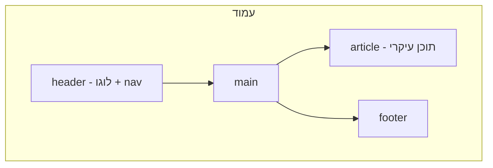

## מה זה?

בשיעור הקודם השתמשנו ב-`<div>` בהקשר כללי — "קופסה" גנרית בלי משמעות. אבל דמיינו עמוד עם 10 `<div>`-ים: איך תדעו איזה מהם הוא התפריט הראשי, איזה התוכן העיקרי, ואיזה footer? לתוכנת קורא-מסך (עבור משתמשים עיוורים) או למנוע חיפוש (Google) זה בלתי אפשרי לדעת מ-`<div>` גנרי. **Semantic HTML** הוא שימוש בתגיות שמתארות **את התפקיד** של התוכן — `<nav>`, `<main>`, `<article>` — לא רק "קופסה".

## מילות מפתח שחשוב לזכור

• Semantic Element (אלמנט סמנטי) — תג שהשם שלו מתאר את **תפקיד** התוכן שבתוכו, לא רק מיכל גנרי

• `<header>` — כותרת עליונה של עמוד או סקשן (לוגו, ניווט ראשי)

• `<nav>` — אזור ניווט (תפריט קישורים)

• `<main>` — התוכן העיקרי והייחודי של העמוד (רק אחד לעמוד)

• `<article>` / `<section>` — `<article>` = תוכן עצמאי שעומד בפני עצמו (כמו פוסט בבלוג); `<section>` = קיבוץ נושאי כללי יותר בתוך העמוד

• `<footer>` — כותרת תחתונה (זכויות יוצרים, קישורים נוספים)

• Accessibility (נגישות) — היכולת של כל משתמש, כולל עם מוגבלויות, להשתמש באתר; תגיות סמנטיות הן אבן יסוד בנגישות

```html
<body>
  <header>
    <nav><a href="/">בית</a> <a href="/about">אודות</a></nav>
  </header>
  <main>
    <article>
      <h1>כותרת המאמר</h1>
      <p>תוכן המאמר...</p>
    </article>
  </main>
  <footer>
    <p>© 2026 כל הזכויות שמורות</p>
  </footer>
</body>
```



## הסבר עיקרי

למה לא רק `<div>` עם class — אפשר בהחלט לכתוב `<div class="nav">` במקום `<nav>`. אבל תוכנת קורא-מסך לא "יודעת" מה `class="nav"` אומר — היא רק מבינה תגיות סמנטיות תקניות. `<nav>` אומר לה במפורש "זה איזור ניווט", ומאפשר למשתמש עיוור לדלג ישר אליו בלי לעבור על כל התוכן. זה בדיוק מה ש-Semantic HTML נותן ש-`<div>` גנרי לא נותן.

article מול section — ההבדל: `<article>` הוא תוכן שיכול "לעמוד בפני עצמו" גם אם מוציאים אותו מהעמוד (למשל, פוסט בלוג שאפשר לשתף כקישור נפרד). `<section>` הוא קיבוץ נושאי רחב יותר בתוך העמוד (למשל, "אזור הסקירות" בעמוד מוצר) — לא בהכרח עומד לבד. אם מתלבטים, שאלו: "האם התוכן הזה הגיוני כפריט RSS עצמאי?" — אם כן, זה `<article>`.

SEO ונגישות הולכים יחד — מנועי חיפוש (Google) משתמשים באותן תגיות סמנטיות כדי להבין מה **חשוב** בעמוד (`<main>`) ומה משני (`<nav>`, `<footer>`) — עמוד עם Semantic HTML נכון בדרך כלל מדורג טוב יותר בחיפוש, **בנוסף** לנגישות טובה יותר — אותו שינוי קוד נותן שני יתרונות.

## יתרונות

נגישות משמעותית לכלי קריאה עבור משתמשים עם מוגבלויות; SEO טוב יותר — מנועי חיפוש מבינים את מבנה התוכן; קוד קריא יותר גם למפתחים — `<nav>` ברור יותר מ-`<div class="nav">`.

## חסרונות

דורש מחשבה נוספת בבחירת התג הנכון (`article` מול `section` לפעמים לא חד-משמעי); לא כל דפדפן/כלי ישן תומך בכל התגיות הסמנטיות באותה מידה (נדיר היום, אך שווה לדעת).

## נקודות חשובות למבחן / ראיון עבודה

• Semantic HTML משתמש בתגיות שמתארות תפקיד (`nav`, `main`, `article`) במקום `div` גנרי

• `<main>` אמור להופיע **פעם אחת** בעמוד — התוכן הייחודי המרכזי

• `<article>` = עומד בפני עצמו; `<section>` = קיבוץ נושאי כללי יותר

• Semantic HTML משפר גם נגישות (קוראי מסך) וגם SEO (מנועי חיפוש) בו-זמנית

## טעויות נפוצות

• שימוש ב-`<div>` בכל מקום, גם כשקיימת תגית סמנטית מתאימה (`<nav>`, `<header>`) — מוותרים על נגישות ו-SEO בחינם

• יותר מ-`<main>` אחד בעמוד — שובר את הציפייה שהוא "התוכן הייחודי" היחיד

• בלבול בין `<section>` ל-`<div>` — `<section>` דורש בדרך כלל כותרת (`<h2>` וכו') שמתארת אותו, לא כל קיבוץ ויזואלי

## סיכום

Semantic HTML משתמש בתגיות שמתארות **תפקיד** תוכן (`header`, `nav`, `main`, `article`, `section`, `footer`) במקום `<div>` גנרי. זה משפר משמעותית נגישות (קוראי מסך) ו-SEO (מנועי חיפוש) — שני יתרונות מאותו שינוי קוד. `<main>` מופיע פעם אחת; `<article>` עומד בפני עצמו, `<section>` הוא קיבוץ נושאי.

## דוקומנטציה רשמית

[MDN — HTML Semantic Elements](https://developer.mozilla.org/en-US/docs/Glossary/Semantics#semantics_in_html)

---

## תרגילים

### תרגיל 1 — המרת div לסמנטי

**המשימה:** קחו עמוד HTML פשוט עם `<div class="header">`, `<div class="nav">`, `<div class="footer">`, והמירו אותם לתגיות סמנטיות מתאימות.

**בדיקה:** העמוד נראה זהה חזותית (אין CSS משנה עדיין), אבל התגיות עכשיו הן `<header>`, `<nav>`, `<footer>`.

### תרגיל 2 — article מול section

**המשימה:** בנו עמוד בלוג פשוט עם 2 פוסטים. עטפו כל פוסט ב-`<article>`, ואת "אזור התגובות" הכללי (אם יש) ב-`<section>`.

**בדיקה:** כל `<article>` יכול לעמוד "בפני עצמו" (יש לו כותרת ותוכן משלו); ה-`<section>` מקבץ תוכן נושאי בלי להיות "עצמאי" כמו article.

### תרגיל 3 — מבנה עמוד מלא

**המשימה:** בנו עמוד עם `<header>` (עם `<nav>` בתוכו), `<main>` יחיד, ו-`<footer>`.

**בדיקה:** יש בדיוק `<main>` אחד בעמוד; `<nav>` מקונן בתוך `<header>`, לא עצמאי.

---

## פרויקט מסכם

**המשימה:** המירו את עמוד ה-"אודות" מהפרויקט הקודם (HTML Basics) למבנה Semantic HTML מלא.

**דרישות:**
1. `<header>` עם `<nav>` (קישורים לחלקי העמוד או עמודים אחרים)
2. `<main>` יחיד שעוטף את התוכן המרכזי
3. לפחות `<section>` אחד (למשל "כישורים" או "תחביבים") עם כותרת `<h2>`
4. `<footer>` עם מידע נוסף (למשל, פרטי יצירת קשר)

**בדיקה:** פתיחת הקובץ בדפדפן מציגה את כל התוכן; בדיקה ב-DevTools (Elements tab) מראה מבנה סמנטי ברור — `header`/`nav`/`main`/`section`/`footer` כתגיות אמיתיות, לא `div`-ים עם class.

---

## מה בפרק הבא

בפרק הבא נלמד על **Images & Media** — עד עכשיו כל התוכן שלנו היה טקסט. אבל רוב האתרים כוללים תמונות, ולפעמים וידאו או אודיו. HTML נותן תגיות ייעודיות לכל אחד מהם: `` לתמונות, `<video>` לוידאו, `<audio>` לאודיו — כל אחת עם תכונות (Att
