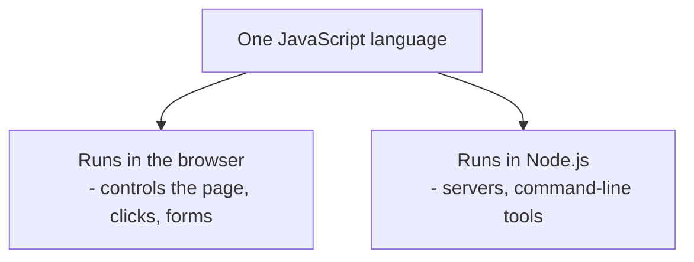

## מה זה?

JavaScript היא שפת תכנות דינמית ו-interpreted (מתפרשת) שרצה בדפדפן וגם בשרת (דרך Node.js). "דינמית" אומר שמשתנה יכול להחזיק כל סוג ערך ולהחליף סוג במהלך הריצה; "interpreted" אומר שהקוד רץ ישירות בלי שלב קימפול נפרד לפני ההרצה, בניגוד לשפות כמו Java או C++.

## מילות מפתח שחשוב לזכור

• Dynamic Typing — משתנה לא "נעול" לסוג ערך אחד; אפשר להחליף סוג באמצע הריצה

• Interpreted — הקוד רץ ישירות, בלי שלב build/compile נפרד לפני ההרצה

• Case-sensitive — `myVar` ו-`myvar` הם שני שמות שונים לגמרי

• Statement — שורת פעולה (`let x = 5;`); Expression — קטע קוד שמניב ערך (`5 + 3`)

• `console.log()` — הדפסה ל-console; הכלי הבסיסי ביותר לבדיקת ערכים

• Comment — `// שורה בודדת` או `/* כמה שורות */`; לא מתבצע, רק תיעוד

```javascript
console.log("Hello, World!"); // runs in both the browser and Node.js

let x = 5;
x = "now it's a string"; // Dynamic Typing — no error
```



## הסבר עיקרי

איפה JavaScript רצה — בדפדפן, JS שולט על מה שקורה בעמוד (לחיצות, טפסים, שינויי תוכן). ב-Node.js, אותה שפה בדיוק רצה מחוץ לדפדפן — בשרתים, בכלי שורת-פקודה, בסקריפטים. זו אותה שפה, שני סביבות ריצה שונות.

Dynamic מול Static Typing — בשפה Static (כמו Java), חייבים להצהיר את סוג המשתנה מראש והוא לא משתנה. ב-JS, `let x` יכול להחזיק מספר, ואז מחרוזת, ואז object — בלי שגיאה. זה נותן גמישות, אך גם מאפשר טעויות שבשפה static היו נתפסות מיד.

Interpreted, לא Compiled — קוד JS לא עובר שלב build לקובץ הרצה נפרד לפני שהוא רץ (בניגוד לשפות compiled). הוא רץ ישירות דרך מנוע JS (V8 בכרום/Node). זו הסיבה שאפשר לבדוק שינוי קוד מיד, בלי המתנה לקימפול.

## יתרונות

רצה בכל מקום — דפדפן, שרת, אפליקציות מובייל; אין שלב build שמעכב בדיקה מהירה של שינויים; אקוסיסטם ענק של ספריות וכלים; קל להתחיל — לא דורש התקנת סביבה מורכבת כדי לכתוב שורת קוד ראשונה.

## חסרונות

Dynamic Typing מאפשר טעויות שבשפה static היו נתפסות בזמן קימפול; מספר דרכים שונות לבצע אותו דבר (למשל, סוגי הצהרת פונקציה) עלול לבלבל מתחילים; היסטוריית השפה יצרה כמה התנהגויות לא-אינטואיטיביות (כמו `==` מול `===`) שצריך ללמוד.

## נקודות חשובות

• JavaScript היא Single-threaded — מבצעת פקודה אחת בכל רגע נתון

• Dynamic Typing = משתנה יכול להחליף סוג ערך; לא נבדק בזמן קימפול

• Interpreted = אין שלב build נפרד; הקוד רץ ישירות

• JS רצה גם בדפדפן וגם ב-Node.js — אותה שפה, שני environments

• השפה case-sensitive לחלוטין — `Name` ו-`name` הם שני משתנים

## טעויות נפוצות

• ציפייה שהשפה תזרוק שגיאה כששינו סוג משתנה — Dynamic Typing מאפשר את זה בכוונה

• בלבול בין `console.log` (הדפסה לבדיקה) לבין `return` (החזרת ערך מפונקציה)

• הנחה מוטעית ש-JS שרצה בדפדפן שונה במהותה מ-JS שרצה ב-Node.js

• שגיאות case-sensitivity — קריאה למשתנה בשם דומה אך לא זהה

## סיכום

JavaScript היא שפה דינמית ו-interpreted שרצה גם בדפדפן וגם בשרת (Node.js) — אותה שפה, שני סביבות ריצה. Dynamic Typing נותן גמישות במחיר בדיקות שנדחות לזמן ריצה. `console.log` הוא הכלי הראשון לבדיקת קוד; הבנה זו היא הבסיס לכל שאר הקורס.

## דוקומנטציה רשמית

[MDN — JavaScript Guide](https://developer.mozilla.org/en-US/docs/Web/JavaScript/Guide)

---

## תרגילים

### תרגיל 1 — Hello World

**המשימה:** הדפיסו לקונסול שני דברים, כל אחד בשורה נפרדת: את המשפט `"Hello, World!"`, ואז את השם שלכם.

**דוגמת פלט:**
```
Hello, World!
Dana
```

**בדיקה:** מריצים את הקובץ ורואים בדיוק שתי שורות בקונסול, בסדר הזה.

### תרגיל 2 — Dynamic Typing

**המשימה:** הוכיחו לעצמכם ש-JavaScript מאפשרת למשתנה להחליף סוג ערך בלי שגיאה.

**דרישות:**
- הצהירו על משתנה עם ערך מספרי, והדפיסו אותו
- שנו את **אותו משתנה** לערך ממחרוזת, והדפיסו אותו שוב

**בדיקה:** שתי ההדפסות מצליחות בלי שום שגיאה — פעם מספר, פעם מחרוזת, על אותו משתנה.

### תרגיל 3 — הערות

**המשימה:** כתבו קובץ עם שני סוגי הערות: הערת `//` בסוף שורת קוד כלשהי שמסבירה אותה, ובלוק הערה `/* ... */` בתחילת הקובץ שמסביר במשפט-שניים מה הקובץ עושה.

**בדיקה:** הרצת הקובץ נותנת פלט זהה עם וגם בלי ההערות — הן קיימות רק לקוראים אנושיים.

---

## פרויקט מסכם

**המשימה:** כתבו סקריפט קטן שמדפיס "כרטיס ביקור" אישי לקונסול, ומדגים שמשתנה `let` ניתן לעדכון.

**דרישות:**
1. `const` עבור שם (מחרוזת), `let` עבור גיל (מספר)
2. הדפסת משפט שמשלב את שניהם: `"שם: X, גיל: Y"`
3. הערה מעל הקוד שמסבירה מה הקובץ עושה
4. עדכון הגיל לערך חדש בהמשך הקובץ, והדפסת אותו משפט שוב

**בדיקה:** הריצו את הקובץ — מופיעים **שני** משפטים, אותו שם, גיל שונה בשני. זו הוכחה חיה שעדכון `let` עובד.

---

## מה בפרק הבא

בפרק הבא נלמד על **Variables** — משתנה הוא שם שנותנים לתא זיכרון כדי לשמור ערך ולהשתמש בו שוב מאוחר יותר בקוד. הבעיה שנפתרת: בלי משתנים, כל ערך היה צריך להיות כתוב ישירות בקוד (hardcoded) בכל מקום שהוא נדרש — קלט מהמשתמש, תוצאת חישוב
