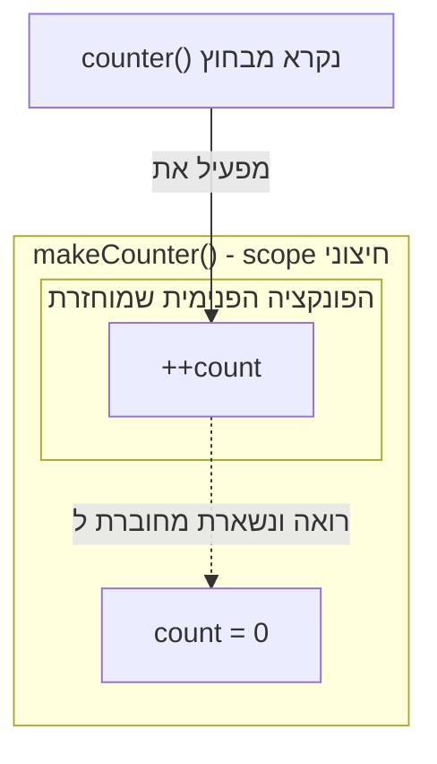

## מה זה?

Closure הוא פונקציה שזוכרת את המשתנים מהסביבה (scope) שבה היא נוצרה — גם אחרי שהפונקציה החיצונית כבר סיימה לרוץ. הבעיה שנפתרת: פונקציה רגילה מתחילה "מאפס" בכל קריאה ולא יכולה לזכור ערך בין קריאה לקריאה; הפתרון האינטואיטיבי — משתנה גלובלי — פותר את הזיכרון אבל שובר את ההגנה, כי כל שורת קוד באפליקציה יכולה לשנות אותו.

## מילות מפתח שחשוב לזכור

• Lexical Scope — פונקציה "רואה" משתנים של הסביבה שבה **הוגדרה**, לא שבה **נקראה**

• Closure — פונקציה פנימית שמשמרת גישה לסביבת ה-scope שבה נוצרה

• Private State — משתנה שנגיש רק דרך הפונקציות שהוחזרו מה-closure, לא ישירות מבחוץ

• Scope Chain — שרשרת החיפוש של JS אחר משתנה, כלפי חוץ עד ה-global scope

```javascript
function makeCounter() {
  let count = 0;
  return () => ++count;
}
const counter = makeCounter();
counter(); // 1
counter(); // 2 — זוכר את count בין קריאות
```



## הסבר עיקרי

Lexical Scope כמנגנון — פונקציה פנימית (`inner`) תמיד רואה משתנים של הפונקציה החיצונית (`outer`) שבה היא **נכתבה** — זה חוק קבוע בשפה. Closure הוא התוצאה הישירה: אם `inner` מוחזרת החוצה, היא ממשיכה "לגרור" איתה גישה למשתנים של `outer`, גם אחרי ש-`outer` סיימה לרוץ.

Private State כתוצר לוואי — כש-`makeCounter()` מחזירה פונקציה בלי לחשוף את `count` עצמו, אין דרך לגשת אליו מבחוץ (`counter.count` הוא `undefined`). זו לא תכונה נפרדת — היא נובעת ישירות מ-Lexical Scope: רק הקוד שנכתב בתוך `makeCounter` רואה את `count`.

כל קריאה יוצרת closure עצמאי — `makeCounter()` נקראת פעמיים יוצרת שני counters נפרדים לגמרי, כל אחד עם `count` משלו. הם לא חולקים state — כל קריאה לפונקציה החיצונית פותחת סביבה (scope) חדשה ונפרדת.

## יתרונות

מאפשר private state בלי תחביר מיוחד; כל instance (קריאה לפונקציה החיצונית) מקבל state עצמאי משלו; פותר בעיה אמיתית של הגנה על מידע פנימי מפני שינוי בלתי מכוון מבחוץ.

## חסרונות

קל לצפות שפונקציה תיצור closure חדש אבל בטעות להשתמש שוב באותו closure קיים (ולהפך); שימוש מוגזם ב-closures מקוננים עמוק פוגע בקריאות.

## נקודות חשובות למבחן / ראיון עבודה

• Closure = פונקציה + הסביבה הלקסיקלית (lexical) שבה היא נוצרה

• Private state הוא תוצר לוואי של Lexical Scope, לא מנגנון נפרד

• כל קריאה לפונקציה חיצונית יוצרת closure עצמאי חדש — instances לא חולקים state

• פונקציה "רואה" משתנים לפי היכן היא **נכתבה**, לא היכן היא **נקראת**

## טעויות נפוצות

• ציפייה ש-`makeCounter()` "יזכור" בין קריאות נפרדות — כל קריאה חדשה יוצרת closure חדש ונפרד

• ניסיון לגשת ישירות למשתנה הפרטי (`counter.count`) וציפייה שהוא יהיה נגיש

• בלבול בין closure חדש (קריאה נוספת לפונקציה החיצונית) לשימוש חוזר באותו closure

## סיכום

Closure הוא פונקציה שזוכרת את ה-scope שבו נוצרה, גם אחרי שהפונקציה החיצונית סיימה לרוץ — תוצאה ישירה של Lexical Scope. כך state יכול להישאר פרטי ולא נגיש מבחוץ. כל קריאה לפונקציה החיצונית יוצרת closure עצמאי חדש, עם state נפרד משלו.

## דוקומנטציה רשמית

[MDN — Closures](https://developer.mozilla.org/en-US/docs/Web/JavaScript/Closures)

---

## תרגילים

### תרגיל 1 — counter

**המשימה:** כתבו פונקציה `makeCounter()` שמחזירה פונקציה חדשה; בכל קריאה לפונקציה המוחזרת, מונה פנימי עולה ב-1 והערך החדש מוחזר.

**בדיקה:** `const counter = makeCounter(); counter(); counter(); counter();` — הקריאה השלישית מחזירה `3`.

### תרגיל 2 — שני counters עצמאיים

**המשימה:** צרו שני counters נפרדים, שניהם מ-`makeCounter()` (מהתרגיל הקודם). הפעילו את הראשון 3 פעמים ואת השני פעם אחת בלבד.

**בדיקה:** ה-counter הראשון מגיע ל-`3`; השני מגיע ל-`1` בלבד — הוכחה שהם לא חולקים אותו מונה.

### תרגיל 3 — private state

**המשימה:** נסו לגשת ישירות למונה הפנימי של counter מבחוץ, למשל `counter.count`.

**בדיקה:** התוצאה היא `undefined` — המונה הפנימי לא נגיש בשום דרך מלבד קריאה ל-`counter()` עצמה. הסבירו במשפט אחד למה (רמז: Lexical Scope).

---

## פרויקט מסכם

**המשימה:** בנו `makeBankAccount(initialBalance)` עם יתרה פרטית.

**דרישות:**
1. משתנה `balance` פנימי (מאותחל ל-`initialBalance`), לא נגיש ישירות מבחוץ
2. הפונקציה מחזירה object עם שלוש מתודות: `deposit(amount)` (מוסיפה ל-`balance`), `withdraw(amount)` (מורידה מ-`balance`), `getBalance()` (מחזירה את היתרה הנוכחית)
3. `withdraw` **לא** מאפשרת יתרה שלילית — אם הסכום המבוקש גדול מהיתרה, היא מחזירה הודעת שגיאה במקום לבצע את המשיכה
4. צרו 2 חשבונות נפרדים מ-`makeBankAccount`, כדי להוכיח שהיתרות שלהם עצמאיות

**בדיקה:** הפקדה ומשיכה על חשבון אחד לא משפיעות על היתרה של השני; ניסיון משיכה שגדולה מהיתרה **לא** מוריד את היתרה מתחת ל-0.

---

## מה בפרק הבא

בפרק הבא נלמד על **Factory Functions** — Factory Function היא פונקציה רגילה שיוצרת ומחזירה object חדש בכל קריאה. הבעיה שנפתרת: כתיבת אותו object ידנית בכל פעם (למשל, 50 משתמשים) היא שכפול קוד ושבירה — צריך דרך ליצור אובייקטים דומים במבנה אך 
