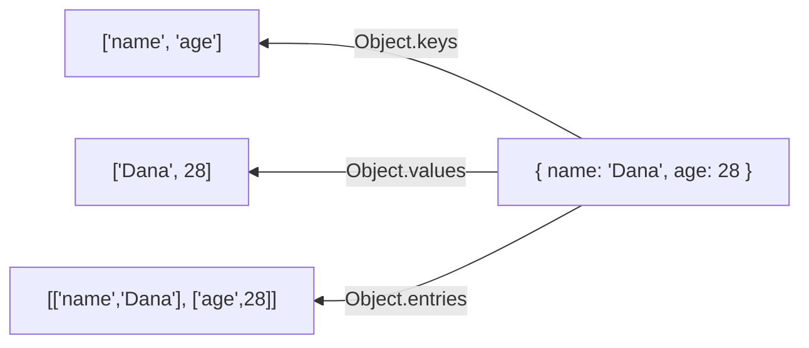

## מה זה?

מתודות Object הן פונקציות סטטיות מובנות (`Object.keys`, `Object.values`, `Object.entries`, `Object.assign`) שפועלות על אובייקטים — לאיטרציה, בדיקה, ומיזוג. הבעיה שנפתרת: אובייקט אינו מערך, ולכן מתודות המערך (`map`/`filter`) שנלמדו קודם לא עובדות עליו ישירות — צריך דרך "לגשר" בין השניים.

## מילות מפתח שחשוב לזכור

• `Object.keys(obj)` — מחזיר מערך של כל מפתחות ה-Object

• `Object.values(obj)` — מחזיר מערך של כל ערכי ה-Object

• `Object.entries(obj)` — מחזיר מערך של זוגות `[key, value]`

• `Object.assign(target, source)` — מעתיק תכונות ל-target; **משנה** את ה-target

• Spread (`{...obj}`) — מיזוג/שכפול ליצירת object חדש, בלי לשנות את המקור

• `"key" in obj` — בדיקת קיום מאפיין, מחזיר boolean

```javascript
const user = { name: "Dana", age: 28 };
Object.keys(user);    // ["name", "age"]
Object.values(user);  // ["Dana", 28]
Object.entries(user); // [["name","Dana"], ["age",28]]
```



## הסבר עיקרי

entries כגשר למתודות מערך — `Object.entries()` הופכת Object למערך זוגות `[key, value]` — בדיוק המבנה שמאפשר להשתמש ב-`map`/`filter` (משיעור קודם) על תוכן ה-Object, כלים שלא זמינים ישירות עליו.

assign מול spread — שתיהן מבצעות מיזוג שטחי, אך ההבדל קריטי: `Object.assign(target, source)` כותבת **לתוך** ה-target (mutating, אם הוא לא `{}` ריק); spread (`{...a, ...b}`) **תמיד** יוצרת object חדש ולא נוגעת במקורות — לכן היא המועדפת בקוד מודרני.

```javascript
const merged = { ...user, age: 29 }; // spread — לא נוגע ב-user
Object.assign(user, { age: 30 });    // assign — משנה את user עצמו!
```

`"key" in obj` לבדיקת קיום — לפני גישה לתכונה שאולי לא קיימת, `"email" in user` מחזיר `true`/`false` בלי לזרוק שגיאה — בטוח יותר מלנחש.

## יתרונות

מחליף איטרציה ידנית מסורבלת בכלים ממוקדים ובטוחים; spread מבטיח מיזוג בלי לפגוע במקור; `entries`/`keys`/`values` מגשרים ישירות למתודות מערך שכבר מוכרות.

## חסרונות

`Object.assign` בלי `{}` ריק כ-target משנה בטעות את המקור (mutation לא מכוון); בלבול בין `keys`/`values`/`entries` — לא זוכרים איזו מחזירה מה.

## נקודות חשובות למבחן / ראיון עבודה

• `Object.assign(target, source)` משנה את ה-target; spread תמיד יוצר object חדש

• `Object.entries()` הופכת Object למערך זוגות `[key, value]`

• `"key" in obj` בודק קיום מאפיין ומחזיר boolean

• `keys` מחזיר מפתחות, `values` מחזיר ערכים, `entries` מחזיר שניהם

## טעויות נפוצות

• קריאה ל-`Object.assign(base, extra)` בלי `{}` ריק ראשון — משנה בטעות את `base` המקורי

• בלבול בין `Object.keys`/`values`/`entries` — לא זוכרים איזו מחזירה מה

• שימוש ב-`for...in` (לא נלמד כאן) במקום `Object.keys` + `forEach`/`map`

## סיכום

`Object.keys`/`values`/`entries` הם הכלים היומיומיים לעיבוד אובייקטים ולגישור למתודות מערך. `Object.assign`/spread ממזגים; spread מועדף כי אינו פוגע במקור. `"key" in obj` בודק קיום מאפיין בבטחה.

## דוקומנטציה רשמית

[MDN — Object.entries()](https://developer.mozilla.org/en-US/docs/Web/JavaScript/Reference/Global_Objects/Object/entries)

---

## תרגילים

### תרגיל 1 — keys/values/entries

**המשימה:** בהינתן `const car = { brand: "Toyota", year: 2022 }`, הדפיסו בנפרד את `Object.keys(car)`, `Object.values(car)`, ו-`Object.entries(car)`.

**בדיקה:** שלוש שורות פלט: מערך מפתחות (`["brand","year"]`), מערך ערכים (`["Toyota",2022]`), ומערך זוגות (`[["brand","Toyota"],["year",2022]]`).

### תרגיל 2 — spread

**המשימה:** בהינתן `car` מהתרגיל הקודם, צרו object חדש בשם `updatedCar` שהוא עותק של `car` עם `year: 2023` בלבד שונה, באמצעות spread (`{ ...car, year: 2023 }`).

**בדיקה:** `updatedCar.year` הוא `2023`, אבל `car.year` **נשאר** `2022` — המקור לא השתנה.

### תרגיל 3 — in

**המשימה:** בדקו עם `"color" in car` אם ל-`car` יש תכונת `color` (עדיין אין). הוסיפו את התכונה (`car.color = "red"`) ובדקו שוב עם `in`.

**בדיקה:** הבדיקה הראשונה מחזירה `false`; אחרי ההוספה, הבדיקה השנייה מחזירה `true`.

---

## פרויקט מסכם

**המשימה:** בנו פונקציית `mergeSettings(defaults, overrides)` להגדרות אפליקציה.

**דרישות:**
1. הפונקציה משתמשת ב-spread למיזוג (`{ ...defaults, ...overrides }`) — **לא** ב-`Object.assign`, כדי לא לשנות אף אחד מהמקורות
2. כל תכונה שקיימת גם ב-`overrides` דורסת את הערך המקביל מ-`defaults`
3. תכונות שקיימות רק ב-`defaults` (ולא ב-`overrides`) נשמרות בתוצאה
4. השתמשו ב-`Object.entries` על התוצאה כדי להדפיס כל זוג כשורת `"key: value"`

**בדיקה:** `mergeSettings({ theme: "light", lang: "he" }, { theme: "dark" })` מחזירה object עם `theme: "dark"` ו-`lang: "he"` — ושני ה-objects המקוריים לא השתנו.

---

## מה בפרק הבא

בפרק הבא נלמד על **Closures** — Closure הוא פונקציה שזוכרת את המשתנים מהסביבה (scope) שבה היא נוצרה — גם אחרי שהפונקציה החיצונית כבר סיימה לרוץ. הבעיה שנפתרת: פונקציה רגילה מתחילה "מאפס" בכל קריאה ולא יכולה לזכור ערך בין קריאה לקריא
