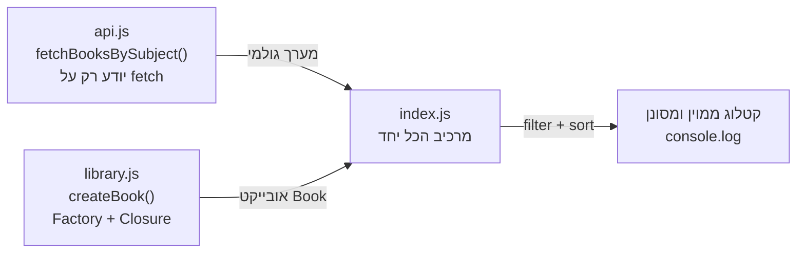

## מה זה?

זהו הפרויקט המסכם של יחידת JavaScript: לא מושג חדש, אלא **חיבור** של כל מה שנלמד ביחידה — משתנים, תנאים ולולאות, פונקציות, מערכים ואובייקטים, מתודות מערך (`map`/`filter`/`sort`), closures, factory functions, מודולים (`import`/`export`), קוד נקי, דיבאגינג, ו-`fetch`/`async`/`await` — לכדי **תוכנית עבודה אחת אמיתית**: קטלוג ספרים שנטען מ-API חיצוני. עדיין **בלי DOM ובלי שרת** (אלה יחידות נפרדות בהמשך) — הפלט הוא `console.log`, בדיוק כמו רוב היחידה.

## מילות מפתח שחשוב לזכור

• מודולים (ESM) — פיצול הפרויקט לכמה קבצים (`api.js`, `library.js`, `index.js`), כל אחד עם אחריות אחת, מחוברים עם `import`/`export`

• Factory Function — פונקציה שיוצרת ומחזירה אובייקט חדש בכל קריאה (`createBook(...)`), במקום לבנות אובייקטים ידנית בכל מקום

• Closure — משתנה "פרטי" (כמו מונה צפיות בספר) שנשאר חי בזיכרון בתוך הפונקציה שיצרה אותו, ונגיש רק דרך מתודות שהיא מחזירה

• מתודות מערך — `filter`/`map`/`sort` על מערך הספרים, כדי לחפש ולמיין בלי לולאת `for` ידנית

• `async`/`await` + `try`/`catch` — טעינת הנתונים מ-API אמיתי, עם טיפול נכון בשגיאת רשת

```javascript
// api.js — כל התקשורת עם ה-API במקום אחד
export async function fetchBooksBySubject(subject) {
  const res = await fetch(`https://openlibrary.org/subjects/${subject}.json?limit=10`);
  if (!res.ok) throw new Error(`שגיאת רשת: ${res.status}`);
  const data = await res.json();
  return data.works; // מערך של אובייקטי ספרים גולמיים מה-API
}
```

```javascript
// library.js — הלוגיקה של "הספרייה" עצמה, בלי לדעת כלום על fetch
export function createBook(rawWork) {
  let timesViewed = 0; // closure — "פרטי", לא נגיש מבחוץ

  return {
    title: rawWork.title,
    author: rawWork.authors?.[0]?.name ?? "לא ידוע",
    year: rawWork.first_publish_year ?? null,
    view() {
      timesViewed++;
      return `${this.title} (נצפה ${timesViewed} פעמים)`;
    },
  };
}
```



## הסבר עיקרי

מודולים מפרקים את הפרויקט לפי אחריות — `api.js` **לא יודע כלום** על מבנה "ספר" בפרויקט שלנו, הוא רק יודע לדבר עם ה-API החיצוני ולהחזיר מערך גולמי. `library.js` **לא יודע כלום** על `fetch` — הוא רק יודע להפוך אובייקט גולמי לאובייקט "ספר" מוכר. זו בדיוק החלוקה מיחידת Clean Code: כל קובץ עושה דבר אחד, וקל להחליף/לבדוק כל חלק בנפרד.

Factory + Closure יוצרים "ספר" עם זיכרון משלו — `createBook` (Factory Function, מיחידת Factories) בונה אובייקט חדש בכל קריאה, עם `timesViewed` שנשאר **פרטי** בזיכרון הפונקציה (Closure, מיחידת Closures) — קוד מחוץ ל-`createBook` לא יכול לגעת ב-`timesViewed` ישירות, רק דרך המתודה `view()` שהיא חושפת. זו בדיוק ההגנה על state פנימי שראינו ביחידת Closures.

async/await עוטף גישה לרשת אמיתית, עם שגיאות אמיתיות — בניגוד לדוגמאות המדומות בשיעורי Promises/Async, כאן ה-`fetch` פונה לשירות אמיתי (Open Library) שיכול **באמת** להיכשל (בלי אינטרנט, שירות למטה, שם נושא שגוי). `try`/`catch` סביב הקריאה ב-`index.js` הוא לא תרגיל תיאורטי — הוא ההבדל בין תוכנית שקורסת לתוכנית שמדפיסה הודעת שגיאה ברורה וממשיכה.

## נקודות חשובות למבחן / ראיון עבודה

• פרויקט אמיתי מפוצל למודולים לפי **אחריות**, לא באופן שרירותי — כל קובץ "יודע" דבר אחד

• Factory Function + Closure הם הדרך הנפוצה ב-JavaScript ליצור "אובייקטים עם state פרטי" בלי `class`

• `try`/`catch` סביב `await` הוא חובה בכל קוד שבאמת פונה לרשת, לא רק "נחמד שיהיה"

• `filter`/`map`/`sort` על מערך אובייקטים הם הכלי הראשון לחיפוש/מיון — לפני שחושבים על לולאת `for` ידנית

## טעויות נפוצות

• לתת ל-`api.js` "לדעת" על מבנה הספר בפרויקט — זה שובר את ההפרדה; `api.js` צריך להחזיר רק את הנתונים הגולמיים

• לשכוח `try`/`catch` סביב `await fetch(...)` — שגיאת רשת הופכת ל-unhandled rejection שמפילה את כל הפרויקט

• ליצור אובייקט "ספר" עם `{ ... }` ידני בכל מקום בקוד, במקום דרך `createBook` אחת — כפילות, וקל לשכוח שדה

• להשתמש בלולאת `for` ידנית לחיפוש/סינון/מיון, כשיש `filter`/`sort` מובנים שעושים בדיוק את זה בשורה אחת

## סיכום

הפרויקט המסכם מחבר את כל יחידת JavaScript לכדי תוכנית עבודה אחת: מודולים מפרקים את הקוד לפי אחריות, Factory + Closure בונים אובייקטי "ספר" עם state פרטי, מתודות מערך מחפשות וממיינות את הקטלוג, ו-`async`/`await` עם `try`/`catch` טוענים נתונים אמיתיים מ-API חיצוני בלי להפיל את התוכנית בשגיאת רשת. זו בדיוק סוג העבודה שממשיכה ביחידות הבאות — DOM (להציג את זה על מסך) ושרתים (לבנות API כזה בעצמכם).

## דוקומנטציה רשמית

[MDN — JavaScript Modules](https://developer.mozilla.org/en-US/docs/Web/JavaScript/Guide/Modules)

[Open Library — Subjects API](https://openlibrary.org/dev/docs/api/subjects)

---

## פרויקט מסכם

**המשימה:** בנו "מנהל קטלוג ספרים" שמשלב את כל מושגי יחידת JavaScript, מפוצל לשלושה מודולים.

**דרישות:**
1. `api.js` — פונקציית `async` אחת שקוראת ל-Open Library Subjects API (או כל API ציבורי חופשי אחר) ומחזירה מערך גולמי; זריקת שגיאה ברורה אם התגובה לא תקינה
2. `library.js` — `createBook(rawWork)` (Factory) שמחזיר אובייקט "ספר" עם `title`/`author`/`year` ומתודת `view()` שסופרת צפיות דרך Closure פרטי
3. `index.js` — קורא ל-`api.js`, הופך כל תוצאה ל"ספר" עם `library.js`, ושומר הכל במערך אחד
4. שימוש ב-`filter` להצגת ספרים משנה מסוימת ואילך, ו-`sort` למיון הקטלוג לפי שנה
5. `try`/`catch` סביב הקריאה האסינכרונית ב-`index.js`, עם הודעת שגיאה ברורה אם ה-API לא זמין

**בדיקה:** הרצת `index.js` (עם `node`) מדפיסה קטלוג ספרים אמיתי מה-API, ממוין וכולל רק תוצאות שעברו את הסינון; ניתוק האינטרנט (או שינוי כתובת ה-API לשגויה בכוונה) מדפיס הודעת שגיאה ברורה, לא קריסה עם stack trace גולמי; קריאה חוזרת ל-`view()` על אותו ספר מגדילה את המונה בכל פעם.

## מה בפרק הבא

בפרק הבא נתחיל יחידה חדשה לגמרי — **Git**. עד עכשיו כל הקוד שכתבנו חי רק על המחשב שלנו — אין דרך לשחזר גרסה קודמת אם שברנו משהו, ואין דרך לשתף את הפרויקט עם מישהו אחר בלי לשלוח קבצים ידנית. Git פותר בדיוק את זה: מערכת ניהול גרסאות ששומרת היסטוריה מלאה של כל שינוי, ומאפשרת שיתוף-פעולה אמיתי על אותו קוד.
