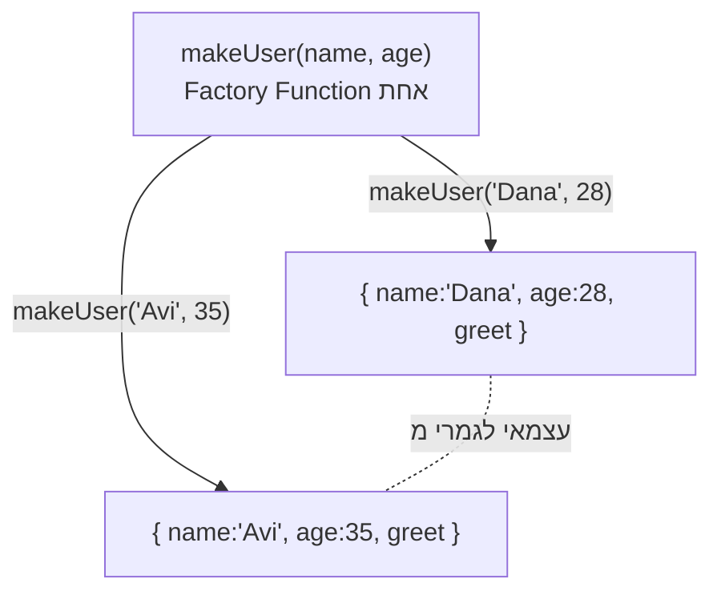

## מה זה?

Factory Function היא פונקציה רגילה שיוצרת ומחזירה object חדש בכל קריאה. הבעיה שנפתרת: כתיבת אותו object ידנית בכל פעם (למשל, 50 משתמשים) היא שכפול קוד ושבירה — צריך דרך ליצור אובייקטים דומים במבנה אך עם ערכים שונים, ולפעמים גם עם state פרטי שלא נגיש מבחוץ.

## מילות מפתח שחשוב לזכור

• Factory Function — פונקציה שמחזירה object חדש בכל קריאה

• Shorthand Property — כשמפתח ומשתנה נקראים אותו דבר: `{ name }` שקול ל-`{ name: name }`

• Composition — הרכבת יכולות מכמה מקורות לתוך object אחד (למשל דרך spread)

```javascript
function makeUser(name, age) {
  return {
    name, age,
    greet() { return `Hi, I'm ${name}`; },
  };
}
const u1 = makeUser("Dana", 28);
const u2 = makeUser("Avi", 35); // עצמאי לגמרי מ-u1
```



## הסבר עיקרי

Factory כפתרון ל"איך יוצרים הרבה objects דומים" — במקום לכתוב כל object ידנית, `makeUser(name, age)` מחזירה object חדש עם אותו מבנה בכל קריאה, וכל קריאה עצמאית לחלוטין מהאחרות (בדיוק כמו closures, בשיעור הקודם — בכל קריאה נפתחת סביבה חדשה).

Private State דרך Closure — כש-Factory משתמשת ב-closure (`let count = start` בתוך `makeCounter`), המשתנה הפנימי לא נגיש ישירות מבחוץ — רק דרך המתודות שהוחזרו. זה בדיוק אותו מנגנון שנלמד בשיעור Closures, כאן מיושם ליצירת objects.

```javascript
function makeCounter(start = 0) {
  let count = start; // private — לא נגיש מבחוץ
  return { inc: () => ++count, value: () => count };
}
const c = makeCounter();
c.count;   // undefined — לא נגיש ישירות
c.value(); // 0
```

Composition במקום שכפול — Factory מאפשרת "להרכיב" יכולות מכמה מקורות לתוך object אחד, למשל `{ ...canFly, ...canSwim }` — גישה גמישה לשילוב יכולות בלי מבנה היררכי מורכב.

## יתרונות

Private state טבעי בלי תחביר מיוחד; כל קריאה עצמאית עם state משלה; Composition (הרכבת יכולות) גמישה לשילוב תכונות שונות; מתאימה מצוין ל-utility objects פשוטים כמו counter, logger.

## חסרונות

יצירת אובייקטים רבים עם אותן מתודות בכל instance פחות יעילה בזיכרון בקנה מידה גדול מאוד; בלי תיעוד ברור, קשה לדעת מראש אילו תכונות ה-object יחזיר.

## נקודות חשובות למבחן / ראיון עבודה

• Factory Function מחזירה object חדש בכל קריאה, בלי מנגנון מיוחד

• Private state ב-Factory מגיע מ-closure — אותו מנגנון משיעור Closures

• Shorthand Property: `{ name }` זהה ל-`{ name: name }`

• כל קריאה ל-Factory יוצרת object עצמאי, לא משותף

## טעויות נפוצות

• חשיפת המשתנה הפרטי בטעות (למשל להחזיר גם `count` וגם `value()`) — מבטל את מטרת ה-private state

• בלבול בין Factory Function ל-Object Literal בודד — Object Literal הוא עותק יחיד, Factory יוצרת כמה שרוצים

• שינוי (mutate) ה-object שהועבר כפרמטר ל-Factory במקום להחזיר object חדש

## סיכום

Factory Function היא פונקציה רגילה שמחזירה object חדש בכל קריאה. שילוב עם closure נותן private state טבעי. Composition מרכיבה יכולות מכמה מקורות. כל קריאה ל-Factory עצמאית לגמרי מהאחרות — בדיוק כמו closures.

## דוקומנטציה רשמית

[MDN — Working with objects](https://developer.mozilla.org/en-US/docs/Web/JavaScript/Guide/Working_with_objects)

---

## תרגילים

### תרגיל 1 — Factory בסיסי

**המשימה:** כתבו `makeCar(brand, model)` שמחזירה object עם `brand`, `model`, ומתודה `describe()` שמחזירה `"<brand> <model>"`.

**בדיקה:** `makeCar("Toyota", "Corolla").describe()` מחזירה `"Toyota Corolla"`.

### תרגיל 2 — Private State

**המשימה:** כתבו `makeTimer()` עם משתנה `seconds` פרטי שמתחיל מ-`0`, ושתי מתודות: `tick()` (מוסיפה 1 ל-`seconds`) ו-`getSeconds()` (מחזירה את הערך הנוכחי).

**בדיקה:** `const t = makeTimer(); t.tick(); t.tick(); t.getSeconds();` מחזיר `2`.

### תרגיל 3 — Composition

**המשימה:** כתבו שני objects "יכולת" בסיסיים: `const canFly = { fly: () => "flying" }` ו-`const canSwim = { swim: () => "swimming" }`. הרכיבו אותם יחד ל-object `duck` בעזרת spread (`{ ...canFly, ...canSwim }`).

**בדיקה:** `duck.fly()` ו-`duck.swim()` שתיהן עובדות על אותו `duck`.

---

## פרויקט מסכם

**המשימה:** בנו מערכת "משתמשים" עם Factory Functions.

**דרישות:**
1. `makeUser(name, role)` מחזירה object עם `name`, `role`, ומתודה `hasPermission(action)` שמחזירה `true` אם `role === "admin"`, ו-`false` אחרת (בלי תלות ב-`action` עצמו — כל admin מורשה לכל פעולה, כל מי שאינו admin לא)
2. משתנה פרטי `loginCount` שמתחיל מ-`0`, ומתודה `login()` שמעלה אותו ב-1
3. מתודה `getLoginCount()` שמחזירה את הערך הנוכחי
4. צרו 2 משתמשים נפרדים מ-`makeUser`, קראו ל-`login()` על הראשון פעמיים ועל השני פעם אחת

**בדיקה:** `hasPermission` מחזירה תוצאה נכונה לפי ה-`role`; `getLoginCount()` של המשתמש הראשון מחזירה `2`, ושל השני `1` — עצמאיים לגמרי.

---

## מה בפרק הבא

בפרק הבא נלמד על **Modules (ESM)** — Modules מאפשרים חלוקת קוד JavaScript לקבצים נפרדים עם `import`/`export` ברור, כשכל Module הוא scope עצמאי שמשתנים ממנו לא דולפים לגלובל. הבעיה שנפתרת: קוד שלם בקובץ אחד ענק בלתי ניתן לתחזוקה — קשה למצ
