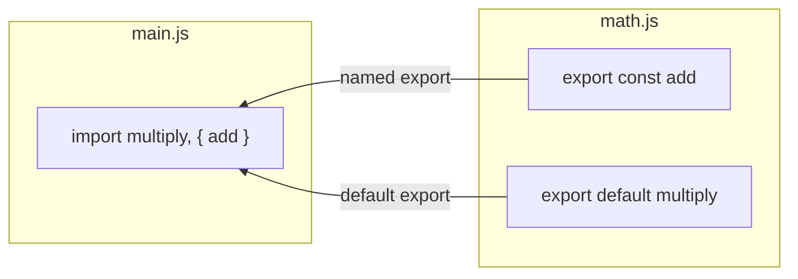

## מה זה?

Modules מאפשרים חלוקת קוד JavaScript לקבצים נפרדים עם `import`/`export` ברור, כשכל Module הוא scope עצמאי שמשתנים ממנו לא דולפים לגלובל. הבעיה שנפתרת: קוד שלם בקובץ אחד ענק בלתי ניתן לתחזוקה — קשה למצוא קוד, קשה להימנע מהתנגשות שמות בין קבצים.

## מילות מפתח שחשוב לזכור

• `export` — חושף פונקציה/קבוע מקובץ כלפי חוץ

• Named Export — `export const fn = ...`; אפשר כמה בקובץ אחד, ייבוא לפי שם מדויק

• `export default` — ייצוא ראשי, אחד בלבד לקובץ; המייבא בוחר את השם בעצמו

• `import { fn } from "./file"` — ייבוא לפי שם (named); `import fn from "./file"` — ייבוא default

```javascript
// math.js
export const add = (a, b) => a + b;
export default function multiply(a, b) { return a * b; }

// main.js
import multiply, { add } from "./math.js";
```



## הסבר עיקרי

Named מול Default — ההבדל המעשי: ב-Named export, המייבא **חייב** לדעת את השם המדויק (`import { add }`); ב-Default export, המייבא בוחר איך לקרוא לו (`import whatever from "./file"`). לכן Named exports מועדפים בקוד מודרני — ה-IDE יודע להשלים אוטומטית, וקל יותר לחפש קוד.

Scope מבודד לכל קובץ — משתנה שמוגדר בקובץ מודול לא "דולף" לקבצים אחרים אוטומטית — רק מה שמיוצא במפורש (`export`) נגיש מבחוץ. זה מונע התנגשות שמות בין קבצים שונים בפרויקט גדול.

הרבה קבצים קטנים, לא אחד ענק — במקום קובץ `app.js` עם 3000 שורות, מפרקים לקבצים ממוקדים (`math.js`, `validators.js`, `user.js`) שכל אחד אחראי לתחום אחד — קל יותר למצוא, לבדוק, ולתחזק.

## יתרונות

Scope מבודד לכל קובץ — משתנים לא דולפים לגלובל; ארגון קוד ברור לפי תחום אחריות; ניתוח סטטי מאפשר ל-IDE להשלים ולזהות שגיאות ייבוא מוקדם.

## חסרונות

יותר מדי קבצים קטנים מדי עלול להקשות ניווט; `export default` יכול לגרום לשמות שונים לאותו ייבוא בקבצים שונים בצוות — פוגע בעקביות.

## נקודות חשובות למבחן / ראיון עבודה

• Named export — כמה בקובץ, ייבוא בשם מדויק; Default export — אחד בקובץ, המייבא בוחר שם

• Modules מבודדים scope — משתנה לא נגיש מבחוץ בלי `export` מפורש

• `import`/`export` הם התקן המודרני (ESM) לחלוקת קוד לקבצים

## טעויות נפוצות

• שכחת `export` על פונקציה שמנסים לייבא מקובץ אחר

• ניסיון לייבא `{ fn }` (named) כשהפונקציה יוצאה כ-`export default`

• בלבול בין שם הקובץ לשם הפונקציה המיוצאת ב-default export

## סיכום

Modules מחלקים קוד לקבצים עצמאיים עם `import`/`export` ברור, כל אחד עם scope מבודד. Named exports מועדפים על Default — ברורים יותר ותומכים ב-IDE autocomplete. חלוקה נכונה לקבצים לפי תחום אחריות הופכת פרויקט גדול לניתן לתחזוקה.

## דוקומנטציה רשמית

[MDN — import](https://developer.mozilla.org/en-US/docs/Web/JavaScript/Reference/Statements/import)

[MDN — export](https://developer.mozilla.org/en-US/docs/Web/JavaScript/Reference/Statements/export)

---

## תרגילים

### תרגיל 1 — Named Export

**המשימה:** צרו קובץ `strings.js` עם `export function shout(s) { return s.toUpperCase(); }`. בקובץ נפרד (`main.js`), ייבאו את `shout` עם `import { shout } from "./strings.js"` וקראו לה.

**בדיקה:** `shout("hello")` (שנקרא מ-`main.js`) מחזירה `"HELLO"`.

### תרגיל 2 — Default Export

**המשימה:** צרו קובץ `logger.js` עם `export default function log(msg) { console.log("[LOG]", msg); }`. בקובץ נפרד, ייבאו אותה עם שם משלכם (למשל `import myLogger from "./logger.js"`) וקראו לה.

**בדיקה:** הקריאה מדפיסה `"[LOG] <ההודעה שלכם>"` — למרות ששם הפונקציה בייבוא שונה מהשם המקורי בקובץ.

### תרגיל 3 — שילוב

**המשימה:** בקובץ אחד, ייצאו גם `export default` (פונקציה כלשהי) וגם לפחות named export אחד נוסף. בקובץ אחר, ייבאו את שניהם **באותה שורת import** (`import defaultThing, { namedThing } from "./file.js"`).

**בדיקה:** שני הייבואים עובדים מאותה שורה, ושניהם ניתנים לקריאה בקובץ המייבא.

---

## פרויקט מסכם

**המשימה:** פרקו "מחשבון" קטן למספר מודולים.

**דרישות:**
1. `operations.js` — named exports עבור `add(a,b)`, `subtract(a,b)`, `multiply(a,b)`, `divide(a,b)`
2. `formatter.js` — default export של פונקציה `formatResult(label, value)` שמחזירה מחרוזת כמו `"Result: 12"`
3. `main.js` — מייבא את הפעולות מ-`operations.js` ואת ה-formatter מ-`formatter.js`, מבצע חישוב אחד (למשל `add(5, 7)`), ומדפיס אותו מעוצב

**בדיקה:** הרצת `main.js` מדפיסה שורה בפורמט `"Result: <תוצאה>"` עם התוצאה הנכונה של החישוב שביצעתם.

---

## מה בפרק הבא

בפרק הבא נלמד על **Clean Code** — Clean Code הוא קוד שקל לקרוא, להבין, ולתחזק — לא רק לכתוב ולהריץ. עקרונות מרכזיים: שמות משתנים ברורים, פונקציות קטנות עם אחריות אחת, ומניעת כפילויות. הבעיה שנפתרת: קוד "שעובד עכשיו" נקרא הרבה יותר פעמ
