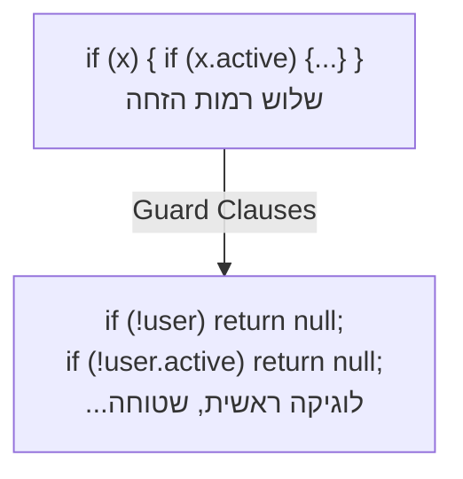

## מה זה?

Clean Code הוא קוד שקל לקרוא, להבין, ולתחזק — לא רק לכתוב ולהריץ. עקרונות מרכזיים: שמות משתנים ברורים, פונקציות קטנות עם אחריות אחת, ומניעת כפילויות. הבעיה שנפתרת: קוד "שעובד עכשיו" נקרא הרבה יותר פעמים ממה שהוא נכתב — שמות עמומים (`fn2`, `temp`, `x`) הופכים תחזוקה עתידית לאיטית ומועדת לטעויות.

## מילות מפתח שחשוב לזכור

• DRY (Don't Repeat Yourself) — כל חתיכת לוגיקה קיימת במקום אחד בלבד

• Single Responsibility — כל פונקציה אחראית לדבר אחד בלבד

• Meaningful Names — שמות שמסבירים כוונה: `getUserAge` ולא `fn2`

• Magic Number — ערך מספרי קבוע בקוד ללא הסבר; יש להגדירו כקבוע בשם ברור

• Guard Clause — בדיקת תנאי שגיאה/edge case בתחילת הפונקציה, לפני הלוגיקה הראשית

```javascript
// לפני
function fn2(x) { if (x) { if (x.active) { return x.name; } } }

// אחרי — Guard Clauses + שם ברור
function getActiveUserName(user) {
  if (!user) return null;
  if (!user.active) return null;
  return user.name;
}
```



## הסבר עיקרי

שמות כתיעוד חי — Meaningful Names הם לא "עניין סגנון" — השם *הוא* התיעוד. `getUserAge()` מתעד את עצמו; `fn2()` לא. אם צריך הערה כדי להסביר מה משתנה עושה, זה סימן שהשם עצמו לא מספיק טוב.

Guard Clauses שוברות nesting עמוק — במקום `if` מקונן בתוך `if` (שלוש רמות הזחה), בדיקות early-return בתחילת הפונקציה משטחות את הקוד ומשאירות רק את הלוגיקה הראשית בסוף.

Magic Numbers כמכשול קריאות — `if (age > 18)` לא מסביר *למה* 18 הוא הסף; `const ADULT_AGE = 18; if (age > ADULT_AGE)` הופך את הכוונה לגלויה בלי הערה נפרדת.

DRY כאיתות לפעולה — כלל אצבע מעשי: שלוש שורות זהות חוזרות? עטפו בפונקציה. "זה עובד" הוא לא נימוק מספיק נגד כפילות — כפילות מכפילה גם את מספר המקומות שצריך לתקן כשמתגלה באג.

## יתרונות

קריאות משופרת מפחיתה זמן onboarding לחברי צוות חדשים; פונקציות קטנות עם אחריות אחת קלות יותר לבדיקה בבידוד; Guard Clauses מפחיתים מספר מקרי קצה שנשכחים.

## חסרונות

לפעמים קוד "נקי מדי" (abstraction מוקדמת) מוסיף שכבות עקיפין שמכבידות; Refactoring מתמיד דורש זמן שלא תמיד יש בלוחות זמנים לחוצים.

## נקודות חשובות למבחן / ראיון עבודה

• "קוד נקרא הרבה יותר פעמים ממה שהוא נכתב" — העיקרון המכונן

• Guard Clause מוקדם בפונקציה מחליף `if` מקונן עמוק (early return)

• Magic Number תמיד הופך לקבוע בשם ברור (`const MAX_RETRIES = 3`)

• Single Responsibility: אם קשה לתאר פונקציה במשפט אחד בלי "וגם" — היא עושה יותר מדי

## טעויות נפוצות

• שמות משתנים גנריים (`data`, `temp`, `x`) שדורשים ניחוש הקשר

• פונקציה אחת שעושה כמה דברים בו-זמנית — קשה לבדוק ולתחזק

• `if` מקונן עמוק במקום Guard Clauses / Early Return

• מספרים "קסומים" ללא הסבר בקוד

## סיכום

Clean Code הוא כבוד כלפי הקוראים הבאים — כולל את עצמך בעתיד. שמות ברורים, פונקציות קטנות עם אחריות אחת, Guard Clauses במקום nesting עמוק, ו-DRY למניעת כפילות — ארבעת העקרונות שמכסים את רוב ה-impact.

## דוקומנטציה רשמית

[Refactoring.guru](https://refactoring.guru/refactoring)

---

## תרגילים

### תרגיל 1 — שמות ברורים

**המשימה:** שכתבו את שלושת המשתנים הבאים לשמות ברורים ב-camelCase שמתעדים את עצמם, בלי לשנות את הערכים:
```javascript
let x = 25;
let y = "Dana";
let z = true;
```

**בדיקה:** כל שם חדש מסביר בעצמו מה הוא מייצג (למשל `userAge`, `userName`, `isActive`), בלי צורך בהערה נוספת.

### תרגיל 2 — Guard Clauses

**המשימה:** שכתבו את הפונקציה הבאה עם Guard Clauses (early return) במקום `if` מקונן, כך שהיא מחזירה בדיוק את אותה תוצאה:

```javascript
function process(user) {
  if (user) {
    if (user.active) {
      return user.name;
    }
  }
  return null;
}
```

**בדיקה:** הגרסה החדשה שלכם ללא אף `if` מקונן בתוך `if` אחר, ומחזירה את אותן תוצאות בדיוק על אותם קלטים (`process(null)`, `process({active: false})`, `process({active: true, name: "Dana"})`).

### תרגיל 3 — Magic Numbers

**המשימה:** בקוד `if (attempts > 3) { lockAccount(); }`, החליפו את המספר `3` בקבוע עם שם ברור שמסביר מה הוא מייצג.

**בדיקה:** הקוד מתנהג בדיוק כמו קודם, אבל עכשיו אפשר להבין את הסף בלי לנחש למה `3` דווקא.

---

## פרויקט מסכם

**המשימה:** נקו את הפונקציה "המלוכלכת" הבאה, בלי לשנות את ההתנהגות שלה.

```javascript
function chk(u) {
  if (u) {
    if (u.a) {
      if (u.tries < 5) {
        return u.n;
      }
    }
  }
  return null;
}
```

**דרישות:**
1. שם פונקציה ושמות פרמטרים ברורים (לא `chk`, `u`, `a`, `n`)
2. Guard Clauses במקום שלוש רמות `if` מקוננות
3. המספר הקסום `5` מוצא לקבוע בשם ברור

**בדיקה:** הגרסה הנקייה מחזירה בדיוק את אותן תוצאות כמו המקורית, על אותם קלטים — רק הקריאות השתפרה, לא ההתנהגות.

---

## מה בפרק הבא

בפרק הבא נלמד על **Debugging** — Debugging הוא תהליך שיטתי של איתור ותיקון שגיאות בקוד, בעזרת כלי DevTools של הדפדפן — לא רק ניחוש עם `console.log` פזור. הבעיה שנפתרת: הוספת `console.log` בכל מקום ותקווה לטוב היא לא שיטתית — לא מראה 
