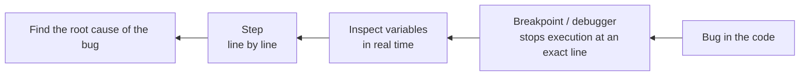

## מה זה?

Debugging הוא תהליך שיטתי של איתור ותיקון שגיאות בקוד, בעזרת כלי DevTools של הדפדפן — לא רק ניחוש עם `console.log` פזור. הבעיה שנפתרת: הוספת `console.log` בכל מקום ותקווה לטוב היא לא שיטתית — לא מראה מבנה נתונים מורכב בצורה קריאה, ולא מספקת דרך נוחה לעצור ולבדוק מצב מדויק.

## מילות מפתח שחשוב לזכור

• `console.log`/`warn`/`error` — הדפסה לקונסול ברמות חומרה שונות

• `console.table` — הצגת מערך/object כטבלה קריאה, במקום JSON שטוח

• `debugger` — מילת מפתח בקוד שעוצרת ביצוע ופותחת DevTools (חייב DevTools פתוח)

• Breakpoint — נקודת עצירה שמוגדרת ישירות ב-DevTools על שורה מסוימת

• Call Stack — רשימת הפונקציות שקראו זו לזו כדי להגיע לנקודה הנוכחית

```javascript
console.table([
  { name: "Dana", age: 28 },
  { name: "Avi", age: 35 },
]);
// shows a readable table instead of nested JSON
```



## הסבר עיקרי

מ-console.log ל-Breakpoints — Breakpoint ב-DevTools → Sources עוצר את ביצוע הקוד בדיוק בשורה הרצויה, ומאפשר לבדוק ערכי משתנים בזמן אמת ולצעוד שורה אחר שורה (Step) — דיוק ששורת `console.log` בודדת לא נותנת.

```javascript
function calcTotal(price) {
  debugger; // stops here in DevTools if it's open
  return price * 1.17;
}
```

Call Stack כמפת ניווט — כשה-debugger עצור, ה-Call Stack מציג את רשימת הפונקציות שקראו זו לזו כדי להגיע לנקודה הנוכחית. זה עונה על "איך בכלל הגעתי לכאן?" בלי לנחש.

console.table לנתונים מובנים — כשיש מערך אובייקטים, `console.table(items)` מציג אותם כטבלה קריאה עם עמודות, במקום גוש JSON מקונן שקשה לסרוק בעין.

שאלת הבדיקה הנכונה — לפני כל צעד debug: "מה בדיוק אני בודק?" — לצמצם שיטתית *היכן* הבאג קיים (איזו פונקציה, איזו שורה) ולבדוק הנחות אחת אחת (מה ה-input בפועל, מה ה-output הצפוי).

## יתרונות

Breakpoints מדויקים בהרבה מ-console.log מפוזר; Call Stack חושף את כל ה-flow שהוביל לבאג; console.table הופך נתוני מערך/object לקריאים מיידית.

## חסרונות

`debugger` שנשאר בקוד production הוא באג בפני עצמו — חוסם ביצוע אצל כל מי שפותח DevTools; למידת קיצורי הדרך והכלים ב-DevTools דורשת זמן השקעה ראשוני.

## נקודות חשובות

• Breakpoint עוצר ביצוע בשורה מדויקת; console.log דורש חיזוי מראש מה להדפיס

• Call Stack הוא LIFO — הפונקציה שנכנסה אחרונה מוצגת ראשונה

• `debugger` בקוד production הוא bug שצריך להסיר לפני commit

• console.table מתאים לבדיקת מבני נתונים, לא רק להדפסת ערך בודד

## טעויות נפוצות

• פיזור `console.log` רב בלי תוכנית ברורה מה בודקים

• השארת `debugger` statement בקוד שמגיע ל-commit

• הדפסת object שלם עם `console.log` כשעבור מערך של רשומות `console.table` הרבה יותר קריא

## סיכום

Debug שיטתי מתחיל בשאלה "מה בדיוק אני בודק?", לא בהוספת console.log אקראית. Breakpoints ב-DevTools עוצרים ביצוע במדויק; Call Stack מראה איך הגעת לכאן. console.table הופך נתוני מערך לקריאים.

## דוקומנטציה רשמית

[Chrome DevTools](https://developer.chrome.com/docs/devtools)

---

## תרגילים

### תרגיל 1 — console.table

**המשימה:** צרו מערך עם 3 objects, כל אחד מייצג מוצר עם `name` (מחרוזת) ו-`price` (מספר). הציגו את המערך עם `console.table`.

**בדיקה:** הפלט הוא טבלה עם עמודות `name` ו-`price`, שורה לכל מוצר — לא JSON שטוח.

### תרגיל 2 — debugger

**המשימה:** כתבו פונקציה כלשהי (למשל חישוב מספרי פשוט) עם מילת המפתח `debugger` בשורה הראשונה שלה. פתחו את הקובץ ב-DevTools של הדפדפן (או `node inspect`), והריצו את הקוד.

**בדיקה:** הריצה נעצרת בדיוק בשורת ה-`debugger`, ואתם יכולים לראות את ערכי המשתנים באותה נקודה.

### תרגיל 3 — Call Stack

**המשימה:** כתבו 3 פונקציות שקוראות זו לזו ברצף: `a()` קוראת ל-`b()`, ו-`b()` קוראת ל-`c()`. הוסיפו `debugger` בתוך `c`, הריצו עם DevTools פתוח, ובדקו את חלונית ה-Call Stack.

**בדיקה:** ה-Call Stack מציג את שלוש הפונקציות, בסדר `c` (למעלה) → `b` → `a` (למטה) — LIFO.

---

## פרויקט מסכם

**המשימה:** אתרו ותקנו 2 באגים בקוד הבא, בעזרת DevTools בלבד (Breakpoints, לא `console.log`).

```javascript
function calculateAverage(numbers) {
  let total = 0;
  for (let i = 0; i <= numbers.length; i++) { // bug 1: wrong loop condition
    total += numbers[i];
  }
  return total / numbers.length;
}

function getDiscountedPrice(price, discountPercent) {
  const discount = price * discountPercent; // bug 2: missing division by 100
  return price - discount;
}

console.log(calculateAverage([10, 20, 30])); // should print 20, prints NaN
console.log(getDiscountedPrice(100, 10));    // should print 90, prints something else
```

**דרישות:**
1. השתמשו ב-Breakpoint (לא `console.log`) כדי לעצור בתוך כל אחת מהפונקציות ולבדוק ערכי משתנים תוך כדי ריצה
2. תקנו את שני הבאגים כך שהתוצאות יהיו `20` ו-`90` בהתאמה
3. תעדו (בהערה מעל כל תיקון) מה בדיוק היה הבאג ואיך אותר

---

## מה בפרק הבא

בפרק הבא נלמד על **Async JavaScript** — עד עכשיו, כל שורת קוד שכתבתם רצה **מיד**, אחת אחרי השנייה, בלי המתנה. זה נקרא קוד **סינכרוני (Synchronous)** — כמו לקרוא ספר עמוד אחר עמוד: אי אפשר לקרוא עמוד 5 לפני שסיימתם עמוד 4. JavaScript, בנוסף,
