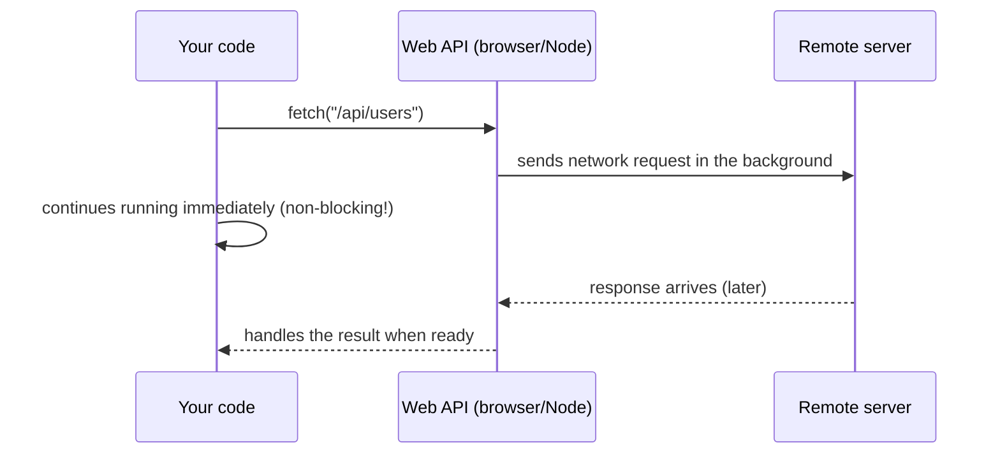

## מה זה?

עד עכשיו, כל שורת קוד שכתבתם רצה **מיד**, אחת אחרי השנייה, בלי המתנה. זה נקרא קוד **סינכרוני (Synchronous)** — כמו לקרוא ספר עמוד אחר עמוד: אי אפשר לקרוא עמוד 5 לפני שסיימתם עמוד 4. JavaScript, בנוסף, היא שפה **Single-threaded** — מונח שאומר "יש לה רק 'ראש' אחד שמריץ קוד", בניגוד לשפות שיכולות להריץ כמה דברים ממש-במקביל. המשמעות: JavaScript יכולה לבצע רק פעולה אחת בכל רגע נתון.

עכשיו לבעיה: תארו לעצמכם שאתם רוצים לבקש מידע ממחשב אחר באינטרנט — למשל, "תביא לי את רשימת המשתמשים מהשרת". השרת נמצא במקום אחר בעולם, והבקשה חייבת לנסוע ברשת, להתעבד, ולחזור — זה יכול לקחת 50 מילישניות או 3 שניות, תלוי בעומס וברשת. אם JavaScript הייתה **חוסמת (Blocking)** — כלומר עוצרת הכל ומחכה בשקט עד שהתשובה חוזרת — כל שאר התוכנית הייתה קופאת באותו זמן: כפתורים לא היו מגיבים, שום קוד אחר לא היה רץ. זו הבעיה ש-**Async JavaScript** פותר: הוא נותן דרך "לבקש" משהו שלוקח זמן, ולהמשיך לרוץ בינתיים, בלי לחכות.

## מילות מפתח שחשוב לזכור

• Synchronous (סינכרוני) — קוד שממתין לסיום כל שורה לפני שממשיך לשורה הבאה

• Single-threaded — יש ל-JavaScript רק "ראש" ביצוע אחד; היא לא באמת מריצה שני דברים בו-זמנית

• Blocking (חוסם) — פעולה שעוצרת את כל שאר הקוד עד שהיא מסתיימת

• Asynchronous (אסינכרוני) — פעולה שמתחילה, ומיד מחזירה שליטה לשאר הקוד; התוצאה שלה מגיעה מאוחר יותר

• Server (שרת) — מחשב אחר, בדרך כלל במקום פיזי אחר, ששומר נתונים ועונה לבקשות דרך האינטרנט

• Web API — יכולת שמספק לכם **הדפדפן** או **Node.js** (לא שפת JavaScript עצמה) — למשל, היכולת לשלוח בקשת רשת

• Non-blocking (לא-חוסם) — הקוד שממשיך לרוץ בזמן שממתינים לתוצאה של פעולה אסינכרונית

```javascript
console.log("Starting to request data from the server...");
fetch("/api/users"); // sends the request — doesn't wait for the response!
console.log("Continuing to run immediately, even if the response hasn't arrived yet");
```



## הסבר עיקרי

למה בעצם צריך את זה — דמיינו אתר עם כפתור "טען עוד תמונות". אם לחיצה על הכפתור הייתה חוסמת את כל הדף עד שהתמונות מגיעות מהשרת (יכול לקחת שנייה-שתיים), שום כפתור אחר לא היה מגיב באותו זמן — הדף פשוט "קופא". Async נותן פתרון: הבקשה יוצאת, הדף ממשיך לעבוד כרגיל, ורק כשהתשובה מוכנה, קוד מיוחד "מטפל" בה.

מי בעצם מטפל בבקשה בזמן שאנחנו ממשיכים? — כשקוראים ל-`fetch(...)`, JavaScript לא מטפלת בבקשת הרשת בעצמה. היא מעבירה את המשימה ל-**Web API** — מנגנון שהדפדפן (או Node.js) מספק בנפרד ממנוע ה-JavaScript. תחשבו על זה כמו למסור מכתב לדוור: אתם לא מחכים ליד תיבת הדואר עד שהוא מגיע ליעד — אתם ממשיכים ביום שלכם, והדוור "מטפל" במשלוח ברקע.

מה קורה כשהתשובה כן מגיעה — היא לא "קופצת" באמצע קוד שכבר רץ. יש מנגנון סדור (שנלמד בפירוט בשיעור הבא, Event Loop) שקובע בדיוק מתי הקוד שממתין לתשובה מקבל תור להרצה.

## יתרונות

התוכנית לא נקפאת בזמן פעולות איטיות כמו בקשות רשת; אפשר להתחיל כמה פעולות איטיות בו-זמנית בלי שהן יחסמו זו את זו; אותו רעיון עובד גם בדפדפן וגם ב-Node.js (בצד שרת).

## חסרונות

קוד שמחכה ל"אחר כך" קשה יותר לעקוב אחריו מקוד ליניארי רגיל — צריך ללמוד כלים חדשים (בשיעורים הבאים) כדי לכתוב אותו בקריאות; אי אפשר לדעת מראש בדיוק כמה זמן ייקח, רק שזה לא יחסום.

## נקודות חשובות

• JavaScript היא Single-threaded — יש לה רק ביצוע אחד בכל רגע, לא כמה "מקבילים" אמיתיים

• Blocking (חוסם) עוצר הכל; Non-blocking (לא-חוסם) מאפשר לשאר הקוד להמשיך

• Web APIs (כמו שליחת בקשת רשת) מנוהלים על ידי הדפדפן/Node.js, לא ע"י מנוע ה-JS עצמו

• קריאה ל-פעולה אסינכרונית (כמו `fetch`) לא "עוצרת" את הקוד שאחריה — היא רק מתחילה תהליך

## טעויות נפוצות

• ציפייה שקריאה ל-`fetch(...)` "תעצור" את הקוד עד שהתשובה מגיעה — היא לא, היא רק שולחת את הבקשה

• הנחה ש-Async "מריץ קוד על עוד ליבה/thread" — בפועל זו עדיין אותה JavaScript יחידה, רק שהעבודה האיטית מבוצעת מחוץ לה

• בלבול בין "לא יודעים כמה זמן ייקח" (נכון) לבין "אין דרך לדעת מתי זה נגמר" (לא נכון — יש כלים בדיוק לזה, בשיעורים הבאים)

## סיכום

קוד סינכרוני רץ שורה אחר שורה, בלי לדלג. פעולות שלוקחות זמן לא-ידוע (כמו בקשת רשת לשרת) לא יכולות "לעצור" את כל התוכנית — Async JavaScript פותר את זה: הבקשה מופנית ל-Web API, הקוד ממשיך לרוץ מיד, והתוצאה מטופלת מאוחר יותר. השיעורים הבאים מלמדים בדיוק *איך* לתפוס ולהשתמש בתוצאה הזו.

## דוקומנטציה רשמית

[MDN — Introducing asynchronous JavaScript](https://developer.mozilla.org/en-US/docs/Learn_web_development/Extensions/Async_JS/Introducing)

---

## תרגילים

### תרגיל 1 — סינכרוני מול אסינכרוני

**המשימה:** כתבו 3 שורות `console.log` רגילות ברצף והריצו אותן. אחר כך הוסיפו `fetch("/api/users")` בין השורה הראשונה לשנייה, בלי לטפל בתוצאה שלה.

**בדיקה:** בשני המקרים, שלוש הודעות ה-`console.log` מודפסות **בדיוק** באותו סדר שכתבתם — הוספת `fetch` לא שינתה את הסדר, כי היא רק שולחת את הבקשה ולא מחכה לתשובה.

### תרגיל 2 — למה blocking רע

**המשימה:** בכתיבה (לא הרצה): תארו תרחיש קונקרטי אחד (למשל, אתר עם טופס הרשמה) שבו `fetch` "חוסמת" (blocking) הייתה גורמת לבעיה אמיתית עבור המשתמש.

**בדיקה:** התרחיש שלכם מסביר במפורש **מה המשתמש לא יכול היה לעשות** בזמן שהדף "קופא".

### תרגיל 3 — זיהוי סינכרוני/אסינכרוני

**המשימה:** לכל אחת משלוש הפעולות הבאות, קבעו אם היא סינכרונית או אסינכרונית, ונמקו במשפט אחד: `console.log("hi")`, `fetch("/api/data")`, `const sum = 2 + 2`.

**בדיקה:** `console.log` ו-`const sum = 2 + 2` סינכרוניות (מסתיימות מיד); `fetch` אסינכרונית (מפנה עבודה ל-Web API וממשיכה).

---

## פרויקט מסכם

**המשימה:** כתבו קובץ קטן שממחיש את הרעיון של "לא לחכות".

**דרישות:**
1. הדפיסו `"מתחיל"`
2. קראו ל-`fetch("/api/users")` בלי לטפל בתוצאה עדיין (זה בסדר — נלמד איך בשיעורים הבאים)
3. מיד אחרי, הריצו לולאת `for` שמדפיסה את המספרים 1 עד 5
4. הדפיסו `"מסתיים"`

**בדיקה:** הפלט הוא `"מתחיל"`, ואז 1-5, ואז `"מסתיים"` — כל זה קורה מיד, בלי שום המתנה לתשובה בפועל של `fetch`.

---

## מה בפרק הבא

בפרק הבא נלמד על **Event Loop** — בשיעור הקודם ראינו ש-JavaScript שולחת בקשה אסינכרונית (כמו `fetch`) וממשיכה מיד לקוד הבא, בלי לחכות. אבל זה מעורר שאלה: כשהתשובה **כן** מגיעה מהשרת, מתי בדיוק הקוד שאמור "לטפל" בה מקבל תור לרוץ? Event
