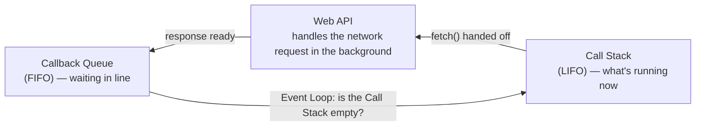

## מה זה?

בשיעור הקודם ראינו ש-JavaScript שולחת בקשה אסינכרונית (כמו `fetch`) וממשיכה מיד לקוד הבא, בלי לחכות. אבל זה מעורר שאלה: כשהתשובה **כן** מגיעה מהשרת, מתי בדיוק הקוד שאמור "לטפל" בה מקבל תור לרוץ? Event Loop הוא המנגנון המדויק שעונה על השאלה הזו — הוא מתאם בין שלושה חלקים: **Call Stack** (מה רץ עכשיו), **Web APIs** (מי מטפל בבקשות ברקע), ו-**Callback Queue** (תור למי שממתין לתור).

## מילות מפתח שחשוב לזכור

• Call Stack — "מחסנית" שבה JavaScript שומרת אילו פונקציות רצות כרגע, אחת על גבי השנייה

• LIFO (Last In, First Out) — "אחרון נכנס, ראשון יוצא"; ככה עובד ה-Call Stack — הפונקציה שנכנסה אחרונה, יוצאת ראשונה

• Callback Queue — תור (בסדר הגעה) של פעולות שמוכנות לרוץ, וממתינות שיהיה להן מקום

• FIFO (First In, First Out) — "ראשון נכנס, ראשון יוצא"; ככה עובד ה-Callback Queue

• Event Loop — תהליך שרץ כל הזמן ובודק שאלה אחת בלבד: "האם ה-Call Stack ריק לגמרי? אם כן — קח את הבא בתור והרץ אותו"

```javascript
console.log("1");
fetch("/api/users"); // handed off to the Web API; the code continues immediately
console.log("2");
// "1" and "2" will print first, before any handling of fetch's response begins
```



## הדגמה חיה

<div class="demo-live event-loop-demo" dir="ltr">
<style>
.event-loop-demo { border: 1px solid var(--bs-border-color); border-radius: .5rem; padding: 1rem 1.25rem; margin: 1.5rem 0; text-align: left; }
.event-loop-demo .el-boards { display: flex; gap: 1rem; flex-wrap: wrap; margin-block: 1rem; }
.event-loop-demo .el-board { flex: 1; min-width: 170px; border: 2px dashed var(--bs-border-color); border-radius: .5rem; padding: .75rem; min-height: 150px; position: relative; transition: box-shadow .3s ease, border-color .3s ease; }
.event-loop-demo .el-board.el-start { border-color: var(--bs-primary); border-style: solid; }
.event-loop-demo .el-board.el-active { border-color: var(--bs-primary); box-shadow: 0 0 0 4px rgba(var(--bs-primary-rgb, 13,110,253), .25); }
.event-loop-demo .el-board h4 { font-size: .85rem; margin: 0 0 .5rem; opacity: .75; }
.event-loop-demo .el-step-num { display: inline-flex; align-items: center; justify-content: center; width: 1.4rem; height: 1.4rem; border-radius: 50%; background: var(--bs-primary); color: #fff; font-size: .75rem; font-weight: 700; margin-right: .4rem; }
.event-loop-demo .el-start-badge { position: absolute; top: -.7rem; right: .5rem; background: var(--bs-primary); color: #fff; font-size: .7rem; padding: .1rem .5rem; border-radius: 1rem; }
.event-loop-demo .el-flow-hint { font-size: .85rem; opacity: .75; margin-bottom: .25rem; }
.event-loop-demo .el-chip { display: inline-block; padding: .3rem .6rem; border-radius: .35rem; font-size: .8rem; margin: .2rem; color: #fff; opacity: 0; transform: scale(.7); transition: all .35s ease; }
.event-loop-demo .el-chip.show { opacity: 1; transform: scale(1); }
.event-loop-demo .el-chip.stack { background: #6f42c1; }
.event-loop-demo .el-chip.webapi { background: #fd7e14; }
.event-loop-demo .el-chip.queue { background: #20c997; }
.event-loop-demo .el-log { font-family: monospace; font-size: .85rem; background: var(--bs-tertiary-bg, #f1f3f5); border-radius: .35rem; padding: .6rem .75rem; min-height: 130px; max-height: 220px; overflow-y: auto; }
.event-loop-demo .el-log-line { opacity: .4; padding: .15rem 0; transition: opacity .3s ease; }
.event-loop-demo .el-log-line.el-current { opacity: 1; font-weight: 600; }
.event-loop-demo .el-btn { border: none; border-radius: .35rem; padding: .5rem 1rem; background: var(--bs-primary); color: #fff; cursor: pointer; font-size: .9rem; }
.event-loop-demo .el-btn:disabled { opacity: .5; cursor: not-allowed; }
</style>

<p>Click <strong>"▶ Run animation"</strong> and watch <code>fetch</code>'s real journey between the three pieces, following the code example above — instead of imagining it, you'll see it happen. Runs slowly, step by step.</p>

<button type="button" class="el-btn" onclick="window.__runEventLoopDemo(this)">▶ Run animation</button>

<p class="el-flow-hint">🔢 Follow the numbers — everything always starts at <strong>① Call Stack</strong>, marked with a solid blue border:</p>

<div class="el-boards">
  <div class="el-board el-start"><span class="el-start-badge">START HERE</span><h4><span class="el-step-num">1</span>📚 Call Stack (LIFO)</h4><div class="el-stack-zone"></div></div>
  <div class="el-board"><h4><span class="el-step-num">2</span>🌐 Web API</h4><div class="el-webapi-zone"></div></div>
  <div class="el-board"><h4><span class="el-step-num">3</span>📥 Callback Queue (FIFO)</h4><div class="el-queue-zone"></div></div>
</div>

<div class="el-log" data-el-log><div class="el-log-line el-current">Click "▶ Run animation" to start...</div></div>

<script>
(function () {
  window.__runEventLoopDemo = function (btn) {
    var demo = btn.closest('.event-loop-demo');
    var stackZone = demo.querySelector('.el-stack-zone');
    var webapiZone = demo.querySelector('.el-webapi-zone');
    var queueZone = demo.querySelector('.el-queue-zone');
    var log = demo.querySelector('[data-el-log]');
    var boards = demo.querySelectorAll('.el-board');

    btn.disabled = true;
    stackZone.innerHTML = '';
    webapiZone.innerHTML = '';
    queueZone.innerHTML = '';
    log.innerHTML = '';

    function addChip(zone, cls, text) {
      var chip = document.createElement('span');
      chip.className = 'el-chip ' + cls;
      chip.textContent = text;
      zone.appendChild(chip);
      requestAnimationFrame(function () { chip.classList.add('show'); });
    }
    function clearZone(zone) { zone.innerHTML = ''; }
    function highlight(zone) {
      boards.forEach(function (b) { b.classList.remove('el-active'); });
      if (zone) zone.closest('.el-board').classList.add('el-active');
    }
    function addLine(text) {
      var prev = log.querySelector('.el-current');
      if (prev) prev.classList.remove('el-current');
      var line = document.createElement('div');
      line.className = 'el-log-line el-current';
      line.textContent = text;
      log.appendChild(line);
      log.scrollTop = log.scrollHeight;
    }

    // Slow, evenly-paced steps — about 1.8s apart, ~16s total, plenty of time to read each line
    var steps = [
      { t: 0,     text: '▶ console.log("1") enters the Call Stack and runs immediately',            action: function () { addChip(stackZone, 'stack', 'console.log("1")'); highlight(stackZone); } },
      { t: 1800,  text: '✓ console.log("1") finishes and leaves the Stack — printed: 1',             action: function () { clearZone(stackZone); } },
      { t: 3600,  text: '▶ fetch(...) enters the Call Stack briefly',                                 action: function () { addChip(stackZone, 'stack', 'fetch(...)'); highlight(stackZone); } },
      { t: 5400,  text: '↪ fetch is handed off to the Web API in the background — it leaves the Stack right away!', action: function () { clearZone(stackZone); addChip(webapiZone, 'webapi', 'waiting for response...'); highlight(webapiZone); } },
      { t: 7200,  text: '▶ console.log("2") enters and runs immediately — the code did NOT wait for fetch!', action: function () { addChip(stackZone, 'stack', 'console.log("2")'); highlight(stackZone); } },
      { t: 9000,  text: '✓ console.log("2") finishes — printed: 2',                                   action: function () { clearZone(stackZone); } },
      { t: 10800, text: '📩 The server response arrives! The callback moves to the Callback Queue — it does NOT run yet', action: function () { clearZone(webapiZone); addChip(queueZone, 'queue', 'handle(response)'); highlight(queueZone); } },
      { t: 12600, text: '🔁 Event Loop checks: "Is the Stack empty?" — Yes! It moves the callback in',  action: function () { highlight(queueZone); } },
      { t: 14400, text: '▶ handle(response) finally runs — only now, after all the synchronous code',  action: function () { clearZone(queueZone); addChip(stackZone, 'stack', 'handle(response)'); highlight(stackZone); } },
      { t: 16200, text: '✓ Done. Actual print order: 1, 2, then handle(response) — always in this order.', action: function () { clearZone(stackZone); highlight(null); } }
    ];

    steps.forEach(function (step) {
      setTimeout(function () {
        step.action();
        addLine(step.text);
      }, step.t);
    });

    setTimeout(function () { btn.disabled = false; }, 17000);
  };
})();
</script>
</div>

## הסבר עיקרי

מה קורה, צעד-צעד, כשקוראים ל-`fetch` — (1) הקריאה `fetch(url)` נכנסת ל-Call Stack לרגע, ומיד "מפנה" את בקשת הרשת בפועל ל-Web API של הדפדפן/Node — זהו קוד שרץ **מחוץ** למנוע ה-JavaScript עצמו. (2) `fetch(...)` יוצאת מה-Call Stack, וה-JavaScript ממשיכה מיד לשורה הבאה בקוד. (3) ברקע, ה-Web API "מחכה" לתשובה מהשרת. (4) כשהתשובה מגיעה, הקוד שאמור לטפל בה לא רץ מיד — הוא נכנס ל-Callback Queue וממתין לתורו.

Event Loop כ"שוטר תנועה" — Event Loop בודק שוב ושוב, ברציפות: "האם ה-Call Stack ריק **לגמרי** עכשיו?" רק כשהתשובה כן, הוא לוקח את הפעולה הראשונה מה-Callback Queue ומכניס אותה להרצה. המשמעות המעשית: **כל** הקוד הסינכרוני שכתבתם תמיד ירוץ במלואו קודם — לא משנה כמה מהר התשובה מהשרת חזרה.

Call Stack הוא LIFO, Callback Queue הוא FIFO — כשפונקציה `a()` קוראת לפונקציה `b()`, `b` נכנסת "מעל" `a` במחסנית — וגם יוצאת ממנה ראשונה כשהיא מסתיימת (LIFO). זה שונה מה-Callback Queue, שבו הפעולה הראשונה שנכנסה היא גם הראשונה שיוצאת ורצה (FIFO) — בדיוק כמו תור בקופה.

## יתרונות

הבנת Event Loop מסבירה בדיוק מתי קוד אסינכרוני רץ — לא ניחוש; מאפשרת לכתוב קוד async שמתנהג בצורה צפויה; אותו מודל בדיוק עובד גם בדפדפן וגם ב-Node.js.

## חסרונות

מנגנון עם כמה חלקים נעים (Call Stack, Web APIs, Queue) שדורש זמן להפנים; קל לטעות בחיזוי סדר הרצה בלי להבין את הכללים לעומק.

## נקודות חשובות

• Event Loop מריץ פעולה מה-Callback Queue **רק** כשה-Call Stack ריק לגמרי

• Call Stack הוא LIFO (מחסנית); Callback Queue הוא FIFO (תור)

• קוד סינכרוני **תמיד** רץ במלואו לפני כל דבר שממתין בתור, לא משנה מתי התשובה חזרה בפועל

• Web APIs (כמו בקשות רשת) מנוהלים מחוץ למנוע ה-JS עצמו — זה מה שמאפשר להם לא לחסום

## טעויות נפוצות

• ציפייה שטיפול בתשובה ירוץ "מיד" כשהיא מגיעה מהשרת — היא רק נכנסת לתור וממתינה ל-Call Stack ריק

• בלבול בין Call Stack (LIFO, מה שרץ ממש עכשיו) לבין Callback Queue (FIFO, מה שממתין)

• הנחה שקוד סינכרוני "יפנה מקום" באמצע לטובת תשובה שהגיעה — הוא לא, הוא רץ עד הסוף קודם, תמיד

## סיכום

Event Loop מתאם בין Call Stack (מה רץ עכשיו, LIFO), Web APIs (מי מטפל ברקע), ו-Callback Queue (מי ממתין, FIFO). כלל הברזל: קוד סינכרוני תמיד רץ במלואו לפני כל תשובה אסינכרונית ממתינה, לא משנה כמה מהר היא הגיעה. השיעורים הבאים בונים על ההבנה הזו כדי ללמד *איך בפועל* כותבים את הקוד שמטפל בתשובה.

## דוקומנטציה רשמית

[MDN — Event Loop](https://developer.mozilla.org/en-US/docs/Web/JavaScript/Event_loop)

---

## תרגילים

### תרגיל 1 — ניחוש סדר

**המשימה:** לפני שאתם מריצים, נחשו את סדר ההדפסה של הקוד הבא, וכתבו הסבר קצר למה:

```javascript
console.log("start");
fetch("/api/users");
console.log("end");
```

**בדיקה:** הסדר הוא `"start"` ואז `"end"` — שניהם לפני שכל טיפול בתשובה של `fetch` בכלל מתחיל, כי הקוד הסינכרוני תמיד רץ במלואו קודם.

### תרגיל 2 — Call Stack

**המשימה:** כתבו שלוש פונקציות: `a()` קוראת ל-`b()`, ו-`b()` קוראת ל-`c()`. בכל אחת מהן, הדפיסו הודעה לפני הקריאה הפנימית והודעה אחריה.

**בדיקה:** סדר ההדפסות מראה את ה-Call Stack בפעולה: הכניסות (`a` לפני `b` לפני `c`) ואז היציאות בסדר **הפוך** (`c` לפני `b` לפני `a`) — LIFO.

### תרגיל 3 — הסבירו במילים שלכם

**המשימה:** הסבירו בכתיבה למה `fetch` לא "חוסמת" את הקוד, גם אם התשובה מהשרת חוזרת מהר מאוד (5 מילישניות) — קשרו את ההסבר ל-Call Stack ול-Callback Queue.

**בדיקה:** ההסבר שלכם מזכיר במפורש שקוד סינכרוני תמיד רץ עד הסוף לפני שכל דבר מהתור מקבל תור, לא משנה כמה מהר התשובה הגיעה.

---

## פרויקט מסכם

**המשימה:** תעדו (בהערות קוד) את מסע הבקשה של `fetch`, שלב אחר שלב.

**דרישות:**
1. הדפיסו `"1: לפני הבקשה"`
2. קראו ל-`fetch("/api/users")`
3. הדפיסו `"2: אחרי הבקשה — מיד"`
4. מעל כל שורה, הוסיפו הערה שמתארת מה קורה בפועל: מתי הקוד עובר ל-Web API, מתי הוא חוזר ל-Call Stack

**בדיקה:** ההערות שלכם מסבירות למה `"2"` תמיד ידפיס מיד, לפני שהתשובה האמיתית של `fetch` בכלל התקבלה.

---

## מה בפרק הבא

בפרק הבא נלמד על **Fetch API** — Fetch API הוא הכלי המובנה בדפדפן (וב-Node.js 18+) לשלוח בקשה לשרת ולבקש ממנו מידע — בדיוק הדוגמה ששימשה אותנו בשני השיעורים הקודמים. לפני שנצלול: **שרת** הוא מחשב אחר, לרוב במקום פיזי אחר בעולם, שמחזי
