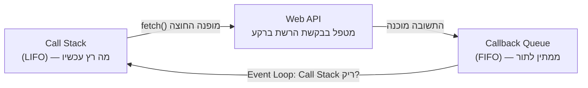

## מה זה?

בשיעור הקודם ראינו ש-JavaScript שולחת בקשה אסינכרונית (כמו `fetch`) וממשיכה מיד לקוד הבא, בלי לחכות. אבל זה מעורר שאלה: כשהתשובה **כן** מגיעה מהשרת, מתי בדיוק הקוד שאמור "לטפל" בה מקבל תור לרוץ? Event Loop הוא המנגנון המדויק שעונה על השאלה הזו — הוא מתאם בין שלושה חלקים: **Call Stack** (מה רץ עכשיו), **Web APIs** (מי מטפל בבקשות ברקע), ו-**Callback Queue** (תור למי שממתין לתור).

## מילות מפתח שחשוב לזכור

• Call Stack — "מחסנית" שבה JavaScript שומרת אילו פונקציות רצות כרגע, אחת על גבי השנייה

• LIFO (Last In, First Out) — "אחרון נכנס, ראשון יוצא"; ככה עובד ה-Call Stack — הפונקציה שנכנסה אחרונה, יוצאת ראשונה

• Callback Queue — תור (בסדר הגעה) של פעולות שמוכנות לרוץ, וממתינות שיהיה להן מקום

• FIFO (First In, First Out) — "ראשון נכנס, ראשון יוצא"; ככה עובד ה-Callback Queue

• Event Loop — תהליך שרץ כל הזמן ובודק שאלה אחת בלבד: "האם ה-Call Stack ריק לגמרי? אם כן — קח את הבא בתור והרץ אותו"

```javascript
console.log("1");
fetch("/api/users"); // מופנה ל-Web API; הקוד ממשיך מיד
console.log("2");
// "1" ו-"2" ידפיסו קודם, לפני שכל טיפול בתשובה של fetch מתחיל
```



## הסבר עיקרי

מה קורה, צעד-צעד, כשקוראים ל-`fetch` — (1) הקריאה `fetch(url)` נכנסת ל-Call Stack לרגע, ומיד "מפנה" את בקשת הרשת בפועל ל-Web API של הדפדפן/Node — זהו קוד שרץ **מחוץ** למנוע ה-JavaScript עצמו. (2) `fetch(...)` יוצאת מה-Call Stack, וה-JavaScript ממשיכה מיד לשורה הבאה בקוד. (3) ברקע, ה-Web API "מחכה" לתשובה מהשרת. (4) כשהתשובה מגיעה, הקוד שאמור לטפל בה לא רץ מיד — הוא נכנס ל-Callback Queue וממתין לתורו.

Event Loop כ"שוטר תנועה" — Event Loop בודק שוב ושוב, ברציפות: "האם ה-Call Stack ריק **לגמרי** עכשיו?" רק כשהתשובה כן, הוא לוקח את הפעולה הראשונה מה-Callback Queue ומכניס אותה להרצה. המשמעות המעשית: **כל** הקוד הסינכרוני שכתבתם תמיד ירוץ במלואו קודם — לא משנה כמה מהר התשובה מהשרת חזרה.

Call Stack הוא LIFO, Callback Queue הוא FIFO — כשפונקציה `a()` קוראת לפונקציה `b()`, `b` נכנסת "מעל" `a` במחסנית — וגם יוצאת ממנה ראשונה כשהיא מסתיימת (LIFO). זה שונה מה-Callback Queue, שבו הפעולה הראשונה שנכנסה היא גם הראשונה שיוצאת ורצה (FIFO) — בדיוק כמו תור בקופה.

## יתרונות

הבנת Event Loop מסבירה בדיוק מתי קוד אסינכרוני רץ — לא ניחוש; מאפשרת לכתוב קוד async שמתנהג בצורה צפויה; אותו מודל בדיוק עובד גם בדפדפן וגם ב-Node.js.

## חסרונות

מנגנון עם כמה חלקים נעים (Call Stack, Web APIs, Queue) שדורש זמן להפנים; קל לטעות בחיזוי סדר הרצה בלי להבין את הכללים לעומק.

## נקודות חשובות למבחן / ראיון עבודה

• Event Loop מריץ פעולה מה-Callback Queue **רק** כשה-Call Stack ריק לגמרי

• Call Stack הוא LIFO (מחסנית); Callback Queue הוא FIFO (תור)

• קוד סינכרוני **תמיד** רץ במלואו לפני כל דבר שממתין בתור, לא משנה מתי התשובה חזרה בפועל

• Web APIs (כמו בקשות רשת) מנוהלים מחוץ למנוע ה-JS עצמו — זה מה שמאפשר להם לא לחסום

## טעויות נפוצות

• ציפייה שטיפול בתשובה ירוץ "מיד" כשהיא מגיעה מהשרת — היא רק נכנסת לתור וממתינה ל-Call Stack ריק

• בלבול בין Call Stack (LIFO, מה שרץ ממש עכשיו) לבין Callback Queue (FIFO, מה שממתין)

• הנחה שקוד סינכרוני "יפנה מקום" באמצע לטובת תשובה שהגיעה — הוא לא, הוא רץ עד הסוף קודם, תמיד

## סיכום

Event Loop מתאם בין Call Stack (מה רץ עכשיו, LIFO), Web APIs (מי מטפל ברקע), ו-Callback Queue (מי ממתין, FIFO). כלל הברזל: קוד סינכרוני תמיד רץ במלואו לפני כל תשובה אסינכרונית ממתינה, לא משנה כמה מהר היא הגיעה. השיעורים הבאים בונים על ההבנה הזו כדי ללמד *איך בפועל* כותבים את הקוד שמטפל בתשובה.

## דוקומנטציה רשמית

[MDN — Event Loop](https://developer.mozilla.org/en-US/docs/Web/JavaScript/Event_loop)

---

## תרגילים

### תרגיל 1 — ניחוש סדר

**המשימה:** לפני שאתם מריצים, נחשו את סדר ההדפסה של הקוד הבא, וכתבו הסבר קצר למה:

```javascript
console.log("start");
fetch("/api/users");
console.log("end");
```

**בדיקה:** הסדר הוא `"start"` ואז `"end"` — שניהם לפני שכל טיפול בתשובה של `fetch` בכלל מתחיל, כי הקוד הסינכרוני תמיד רץ במלואו קודם.

### תרגיל 2 — Call Stack

**המשימה:** כתבו שלוש פונקציות: `a()` קוראת ל-`b()`, ו-`b()` קוראת ל-`c()`. בכל אחת מהן, הדפיסו הודעה לפני הקריאה הפנימית והודעה אחריה.

**בדיקה:** סדר ההדפסות מראה את ה-Call Stack בפעולה: הכניסות (`a` לפני `b` לפני `c`) ואז היציאות בסדר **הפוך** (`c` לפני `b` לפני `a`) — LIFO.

### תרגיל 3 — הסבירו במילים שלכם

**המשימה:** הסבירו בכתיבה למה `fetch` לא "חוסמת" את הקוד, גם אם התשובה מהשרת חוזרת מהר מאוד (5 מילישניות) — קשרו את ההסבר ל-Call Stack ול-Callback Queue.

**בדיקה:** ההסבר שלכם מזכיר במפורש שקוד סינכרוני תמיד רץ עד הסוף לפני שכל דבר מהתור מקבל תור, לא משנה כמה מהר התשובה הגיעה.

---

## פרויקט מסכם

**המשימה:** תעדו (בהערות קוד) את מסע הבקשה של `fetch`, שלב אחר שלב.

**דרישות:**
1. הדפיסו `"1: לפני הבקשה"`
2. קראו ל-`fetch("/api/users")`
3. הדפיסו `"2: אחרי הבקשה — מיד"`
4. מעל כל שורה, הוסיפו הערה שמתארת מה קורה בפועל: מתי הקוד עובר ל-Web API, מתי הוא חוזר ל-Call Stack

**בדיקה:** ההערות שלכם מסבירות למה `"2"` תמיד ידפיס מיד, לפני שהתשובה האמיתית של `fetch` בכלל התקבלה.

---

## מה בפרק הבא

בפרק הבא נלמד על **Fetch API** — Fetch API הוא הכלי המובנה בדפדפן (וב-Node.js 18+) לשלוח בקשה לשרת ולבקש ממנו מידע — בדיוק הדוגמה ששימשה אותנו בשני השיעורים הקודמים. לפני שנצלול: **שרת** הוא מחשב אחר, לרוב במקום פיזי אחר בעולם, שמחזי
