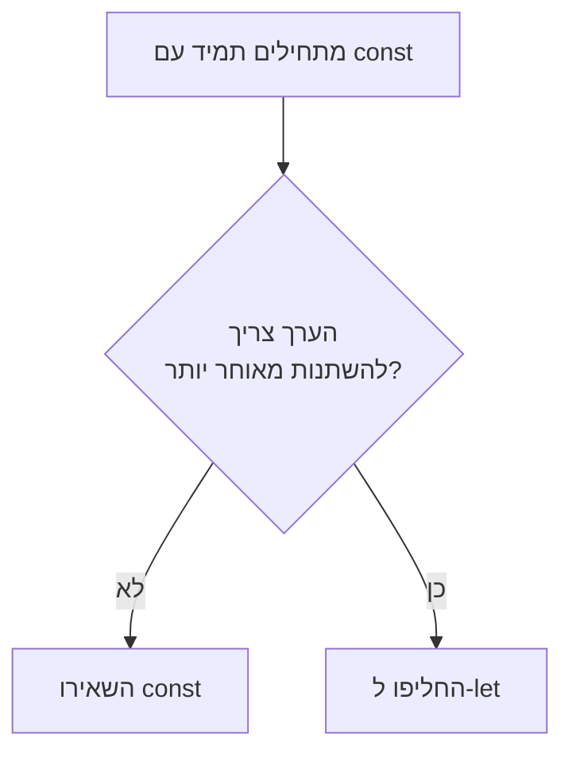

## מה זה?

משתנה הוא שם שנותנים לתא זיכרון כדי לשמור ערך ולהשתמש בו שוב מאוחר יותר בקוד. הבעיה שנפתרת: בלי משתנים, כל ערך היה צריך להיות כתוב ישירות בקוד (hardcoded) בכל מקום שהוא נדרש — קלט מהמשתמש, תוצאת חישוב, או מונה שרץ בלולאה לא ניתנים לשמירה או לעדכון.

## מילות מפתח שחשוב לזכור

• `let` — משתנה שערכו יכול להשתנות לאורך הקוד

• `const` — משתנה שאי אפשר להצהיר עליו מחדש; ברירת המחדל בקוד מודרני

• `var` — הדרך הישנה להצהיר משתנה; נמנעים ממנה כיום (יש לה חוקי scope ישנים ומבלבלים)

• Assignment — הפעולה של נתינת ערך למשתנה, באמצעות `=`

• Reassignment — שינוי הערך של משתנה קיים (`let` בלבד, לא `const`)

• Naming Convention — camelCase (`firstName`) הוא הסטנדרט לשמות משתנים ב-JS

```javascript
let name = "Dana";
name = "Avi";        // let — ניתן לשנות

const age = 30;
age = 31;            // TypeError: Assignment to constant variable
```



## הסבר עיקרי

מתי `let` ומתי `const` — הכלל המעשי: התחילו תמיד עם `const`. אם מתברר שצריך לשנות את הערך מאוחר יותר בקוד (למשל מונה שגדל, או משתנה שמתעדכן לפי תנאי) — רק אז החליפו ל-`let`. כך הקוד עצמו "מתעד" אילו ערכים אמורים להישאר קבועים.

Assignment מול Reassignment — `let x = 5;` היא הצהרה עם ערך התחלתי. `x = 6;` בשורה הבאה היא reassignment — לא הצהרה חדשה, רק עדכון הערך הקיים. `const` אוסר reassignment לגמרי; ניסיון להריץ `age = 31` על `const age` זורק שגיאה מיד.

שמות ברורים חוסכים בלבול — `let x = 25;` לא אומר כלום; `let userAge = 25;` מתעד את עצמו. camelCase (מילה ראשונה קטנה, כל מילה נוספת מתחילה באות גדולה: `firstName`, `isLoggedIn`) הוא הסטנדרט המקובל ב-JS.

## יתרונות

מאפשר שמירת ועדכון נתונים לאורך ריצת התוכנית; `const` מונע שינוי בטעות של ערכים שאמורים להישאר קבועים; שמות משתנים ברורים הופכים קוד לקריא בלי צורך בהערות נוספות.

## חסרונות

בחירה לא נכונה בין `let` ל-`const` (למשל `let` על ערך שלעולם לא משתנה) מטשטשת את כוונת הקוד; `var` הישן עדיין קיים בקוד legacy ומתנהג אחרת מ-`let`/`const`, מה שיוצר בלבול כשנתקלים בו.

## נקודות חשובות למבחן / ראיון עבודה

• `const` לא ניתן ל-reassignment; ניסיון כזה זורק `TypeError`

• `let` ניתן לשינוי חוזר; `var` הוא סגנון ישן שנמנעים ממנו

• ברירת המחדל בקוד מודרני: `const` תמיד, `let` רק כשבאמת צריך לשנות

• camelCase הוא מוסכמת השמות הסטנדרטית למשתנים ב-JS

## טעויות נפוצות

• ניסיון ל-reassign משתנה `const` וקבלת `TypeError` לא צפוי

• שימוש ב-`let` בכל מקום מהרגל, גם כשהערך אף פעם לא משתנה בפועל

• שמות משתנים לא ברורים (`x`, `data`, `temp`) שדורשים ניחוש הקשר

• בלבול בין הצהרה ראשונה (`let x = 5`) לבין reassignment (`x = 6`)

## סיכום

משתנה הוא שם לתא זיכרון שמאפשר לשמור ולעדכן ערכים. `const` הוא ברירת המחדל — משתנה שלא ניתן ל-reassignment; `let` משמש רק כשהערך באמת צריך להשתנות. שמות ברורים (camelCase) הופכים קוד לקריא בלי הערות מיותרות.

## דוקומנטציה רשמית

[MDN — let](https://developer.mozilla.org/en-US/docs/Web/JavaScript/Reference/Statements/let)

[MDN — const](https://developer.mozilla.org/en-US/docs/Web/JavaScript/Reference/Statements/const)

---

## תרגילים

### תרגיל 1 — let מול const

**המשימה:** הצהירו על `const city = "Tel Aviv"` ונסו לשנות אותו לערך אחר (`city = "Haifa"`). אחר כך הצהירו על `let score = 0`, ושנו אותו פעמיים ברצף — למשל ל-`10` ואז ל-`25`, עם `console.log` אחרי כל שינוי.

**בדיקה:** הניסיון לשנות את `city` זורק `TypeError`; שינוי `score` פעמיים מצליח בלי שגיאה, ומדפיס `10` ואז `25`.

### תרגיל 2 — שמות ברורים

**המשימה:** קחו את הקוד הבא, עם שמות משתנים גרועים, ושכתבו אותו עם שמות ברורים ב-camelCase שמתעדים את עצמם (למשל `userName`, `userAge`, `isActive`) — בלי לשנות את הערכים עצמם.

```javascript
let x = "Dana";
let y = 28;
let z = true;
```

**בדיקה:** הקוד עושה בדיוק אותו דבר כמו לפני, אבל כל שם משתנה מסביר את עצמו בלי צורך בהערה נוספת.

### תרגיל 3 — בחירה נכונה

**המשימה:** לכל אחד מהמקרים הבאים, כתבו אם הייתם משתמשים ב-`let` או ב-`const`, ונמקו במשפט אחד: (א) מונה שגדל בלולאה, (ב) קבוע מתמטי `PI`, (ג) שם משתמש שמוזן פעם אחת בתחילת התוכנית ולא משתנה, (ד) ניקוד שמתעדכן במהלך משחק.

**בדיקה:** לכל אחד מהארבעה יש תשובה חד-משמעית (`let` או `const`) עם נימוק שמתייחס לשאלה "האם הערך משתנה אחרי ההצהרה הראשונה?".

---

## פרויקט מסכם

**המשימה:** כתבו סקריפט "פרופיל משתמש" שמשלב `let` ו-`const` בצורה נכונה.

**דרישות:**
1. `const` לערכים קבועים: `name` ו-`email`
2. `let` לערך שמתעדכן: `score`, שמתחיל מ-`0`
3. עדכנו את `score` פעמיים לאורך הקובץ, כל פעם בתוספת `10` (`score = score + 10`)
4. הדפיסו בסוף משפט מלא שמציג את הפרופיל, כולל הניקוד הסופי

**בדיקה:** הריצו את הקובץ — הניקוד המוצג בפלט הסופי הוא `20` (`0 + 10 + 10`), ו-`name`/`email` לא השתנו לאורך הקובץ.

---

## מה בפרק הבא

בפרק הבא נלמד על **קלט/פלט בסיסי (IO)** — עד עכשיו כל הערכים בקוד היו קבועים מראש; `prompt()` נותן דרך לקבל ערך **מהמשתמש** בזמן ריצה, ו-`console.log` (שכבר מוכר) מציג תוצאה בחזרה — שני הכיוונים של תקשורת עם מי שמריץ את הקוד. חשוב לזכור: `prompt()` תמיד מחזיר `string`, גם כשמוקלד מספר.
