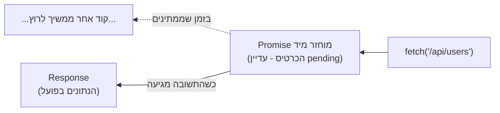

## מה זה?

Fetch API הוא הכלי המובנה בדפדפן (וב-Node.js 18+) לשלוח בקשה לשרת ולבקש ממנו מידע — בדיוק הדוגמה ששימשה אותנו בשני השיעורים הקודמים. לפני שנצלול: **שרת** הוא מחשב אחר, לרוב במקום פיזי אחר בעולם, שמחזיק נתונים ויודע לענות לבקשות שמגיעות אליו דרך האינטרנט. כשכתבנו `fetch("/api/users")`, שלחנו בקשה כזו — "שלח לי בבקשה את רשימת המשתמשים". הבעיה שנפתרת: אי אפשר לקבל את התשובה **מיד** בשורת הקוד הבאה (למדנו למה בשני השיעורים הקודמים) — צריך דרך מסודרת לומר "תן לי לדעת כשהתשובה מוכנה".

## מילות מפתח שחשוב לזכור

• URL — הכתובת של המשאב שמבקשים מהשרת, למשל `"/api/users"`

• `fetch(url)` — שולחת בקשת HTTP (בקשת רשת) לכתובת הנתונה

• Promise — Object מיוחד שמחזיר `fetch` **מיד**, עוד לפני שהתשובה בפועל הגיעה — "כרטיס המתנה" שמייצג ערך שעוד יגיע

• `Response` — הערך שה-Promise "מכיל" בסוף: אובייקט שמייצג את תגובת השרת (סטטוס, גוף התגובה)

• `.then(callback)` — דרך "לקבל" את הערך מתוך Promise כשהוא מוכן; נלמד לעומק בשיעור הבא

```javascript
const result = fetch("/api/users");
console.log(result); // Promise { <pending> } — עדיין לא הנתונים עצמם!
```



## הסבר עיקרי

Promise כ"כרטיס המתנה" — דמיינו שאתם מזמינים בגד לניקוי יבש. כשמוסרים את הבגד, מקבלים **כרטיס** מיד — הכרטיס הוא לא הבגד הנקי עצמו, אבל הוא ה"הבטחה" שהבגד יהיה מוכן, ודרכו תדעו לאסוף אותו כשהוא מוכן. `Promise` עובד באותו עיקרון: `fetch(url)` מחזירה Promise **באופן מיידי**, אבל ה-Promise הוא לא הנתונים בפועל — הוא ה"כרטיס" שדרכו נקבל את הנתונים כשהם מוכנים. איך בדיוק "פודים" את הכרטיס הזה? זו בדיוק השאלה שהשיעור הבא (Callbacks) והשיעור שאחריו (Promises) עונים עליה לעומק.

תצוגה מקדימה קצרה של איך זה נראה בפועל — כדי שתראו שהכלי אכן שלם ועובד, הנה השימוש המלא ב-`fetch` עם `.then` (עוד לא נסביר כאן איך `.then` עובד בדיוק — זה החומר של שני השיעורים הבאים; לעת עתה, רק הכירו את הצורה):

```javascript
fetch("/api/users")
  .then(response => response.json()) // "פודים" את הכרטיס, מקבלים את התגובה
  .then(data => console.log(data));  // "פודים" כרטיס נוסף, מקבלים את הנתונים עצמם
```

שימו לב שיש **שני** שלבי `.then` — זה לא טעות. `fetch` עצמה נותנת Promise ל-`Response` (מעטפת התגובה: קוד סטטוס וכו'); ולהוציא ממנה את התוכן בפועל (`response.json()`) זהו עוד Promise נפרד. שני השלבים האלה יוסברו לעומק בהמשך.

בקשות GET מול POST — כברירת מחדל, `fetch(url)` שולחת בקשת `GET` — "תן לי מידע". אפשר גם לשלוח `POST` — "הנה מידע חדש, שמור אותו" — על ידי הוספת אובייקט אפשרויות שני: `fetch(url, { method: "POST", ... })`. נעמיק בזה בהמשך היחידה.

## יתרונות

מובנה בדפדפן וב-Node — אין צורך להתקין ספרייה חיצונית; ממשק אחיד לכל סוגי הבקשות (GET, POST ועוד); מחזיר Promise, שהוא הדרך הסטנדרטית המודרנית להתמודד עם תוצאות שמגיעות מאוחר יותר.

## חסרונות

הערך המיידי שמתקבל (ה-Promise) הוא לא הנתונים עצמם — צריך ללמוד איך "לפדות" אותו (השיעורים הבאים); בלי הבנת Promise, הקוד עלול להיראות "לא עובד" (למשל, הדפסת ה-Promise במקום התוכן).

## נקודות חשובות למבחן / ראיון עבודה

• `fetch(url)` שולחת בקשת HTTP ומחזירה **מיד** Promise — לא את התשובה עצמה

• Promise הוא Object שמייצג ערך שיגיע בעתיד, לא הערך עצמו

• יש שני שלבי Promise טיפוסיים ב-fetch: אחד ל-`Response`, אחד לתוכן שבתוכו (`.json()`)

• ברירת המחדל של `fetch` היא בקשת `GET`

## טעויות נפוצות

• ציפייה ש-`const data = fetch(url)` יכיל את הנתונים עצמם — הוא מכיל Promise, לא את הנתונים

• הדפסת התוצאה של `fetch(...)` ישירות ותמיהה למה רואים `Promise { <pending> }` ולא נתונים

• שכחה ששלב `.json()` הוא בעצמו Promise נוסף, לא ערך מיידי

## סיכום

Fetch API שולחת בקשת HTTP לשרת. `fetch(url)` מחזירה **מיד** Promise — "כרטיס המתנה" לתוצאה, לא התוצאה עצמה. איך "פודים" את הכרטיס הזה בפועל — קודם עם Callbacks (הגישה ההיסטורית), ואז עם Promises לעומק (הגישה המודרנית) — זה בדיוק מה שהשיעורים הבאים מלמדים, עם `fetch` כדוגמה חוזרת לאורך כולם.

## דוקומנטציה רשמית

[MDN — Fetch API](https://developer.mozilla.org/en-US/docs/Web/API/Fetch_API)

---

## תרגילים

### תרגיל 1 — הכירו את ה-Promise

**המשימה:** כתבו `const p = fetch("/api/users"); console.log(p);`, והריצו. כתבו במשפט אחד למה מה שמודפס הוא לא הנתונים עצמם.

**בדיקה:** הפלט הוא משהו כמו `Promise { <pending> }` — לא מערך או object עם נתונים אמיתיים.

### תרגיל 2 — GET מול POST

**המשימה:** כתבו שתי קריאות `fetch` לאותו URL: `fetch("/api/users")` (GET רגיל, בלי אפשרויות נוספות), ואז `fetch("/api/users", { method: "POST" })`. כתבו במשפט אחד מה ההבדל בכוונה של כל אחת.

**בדיקה:** ההסבר שלכם מבחין בין "בקש מידע קיים" (GET) ל"צור רשומה חדשה" (POST).

### תרגיל 3 — שני שלבים

**המשימה:** בכתיבה בלבד (לא הרצה): הסבירו למה `fetch(url).then(res => res.json())` צריך **שני** שלבי Promise (אחד ל-`Response`, אחד לתוכן) ולא מספיק אחד.

**בדיקה:** ההסבר שלכם מזכיר במפורש ש-`response.json()` היא בעצמה פעולה אסינכרונית שמחזירה Promise נפרד.

---

## פרויקט מסכם

**המשימה:** כתבו קובץ שמדגים את "כרטיס ההמתנה" של Promise.

**דרישות:**
1. שמרו את התוצאה של `fetch("/api/users")` במשתנה בשם `result`
2. הדפיסו את `result` עם `console.log`
3. מעל ההדפסה, כתבו הערה שמסבירה מה בדיוק אתם רואים בפלט (רמז: זה לא הנתונים)
4. בהערה נוספת בתחתית הקובץ, כתבו במילים שלכם את ההבדל בין "הבטחה לתוצאה" (Promise) לבין "התוצאה עצמה"

**בדיקה:** ההערות שלכם מסבירות נכון את מה שראיתם בפועל בפלט של `console.log(result)`.

---

## מה בפרק הבא

בפרק הבא נלמד על **Callbacks** — בשיעור הקודם ראינו ש-`fetch` מחזירה Promise — "כרטיס המתנה" לתוצאה שעוד לא הגיעה. השאלה שנשארה פתוחה: איך בדיוק "פודים" את הכרטיס הזה ומקבלים את התוצאה כשהיא מוכנה? לפני שנענה על כך עם Promises (בשיעו
