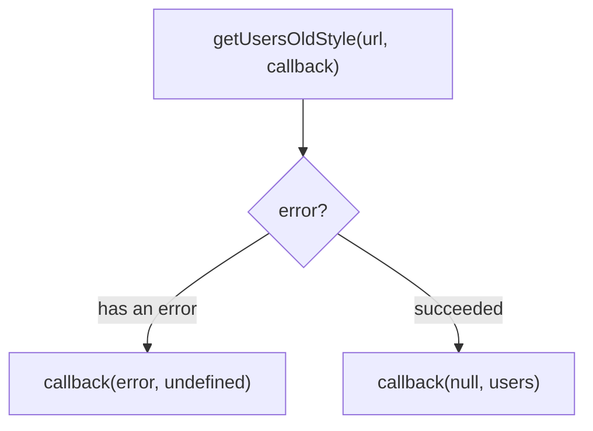

## מה זה?

בשיעור הקודם ראינו ש-`fetch` מחזירה Promise — "כרטיס המתנה" לתוצאה שעוד לא הגיעה. השאלה שנשארה פתוחה: איך בדיוק "פודים" את הכרטיס הזה ומקבלים את התוצאה כשהיא מוכנה? לפני שנענה על כך עם Promises (בשיעור הבא), כדאי להכיר את הגישה **ההיסטורית** שקדמה להם: **Callback** — פונקציה שמעבירים כארגומנט לפונקציה אחרת, כדי שהיא תופעל בשבילנו כשהתוצאה מוכנה. הרעיון הזה כבר מוכר לכם בלי לשים לב: הפונקציה שמעבירים ל-`arr.map(item => item.name)` היא בדיוק callback.

## מילות מפתח שחשוב לזכור

• Callback — פונקציה שמועברת כארגומנט לפונקציה אחרת, כדי שזו תפעיל אותה בזמן מסוים

• Higher-Order Function — פונקציה שמקבלת פונקציה אחרת כארגומנט (כמו `map`, או הדוגמה למטה)

• Synchronous Callback — callback שמופעל **מיד**, באותה ריצה (כמו ב-`map`/`filter`)

• Asynchronous Callback — callback שמופעל **מאוחר יותר**, אחרי שפעולה איטית הסתיימה

• Error-first Callback — קונבנציה ישנה ונפוצה: הפונקציה מקבלת `(error, data)` — הפרמטר הראשון תמיד שגיאה (או `null` אם אין)

• Callback Hell — הרבה callbacks מקוננים זה בתוך זה, שהופכים קשים לקריאה

```javascript
// Historical example: this is how an old fetch-like function might have looked with a callback,
// before the Promise era (the real fetch doesn't work this way — it returns a Promise, as we saw)
function getUsersOldStyle(url, callback) {
  // ...internal code that simulates a network request...
  callback(null, [{ id: 1, name: "Dana" }]); // error-first: null = no error
}

getUsersOldStyle("/api/users", (error, users) => {
  if (error) return console.error(error);
  console.log(users);
});
```



## הסבר עיקרי

כבר משתמשתם ב-Callbacks בלי לדעת — `arr.map(item => item.name)`: הפונקציה `item => item.name` היא callback; `map` היא Higher-Order Function כי היא "מקבלת" פונקציה כארגומנט ומפעילה אותה עבור כל איבר. שם ה-callback הזה מופעל **מיד**, בתוך אותה ריצה — זה Synchronous Callback.

מה קורה כשהתוצאה לא מוכנה מיד — הדוגמה למעלה (`getUsersOldStyle`) ממחישה איך פעולות ישנות (**לפני** ש-Promises היו קיימים בשפה) פתרו את בעיית "התוצאה מגיעה מאוחר יותר": במקום להחזיר ערך ישירות, הפונקציה מקבלת **פונקציה נוספת** (callback) כארגומנט, ומפעילה אותה בעצמה כשהתוצאה מוכנה. זו הייתה הדרך שבה JavaScript התמודדה עם async **לפני** ש-Promise (וממילא `fetch`, שמבוסס עליו) נכנסו לשפה.

Error-first כקונבנציה ישנה — שימו לב לפרמטר הראשון, `error`: אם משהו השתבש, הוא יכיל את השגיאה; אם לא, הוא `null`. הרגל הבדיקה `if (error) return ...` בתחילת ה-callback חשוב כדי לא "לפספס" שגיאה שקטה. תבנית זו עדיין מופיעה בקוד ישן (ובחלק מספריות Node.js), אבל `fetch` המודרני **לא** משתמש בה בכלל — הוא משתמש ב-Promise, שנלמד לעומק בשיעור הבא.

הבעיה: Callback Hell — כשצריך לבצע כמה פעולות אסינכרוניות **תלויות זו בזו** (קבל משתמש → ואז, בעזרת התוצאה, קבל את ההזמנות שלו → ואז...), עם callbacks זה אומר לקנן callback בתוך callback בתוך callback — "פירמידה" שהולכת ונהיית קשה יותר לקריאה, ועוד יותר קשה לטפל בשגיאות שלה בצורה מסודרת. זו בדיוק הבעיה שדחפה את השפה להמציא Promises — הפתרון של השיעור הבא.

## יתרונות

פשוט להבנה בבסיסו — "פונקציה שמופעלת כשמוכן"; מתאים היטב למקרים שיכולים לקרות **כמה פעמים** (כמו אירוע לחיצה, לא רק בקשת רשת חד-פעמית); זו עדיין הדרך שבה `map`/`filter` עובדים.

## חסרונות

Callback Hell (קינון עמוק) הופך קוד לבלתי-קריא כשיש כמה שלבים תלויים; טיפול בשגיאות מפוזר — צריך לבדוק `if (error)` בנפרד בכל callback; קשה לדבג רצף ארוך של callbacks מקוננים כי קשה לעקוב אחרי סדר ההרצה.

## נקודות חשובות

• Callback = פונקציה שמועברת כארגומנט, מופעלת ע"י הפונקציה שקיבלה אותה

• Higher-Order Function = פונקציה שמקבלת פונקציה כארגומנט (או מחזירה פונקציה)

• Sync callback (כמו ב-`map`) רץ מיד; Async callback רץ מאוחר יותר

• Error-first pattern: `(error, data) => {}` — קונבנציה ישנה, לא בשימוש ב-`fetch` המודרני

• Callback Hell הוא הסימן המעשי שהוביל להמצאת Promises

## טעויות נפוצות

• שכחת בדיקת ה-`error` הראשון ב-error-first callback

• קינון callbacks עמוק מדי במקום לשקול מבנה אחר (Promises, בשיעור הבא)

• בלבול בין callback סינכרוני (`map`) לאסינכרוני — חשיבה ששניהם "רצים באותו רגע"

## סיכום

Callback הוא פונקציה שמעבירים כארגומנט כדי שתופעל כשהתוצאה מוכנה — מיד (Sync) או מאוחר יותר (Async). זו הייתה הגישה המקורית להתמודדות עם async ב-JavaScript, לפני שהומצא Promise. Callback Hell (קינון עמוק כשיש כמה שלבים תלויים) הוא הבעיה שהובילה בדיוק לפתרון של השיעור הבא: Promises — שבהם `fetch` עצמו משתמש.

## דוקומנטציה רשמית

[MDN — Callback function](https://developer.mozilla.org/en-US/docs/Glossary/Callback_function)

---

## תרגילים

### תרגיל 1 — callback בסיסי

**המשימה:** כתבו פונקציה `processArray(arr, callback)` שרצה על כל איבר במערך `arr` ומפעילה עליו את `callback`. השתמשו בה עם `callback` שמדפיס כל איבר.

**בדיקה:** `processArray([1,2,3], n => console.log(n))` מדפיס שלוש שורות: `1`, `2`, `3`.

### תרגיל 2 — error-first

**המשימה:** כתבו פונקציה `divide(a, b, callback)` שקוראת ל-`callback(error, result)`: אם `b === 0`, מעבירה `error = "Cannot divide by zero"` ו-`result = undefined`; אחרת מעבירה `error = null` ו-`result` עם התוצאה.

**בדיקה:** `divide(10, 2, (err, res) => console.log(err, res))` מדפיס `null 5`; `divide(10, 0, ...)` מדפיס את הודעת השגיאה ו-`undefined`.

### תרגיל 3 — דמיינו Callback Hell

**המשימה:** בכתיבה בלבד (לא הרצה): שרטטו (בפסאודו-קוד או אנגלית פשוטה) איך היה נראה קוד עם 3 callbacks מקוננים לרצף "קבל משתמש → קבל את ההזמנות שלו → קבל את פרטי ההזמנה הראשונה".

**בדיקה:** התיאור שלכם מראה בבירור את "מדרגות" ההזחה (indentation) שנוצרות עם כל callback נוסף.

---

## פרויקט מסכם

**המשימה:** בנו מערכת "התראות" ישנה-סגנון מבוססת callbacks (לא `fetch` אמיתי — תרגול המושג).

**דרישות:**
1. `getNotificationsOldStyle(userId, callback)` שמפעילה את `callback(error, notifications)` בסגנון error-first (אפשר להשתמש ב-`setTimeout` פנימי כדי לדמות עיכוב, או להפעיל את ה-callback ישירות)
2. אם `userId` שלילי או `0` — מעבירה שגיאה (`"Invalid userId"`) במקום נתונים
3. אחרת — מעבירה מערך התראות לדוגמה (2-3 מחרוזות)
4. קריאה אחת עם `userId` תקין וקריאה אחת עם `userId` לא תקין, כל אחת מדפיסה את מה שחזר

**בדיקה:** הקריאה עם `userId` תקין מדפיסה את מערך ההתראות; הקריאה עם `userId` לא תקין מדפיסה את הודעת השגיאה, לא נתונים.

---

## מה בפרק הבא

בפרק הבא נלמד על **Promises** — עכשיו נסגור את המעגל: בשיעור על Fetch API ראינו ש-`fetch` מחזירה **מיד** Promise — "כרטיס המתנה" לתוצאה. בשיעור על Callbacks ראינו את הגישה **הישנה** לטיפול בתוצאות מאוחרות, ואת הבעיה שלה (Callback He
