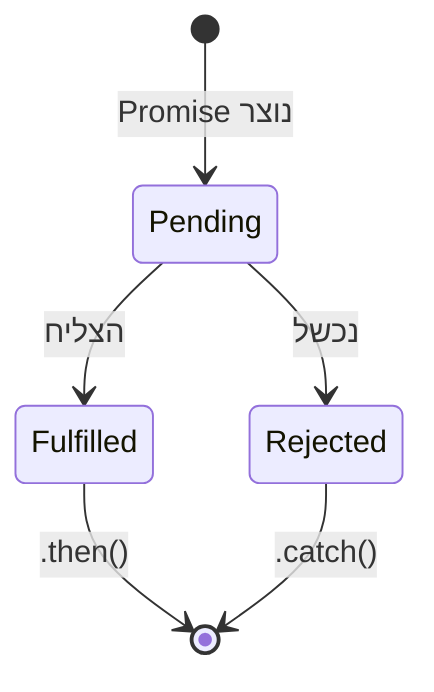

## מה זה?

עכשיו נסגור את המעגל: בשיעור על Fetch API ראינו ש-`fetch` מחזירה **מיד** Promise — "כרטיס המתנה" לתוצאה. בשיעור על Callbacks ראינו את הגישה **הישנה** לטיפול בתוצאות מאוחרות, ואת הבעיה שלה (Callback Hell). Promise הוא בדיוק ה-Object שנועד לפתור את שתי הבעיות האלה יחד: הוא **הכרטיס עצמו** — Object שמייצג ערך שאינו זמין עדיין, אך יהיה זמין בעתיד (או ייכשל) — עם ממשק מסודר, בלי קינון, ל"פדות" אותו.

## מילות מפתח שחשוב לזכור

• Pending (ממתין) — המצב הראשוני של Promise: התוצאה עוד לא הגיעה

• Fulfilled (הצליח) — ה-Promise הושלם בהצלחה, עם ערך

• Rejected (נכשל) — ה-Promise נכשל, עם שגיאה

• `.then(callback)` — רושם פונקציה שתופעל **כשה-Promise יצליח** — "פדיית הכרטיס" בהצלחה

• `.catch(callback)` — רושם פונקציה שתופעל **אם ה-Promise ייכשל**

• `.finally(callback)` — פונקציה שתמיד תופעל בסוף, הצליח או נכשל

• `Promise.all(array)` — ממתין לכמה Promises יחד; נכשל מיד אם אחד מהם נכשל

```javascript
fetch("/api/users")           // Promise 1: מחזיר Response
  .then(response => response.json()) // Promise 2: מחזיר את הנתונים
  .then(users => console.log(users)) // מריצים על הנתונים בפועל
  .catch(error => console.error(error)) // אם משהו נכשל בדרך
  .finally(() => console.log("הבקשה הסתיימה"));
```



## הסבר עיקרי

עכשיו זה מסתדר — בשיעור Fetch API הראנו את שני ה-`.then` בלי להסביר איך הם עובדים. עכשיו אפשר: כל `.then()` **מחזיר Promise חדש** — וזו הסיבה שאפשר "לשרשר" אותם ברצף, כל אחד ממשיך מאיפה שהקודם הפסיק. `response.json()` (השלב השני) הוא בעצמו פעולה אסינכרונית (קריאת התוכן לוקחת זמן) — ולכן היא **גם** מחזירה Promise, שדורש `.then` נוסף כדי "לפדות" אותו.

היתרון על פני callbacks: טיפול שגיאות מרוכז — זוכרים את Callback Hell מהשיעור הקודם, ואת הצורך לבדוק `if (error)` בנפרד בכל callback? עם Promises, שגיאה שקורית **בכל שלב** בשרשרת "קופצת" ישירות אל ה-`.catch()` הקרוב ביותר — מקום אחד שמטפל בכל השגיאות של כל השרשרת, בלי בדיקות חוזרות.

מאיפה בדיוק מגיע Promise — כשרוצים ליצור Promise בעצמנו (לא רק להשתמש באחד מ-`fetch`), כותבים `new Promise((resolve, reject) => {...})`: קוראים ל-`resolve(value)` כשהפעולה הצליחה, ל-`reject(error)` כשנכשלה. זה בדיוק המנגנון הפנימי ש-`fetch` (ופונקציות async מובנות אחרות) בונות עליו.

Promise.all להרצה מקבילית — כשיש כמה פעולות async **לא-תלויות זו בזו** (למשל, לבקש נתוני משתמש ונתוני מוצר בו-זמנית, לא בזה-אחר-זה), `Promise.all([...])` מריץ את שתיהן **במקביל** וממתין לשתיהן יחד — מהיר יותר מלחכות לראשונה ואז להתחיל את השנייה. שימו לב: `Promise.all` נכשל **מיד** אם אחת מהן נכשלת, גם אם השאר עדיין רצות; `Promise.allSettled` הוא חלופה שמחכה לכולן תמיד, גם אם חלקן נכשלו.

## יתרונות

קריא משמעותית יותר מ-Callback Hell — אין קינון; טיפול שגיאות מרוכז דרך `.catch()` יחיד לשרשרת שלמה; `Promise.all`/`allSettled` נותנים כלים מובנים להרצה מקבילית ויעילה.

## חסרונות

שרשראות `.then()` ארוכות עדיין פחות קריאות מקוד שנראה סינכרוני לגמרי (הפתרון הסופי בשיעור הבא: `async`/`await`); `Promise.all` "נכשל מיד" עלול להיות לא-רצוי כשרוצים תוצאות חלקיות.

## נקודות חשובות למבחן / ראיון עבודה

• Promise עובר בין שלושה מצבים: Pending → Fulfilled או Rejected (ולא חוזר אחורה)

• כל `.then()` מחזיר Promise חדש — זה מה שמאפשר Chaining (שרשור)

• שגיאה בכל שלב בשרשרת קופצת ישר ל-`.catch()` הקרוב ביותר

• `Promise.all` נכשל מיד עם כישלון ראשון; `Promise.allSettled` ממתין לכולן תמיד

## טעויות נפוצות

• שכחת `.catch()` בסוף שרשרת — שגיאה "נעלמת" בלי שאף אחד מטפל בה

• שימוש ב-`Promise.all` כשרוצים תוצאות חלקיות גם אם חלק נכשל — צריך `allSettled`

• קריאה כפולה ל-`resolve`/`reject` בתוך Promise שנוצר ידנית (השנייה פשוט מתעלמת)

## סיכום

Promise הוא ה-Object ש-`fetch` (ופעולות async אחרות) מחזיר — "הכרטיס" מהשיעור על Fetch API. הוא עובר בין שלושה מצבים: Pending → Fulfilled/Rejected. `.then()`/`.catch()`/`.finally()` מאפשרים שרשור קריא במקום Callback Hell, עם טיפול שגיאות מרוכז במקום אחד. `Promise.all` מריץ פעולות עצמאיות במקביל.

## דוקומנטציה רשמית

[MDN — Promise](https://developer.mozilla.org/en-US/docs/Web/JavaScript/Reference/Global_Objects/Promise)

---

## תרגילים

### תרגיל 1 — שרשרת fetch מלאה

**המשימה:** כתבו `fetch("/api/users")` עם שרשרת `.then` מלאה: קבלת `Response`, המרה ל-JSON (`.then(response => response.json())`), הדפסת התוצאה, ו-`.catch()` בסוף שמדפיס שגיאה אם קרתה.

**בדיקה:** אם השרת לא זמין (URL שגוי בכוונה), רואים בקונסול את הודעת השגיאה מה-`.catch()` ולא שגיאה לא-מטופלת (unhandled) אדומה.

### תרגיל 2 — Promise ידני

**המשימה:** כתבו פונקציה `wait(ms)` שמחזירה `new Promise((resolve) => {...})` המתמלאת (`resolve`) אחרי `ms` מילישניות. קראו לה עם `.then()` שמדפיס `"done"`.

**בדיקה:** `wait(1000).then(() => console.log("done"))` מדפיס `"done"` בערך שנייה אחרי הקריאה, לא מיד.

### תרגיל 3 — Promise.all

**המשימה:** כתבו שתי קריאות `fetch` לשני URL-ים שונים והריצו אותן במקביל עם `Promise.all`, ואז הדפיסו את שתי התוצאות יחד.

**בדיקה:** שתי התוצאות מודפסות רק אחרי ששתי הבקשות הסתיימו — לא אחת אחרי השנייה.

---

## פרויקט מסכם

**המשימה:** בנו "מנהל בקשות" ל-2 משאבים תלויים, עם `fetch` אמיתי.

**דרישות:**
1. `fetch("/api/user/1")` ואז, בעזרת התוצאה, `fetch` נוסף להזמנות של אותו משתמש — שרשור `.then`
2. `.catch()` אחד בסוף שתופס כל שגיאה בכל שלב בשרשרת
3. `.finally()` שמדפיס "הבקשה הסתיימה"

**בדיקה:** במקרה תקין, מודפסות ההזמנות של המשתמש ואז "הבקשה הסתיימה". אם אחת הבקשות נכשלת (למשל URL שגוי), מודפסת השגיאה דרך ה-`.catch()` היחיד — ועדיין מודפס "הבקשה הסתיימה" בסוף.

---

## מה בפרק הבא

בפרק הבא נלמד על **Async / Await** — בשיעור הקודם ראינו איך Promises פותרים את Callback Hell, אבל שרשראות `.then()` ארוכות עדיין לא נראות כמו קוד "רגיל" — יש בהן הרבה `()  =>` וסוגריים מקוננים. `async`/`await` הוא תחביר (syntax) חדש יותר
