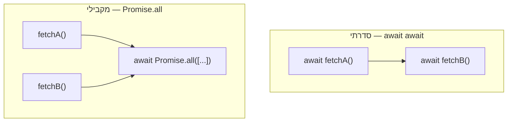

## מה זה?

בשיעור הקודם ראינו איך Promises פותרים את Callback Hell, אבל שרשראות `.then()` ארוכות עדיין לא נראות כמו קוד "רגיל" — יש בהן הרבה `()  =>` וסוגריים מקוננים. `async`/`await` הוא תחביר (syntax) חדש יותר שנותן לנו לכתוב בדיוק אותו קוד Promise, אבל בצורה שנראית ומתנהגת **הרבה יותר** כמו קוד סינכרוני רגיל — קריא כאילו כל שורה "מחכה" לקודמת, למרות שברקע זה עדיין בדיוק אותו מנגנון Promise שלמדנו.

## מילות מפתח שחשוב לזכור

• `async function` — מילת מפתח שמוסיפים לפני הגדרת פונקציה; היא הופכת אותה לפונקציה שמחזירה **תמיד** Promise, גם אם בפנים כתבתם `return` עם ערך רגיל

• `await` — מילת מפתח שאפשר להשתמש בה **רק** בתוך `async function`; היא "עוצרת" את הקוד בשורה הזו עד שה-Promise שאחריה יסתיים, ואז מחזירה את הערך שבתוכו

• `try`/`catch` — מבנה טיפול-שגיאות מוכר מקוד סינכרוני; עם `await`, הוא תופס בדיוק את אותן שגיאות ש-`.catch()` היה תופס בשיעור הקודם

• Sequential (סדרתי) — כמה שורות `await` זו אחרי זו; כל אחת ממתינה לקודמת שתסתיים

• Parallel (מקבילי) — הרצת כמה Promises **בו-זמנית** עם `Promise.all` (מהשיעור הקודם), ולא בזה-אחר-זה

```javascript
async function getUser(id) {
  const res = await fetch(`/api/users/${id}`);
  if (!res.ok) throw new Error(`HTTP ${res.status}`);
  return res.json();
}
```



## הסבר עיקרי

אותו קוד, שני תחבירים — הדוגמה למעלה שקולה **בדיוק** לקוד ה-`fetch().then()` שכתבנו בשיעור הקודם על Promises. שום דבר לא השתנה "מתחת למכסה המנוע" — עדיין יש Promise, עדיין הוא עובר Pending → Fulfilled/Rejected. השינוי היחיד הוא איך זה **נראה**: במקום לשרשר `.then()` אחרי `.then()`, כותבים `await` לפני כל קריאה, ושורה אחרי שורה — בדיוק כמו קוד רגיל.

איך `await` עובד בפועל, בלי לבלבל עם "הקפאה" — כשכותבים `await` בתוך `async function`, ה-JavaScript **לא** עוצרת את כל התוכנית (אנחנו כבר יודעים מהשיעור על Event Loop ש-JavaScript לעולם לא "קופאת" ככה). היא רק עוצרת את ה**המשך של הפונקציה הזו בלבד** — קוד אחר בתוכנית (למשל, טיפול בלחיצת כפתור אחרת) ממשיך לרוץ כרגיל בינתיים. כשה-Promise מסתיים, הפונקציה ממשיכה בדיוק מהנקודה שבה עצרה.

Sequential מול Parallel — שתי שורות `await` אחת אחרי השנייה הן ביצוע **סדרתי**: השנייה מתחילה רק אחרי שהראשונה הסתיימה לגמרי — טוב אם השנייה **צריכה** את תוצאת הראשונה. אבל אם שתי הבקשות **עצמאיות לגמרי** (למשל, לבקש נתוני משתמש ונתוני הגדרות — שני דברים לא-קשורים), ביצוע סדרתי מבזבז זמן שלא לצורך; `const [a, b] = await Promise.all([fetchA(), fetchB()])` (הכלי מהשיעור הקודם) מריץ את שתיהן במקביל.

try/catch כתחליף מוכר ל-`.catch()` — כש-Promise נדחה (`reject`) בתוך `async function`, השורה עם ה-`await` שממתינה לו **זורקת שגיאה** בפועל — בדיוק כמו `throw` בקוד סינכרוני רגיל. לכן `try`/`catch`, שכבר מוכר לכם ממקומות אחרים בשפה, תופס אותה באותה צורה — בלי ללמוד תחביר חדש לגמרי לטיפול שגיאות.

## יתרונות

קריא כמעט כמו קוד סינכרוני רגיל — קל יותר לעקוב אחרי הזרימה; דיבוג קל יותר, כי הודעות שגיאה מצביעות בבירור על השורה הבעייתית; `try`/`catch` מוכר, בלי ללמוד דפוס טיפול-שגיאות נפרד.

## חסרונות

`await` סדרתי מיותר (כששתי הבקשות עצמאיות) הוא באג ביצועים נפוץ וקל לפספס אם לא זוכרים על `Promise.all`; שכחת `await` היא שגיאה **שקטה** — מקבלים Promise object במקום הערך בפועל, בלי הודעת שגיאה שמסבירה מה קרה.

## נקודות חשובות למבחן / ראיון עבודה

• פונקציית `async` מחזירה תמיד Promise, גם אם מוחזר ערך פשוט מבפנים

• `await` זמין רק בתוך פונקציית `async`; מחוץ לזה זו שגיאת syntax

• שתי שורות `await` רצופות = סדרתי; `await Promise.all([...])` = מקבילי

• שכחת `await` = קבלת Promise object במקום הערך בפועל — בלי שגיאה גלויה

## טעויות נפוצות

• `await` סדרתי לבקשות עצמאיות במקום `Promise.all` — פוגע בביצועים שלא לצורך

• שכחת `await` על קריאה לפונקציית `async` וניסיון להשתמש בתוצאה כאילו היא ערך רגיל

• אי-שימוש ב-`try`/`catch` סביב `await` — כישלון שקט כש-Promise נדחה בלי טיפול

## סיכום

`async`/`await` הוא תחביר קריא יותר מעל אותו מנגנון Promise שכבר הכרנו: `async` מחזיר תמיד Promise, `await` ממתין לתוצאה בלי לחסום את שאר התוכנית. `try`/`catch` מטפל בשגיאות בדיוק כמו קוד סינכרוני רגיל. `await` סדרתי מתאים כשיש תלות בין הבקשות; `Promise.all` מתאים כשהן עצמאיות.

## דוקומנטציה רשמית

[MDN — async function](https://developer.mozilla.org/en-US/docs/Web/JavaScript/Reference/Statements/async_function)

---

## תרגילים

### תרגיל 1 — המרה מ-then ל-await

**המשימה:** קחו את קוד ה-`fetch().then()` המלא משיעור Promises (תרגיל 1 שם) ושכתבו אותו כפונקציית `async` עם `await` ו-`try`/`catch` במקום `.then`/`.catch`.

**בדיקה:** ההתנהגות זהה לגרסה המקורית — נתונים מודפסים בהצלחה, ושגיאה נתפסת ומודפסת דרך ה-`catch` אם הבקשה נכשלת.

### תרגיל 2 — סדרתי מול מקבילי

**המשימה:** כתבו שתי גרסאות של קריאה לשתי בקשות `fetch` עצמאיות (URL-ים שונים): גרסה א' עם שתי שורות `await` רצופות, גרסה ב' עם `await Promise.all([...])`. מדדו זמן ריצה של כל גרסה עם `console.time`/`console.timeEnd`.

**בדיקה:** זמן הריצה של גרסה ב' (מקבילי) קטן או שווה לזמן הריצה של גרסה א' (סדרתי) — לא גדול ממנו.

### תרגיל 3 — טיפול שגיאות

**המשימה:** כתבו פונקציית `async` שקוראת ל-`fetch` עם URL לא-קיים בכוונה, ותופסת את השגיאה עם `try`/`catch`, ומדפיסה הודעה ברורה (לא סתם את אובייקט השגיאה הגולמי).

**בדיקה:** הפונקציה לא זורקת שגיאה לא-מטופלת (unhandled) — הקונסול מציג רק את ההודעה הברורה שכתבתם.

---

## פרויקט מסכם

**המשימה:** שכתבו את "מנהל הבקשות" משיעור Promises (התרגיל שם) עם `async`/`await`.

**דרישות:**
1. פונקציית `async` אחת שמחליפה את כל שרשרת ה-`.then()`
2. `try`/`catch` לטיפול בשגיאות במקום `.catch()`
3. אם יש שתי קריאות עצמאיות — הריצו אותן עם `Promise.all`, לא `await` סדרתי

**בדיקה:** אותה תוצאה פונקציונלית כמו הגרסה עם `.then()` — נתונים מודפסים בהצלחה, שגיאה נתפסת בבירור אם קורית, ושתי הבקשות העצמאיות (אם יש) רצות במקביל ולא בזו-אחר-זו.
