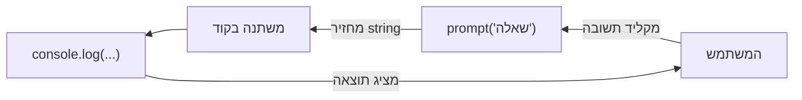

## מה זה?

עד עכשיו כל הערכים בקוד היו קבועים מראש בתוך הקובץ (`let age = 25`) — אבל מה אם רוצים שהמשתמש **עצמו** יזין את הגיל שלו בזמן ריצה? צריך דרך "לשאול" את המשתמש ולקבל תשובה. `prompt()` עושה בדיוק את זה — פותח תיבת דו-שיח בדפדפן שמחכה להקלדה — וביחד עם `console.log()` (שכבר מוכר) הם שני הכיוונים של **IO**: Input (קלט, מהמשתמש פנימה) ו-Output (פלט, מהקוד החוצה).

## מילות מפתח שחשוב לזכור

• `prompt(message)` — פותח תיבת דו-שיח בדפדפן עם שאלה; מחזיר את מה שהמשתמש הקליד

• Input — קלט: מידע שזורם **מהמשתמש** אל תוך הקוד (`prompt`)

• Output — פלט: מידע שזורם **מהקוד** החוצה, לתצוגה (`console.log`, `alert`)

• `prompt()` מחזיר תמיד `string` — גם אם המשתמש הקליד מספר, צריך המרה מפורשת

• `null` — מה ש-`prompt()` מחזיר אם המשתמש לוחץ "ביטול" במקום להקליד ולאשר

```javascript
// Output — כבר מוכר משיעור קודם
console.log("שלום!");

// Input — חדש: שואלים את המשתמש, ומחכים לתשובה
const name = prompt("מה השם שלך?");
console.log(`שלום, ${name}!`); // משלב קלט בתוך פלט
```

```javascript
// prompt() תמיד מחזיר string — גם למספרים דרושה המרה
const ageText = prompt("מה הגיל שלך?"); // "25" — טקסט, לא מספר!
const age = Number(ageText); // המרה מפורשת ל-number

console.log(typeof ageText); // "string"
console.log(typeof age); // "number"
console.log(age + 1); // 26 — עבד, כי age הוא באמת number
```



## הסבר עיקרי

`prompt()` חוסם את הקוד עד שמקבלים תשובה — כשקוראים ל-`prompt()`, הדפדפן עוצר את ריצת הסקריפט ומציג תיבת דו-שיח — שום שורת קוד אחרי `prompt()` לא רצה עד שהמשתמש מקליד ולוחץ אישור (או ביטול). זו התנהגות "חוסמת" (Blocking) — שונה משורות רגילות שרצות מיד ברצף.

תמיד `string`, גם למספרים — בדיוק כמו קלט מהמשתמש בכל שפה (נזכיר את זה שוב בהמשך הקורס בהקשרים אחרים), `prompt()` **תמיד** מחזיר טקסט — גם אם המשתמש הקליד `"25"`. אם מנסים לחבר את זה כמספר בלי המרה (`ageText + 1`), JavaScript **לא** זורקת שגיאה — היא מבצעת חיבור מחרוזות (`"25" + 1` נותן `"251"`, לא `26`!) — בדיוק הסוג של הפתעה שדיברנו עליו כשדיברנו על Dynamic Typing. `Number(ageText)` הוא ההמרה המפורשת שמונעת את הבאג הזה.

ביטול מחזיר `null`, לא מחרוזת ריקה — אם המשתמש לוחץ "ביטול" בתיבת הדו-שיח, `prompt()` מחזיר `null` — לא `""` (מחרוזת ריקה) ולא שגיאה. קוד שמשתמש בתוצאה בלי לבדוק את זה (למשל `name.length` על `null`) עלול לקרוס — נקודה שתחזור ותועמק כשנדבר על תנאים בפרק הבא.

## יתרונות

`prompt()` נותן דרך מהירה וקלה לקבל קלט אינטראקטיבי בדפדפן בלי טופס HTML מלא; משולב עם `console.log` נותן לולאת עבודה שלמה — שאלה, קלט, תגובה; שימושי במיוחד לתרגול ולמידה מהירה.

## חסרונות

`prompt()` חוסם את כל העמוד עד לתשובה — לא מתאים לאתרים אמיתיים (חוויית משתמש גרועה); מחזיר תמיד `string`, מה שדורש המרה זהירה בכל שימוש עם מספרים; `null` בביטול קל לשכוח לבדוק ולגרום לקריסה.

## נקודות חשובות למבחן / ראיון עבודה

• `prompt()` = Input (קלט מהמשתמש); `console.log()` = Output (פלט מהקוד)

• `prompt()` תמיד מחזיר `string`, גם אם הוקלד מספר — נדרשת המרה מפורשת (`Number(...)`)

• חיבור `string` עם `+` על מספר לא-מומר מבצע שרשור טקסט, לא חיבור מתמטי (`"25" + 1` = `"251"`)

• ביטול תיבת ה-`prompt` מחזיר `null`, לא מחרוזת ריקה

## טעויות נפוצות

• להשתמש בתוצאת `prompt()` כמספר בלי `Number(...)` ולקבל שרשור מחרוזות במקום חיבור

• לא לבדוק `null` (ביטול) לפני שמנסים להשתמש בתוצאה כמחרוזת רגילה

• לצפות ש-`prompt()` מתאים לאתר production אמיתי — הוא כלי לימוד/דיבוג מהיר, לא רכיב ממשק משתמש

## סיכום

IO (קלט/פלט) הוא הבסיס לתקשורת דו-כיוונית בין הקוד למשתמש: `prompt()` מקבל קלט (Input) ומחזיר אותו תמיד כ-`string` — דורש המרה מפורשת (`Number(...)`) כשצריך מספר, ומחזיר `null` אם המשתמש מבטל. `console.log()` (שכבר מוכר) הוא הפלט (Output). ביחד הם מאפשרים סקריפט "לשוחח" עם מי שמריץ אותו, לא רק לפעול על ערכים קבועים מראש.

## דוקומנטציה רשמית

[MDN — Window.prompt()](https://developer.mozilla.org/en-US/docs/Web/API/Window/prompt)

[MDN — console.log()](https://developer.mozilla.org/en-US/docs/Web/API/console/log_static)

---

## תרגילים

### תרגיל 1 — שאלה ותשובה

**המשימה:** בקשו מהמשתמש את שמו עם `prompt()`, ואז הדפיסו `"שלום, <שם>!"` עם `console.log`.

**בדיקה:** הקלדת "דנה" מדפיסה `"שלום, דנה!"`.

### תרגיל 2 — המרת מספר

**המשימה:** בקשו מהמשתמש שני מספרים בנפרד עם `prompt()`, המירו כל אחד עם `Number(...)`, וחשבו והדפיסו את הסכום שלהם.

**בדיקה:** הקלדת `"3"` ו-`"4"` מדפיסה `7` (מספר), **לא** `"34"` (שרשור טקסט) — הוכחה שההמרה עבדה.

### תרגיל 3 — בדיקת ביטול

**המשימה:** קראו ל-`prompt()`, לחצו "ביטול" בפועל, והדפיסו את התוצאה עם `console.log` ואת ה-`typeof` שלה.

**בדיקה:** התוצאה המודפסת היא `null`, לא מחרוזת ריקה.

---

## פרויקט מסכם

**המשימה:** כתבו "מחשבון גיל" קטן שמקבל שנת לידה מהמשתמש ומחשב את הגיל המשוער.

**דרישות:**
1. `prompt()` לשנת לידה, עם המרה מפורשת ל-`Number`
2. חישוב הגיל (2026 פחות שנת הלידה)
3. הדפסת משפט מלא: `"בשנת 2026 אתה/את בן/בת X"`

**בדיקה:** הזנת `2000` מדפיסה גיל `26`; הזנת `"אבגד"` (לא מספר) מדפיסה `NaN` בחישוב — תופעה שתוסבר ותטופל בהמשך הקורס עם תנאים.

## מה בפרק הבא

בפרק הבא נלמד על **Conditions & Loops** — תנאים (`if`/`else`) מריצים קטע קוד רק אם עומדים בתנאי מסוים — בדיוק מה שצריך כדי לבדוק אם קלט מ-`prompt()` תקין (`null`? `NaN`?) לפני שממשיכים איתו. לולאות (`for`, `while`) מריצות אותו קטע קוד שוב ושוב.
