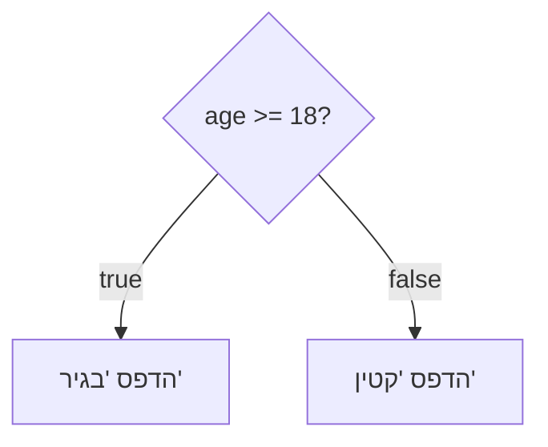
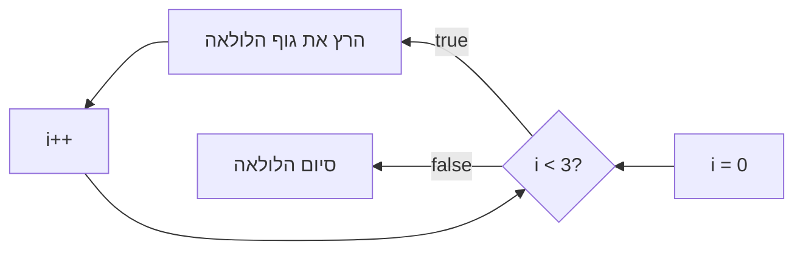

## מה זה?

תנאים (`if`/`else`) מריצים קטע קוד רק אם עומדים בתנאי מסוים; לולאות (`for`, `while`) מריצות אותו קטע קוד שוב ושוב. הבעיה שנפתרת: בלי תנאים, אי אפשר לקוד "להחליט" בין כמה אפשרויות; בלי לולאות, הדפסת 100 מספרים דורשת כתיבת 100 שורות `console.log` נפרדות — ידנית, משכפלת, ומועדת לטעויות.

## מילות מפתח שחשוב לזכור

• `if` / `else` — מריץ בלוק קוד רק אם תנאי מתקיים, אחרת מריץ את ה-`else`

• `else if` — בדיקת תנאי נוסף כשה-`if` הראשון לא התקיים

• Comparison Operators — `===` (שווה בערך ובסוג), `!==`, `>`, `<`, `>=`, `<=`

• Logical Operators — `&&` (וגם), `||` (או), `!` (לא)

• `for` — לולאה עם מונה מובנה: אתחול, תנאי עצירה, עדכון

• `while` — לולאה שרצה כל עוד תנאי מתקיים; מתאימה כשלא יודעים מראש כמה איטרציות

```javascript
const age = 20;
if (age >= 18) {
  console.log("בגיר");
} else {
  console.log("קטין");
}
```





## הסבר עיקרי

`===` ולא `==` — `===` בודק גם ערך וגם סוג (`5 === "5"` הוא `false`); `==` מבצע המרת סוגים אוטומטית לפני ההשוואה, מה שיוצר תוצאות מפתיעות (`5 == "5"` הוא `true`). לכן `===` הוא הסטנדרט בקוד מודרני — הוא צפוי ולא "מנחש".

`for` כשיודעים כמה פעמים — `for (let i = 0; i < 3; i++)` מכיל שלושה חלקים: אתחול (`i = 0`, פעם אחת), תנאי עצירה (`i < 3`, נבדק כל סיבוב), ועדכון (`i++`, אחרי כל סיבוב). מתאים כשיודעים מראש כמה איטרציות נדרשות.

`while` כשלא יודעים כמה פעמים — `while (condition)` ממשיך לרוץ כל עוד התנאי `true`, בלי מונה מובנה. מתאים למצבים כמו "המשך לבקש קלט עד שהמשתמש מקליד משהו תקין" — לא יודעים מראש כמה נסיונות יידרשו.

שילוב תנאים לוגיים — `&&` דורש ששני הצדדים יהיו `true`; `||` מספיק שצד אחד יהיה `true`. `if (age >= 18 && hasLicense)` בודק שני תנאים יחד — שניהם חייבים להתקיים.

## יתרונות

תנאים מאפשרים לקוד "להחליט" בין אפשרויות שונות בהתאם לנתונים; לולאות מונעות שכפול קוד — לוגיקה אחת שרצה N פעמים במקום N העתקות ידניות; שילוב שניהם מאפשר לוגיקה מורכבת בקוד קצר וקריא.

## חסרונות

`if`/`else if` ארוך מדי (הרבה תנאים) פוגע בקריאות; שכחת `i++` בלולאת `while` יוצרת לולאה אינסופית שתוקעת את התוכנית; שימוש ב-`==` במקום `===` עלול לייצר באגים עדינים מהמרת סוגים לא צפויה.

## נקודות חשובות למבחן / ראיון עבודה

• `===` בודק ערך וסוג; `==` מבצע המרת סוגים אוטומטית — לכן `===` עדיף

• `for` מתאים כשיודעים מראש כמה איטרציות; `while` כשלא יודעים

• `&&` דורש ששני התנאים יהיו אמת; `||` מספיק תנאי אחד

• לולאת `while` בלי עדכון למשתנה התנאי יוצרת לולאה אינסופית

## טעויות נפוצות

• שימוש ב-`==` במקום `===` וקבלת תוצאה לא צפויה מהמרת סוגים

• שכחת עדכון המשתנה בלולאת `while` — לולאה אינסופית שתוקעת את הדפדפן/תהליך

• בלבול בין `&&` (וגם, שני התנאים) ל-`||` (או, מספיק אחד)

• שכחת ה-`{}` סביב בלוק `if` עם יותר משורה אחת

## סיכום

תנאים (`if`/`else`) בוחרים איזה קוד רץ בהתאם למצב; לולאות (`for`, `while`) חוזרות על קוד בלי שכפול ידני. `===` הוא הסטנדרט להשוואה (ערך + סוג); `&&`/`||` משלבים כמה תנאים. `for` כשיודעים כמה איטרציות, `while` כשלא.

## דוקומנטציה רשמית

[MDN — if...else](https://developer.mozilla.org/en-US/docs/Web/JavaScript/Reference/Statements/if...else)

[MDN — for](https://developer.mozilla.org/en-US/docs/Web/JavaScript/Reference/Statements/for)

---

## תרגילים

### תרגיל 1 — בדיקת גיל

**המשימה:** כתבו משתנה `age` ו-`if`/`else` שמדפיס `"בגיר"` אם `age >= 18`, אחרת `"קטין"`. הריצו את הקוד שלוש פעמים עם ערכים שונים: `20`, `18`, ו-`15`.

**בדיקה:** `20` ו-`18` מדפיסים `"בגיר"`; `15` מדפיס `"קטין"`.

### תרגיל 2 — לולאת for

**המשימה:** כתבו לולאת `for` שמדפיסה את המספרים 1 עד 5, כל אחד בשורה נפרדת.

**פלט צפוי:**
```
1
2
3
4
5
```

### תרגיל 3 — שילוב תנאי ולולאה

**המשימה:** כתבו לולאת `for` שעוברת על המספרים 1 עד 10, ומדפיסה **רק** את הזוגיים שבהם (השתמשו ב-`if` עם `% 2 === 0` בתוך הלולאה).

**פלט צפוי:**
```
2
4
6
8
10
```

---

## פרויקט מסכם

**המשימה:** כתבו "בודק סיסמה" שרץ על מערך סיסמאות ובודק כל אחת.

**דרישות:**
1. מערך `passwords` עם 5 סיסמאות לדוגמה (מחרוזות באורכים שונים, חלקן קצרות מ-8 תווים)
2. לולאת `for` שעוברת על כל סיסמה במערך
3. עבור כל סיסמה: אם אורכה `>= 8` הדפיסו `"<הסיסמה>: תקינה"`, אחרת `"<הסיסמה>: קצרה מדי"`

**בדיקה:** מספר שורות הפלט שווה בדיוק למספר הסיסמאות במערך, וכל שורה מסתיימת ב-"תקינה" או "קצרה מדי" בהתאם לאורך האמיתי של אותה סיסמה.

---

## מה בפרק הבא

בפרק הבא נלמד על **Functions** — פונקציה היא בלוק קוד עם שם, שמקבל קלט (פרמטרים), מבצע פעולה, ומחזיר ערך (`return`) — נכתבת פעם אחת ונקראת מכל מקום בתוכנית. הבעיה שנפתרת: בלי פונקציות, אותה לוגיקה (למשל חישוב שטח) שחוזרת בעשרות מקומו
