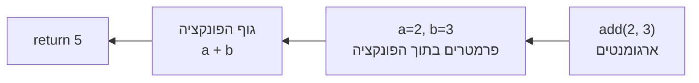

## מה זה?

פונקציה היא בלוק קוד עם שם, שמקבל קלט (פרמטרים), מבצע פעולה, ומחזיר ערך (`return`) — נכתבת פעם אחת ונקראת מכל מקום בתוכנית. הבעיה שנפתרת: בלי פונקציות, אותה לוגיקה (למשל חישוב שטח) שחוזרת בעשרות מקומות בקוד דורשת העתק-הדבק; שינוי עתידי מחייב איתור ותיקון ידני של כל המקומות, ושכחת אחד מהם יוצרת באג נסתר.

## מילות מפתח שחשוב לזכור

• Function Declaration — הצהרה עם `function`; מורמת (hoisted) ונגישה לפני שורת ההגדרה

• Function Expression — פונקציה בתוך משתנה; לא מורמת, נגישה רק אחרי שורת ההגדרה

• Arrow Function — תחביר קצר `() => {}`; ביטוי בודד מחזיר ערך אוטומטית (implicit return)

• Parameter — שם המשתנה בהגדרת הפונקציה; Argument — הערך שבפועל מועבר בקריאה

• Default Parameter — ערך ברירת מחדל כשלא סופק ארגומנט: `function fn(x = 0) {}`

• `return` — עוצר את ריצת הפונקציה ומחזיר ערך; בלעדיו הפונקציה מחזירה `undefined`

```javascript
function add(a, b) {
  return a + b;
}
add(2, 3); // 5
```



## הסבר עיקרי

DRY (Don't Repeat Yourself) — במקום לכתוב `w * h` בעשרה מקומות בקוד, `function area(w, h) { return w * h; }` נכתבת פעם אחת ונקראת בכל מקום. שינוי עתידי (למשל הוספת עיגול) נעשה במקום אחד בלבד.

Declaration מול Expression — ההבדל המעשי הוא hoisting: `function greet(){}` ניתן לקרוא לפני שורת ההגדרה שלו בקובץ; `const greet2 = function(){}` זורק שגיאה אם קוראים לו לפני השורה שמגדירה אותו, כי הוא לא מורם כמו declaration.

Parameter מול Argument — פרמטר הוא השם שמופיע בהגדרת הפונקציה (`function add(a, b)`); ארגומנט הוא הערך בפועל שמועבר בקריאה (`add(2, 3)`). ברירת מחדל (`b = 0`) חוסכת בדיקה ידנית של `undefined`.

שכחת return — פונקציה בלי `return` מחזירה `undefined` תמיד, גם אם היא מדפיסה משהו ל-console. `return` עוצר את ריצת הפונקציה ומחזיר ערך למקום הקריאה; בלעדיו, אין ערך חוזר.

Arrow Functions — ביטוי בודד בלי `{}` מחזיר אוטומטית (implicit return): `n => n * n`. עם `{}` (explicit) חובה לכתוב `return` במפורש, לשימוש עם לוגיקה מרובת-שורות.

## יתרונות

מונע שכפול קוד (DRY) — שינוי במקום אחד משפיע על כל הקריאות; שם פונקציה תיאורי (`calculateTotal`) מתעד את הכוונה בלי הערות; ניתן לבדוק פונקציה בבידוד מכל שאר הקוד.

## חסרונות

בחירה לא נכונה בין declaration ל-expression עלולה ליצור תלות ב-hoisting שקשה להבין; פונקציות ארוכות מדי (שעושות כמה דברים בו-זמנית) פוגעות בקריאות ובבדיקתיות.

## נקודות חשובות למבחן / ראיון עבודה

• Function Declaration מורם (hoisted); Function Expression ו-Arrow Function לא

• פרמטר = שם בהגדרה; ארגומנט = ערך בקריאה בפועל

• בלי `return` — הפונקציה מחזירה `undefined`, גם אם היא מדפיסה תוכן

• Arrow function עם `{}` דורש `return` מפורש; בלי `{}` יש implicit return

## טעויות נפוצות

• קריאה ל-Function Expression לפני שורת ההגדרה שלו — זורק `ReferenceError`/`TypeError`

• שכחת `return` וציפייה שהפונקציה "תחזיר" את מה שהיא הדפיסה עם `console.log`

• פונקציה אחת שעושה יותר מדבר אחד — קשה לבדוק ולתחזק

• בלבול בין פרמטר לארגומנט בדיבור מקצועי (משפיע על תקשורת בצוות)

## סיכום

פונקציה היא בלוק קוד עם שם שנכתב פעם אחת ונקרא שוב ושוב (DRY). Declaration מורם ונגיש לפני ההגדרה; Expression ו-Arrow לא. פרמטרים עם ברירת מחדל מקבלים קלט; `return` מחזיר פלט — בלעדיו יש `undefined`.

## דוקומנטציה רשמית

[MDN — Functions](https://developer.mozilla.org/en-US/docs/Web/JavaScript/Guide/Functions)

[MDN — Arrow function expressions](https://developer.mozilla.org/en-US/docs/Web/JavaScript/Reference/Functions/Arrow_functions)

---

## תרגילים

### תרגיל 1 — שלוש דרכים

**המשימה:** כתבו פונקציה בשם `square` שמקבלת מספר `n` ומחזירה את הריבוע שלו — בשלוש דרכים נפרדות: function declaration, function expression, ו-arrow function (שלושה שמות משתנים שונים, כדי שלא יתנגשו).

**בדיקה:** קריאה לכל אחת מהשלוש עם `square(4)` (או המקבילות) מחזירה `16`.

### תרגיל 2 — ברירת מחדל

**המשימה:** כתבו `greet(name)` עם ברירת מחדל `name = "Guest"`, שמחזירה (לא מדפיסה) `"Hello, " + name`.

**פלט צפוי:**
```javascript
greet()        →  "Hello, Guest"
greet("Alice") →  "Hello, Alice"
```

### תרגיל 3 — תיקון באג

**המשימה:** בפונקציה הבאה חסר `return` — קריאה לה מדפיסה `undefined` במקום את השטח. מצאו ותקנו את הבאג.

```javascript
function calcArea(w, h) {
  w * h; // באג: אין return!
}
```

**בדיקה:** אחרי התיקון, `console.log(calcArea(3, 4))` מדפיס `12`.

---

## פרויקט מסכם

**המשימה:** בנו מודול קטן של פונקציות מתמטיות לעיגול ועיבוד מספרים.

**דרישות:**
1. `roundTo(num, decimals = 2)` — מחזירה `num` מעוגל למספר הספרות העשרוניות הנתון
2. `clamp(num, min, max)` — מחזירה את `num`, אבל לא פחות מ-`min` ולא יותר מ-`max`
3. `toPercent(value, total)` — מחזירה מחרוזת אחוז, למשל `toPercent(1, 4)` → `"25%"`
4. כל פונקציה משתמשת ב-`return`, לא ב-`console.log` בלבד

**בדיקה:** `roundTo(3.14159, 2)` → `3.14`; `clamp(15, 0, 10)` → `10`; `toPercent(1, 4)` → `"25%"`.

---

## מה בפרק הבא

בפרק הבא נלמד על **String Methods** — מתודות מחרוזת (`toUpperCase`, `trim`, `split`, `includes` ועוד) הן פונקציות מובנות שפועלות על כל מחרוזת ומבצעות פעולות נפוצות — שינוי אותיות, ניקוי רווחים, פיצול לחלקים, חיפוש. הבעיה שנפתרת: בלי מתודו
